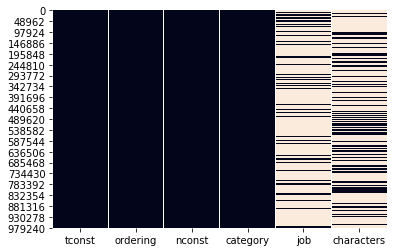

<h1>Table of Contents<span class="tocSkip"></span></h1>
<div class="toc"><ul class="toc-item"><li><span><a href="#-Final-Project-Submission" data-toc-modified-id="-Final-Project-Submission-1"><span class="toc-item-num">1&nbsp;&nbsp;</span> Final Project Submission</a></span></li><li><span><a href="#-Client-Interest-Statement-:" data-toc-modified-id="-Client-Interest-Statement-:-2"><span class="toc-item-num">2&nbsp;&nbsp;</span> Client Interest Statement :</a></span><ul class="toc-item"><li><ul class="toc-item"><li><span><a href="#Client(Microsoft)-is-interested-in-going-into-the-movie-making-business-space." data-toc-modified-id="Client(Microsoft)-is-interested-in-going-into-the-movie-making-business-space.-2.0.1"><span class="toc-item-num">2.0.1&nbsp;&nbsp;</span>Client(Microsoft) is interested in going into the movie-making business space.</a></span></li></ul></li></ul></li><li><span><a href="#-Mission:" data-toc-modified-id="-Mission:-3"><span class="toc-item-num">3&nbsp;&nbsp;</span> Mission:</a></span><ul class="toc-item"><li><ul class="toc-item"><li><span><a href="#Analyze-the-movie-market-to-determine-what-makes-a-great-movie-using-market-data,-web-data-and-financial-information." data-toc-modified-id="Analyze-the-movie-market-to-determine-what-makes-a-great-movie-using-market-data,-web-data-and-financial-information.-3.0.1"><span class="toc-item-num">3.0.1&nbsp;&nbsp;</span>Analyze the movie market to determine what makes a great movie using market data, web data and financial information.</a></span></li></ul></li></ul></li><li><span><a href="#-Transform-Data" data-toc-modified-id="-Transform-Data-4"><span class="toc-item-num">4&nbsp;&nbsp;</span> Transform Data</a></span><ul class="toc-item"><li><ul class="toc-item"><li><span><a href="#1.-Import-the-required-libraries-for-EDA" data-toc-modified-id="1.-Import-the-required-libraries-for-EDA-4.0.1"><span class="toc-item-num">4.0.1&nbsp;&nbsp;</span>1. Import the required libraries for EDA</a></span></li><li><span><a href="#-Transform-csv-data-to-dataframes" data-toc-modified-id="-Transform-csv-data-to-dataframes-4.0.2"><span class="toc-item-num">4.0.2&nbsp;&nbsp;</span> Transform csv data to dataframes</a></span></li><li><span><a href="#Import-other-files-to-dictionaries" data-toc-modified-id="Import-other-files-to-dictionaries-4.0.3"><span class="toc-item-num">4.0.3&nbsp;&nbsp;</span>Import other files to dictionaries</a></span></li></ul></li></ul></li><li><span><a href="#-Cleaning-the-Data" data-toc-modified-id="-Cleaning-the-Data-5"><span class="toc-item-num">5&nbsp;&nbsp;</span> Cleaning the Data</a></span><ul class="toc-item"><li><span><a href="#All-Files-Review" data-toc-modified-id="All-Files-Review-5.1"><span class="toc-item-num">5.1&nbsp;&nbsp;</span>All Files Review</a></span><ul class="toc-item"><li><span><a href="#NA's-for-all-files" data-toc-modified-id="NA's-for-all-files-5.1.1"><span class="toc-item-num">5.1.1&nbsp;&nbsp;</span>NA's for all files</a></span></li><li><span><a href="#Check-for-duplicates" data-toc-modified-id="Check-for-duplicates-5.1.2"><span class="toc-item-num">5.1.2&nbsp;&nbsp;</span>Check for duplicates</a></span></li><li><span><a href="#3.-Check-for-column-name-consistency" data-toc-modified-id="3.-Check-for-column-name-consistency-5.1.3"><span class="toc-item-num">5.1.3&nbsp;&nbsp;</span>3. Check for column name consistency</a></span></li></ul></li><li><span><a href="#Movies-file" data-toc-modified-id="Movies-file-5.2"><span class="toc-item-num">5.2&nbsp;&nbsp;</span>Movies file</a></span><ul class="toc-item"><li><span><a href="#3.-Change-datetime-format" data-toc-modified-id="3.-Change-datetime-format-5.2.1"><span class="toc-item-num">5.2.1&nbsp;&nbsp;</span>3. Change datetime format</a></span></li></ul></li><li><span><a href="#Title_crew-file" data-toc-modified-id="Title_crew-file-5.3"><span class="toc-item-num">5.3&nbsp;&nbsp;</span>Title_crew file</a></span></li><li><span><a href="#Tn_budgets-file" data-toc-modified-id="Tn_budgets-file-5.4"><span class="toc-item-num">5.4&nbsp;&nbsp;</span>Tn_budgets file</a></span><ul class="toc-item"><li><span><a href="#1.-Change-dtypes-to-'int'" data-toc-modified-id="1.-Change-dtypes-to-'int'-5.4.1"><span class="toc-item-num">5.4.1&nbsp;&nbsp;</span>1. Change dtypes to 'int'</a></span></li><li><span><a href="#1.-Change-to-datetime" data-toc-modified-id="1.-Change-to-datetime-5.4.2"><span class="toc-item-num">5.4.2&nbsp;&nbsp;</span>1. Change to datetime</a></span></li></ul></li><li><span><a href="#Title_ratings-File" data-toc-modified-id="Title_ratings-File-5.5"><span class="toc-item-num">5.5&nbsp;&nbsp;</span>Title_ratings File</a></span></li><li><span><a href="#Name_basics-File" data-toc-modified-id="Name_basics-File-5.6"><span class="toc-item-num">5.6&nbsp;&nbsp;</span>Name_basics File</a></span><ul class="toc-item"><li><span><a href="#1.-Drop-birth/death-years" data-toc-modified-id="1.-Drop-birth/death-years-5.6.1"><span class="toc-item-num">5.6.1&nbsp;&nbsp;</span>1. Drop birth/death years</a></span></li><li><span><a href="#1.-Fill-na's" data-toc-modified-id="1.-Fill-na's-5.6.2"><span class="toc-item-num">5.6.2&nbsp;&nbsp;</span>1. Fill na's</a></span></li></ul></li><li><span><a href="#Title_principals-file" data-toc-modified-id="Title_principals-file-5.7"><span class="toc-item-num">5.7&nbsp;&nbsp;</span>Title_principals file</a></span><ul class="toc-item"><li><span><a href="#--delete-job,-characters-columns" data-toc-modified-id="--delete-job,-characters-columns-5.7.1"><span class="toc-item-num">5.7.1&nbsp;&nbsp;</span>  delete job, characters columns</a></span></li></ul></li><li><span><a href="#Title_akas-file" data-toc-modified-id="Title_akas-file-5.8"><span class="toc-item-num">5.8&nbsp;&nbsp;</span>Title_akas file</a></span></li><li><span><a href="#bom_movie_gross-file" data-toc-modified-id="bom_movie_gross-file-5.9"><span class="toc-item-num">5.9&nbsp;&nbsp;</span>bom_movie_gross file</a></span></li><li><span><a href="#Title_basics-file" data-toc-modified-id="Title_basics-file-5.10"><span class="toc-item-num">5.10&nbsp;&nbsp;</span>Title_basics file</a></span></li></ul></li><li><span><a href="#Merging-the-Data" data-toc-modified-id="Merging-the-Data-6"><span class="toc-item-num">6&nbsp;&nbsp;</span>Merging the Data</a></span><ul class="toc-item"><li><span><a href="#Explode-the-list-in-the-tn_budgets-file" data-toc-modified-id="Explode-the-list-in-the-tn_budgets-file-6.1"><span class="toc-item-num">6.1&nbsp;&nbsp;</span>Explode the list in the tn_budgets file</a></span></li><li><span><a href="#Merge-Files" data-toc-modified-id="Merge-Files-6.2"><span class="toc-item-num">6.2&nbsp;&nbsp;</span>Merge Files</a></span></li></ul></li><li><span><a href="#Analysis" data-toc-modified-id="Analysis-7"><span class="toc-item-num">7&nbsp;&nbsp;</span>Analysis</a></span><ul class="toc-item"><li><span><a href="#Pair-plot" data-toc-modified-id="Pair-plot-7.1"><span class="toc-item-num">7.1&nbsp;&nbsp;</span>Pair plot</a></span></li><li><span><a href="#Heat-map" data-toc-modified-id="Heat-map-7.2"><span class="toc-item-num">7.2&nbsp;&nbsp;</span>Heat map</a></span><ul class="toc-item"><li><span><a href="#-Exclude-261-$0-gross-sales-movies" data-toc-modified-id="-Exclude-261-$0-gross-sales-movies-7.2.1"><span class="toc-item-num">7.2.1&nbsp;&nbsp;</span> Exclude 261 $0 gross sales movies</a></span></li><li><span><a href="#-Gross-sales-analysis" data-toc-modified-id="-Gross-sales-analysis-7.2.2"><span class="toc-item-num">7.2.2&nbsp;&nbsp;</span> Gross sales analysis</a></span></li><li><span><a href="#Swarm-Plot" data-toc-modified-id="Swarm-Plot-7.2.3"><span class="toc-item-num">7.2.3&nbsp;&nbsp;</span>Swarm Plot</a></span></li><li><span><a href="#Release-Dates" data-toc-modified-id="Release-Dates-7.2.4"><span class="toc-item-num">7.2.4&nbsp;&nbsp;</span>Release Dates</a></span></li><li><span><a href="#1.--Check-genres" data-toc-modified-id="1.--Check-genres-7.2.5"><span class="toc-item-num">7.2.5&nbsp;&nbsp;</span>1.  Check genres</a></span></li><li><span><a href="#Heat-Map" data-toc-modified-id="Heat-Map-7.2.6"><span class="toc-item-num">7.2.6&nbsp;&nbsp;</span>Heat Map</a></span></li></ul></li></ul></li><li><span><a href="#Previous-sequel/python-work" data-toc-modified-id="Previous-sequel/python-work-8"><span class="toc-item-num">8&nbsp;&nbsp;</span>Previous sequel/python work</a></span></li></ul></div>


<h1> Final Project Submission</h1>
<h4> Student name: Joan Leonard Short</h4>             <h4> Scheduled project review date/time: Aug 15, 2020 - 12:30</h4>       
<h4> Student pace: full time online </h4>             <h4> Blog post URL:  https://israeljls-j.github.io/</h4>


<h1> Client Interest Statement :</h1>
<h3>Client(Microsoft) is interested in going into the movie-making business space.</h3>

<h1> Mission:</h1> 
<h3>Analyze the movie market to determine what makes a great movie using market data, web data and financial information.</h3> 


<h1> Transform Data</h1>

<H3>1. Import the required libraries for EDA</H3>


```python
import sqlite3
import pandas as pd
import numpy as np
import matplotlib.pyplot as plt
%matplotlib inline
import glob
import os
from os import listdir
from os.path import splitext, basename
import datetime
import io
import seaborn as sns
import plotly.express as px
```

<h3> Transform csv data to dataframes<h3
                                         />


```python
# read csv files
filenames = []
df_list = []
path = '/Users/owner/flatiron1/myproject1/dsc-mod-1-project-v2-1-onl01-dtsc-ft-070620/zippedData/'
filenames = [(path + filename) for filename in os.listdir(path) if filename.endswith('.csv')]
df_list = [filename.split('.csv') for  filename in filenames] 

filenames
```


    ['/Users/owner/flatiron1/myproject1/dsc-mod-1-project-v2-1-onl01-dtsc-ft-070620/zippedData/tmdb.movies.csv',
     '/Users/owner/flatiron1/myproject1/dsc-mod-1-project-v2-1-onl01-dtsc-ft-070620/zippedData/imdb.title.crew.csv',
     '/Users/owner/flatiron1/myproject1/dsc-mod-1-project-v2-1-onl01-dtsc-ft-070620/zippedData/tn.movie_budgets.csv',
     '/Users/owner/flatiron1/myproject1/dsc-mod-1-project-v2-1-onl01-dtsc-ft-070620/zippedData/imdb.title.ratings.csv',
     '/Users/owner/flatiron1/myproject1/dsc-mod-1-project-v2-1-onl01-dtsc-ft-070620/zippedData/imdb.name.basics.csv',
     '/Users/owner/flatiron1/myproject1/dsc-mod-1-project-v2-1-onl01-dtsc-ft-070620/zippedData/imdb.title.principals.csv',
     '/Users/owner/flatiron1/myproject1/dsc-mod-1-project-v2-1-onl01-dtsc-ft-070620/zippedData/imdb.title.akas.csv',
     '/Users/owner/flatiron1/myproject1/dsc-mod-1-project-v2-1-onl01-dtsc-ft-070620/zippedData/bom.movie_gross.csv',
     '/Users/owner/flatiron1/myproject1/dsc-mod-1-project-v2-1-onl01-dtsc-ft-070620/zippedData/imdb.title.basics.csv']


```python
#create list of files
for item in df_list:
    print(item)
```

    ['/Users/owner/flatiron1/myproject1/dsc-mod-1-project-v2-1-onl01-dtsc-ft-070620/zippedData/tmdb.movies', '']
    ['/Users/owner/flatiron1/myproject1/dsc-mod-1-project-v2-1-onl01-dtsc-ft-070620/zippedData/imdb.title.crew', '']
    ['/Users/owner/flatiron1/myproject1/dsc-mod-1-project-v2-1-onl01-dtsc-ft-070620/zippedData/tn.movie_budgets', '']
    ['/Users/owner/flatiron1/myproject1/dsc-mod-1-project-v2-1-onl01-dtsc-ft-070620/zippedData/imdb.title.ratings', '']
    ['/Users/owner/flatiron1/myproject1/dsc-mod-1-project-v2-1-onl01-dtsc-ft-070620/zippedData/imdb.name.basics', '']
    ['/Users/owner/flatiron1/myproject1/dsc-mod-1-project-v2-1-onl01-dtsc-ft-070620/zippedData/imdb.title.principals', '']
    ['/Users/owner/flatiron1/myproject1/dsc-mod-1-project-v2-1-onl01-dtsc-ft-070620/zippedData/imdb.title.akas', '']
    ['/Users/owner/flatiron1/myproject1/dsc-mod-1-project-v2-1-onl01-dtsc-ft-070620/zippedData/bom.movie_gross', '']
    ['/Users/owner/flatiron1/myproject1/dsc-mod-1-project-v2-1-onl01-dtsc-ft-070620/zippedData/imdb.title.basics', '']


```python
# read in datafiles
df_list = [pd.read_csv(filename, parse_dates= True) for filename in filenames]
```


```python
#create separate dfs
movies = df_list[0]
title_crew = df_list[1]
tn_budgets = df_list[2]
title_ratings = df_list[3]
name_basics = df_list[4]
title_principals = df_list[5]
title_akas = df_list[6]
bom_movie_gross = df_list[7]
title_basics = df_list[8]

```


```python
md = { 'movies' : movies, 'title_crew' : title_crew, 'tn_budgets' : tn_budgets, 'title_ratings' : title_ratings, 'name_basics' : name_basics, 'title_principals' : title_principals,'title_akas' : title_akas, 'bom_movie_gross' : bom_movie_gross, 'title_basics' : title_basics}
md.keys()
```


    dict_keys(['movies', 'title_crew', 'tn_budgets', 'title_ratings', 'name_basics', 'title_principals', 'title_akas', 'bom_movie_gross', 'title_basics'])


```python
md['movies'].info()
```

    <class 'pandas.core.frame.DataFrame'>
    RangeIndex: 26517 entries, 0 to 26516
    Data columns (total 9 columns):
    genre_ids            26517 non-null object
    id                   26517 non-null int64
    original_language    26517 non-null object
    original_title       26517 non-null object
    popularity           26517 non-null float64
    release_date         26517 non-null object
    title                26517 non-null object
    vote_average         26517 non-null float64
    vote_count           26517 non-null int64
    dtypes: float64(2), int64(2), object(5)
    memory usage: 1.8+ MB


<h3>Import other files to dictionaries</h3>


```python
genre_ids = {'Action': 28, 'Adventure': 12, 'Animation': 16, 'Comedy': 35, 'Crime': 80, 'Documentary': 99, 'Drama': 18, 'Family': 10751, 'Fantasy': 14, 'History': 36, 'Horror': 27, 'Music': 10402, 'Mystery': 9648, 'Romance': 10749, 'Science_fiction': 878, 'TV_movie': 10770, 'Thriller': 53, 'War': 10752, 'Western': 3}
genre_ids

```


    {'Action': 28,
     'Adventure': 12,
     'Animation': 16,
     'Comedy': 35,
     'Crime': 80,
     'Documentary': 99,
     'Drama': 18,
     'Family': 10751,
     'Fantasy': 14,
     'History': 36,
     'Horror': 27,
     'Music': 10402,
     'Mystery': 9648,
     'Romance': 10749,
     'Science_fiction': 878,
     'TV_movie': 10770,
     'Thriller': 53,
     'War': 10752,
     'Western': 3}


<h1> Cleaning the Data</h1>

<h2>All Files Review</h2>


<h3>NA's for all files</h3>


```python
#will not use job or characters
sns.heatmap(md['title_principals'].isnull(), cbar=False)
```


    <matplotlib.axes._subplots.AxesSubplot at 0x1a243bc630>





```python
#will not use births/deaths, characters
sns.heatmap(md['name_basics'].isnull(), cbar=False)
```


    <matplotlib.axes._subplots.AxesSubplot at 0x1a23e0fcf8>


```python
# review shapes of files
for key in md:
    print(key, '   ',md[key].shape)


```

    movies     (26517, 9)
    title_crew     (146144, 3)
    tn_budgets     (5782, 6)
    title_ratings     (73856, 3)
    name_basics     (606648, 6)
    title_principals     (1028186, 6)
    title_akas     (331703, 8)
    bom_movie_gross     (3387, 5)
    title_basics     (146144, 6)


<h3>Check for duplicates</h3>


```python
#duplicate movies
md['movies'] = md['movies'].drop_duplicates(subset=['original_title'])

md['movies'].shape
```


    (24835, 9)


<h3>3. Check for column name consistency</h3>


```python

for key in md:
    columns = (md[key].columns)
    print(key, columns)
```

    movies Index(['genre_ids', 'id', 'original_language', 'original_title', 'popularity',
           'release_date', 'title', 'vote_average', 'vote_count'],
          dtype='object')
    title_crew Index(['tconst', 'directors', 'writers'], dtype='object')
    tn_budgets Index(['id', 'release_date', 'movie', 'production_budget', 'domestic_gross',
           'worldwide_gross'],
          dtype='object')
    title_ratings Index(['tconst', 'averagerating', 'numvotes'], dtype='object')
    name_basics Index(['nconst', 'primary_name', 'birth_year', 'death_year',
           'primary_profession', 'known_for_titles'],
          dtype='object')
    title_principals Index(['tconst', 'ordering', 'nconst', 'category', 'job', 'characters'], dtype='object')
    title_akas Index(['title_id', 'ordering', 'title', 'region', 'language', 'types',
           'attributes', 'is_original_title'],
          dtype='object')
    bom_movie_gross Index(['title', 'studio', 'domestic_gross', 'foreign_gross', 'year'], dtype='object')
    title_basics Index(['tconst', 'primary_title', 'original_title', 'start_year',
           'runtime_minutes', 'genres'],
          dtype='object')


```python

md['title_ratings'].columns     
md['title_ratings'].columns = ['tconst', 'average_rating', 'num_votes']
md['title_ratings'].columns

    
    
```


    Index(['tconst', 'average_rating', 'num_votes'], dtype='object')


```python
md['movies'].head(2)
```


<div>
<style scoped>
    .dataframe tbody tr th:only-of-type {
        vertical-align: middle;
    }

    .dataframe tbody tr th {
        vertical-align: top;
    }

    .dataframe thead th {
        text-align: right;
    }
</style>
<table border="1" class="dataframe">
  <thead>
    <tr style="text-align: right;">
      <th></th>
      <th>genre_ids</th>
      <th>id</th>
      <th>original_language</th>
      <th>original_title</th>
      <th>popularity</th>
      <th>release_date</th>
      <th>title</th>
      <th>vote_average</th>
      <th>vote_count</th>
    </tr>
  </thead>
  <tbody>
    <tr>
      <td>0</td>
      <td>[12, 14, 10751]</td>
      <td>12444</td>
      <td>en</td>
      <td>Harry Potter and the Deathly Hallows: Part 1</td>
      <td>33.533</td>
      <td>2010-11-19</td>
      <td>Harry Potter and the Deathly Hallows: Part 1</td>
      <td>7.7</td>
      <td>10788</td>
    </tr>
    <tr>
      <td>1</td>
      <td>[14, 12, 16, 10751]</td>
      <td>10191</td>
      <td>en</td>
      <td>How to Train Your Dragon</td>
      <td>28.734</td>
      <td>2010-03-26</td>
      <td>How to Train Your Dragon</td>
      <td>7.7</td>
      <td>7610</td>
    </tr>
  </tbody>
</table>
</div>


<h2>Movies file</h2>


```python
md['movies'].info()
```

    <class 'pandas.core.frame.DataFrame'>
    Int64Index: 24835 entries, 0 to 26516
    Data columns (total 9 columns):
    genre_ids            24835 non-null object
    id                   24835 non-null int64
    original_language    24835 non-null object
    original_title       24835 non-null object
    popularity           24835 non-null float64
    release_date         24835 non-null object
    title                24835 non-null object
    vote_average         24835 non-null float64
    vote_count           24835 non-null int64
    dtypes: float64(2), int64(2), object(5)
    memory usage: 1.9+ MB


```python
md['movies']['genre_ids'][0]
```


    '[12, 14, 10751]'


<h3>3. Change datetime format</h3>


```python
pd.to_datetime(md['movies']['release_date'])
```


    0       2010-11-19
    1       2010-03-26
    2       2010-05-07
    3       1995-11-22
    4       2010-07-16
               ...    
    26512   2018-10-13
    26513   2018-05-01
    26514   2018-10-01
    26515   2018-06-22
    26516   2018-10-05
    Name: release_date, Length: 24835, dtype: datetime64[ns]


```python
md['movies'].info()
```

    <class 'pandas.core.frame.DataFrame'>
    Int64Index: 24835 entries, 0 to 26516
    Data columns (total 9 columns):
    genre_ids            24835 non-null object
    id                   24835 non-null int64
    original_language    24835 non-null object
    original_title       24835 non-null object
    popularity           24835 non-null float64
    release_date         24835 non-null object
    title                24835 non-null object
    vote_average         24835 non-null float64
    vote_count           24835 non-null int64
    dtypes: float64(2), int64(2), object(5)
    memory usage: 2.5+ MB


<h2>Title_crew file</h2>


```python
#no cleaning of this file
md['title_crew'].head(2)
```


<div>
<style scoped>
    .dataframe tbody tr th:only-of-type {
        vertical-align: middle;
    }

    .dataframe tbody tr th {
        vertical-align: top;
    }

    .dataframe thead th {
        text-align: right;
    }
</style>
<table border="1" class="dataframe">
  <thead>
    <tr style="text-align: right;">
      <th></th>
      <th>tconst</th>
      <th>directors</th>
      <th>writers</th>
    </tr>
  </thead>
  <tbody>
    <tr>
      <td>0</td>
      <td>tt0285252</td>
      <td>nm0899854</td>
      <td>nm0899854</td>
    </tr>
    <tr>
      <td>1</td>
      <td>tt0438973</td>
      <td>NaN</td>
      <td>nm0175726,nm1802864</td>
    </tr>
  </tbody>
</table>
</div>


```python
md['title_crew'].info()
```

    <class 'pandas.core.frame.DataFrame'>
    RangeIndex: 146144 entries, 0 to 146143
    Data columns (total 3 columns):
    tconst       146144 non-null object
    directors    140417 non-null object
    writers      110261 non-null object
    dtypes: object(3)
    memory usage: 3.3+ MB


<h2>Tn_budgets file</h2>

<h3>1. Change dtypes to 'int'</h3>


```python
# Change string to int for all sales/production dollars
md['tn_budgets']['production_budget'] = md['tn_budgets']['production_budget'].str.replace('$', "").str.replace(',', '')
md['tn_budgets']['domestic_gross'] = md['tn_budgets']['domestic_gross'].str.replace('$', "").str.replace(',', '')
md['tn_budgets']['worldwide_gross'] = md['tn_budgets']['worldwide_gross'].str.replace('$', "").str.replace(',', '')
```


```python
tn_budgets.head()
```


<div>
<style scoped>
    .dataframe tbody tr th:only-of-type {
        vertical-align: middle;
    }

    .dataframe tbody tr th {
        vertical-align: top;
    }

    .dataframe thead th {
        text-align: right;
    }
</style>
<table border="1" class="dataframe">
  <thead>
    <tr style="text-align: right;">
      <th></th>
      <th>id</th>
      <th>release_date</th>
      <th>movie</th>
      <th>production_budget</th>
      <th>domestic_gross</th>
      <th>worldwide_gross</th>
    </tr>
  </thead>
  <tbody>
    <tr>
      <td>0</td>
      <td>1</td>
      <td>Dec 18, 2009</td>
      <td>Avatar</td>
      <td>425000000</td>
      <td>760507625</td>
      <td>2776345279</td>
    </tr>
    <tr>
      <td>1</td>
      <td>2</td>
      <td>May 20, 2011</td>
      <td>Pirates of the Caribbean: On Stranger Tides</td>
      <td>410600000</td>
      <td>241063875</td>
      <td>1045663875</td>
    </tr>
    <tr>
      <td>2</td>
      <td>3</td>
      <td>Jun 7, 2019</td>
      <td>Dark Phoenix</td>
      <td>350000000</td>
      <td>42762350</td>
      <td>149762350</td>
    </tr>
    <tr>
      <td>3</td>
      <td>4</td>
      <td>May 1, 2015</td>
      <td>Avengers: Age of Ultron</td>
      <td>330600000</td>
      <td>459005868</td>
      <td>1403013963</td>
    </tr>
    <tr>
      <td>4</td>
      <td>5</td>
      <td>Dec 15, 2017</td>
      <td>Star Wars Ep. VIII: The Last Jedi</td>
      <td>317000000</td>
      <td>620181382</td>
      <td>1316721747</td>
    </tr>
  </tbody>
</table>
</div>


```python
#change dtype of numerical data to "int"
md['tn_budgets']['production_budget'] = md['tn_budgets']['production_budget'].astype('int')
md['tn_budgets']['domestic_gross'] = md['tn_budgets']['domestic_gross'].astype('int')
md['tn_budgets']['worldwide_gross'] = md['tn_budgets']['worldwide_gross'].astype('int')

```


```python
md['tn_budgets']['worldwide_gross']
```


    0       2776345279
    1       1045663875
    2        149762350
    3       1403013963
    4       1316721747
               ...    
    5777             0
    5778        240495
    5779          1338
    5780             0
    5781        181041
    Name: worldwide_gross, Length: 5782, dtype: int64


<h3>1. Change to datetime</h3>


```python
#change datetime from string to datetime

file = []
for item in md:
    file.append('id')
pd.to_datetime(md['tn_budgets']['release_date'])
```


    0      2009-12-18
    1      2011-05-20
    2      2019-06-07
    3      2015-05-01
    4      2017-12-15
              ...    
    5777   2018-12-31
    5778   1999-04-02
    5779   2005-07-13
    5780   2015-09-29
    5781   2005-08-05
    Name: release_date, Length: 5782, dtype: datetime64[ns]


<h2>Title_ratings File</h2>


```python
md['title_ratings'].head(2)
```


<div>
<style scoped>
    .dataframe tbody tr th:only-of-type {
        vertical-align: middle;
    }

    .dataframe tbody tr th {
        vertical-align: top;
    }

    .dataframe thead th {
        text-align: right;
    }
</style>
<table border="1" class="dataframe">
  <thead>
    <tr style="text-align: right;">
      <th></th>
      <th>tconst</th>
      <th>average_rating</th>
      <th>num_votes</th>
    </tr>
  </thead>
  <tbody>
    <tr>
      <td>0</td>
      <td>tt10356526</td>
      <td>8.3</td>
      <td>31</td>
    </tr>
    <tr>
      <td>1</td>
      <td>tt10384606</td>
      <td>8.9</td>
      <td>559</td>
    </tr>
  </tbody>
</table>
</div>


```python
md['title_ratings'].info()
```

    <class 'pandas.core.frame.DataFrame'>
    RangeIndex: 73856 entries, 0 to 73855
    Data columns (total 3 columns):
    tconst            73856 non-null object
    average_rating    73856 non-null float64
    num_votes         73856 non-null int64
    dtypes: float64(1), int64(1), object(1)
    memory usage: 1.7+ MB


<h2>Name_basics File</h2>


```python
md['name_basics'].head(2)
```


<div>
<style scoped>
    .dataframe tbody tr th:only-of-type {
        vertical-align: middle;
    }

    .dataframe tbody tr th {
        vertical-align: top;
    }

    .dataframe thead th {
        text-align: right;
    }
</style>
<table border="1" class="dataframe">
  <thead>
    <tr style="text-align: right;">
      <th></th>
      <th>nconst</th>
      <th>primary_name</th>
      <th>birth_year</th>
      <th>death_year</th>
      <th>primary_profession</th>
      <th>known_for_titles</th>
    </tr>
  </thead>
  <tbody>
    <tr>
      <td>0</td>
      <td>nm0061671</td>
      <td>Mary Ellen Bauder</td>
      <td>NaN</td>
      <td>NaN</td>
      <td>miscellaneous,production_manager,producer</td>
      <td>tt0837562,tt2398241,tt0844471,tt0118553</td>
    </tr>
    <tr>
      <td>1</td>
      <td>nm0061865</td>
      <td>Joseph Bauer</td>
      <td>NaN</td>
      <td>NaN</td>
      <td>composer,music_department,sound_department</td>
      <td>tt0896534,tt6791238,tt0287072,tt1682940</td>
    </tr>
  </tbody>
</table>
</div>


<h3>1. Drop birth/death years</h3>


```python
md['name_basics'].drop(['birth_year'], axis=1, inplace=True)
md['name_basics'].drop(['death_year'], axis = 1, inplace=True)
```

<h3>1. Fill na's</h3>


```python
#md['name_basics']['primary_profession'][md['name_basics']['primary_profession'].isna()]
# for item in md['name_basics']['primary_profession']:
#     item.fillna('Unknown', inplace=True)
md['name_basics']['primary_profession'].fillna('Unknown', inplace=True)
md['name_basics']['known_for_titles'].fillna('Unknown', inplace=True)
md['name_basics'].info()


```

    <class 'pandas.core.frame.DataFrame'>
    RangeIndex: 606648 entries, 0 to 606647
    Data columns (total 4 columns):
    nconst                606648 non-null object
    primary_name          606648 non-null object
    primary_profession    606648 non-null object
    known_for_titles      606648 non-null object
    dtypes: object(4)
    memory usage: 18.5+ MB


```python
md['name_basics'].head(2)
```


<div>
<style scoped>
    .dataframe tbody tr th:only-of-type {
        vertical-align: middle;
    }

    .dataframe tbody tr th {
        vertical-align: top;
    }

    .dataframe thead th {
        text-align: right;
    }
</style>
<table border="1" class="dataframe">
  <thead>
    <tr style="text-align: right;">
      <th></th>
      <th>nconst</th>
      <th>primary_name</th>
      <th>primary_profession</th>
      <th>known_for_titles</th>
    </tr>
  </thead>
  <tbody>
    <tr>
      <td>0</td>
      <td>nm0061671</td>
      <td>Mary Ellen Bauder</td>
      <td>miscellaneous,production_manager,producer</td>
      <td>tt0837562,tt2398241,tt0844471,tt0118553</td>
    </tr>
    <tr>
      <td>1</td>
      <td>nm0061865</td>
      <td>Joseph Bauer</td>
      <td>composer,music_department,sound_department</td>
      <td>tt0896534,tt6791238,tt0287072,tt1682940</td>
    </tr>
  </tbody>
</table>
</div>


```python
md['name_basics'].info()
```

    <class 'pandas.core.frame.DataFrame'>
    RangeIndex: 606648 entries, 0 to 606647
    Data columns (total 4 columns):
    nconst                606648 non-null object
    primary_name          606648 non-null object
    primary_profession    606648 non-null object
    known_for_titles      606648 non-null object
    dtypes: object(4)
    memory usage: 18.5+ MB


<h2>Title_principals file</h2>


```python
md['title_principals'].head(2)
```


<div>
<style scoped>
    .dataframe tbody tr th:only-of-type {
        vertical-align: middle;
    }

    .dataframe tbody tr th {
        vertical-align: top;
    }

    .dataframe thead th {
        text-align: right;
    }
</style>
<table border="1" class="dataframe">
  <thead>
    <tr style="text-align: right;">
      <th></th>
      <th>tconst</th>
      <th>ordering</th>
      <th>nconst</th>
      <th>category</th>
      <th>job</th>
      <th>characters</th>
    </tr>
  </thead>
  <tbody>
    <tr>
      <td>0</td>
      <td>tt0111414</td>
      <td>1</td>
      <td>nm0246005</td>
      <td>actor</td>
      <td>NaN</td>
      <td>["The Man"]</td>
    </tr>
    <tr>
      <td>1</td>
      <td>tt0111414</td>
      <td>2</td>
      <td>nm0398271</td>
      <td>director</td>
      <td>NaN</td>
      <td>NaN</td>
    </tr>
  </tbody>
</table>
</div>


```python
md['title_principals'].info()
```

    <class 'pandas.core.frame.DataFrame'>
    RangeIndex: 1028186 entries, 0 to 1028185
    Data columns (total 6 columns):
    tconst        1028186 non-null object
    ordering      1028186 non-null int64
    nconst        1028186 non-null object
    category      1028186 non-null object
    job           177684 non-null object
    characters    393360 non-null object
    dtypes: int64(1), object(5)
    memory usage: 47.1+ MB


<h3>  delete job, characters columns</h3>


```python
#drop files not using
md['title_principals'] = md['title_principals'].drop(['job'], axis=1)
md['title_principals'] = md['title_principals'].drop(['characters'], axis = 1)
```


```python
md['title_principals'].info()
```

    <class 'pandas.core.frame.DataFrame'>
    RangeIndex: 1028186 entries, 0 to 1028185
    Data columns (total 4 columns):
    tconst      1028186 non-null object
    ordering    1028186 non-null int64
    nconst      1028186 non-null object
    category    1028186 non-null object
    dtypes: int64(1), object(3)
    memory usage: 31.4+ MB


<h2>Title_akas file</h2>


```python
md['title_akas'].head(2)
```


<div>
<style scoped>
    .dataframe tbody tr th:only-of-type {
        vertical-align: middle;
    }

    .dataframe tbody tr th {
        vertical-align: top;
    }

    .dataframe thead th {
        text-align: right;
    }
</style>
<table border="1" class="dataframe">
  <thead>
    <tr style="text-align: right;">
      <th></th>
      <th>title_id</th>
      <th>ordering</th>
      <th>title</th>
      <th>region</th>
      <th>language</th>
      <th>types</th>
      <th>attributes</th>
      <th>is_original_title</th>
    </tr>
  </thead>
  <tbody>
    <tr>
      <td>0</td>
      <td>tt0369610</td>
      <td>10</td>
      <td>Джурасик свят</td>
      <td>BG</td>
      <td>bg</td>
      <td>NaN</td>
      <td>NaN</td>
      <td>0.0</td>
    </tr>
    <tr>
      <td>1</td>
      <td>tt0369610</td>
      <td>11</td>
      <td>Jurashikku warudo</td>
      <td>JP</td>
      <td>NaN</td>
      <td>imdbDisplay</td>
      <td>NaN</td>
      <td>0.0</td>
    </tr>
  </tbody>
</table>
</div>


```python
md['title_akas'].info()
```

    <class 'pandas.core.frame.DataFrame'>
    RangeIndex: 331703 entries, 0 to 331702
    Data columns (total 8 columns):
    title_id             331703 non-null object
    ordering             331703 non-null int64
    title                331703 non-null object
    region               278410 non-null object
    language             41715 non-null object
    types                168447 non-null object
    attributes           14925 non-null object
    is_original_title    331678 non-null float64
    dtypes: float64(1), int64(1), object(6)
    memory usage: 20.2+ MB


```python
md['title_akas'].drop(['attributes'], axis=1, inplace=True)
md['title_akas'].drop(['language'], axis=1, inplace=True)

```


```python
md['title_akas'].info()
```

    <class 'pandas.core.frame.DataFrame'>
    RangeIndex: 331703 entries, 0 to 331702
    Data columns (total 6 columns):
    title_id             331703 non-null object
    ordering             331703 non-null int64
    title                331703 non-null object
    region               278410 non-null object
    types                168447 non-null object
    is_original_title    331678 non-null float64
    dtypes: float64(1), int64(1), object(4)
    memory usage: 15.2+ MB


<h2>bom_movie_gross file</h2>


```python
md['bom_movie_gross'].head(2)
```


<div>
<style scoped>
    .dataframe tbody tr th:only-of-type {
        vertical-align: middle;
    }

    .dataframe tbody tr th {
        vertical-align: top;
    }

    .dataframe thead th {
        text-align: right;
    }
</style>
<table border="1" class="dataframe">
  <thead>
    <tr style="text-align: right;">
      <th></th>
      <th>title</th>
      <th>studio</th>
      <th>domestic_gross</th>
      <th>foreign_gross</th>
      <th>year</th>
    </tr>
  </thead>
  <tbody>
    <tr>
      <td>0</td>
      <td>Toy Story 3</td>
      <td>BV</td>
      <td>415000000.0</td>
      <td>652000000</td>
      <td>2010</td>
    </tr>
    <tr>
      <td>1</td>
      <td>Alice in Wonderland (2010)</td>
      <td>BV</td>
      <td>334200000.0</td>
      <td>691300000</td>
      <td>2010</td>
    </tr>
  </tbody>
</table>
</div>


<h2>Title_basics file</h2>


```python
md['title_basics'].info()
```

    <class 'pandas.core.frame.DataFrame'>
    RangeIndex: 146144 entries, 0 to 146143
    Data columns (total 6 columns):
    tconst             146144 non-null object
    primary_title      146144 non-null object
    original_title     146123 non-null object
    start_year         146144 non-null int64
    runtime_minutes    114405 non-null float64
    genres             140736 non-null object
    dtypes: float64(1), int64(1), object(4)
    memory usage: 6.7+ MB


```python
md['title_basics']['genres'].dropna()
md['title_basics']['genres'].value_counts(dropna=False)
```


    Documentary                    32185
    Drama                          21486
    Comedy                          9177
    NaN                             5408
    Horror                          4372
                                   ...  
    Documentary,Mystery,Romance        1
    Family,Horror,Romance              1
    Biography,Music,Romance            1
    Animation,Family,Mystery           1
    Comedy,Romance,Short               1
    Name: genres, Length: 1086, dtype: int64


```python
genre_ids.values()

```


    dict_values([28, 12, 16, 35, 80, 99, 18, 10751, 14, 36, 27, 10402, 9648, 10749, 878, 10770, 53, 10752, 3])


<h1>Merging the Data</h1>


```python
md['tn_budgets'].info()
```

    <class 'pandas.core.frame.DataFrame'>
    RangeIndex: 5782 entries, 0 to 5781
    Data columns (total 6 columns):
    id                   5782 non-null int64
    release_date         5782 non-null object
    movie                5782 non-null object
    production_budget    5782 non-null int64
    domestic_gross       5782 non-null int64
    worldwide_gross      5782 non-null int64
    dtypes: int64(4), object(2)
    memory usage: 271.2+ KB


## Explode the list in the tn_budgets file##


```python
pd.options.display.max_rows = 500
```


```python
md['movies']['genre_ids'][0]
```


    '[12, 14, 10751]'


```python
md['movies'].info()
```

    <class 'pandas.core.frame.DataFrame'>
    Int64Index: 24835 entries, 0 to 26516
    Data columns (total 9 columns):
    genre_ids            24835 non-null object
    id                   24835 non-null int64
    original_language    24835 non-null object
    original_title       24835 non-null object
    popularity           24835 non-null float64
    release_date         24835 non-null object
    title                24835 non-null object
    vote_average         24835 non-null float64
    vote_count           24835 non-null int64
    dtypes: float64(2), int64(2), object(5)
    memory usage: 2.5+ MB


<h2>Merge Files</h2>


```python
tn_budgets = md['tn_budgets']
movies = md['movies']
title_crew = md['title_crew']
title_ratings = md['title_ratings']
```


```python
tn_budgets.head()
```


<div>
<style scoped>
    .dataframe tbody tr th:only-of-type {
        vertical-align: middle;
    }

    .dataframe tbody tr th {
        vertical-align: top;
    }

    .dataframe thead th {
        text-align: right;
    }
</style>
<table border="1" class="dataframe">
  <thead>
    <tr style="text-align: right;">
      <th></th>
      <th>id</th>
      <th>release_date</th>
      <th>movie</th>
      <th>production_budget</th>
      <th>domestic_gross</th>
      <th>worldwide_gross</th>
    </tr>
  </thead>
  <tbody>
    <tr>
      <td>0</td>
      <td>1</td>
      <td>Dec 18, 2009</td>
      <td>Avatar</td>
      <td>425000000</td>
      <td>760507625</td>
      <td>2776345279</td>
    </tr>
    <tr>
      <td>1</td>
      <td>2</td>
      <td>May 20, 2011</td>
      <td>Pirates of the Caribbean: On Stranger Tides</td>
      <td>410600000</td>
      <td>241063875</td>
      <td>1045663875</td>
    </tr>
    <tr>
      <td>2</td>
      <td>3</td>
      <td>Jun 7, 2019</td>
      <td>Dark Phoenix</td>
      <td>350000000</td>
      <td>42762350</td>
      <td>149762350</td>
    </tr>
    <tr>
      <td>3</td>
      <td>4</td>
      <td>May 1, 2015</td>
      <td>Avengers: Age of Ultron</td>
      <td>330600000</td>
      <td>459005868</td>
      <td>1403013963</td>
    </tr>
    <tr>
      <td>4</td>
      <td>5</td>
      <td>Dec 15, 2017</td>
      <td>Star Wars Ep. VIII: The Last Jedi</td>
      <td>317000000</td>
      <td>620181382</td>
      <td>1316721747</td>
    </tr>
  </tbody>
</table>
</div>


```python
df = md['movies'].merge(md['tn_budgets'], how='inner', left_on='original_title', right_on='movie')
df.head(2)
```


<div>
<style scoped>
    .dataframe tbody tr th:only-of-type {
        vertical-align: middle;
    }

    .dataframe tbody tr th {
        vertical-align: top;
    }

    .dataframe thead th {
        text-align: right;
    }
</style>
<table border="1" class="dataframe">
  <thead>
    <tr style="text-align: right;">
      <th></th>
      <th>genre_ids</th>
      <th>id_x</th>
      <th>original_language</th>
      <th>original_title</th>
      <th>popularity</th>
      <th>release_date_x</th>
      <th>title</th>
      <th>vote_average</th>
      <th>vote_count</th>
      <th>id_y</th>
      <th>release_date_y</th>
      <th>movie</th>
      <th>production_budget</th>
      <th>domestic_gross</th>
      <th>worldwide_gross</th>
    </tr>
  </thead>
  <tbody>
    <tr>
      <td>0</td>
      <td>[14, 12, 16, 10751]</td>
      <td>10191</td>
      <td>en</td>
      <td>How to Train Your Dragon</td>
      <td>28.734</td>
      <td>2010-03-26</td>
      <td>How to Train Your Dragon</td>
      <td>7.7</td>
      <td>7610</td>
      <td>30</td>
      <td>Mar 26, 2010</td>
      <td>How to Train Your Dragon</td>
      <td>165000000</td>
      <td>217581232</td>
      <td>494870992</td>
    </tr>
    <tr>
      <td>1</td>
      <td>[12, 28, 878]</td>
      <td>10138</td>
      <td>en</td>
      <td>Iron Man 2</td>
      <td>28.515</td>
      <td>2010-05-07</td>
      <td>Iron Man 2</td>
      <td>6.8</td>
      <td>12368</td>
      <td>15</td>
      <td>May 7, 2010</td>
      <td>Iron Man 2</td>
      <td>170000000</td>
      <td>312433331</td>
      <td>621156389</td>
    </tr>
  </tbody>
</table>
</div>


```python

df['foreign_gross'] = df['worldwide_gross'] - df['domestic_gross']  
```


```python
md['bom_movie_gross'].info()
#df1.info()
```

    <class 'pandas.core.frame.DataFrame'>
    RangeIndex: 3387 entries, 0 to 3386
    Data columns (total 5 columns):
    title             3387 non-null object
    studio            3382 non-null object
    domestic_gross    3359 non-null float64
    foreign_gross     2037 non-null object
    year              3387 non-null int64
    dtypes: float64(1), int64(1), object(3)
    memory usage: 132.4+ KB


```python
df1 = pd.DataFrame()
df1 = md['title_crew']
df1 = df1.merge(md['title_ratings'], how='inner', left_on='tconst', right_on='tconst')
df1 = df1.merge(md['title_principals'], how='inner', left_on='tconst', right_on='tconst')
df1 = df1.merge(md['name_basics'], how='inner', left_on='nconst', right_on='nconst')


```


```python
df1 = df1.merge(md['title_basics'], how = 'left', left_on='tconst', right_on='tconst')
```


```python
df = pd.merge(df, md['title_basics'], on= 'original_title' )
df.head()
```


<div>
<style scoped>
    .dataframe tbody tr th:only-of-type {
        vertical-align: middle;
    }

    .dataframe tbody tr th {
        vertical-align: top;
    }

    .dataframe thead th {
        text-align: right;
    }
</style>
<table border="1" class="dataframe">
  <thead>
    <tr style="text-align: right;">
      <th></th>
      <th>genre_ids</th>
      <th>id_x</th>
      <th>original_language</th>
      <th>original_title</th>
      <th>popularity</th>
      <th>release_date_x</th>
      <th>title</th>
      <th>vote_average</th>
      <th>vote_count</th>
      <th>id_y</th>
      <th>...</th>
      <th>movie</th>
      <th>production_budget</th>
      <th>domestic_gross</th>
      <th>worldwide_gross</th>
      <th>foreign_gross</th>
      <th>tconst</th>
      <th>primary_title</th>
      <th>start_year</th>
      <th>runtime_minutes</th>
      <th>genres</th>
    </tr>
  </thead>
  <tbody>
    <tr>
      <td>0</td>
      <td>[14, 12, 16, 10751]</td>
      <td>10191</td>
      <td>en</td>
      <td>How to Train Your Dragon</td>
      <td>28.734</td>
      <td>2010-03-26</td>
      <td>How to Train Your Dragon</td>
      <td>7.7</td>
      <td>7610</td>
      <td>30</td>
      <td>...</td>
      <td>How to Train Your Dragon</td>
      <td>165000000</td>
      <td>217581232</td>
      <td>494870992</td>
      <td>277289760</td>
      <td>tt0892769</td>
      <td>How to Train Your Dragon</td>
      <td>2010</td>
      <td>98.0</td>
      <td>Action,Adventure,Animation</td>
    </tr>
    <tr>
      <td>1</td>
      <td>[12, 28, 878]</td>
      <td>10138</td>
      <td>en</td>
      <td>Iron Man 2</td>
      <td>28.515</td>
      <td>2010-05-07</td>
      <td>Iron Man 2</td>
      <td>6.8</td>
      <td>12368</td>
      <td>15</td>
      <td>...</td>
      <td>Iron Man 2</td>
      <td>170000000</td>
      <td>312433331</td>
      <td>621156389</td>
      <td>308723058</td>
      <td>tt1228705</td>
      <td>Iron Man 2</td>
      <td>2010</td>
      <td>124.0</td>
      <td>Action,Adventure,Sci-Fi</td>
    </tr>
    <tr>
      <td>2</td>
      <td>[28, 878, 12]</td>
      <td>27205</td>
      <td>en</td>
      <td>Inception</td>
      <td>27.920</td>
      <td>2010-07-16</td>
      <td>Inception</td>
      <td>8.3</td>
      <td>22186</td>
      <td>38</td>
      <td>...</td>
      <td>Inception</td>
      <td>160000000</td>
      <td>292576195</td>
      <td>835524642</td>
      <td>542948447</td>
      <td>tt1375666</td>
      <td>Inception</td>
      <td>2010</td>
      <td>148.0</td>
      <td>Action,Adventure,Sci-Fi</td>
    </tr>
    <tr>
      <td>3</td>
      <td>[12, 14, 10751]</td>
      <td>32657</td>
      <td>en</td>
      <td>Percy Jackson &amp; the Olympians: The Lightning T...</td>
      <td>26.691</td>
      <td>2010-02-11</td>
      <td>Percy Jackson &amp; the Olympians: The Lightning T...</td>
      <td>6.1</td>
      <td>4229</td>
      <td>17</td>
      <td>...</td>
      <td>Percy Jackson &amp; the Olympians: The Lightning T...</td>
      <td>95000000</td>
      <td>88768303</td>
      <td>223050874</td>
      <td>134282571</td>
      <td>tt0814255</td>
      <td>Percy Jackson &amp; the Olympians: The Lightning T...</td>
      <td>2010</td>
      <td>118.0</td>
      <td>Adventure,Family,Fantasy</td>
    </tr>
    <tr>
      <td>4</td>
      <td>[16, 10751, 35]</td>
      <td>10193</td>
      <td>en</td>
      <td>Toy Story 3</td>
      <td>24.445</td>
      <td>2010-06-17</td>
      <td>Toy Story 3</td>
      <td>7.7</td>
      <td>8340</td>
      <td>47</td>
      <td>...</td>
      <td>Toy Story 3</td>
      <td>200000000</td>
      <td>415004880</td>
      <td>1068879522</td>
      <td>653874642</td>
      <td>tt0435761</td>
      <td>Toy Story 3</td>
      <td>2010</td>
      <td>103.0</td>
      <td>Adventure,Animation,Comedy</td>
    </tr>
  </tbody>
</table>
<p>5 rows × 21 columns</p>
</div>


```python
df.info()
```

    <class 'pandas.core.frame.DataFrame'>
    Int64Index: 2773 entries, 0 to 2772
    Data columns (total 21 columns):
    genre_ids            2773 non-null object
    id_x                 2773 non-null int64
    original_language    2773 non-null object
    original_title       2773 non-null object
    popularity           2773 non-null float64
    release_date_x       2773 non-null object
    title                2773 non-null object
    vote_average         2773 non-null float64
    vote_count           2773 non-null int64
    id_y                 2773 non-null int64
    release_date_y       2773 non-null object
    movie                2773 non-null object
    production_budget    2773 non-null int64
    domestic_gross       2773 non-null int64
    worldwide_gross      2773 non-null int64
    foreign_gross        2773 non-null int64
    tconst               2773 non-null object
    primary_title        2773 non-null object
    start_year           2773 non-null int64
    runtime_minutes      2521 non-null float64
    genres               2733 non-null object
    dtypes: float64(3), int64(8), object(10)
    memory usage: 476.6+ KB


```python
# shows no white space for df(financial_file)

sns.heatmap(df.isnull(), cbar=False)
```


    <matplotlib.axes._subplots.AxesSubplot at 0x1a29919b38>


```python
# shows still can use this file as many columns are ok
sns.heatmap(df1.isnull(), cbar=False)
```


    <matplotlib.axes._subplots.AxesSubplot at 0x1a2997b4e0>


<h1>Analysis<h1>


```python
df.columns
```


    Index(['genre_ids', 'id_x', 'original_language', 'original_title',
           'popularity', 'release_date_x', 'title', 'vote_average', 'vote_count',
           'id_y', 'release_date_y', 'movie', 'production_budget',
           'domestic_gross', 'worldwide_gross', 'foreign_gross', 'tconst',
           'primary_title', 'start_year', 'runtime_minutes', 'genres'],
          dtype='object')


```python

# Financial columns to explore
financial_file = df.loc[:, ['genre_ids', 'id_x', 'original_title', 'popularity', 'release_date_x', 'vote_average', 'vote_count', 'production_budget', 'domestic_gross', 'foreign_gross', 'worldwide_gross', 'genres']]
financial_file.head(2)

```


<div>
<style scoped>
    .dataframe tbody tr th:only-of-type {
        vertical-align: middle;
    }

    .dataframe tbody tr th {
        vertical-align: top;
    }

    .dataframe thead th {
        text-align: right;
    }
</style>
<table border="1" class="dataframe">
  <thead>
    <tr style="text-align: right;">
      <th></th>
      <th>genre_ids</th>
      <th>id_x</th>
      <th>original_title</th>
      <th>popularity</th>
      <th>release_date_x</th>
      <th>vote_average</th>
      <th>vote_count</th>
      <th>production_budget</th>
      <th>domestic_gross</th>
      <th>foreign_gross</th>
      <th>worldwide_gross</th>
      <th>genres</th>
    </tr>
  </thead>
  <tbody>
    <tr>
      <td>0</td>
      <td>[14, 12, 16, 10751]</td>
      <td>10191</td>
      <td>How to Train Your Dragon</td>
      <td>28.734</td>
      <td>2010-03-26</td>
      <td>7.7</td>
      <td>7610</td>
      <td>165000000</td>
      <td>217581232</td>
      <td>277289760</td>
      <td>494870992</td>
      <td>Action,Adventure,Animation</td>
    </tr>
    <tr>
      <td>1</td>
      <td>[12, 28, 878]</td>
      <td>10138</td>
      <td>Iron Man 2</td>
      <td>28.515</td>
      <td>2010-05-07</td>
      <td>6.8</td>
      <td>12368</td>
      <td>170000000</td>
      <td>312433331</td>
      <td>308723058</td>
      <td>621156389</td>
      <td>Action,Adventure,Sci-Fi</td>
    </tr>
  </tbody>
</table>
</div>


<h2>Pair plot</h2>


```python

plt.figure(figsize=(10,8), dpi= 80)
sns.pairplot(financial_file, kind="scatter", plot_kws=dict(s=80, edgecolor="white", linewidth=2.5))
plt.show()
```


    <Figure size 800x640 with 0 Axes>


<h4>Pair plot shows popularity, vote_average, vote_count have little relationship with the ticket sales or costs so concentrate on ticket sales.</h4>

<h2>Heat map</h2>


```python
plt.figure(figsize=(10,5))
c= financial_file.corr()
sns.heatmap(c,cmap="BrBG",annot=True)
```


    <matplotlib.axes._subplots.AxesSubplot at 0x1a40f1a908>


```python
financial_file.columns
```


    Index(['genre_ids', 'id_x', 'original_title', 'popularity', 'release_date_x',
           'vote_average', 'vote_count', 'production_budget', 'domestic_gross',
           'foreign_gross', 'worldwide_gross', 'genres'],
          dtype='object')


<h3> Exclude 261 $0 gross sales movies</h3>


```python
# 261 0 gross ticket sales films.  Exclude from analysis
a = financial_file[financial_file['worldwide_gross'] <= 0]

for ind, rw in financial_file.iterrows():
    for index, row in a.iterrows():
        if index == ind:
            financial_file.drop(ind, inplace=True)


# for index, row in financial_file.iterrows():
#     for ind, rw in a.iterrows():
#         if index == ind:
#             financial_file.drop(labels=index)
financial_file.shape

```


    (2512, 12)


```python
financial_file.head(1)
#financial_file['month'] = pd.to_datetime(financial_file['release_date']).dt.to_period('M')
```


<div>
<style scoped>
    .dataframe tbody tr th:only-of-type {
        vertical-align: middle;
    }

    .dataframe tbody tr th {
        vertical-align: top;
    }

    .dataframe thead th {
        text-align: right;
    }
</style>
<table border="1" class="dataframe">
  <thead>
    <tr style="text-align: right;">
      <th></th>
      <th>genre_ids</th>
      <th>id_x</th>
      <th>original_title</th>
      <th>popularity</th>
      <th>release_date_x</th>
      <th>vote_average</th>
      <th>vote_count</th>
      <th>production_budget</th>
      <th>domestic_gross</th>
      <th>foreign_gross</th>
      <th>worldwide_gross</th>
      <th>genres</th>
    </tr>
  </thead>
  <tbody>
    <tr>
      <td>0</td>
      <td>[14, 12, 16, 10751]</td>
      <td>10191</td>
      <td>How to Train Your Dragon</td>
      <td>28.734</td>
      <td>2010-03-26</td>
      <td>7.7</td>
      <td>7610</td>
      <td>165000000</td>
      <td>217581232</td>
      <td>277289760</td>
      <td>494870992</td>
      <td>Action,Adventure,Animation</td>
    </tr>
  </tbody>
</table>
</div>


<h3> Gross sales analysis</h3>


```python
# Create boxplot of domestic/foreign/worldwide sales
dom = financial_file['domestic_gross']
frn = financial_file['foreign_gross']
wld = financial_file['worldwide_gross']
data = [wld, dom, frn]

fig3, ax3 = plt.subplots()
ax3.boxplot(data, notch=True)

plt.xlabel('Worldwide(100%)   Domestic(42%)   Foreign(58%)')
plt.ylabel('Gross Ticket Sales(in billions)')
plt.xticks=None

plt.show()

```


```python
# Foreign % of business 59%, domestic 41%
foreign_pct = round(financial_file['foreign_gross'].sum() / financial_file['worldwide_gross'].sum(), 3)
foreign_pct
```


    0.584


```python
# Cost of sales - Production cost % of sales is 31%
financial_file.sort_values(by=['worldwide_gross'], ascending = False).head()
production_ave = financial_file['production_budget'].sum() / financial_file['worldwide_gross'].sum()
production_ave
```


    0.33436820435516074


```python
foreign_tf = financial_file['domestic_gross'] <= 0
domestic_tf = financial_file['foreign_gross'] <= 0
rest = ~foreign_tf & ~domestic_tf
```


```python
financial_file[foreign_tf].head()
```


<div>
<style scoped>
    .dataframe tbody tr th:only-of-type {
        vertical-align: middle;
    }

    .dataframe tbody tr th {
        vertical-align: top;
    }

    .dataframe thead th {
        text-align: right;
    }
</style>
<table border="1" class="dataframe">
  <thead>
    <tr style="text-align: right;">
      <th></th>
      <th>genre_ids</th>
      <th>id_x</th>
      <th>original_title</th>
      <th>popularity</th>
      <th>release_date_x</th>
      <th>vote_average</th>
      <th>vote_count</th>
      <th>production_budget</th>
      <th>domestic_gross</th>
      <th>foreign_gross</th>
      <th>worldwide_gross</th>
      <th>genres</th>
    </tr>
  </thead>
  <tbody>
    <tr>
      <td>139</td>
      <td>[16, 10751, 35]</td>
      <td>50135</td>
      <td>Konferenz der Tiere</td>
      <td>9.258</td>
      <td>2010-10-07</td>
      <td>5.4</td>
      <td>151</td>
      <td>30000000</td>
      <td>0</td>
      <td>53048539</td>
      <td>53048539</td>
      <td>Adventure,Animation,Comedy</td>
    </tr>
    <tr>
      <td>154</td>
      <td>[80, 53, 35, 9648]</td>
      <td>27004</td>
      <td>Ca$h</td>
      <td>8.503</td>
      <td>2010-01-01</td>
      <td>5.8</td>
      <td>112</td>
      <td>13700000</td>
      <td>0</td>
      <td>11738256</td>
      <td>11738256</td>
      <td>Crime,Thriller</td>
    </tr>
    <tr>
      <td>177</td>
      <td>[27]</td>
      <td>26466</td>
      <td>Triangle</td>
      <td>7.761</td>
      <td>2010-02-02</td>
      <td>6.8</td>
      <td>1094</td>
      <td>12000000</td>
      <td>0</td>
      <td>1594955</td>
      <td>1594955</td>
      <td>Family,Fantasy,Music</td>
    </tr>
    <tr>
      <td>178</td>
      <td>[27]</td>
      <td>26466</td>
      <td>Triangle</td>
      <td>7.761</td>
      <td>2010-02-02</td>
      <td>6.8</td>
      <td>1094</td>
      <td>12000000</td>
      <td>0</td>
      <td>1594955</td>
      <td>1594955</td>
      <td>Drama</td>
    </tr>
    <tr>
      <td>179</td>
      <td>[27]</td>
      <td>26466</td>
      <td>Triangle</td>
      <td>7.761</td>
      <td>2010-02-02</td>
      <td>6.8</td>
      <td>1094</td>
      <td>12000000</td>
      <td>0</td>
      <td>1594955</td>
      <td>1594955</td>
      <td>Documentary</td>
    </tr>
  </tbody>
</table>
</div>


```python
# movies released in either foreign or domestic space but not both

#foreign only sales
for_only = financial_file[financial_file['domestic_gross'] <= 0]
a = round(for_only['foreign_gross'].sum() / financial_file['worldwide_gross'].sum(), 2)

# #foreign only movies
b = len(for_only)
c = round(len(for_only)/len(financial_file), 2)

#domestic only sales
dom_only = financial_file[financial_file['foreign_gross'] <= 0]
d = round(dom_only['domestic_gross'].sum() / financial_file['worldwide_gross'].sum(),2)

# #domestic movies
e = len(dom_only)
f = round(len(dom_only)/len(financial_file), 2)
g = len(wld)


print('foreign_only_sales', round(for_only['foreign_gross'].sum()), 'for_perc_bus', a, 'for_only_movies', b, 'for_movie_perc', c )
print('domestic_only_sales', round(dom_only['domestic_gross'].sum()), 'dom_perc_bus', d, 'dom_only_movies', e, 'dom_movie_perc', f )
print('wld_sales', round(financial_file['worldwide_gross'].sum()), 'wld_movies', g)

```

    foreign_only_sales 390398529 for_perc_bus 0.0 for_only_movies 104 for_movie_perc 0.04
    domestic_only_sales 2009563313 dom_perc_bus 0.01 dom_only_movies 288 dom_movie_perc 0.11
    wld_sales 284209064508 wld_movies 2512


```python
#sales averages in millions, #of movies, % of movies in sample
gross_ave_wld = round(financial_file['worldwide_gross'].mean(),0)
gross_ave_dom = round(financial_file['domestic_gross'].mean(),0)
gross_ave_for = round(financial_file['foreign_gross'].mean(),0)
movies_for_only = len(for_only)
movies_dom_only = len(dom_only)
movies_wld = len(wld)
movies_rest = movies_wld - movies_for_only - movies_dom_only
for_bus = round(movies_for_only / movies_wld,3)
dom_bus = round(movies_dom_only / movies_wld, 3)
rest_bus = round(movies_rest / movies_wld, 3)
print('gross_ave_wld', gross_ave_wld , '\n', 'gross_ave_dom', gross_ave_dom, '\n', 'gross_ave_for', gross_ave_for, 
      '\n','movies_for_only', movies_for_only, '\n', 'movies_dom_only', movies_dom_only, '\n', 'movies_wld', movies_wld, '\n', 'movies_rest', movies_rest, '\n',  'for_bus', for_bus, '\n', 'dom_bus', dom_bus, '\n', 'rest_bus', rest_bus)
```

    gross_ave_wld 113140551.0 
     gross_ave_dom 47106151.0 
     gross_ave_for 66034400.0 
     movies_for_only 104 
     movies_dom_only 288 
     movies_wld 2512 
     movies_rest 2120 
     for_bus 0.041 
     dom_bus 0.115 
     rest_bus 0.844


```python

## Re - plot gross sales
plt.style.use('fivethirtyeight')
dom = financial_file['domestic_gross']
frn = financial_file['foreign_gross']
wld = financial_file['worldwide_gross']
data = [wld, dom, frn]
plt.subplots()
flierprops = dict(marker='o', markerfacecolor='lightgreen', markeredgecolor='k')

plt.boxplot(data, notch = True, patch_artist = True, flierprops=flierprops)
plt.title('Gross Ticket Sales Worldwide')
plt.xlabel('Worldwide(100%)   Domestic(41%)   Foreign(59%)')
plt.ylabel('Gross Ticket Sales(in billions)')
plt.gcf().axes[0].yaxis.get_major_formatter().set_scientific(False)
plt.show()


```


<h4>Worldwide grosses up to 1.6 billion in ticket receipts with average film grossing $129 million.  Foreign has more upside potential with more movies and higher value movies above the 75% level<h4/>

### Swarm Plot###


```python
financial_file.describe()
```


<div>
<style scoped>
    .dataframe tbody tr th:only-of-type {
        vertical-align: middle;
    }

    .dataframe tbody tr th {
        vertical-align: top;
    }

    .dataframe thead th {
        text-align: right;
    }
</style>
<table border="1" class="dataframe">
  <thead>
    <tr style="text-align: right;">
      <th></th>
      <th>id_x</th>
      <th>popularity</th>
      <th>vote_average</th>
      <th>vote_count</th>
      <th>production_budget</th>
      <th>domestic_gross</th>
      <th>foreign_gross</th>
      <th>worldwide_gross</th>
    </tr>
  </thead>
  <tbody>
    <tr>
      <td>count</td>
      <td>2512.000000</td>
      <td>2512.000000</td>
      <td>2512.000000</td>
      <td>2512.000000</td>
      <td>2.512000e+03</td>
      <td>2.512000e+03</td>
      <td>2.512000e+03</td>
      <td>2.512000e+03</td>
    </tr>
    <tr>
      <td>mean</td>
      <td>203295.101115</td>
      <td>10.037128</td>
      <td>6.217635</td>
      <td>1508.373806</td>
      <td>3.783060e+07</td>
      <td>4.710615e+07</td>
      <td>6.603440e+07</td>
      <td>1.131406e+08</td>
    </tr>
    <tr>
      <td>std</td>
      <td>138684.195115</td>
      <td>7.832013</td>
      <td>1.121910</td>
      <td>2433.829362</td>
      <td>4.859884e+07</td>
      <td>7.519016e+07</td>
      <td>1.319528e+08</td>
      <td>2.009764e+08</td>
    </tr>
    <tr>
      <td>min</td>
      <td>97.000000</td>
      <td>0.600000</td>
      <td>0.000000</td>
      <td>1.000000</td>
      <td>9.000000e+03</td>
      <td>0.000000e+00</td>
      <td>0.000000e+00</td>
      <td>2.600000e+01</td>
    </tr>
    <tr>
      <td>25%</td>
      <td>71862.750000</td>
      <td>4.758000</td>
      <td>5.700000</td>
      <td>47.000000</td>
      <td>6.000000e+06</td>
      <td>1.872994e+06</td>
      <td>1.062195e+06</td>
      <td>6.553186e+06</td>
    </tr>
    <tr>
      <td>50%</td>
      <td>192983.000000</td>
      <td>9.111000</td>
      <td>6.300000</td>
      <td>518.500000</td>
      <td>2.000000e+07</td>
      <td>2.096033e+07</td>
      <td>1.532108e+07</td>
      <td>4.065186e+07</td>
    </tr>
    <tr>
      <td>75%</td>
      <td>314394.250000</td>
      <td>13.696000</td>
      <td>6.900000</td>
      <td>1895.500000</td>
      <td>4.650000e+07</td>
      <td>5.645123e+07</td>
      <td>6.112428e+07</td>
      <td>1.139575e+08</td>
    </tr>
    <tr>
      <td>max</td>
      <td>566114.000000</td>
      <td>80.773000</td>
      <td>10.000000</td>
      <td>22186.000000</td>
      <td>4.106000e+08</td>
      <td>7.000596e+08</td>
      <td>1.369319e+09</td>
      <td>2.048134e+09</td>
    </tr>
  </tbody>
</table>
</div>


```python
#Calculate mean and 75th percentile

m = wld_mean = np.mean(wld)
y_coord3 = [m, m]
a = np.percentile(wld, 75)
print('75p', a)
b = (wld.sum()-a)
y1_coord = (b, b)
print('Under_75', b)
print('Mean', m)
x_coord = (-100, 100)
y_coord = (m, m)
w = (wld).sum()
print('wld', w)
d = (dom).sum()
print('dom', d)
f = (frn).sum()
print('frn', f)
```

    75p 113957505.5
    Under_75 284095107002.5
    Mean 113140551.15764332
    wld 284209064508
    dom 118330651895
    frn 165878412613


```python
# Swarm plot to show the distribution of sales/movie
sns.set(style="whitegrid")
fig, ax = plt.subplots()

# # determine x, y
y = financial_file['worldwide_gross']
x = financial_file['original_title']
# #Plot mean
# plt.plot(x_coord, y_coord3, color= '#52BE80', linewidth=1, markersize=12)
# plt.text(100.5, 100.5, 'Mean')
# plt.gcf().axes[0].yaxis.get_major_formatter().set_scientific(False)


# #Plot 75th percentile
# a = np.percentile(wld, 75)
# plt.plot(x_coord, y1_coord, color= '#52BE80', linewidth=1, markersize=12)
# plt.text(100.5, 100.5,'75th Percentile')
# plt.gcf().axes[0].yaxis.get_major_formatter().set_scientific(False)


#Plot swarmplot
g = sns.swarmplot(y = y)
plt.xlabel('Individual Movies')
plt.ylabel('Distribution of Worldwide Gross')
plt.title('Distribution of Movie Gross')
# plt.ylabels = ['{:,.1f}'.format(y) for y in g.get_yticks()/100000000]
# g.set_yticklabels(ylabels)
plt.show()


```


<h3>Release Dates</h3>


```python
import datetime
from datetime import date
import calendar
import matplotlib.ticker as ticker
import math
today = date.today()
print("Current date =", today)
import calendar
```

    Current date = 2020-08-14


```python
# release dates
print('max',financial_file['release_date_x'].max())
print('min', financial_file['release_date_x'].min())

#Check object
ax3 = plt.subplots() 

from datetime import date
#financial_file['release_date_x'] = pd.to_datetime(financial_file['release_date_x'], format= '%Y/%m/%d')
today = date.today()
print("Current date =", today)
import calendar
financial_file['release_date'] = pd.to_datetime(financial_file['release_date_x'])
financial_file['month'] = financial_file['release_date'].dt.month

```

    max 2019-05-03
    min 1946-12-25
    Current date = 2020-08-14


```python
# group months into selling seasons
quarter_mapper = {1: 'nov_jan', 12: 'nov_jan', 11: 'nov_jan', 2 : 'feb_apr', 3: 'feb_apr', 4 : 'feb_apr', 5: 'may_jul', 6 : 'may_jul', 7 : 'may_jul', 8 : 'aug_oct', 9: 'aug_oct', 10 : 'aug_oct'}
financial_file['month_groups'] = financial_file['month'].map(quarter_mapper)
financial_file.sort_values('month_groups')

#plot boxplot
fig, ax3 = plt.subplots()


with sns.color_palette("ch:2.5,-.2,dark=.3"):
             ax3 = _=sns.barplot(x = 'month_groups', y = 'worldwide_gross', data=financial_file, order = ['feb_apr', 'may_jul', 'aug_oct', 'nov_jan'])
plt.title('Release Dates')
plt.xlabel('Month Subgroups')
plt.ylabel('Worldwide Gross - in billions')                          
name='month_grouped', # name used in legend and hover labels
marker_color='#EB89B5',
opacity=0.75

ylabels = ['{:,.1f}'.format(y) for y in ax3.get_yticks()/100000000]
ax3.set_yticklabels(ylabels)

plt.show()
```


```python
financial_file.head()
```


<div>
<style scoped>
    .dataframe tbody tr th:only-of-type {
        vertical-align: middle;
    }

    .dataframe tbody tr th {
        vertical-align: top;
    }

    .dataframe thead th {
        text-align: right;
    }
</style>
<table border="1" class="dataframe">
  <thead>
    <tr style="text-align: right;">
      <th></th>
      <th>genre_ids</th>
      <th>id_x</th>
      <th>original_title</th>
      <th>popularity</th>
      <th>release_date_x</th>
      <th>vote_average</th>
      <th>vote_count</th>
      <th>production_budget</th>
      <th>domestic_gross</th>
      <th>foreign_gross</th>
      <th>worldwide_gross</th>
      <th>genres</th>
      <th>release_date</th>
      <th>month</th>
      <th>month_groups</th>
    </tr>
  </thead>
  <tbody>
    <tr>
      <td>0</td>
      <td>[14, 12, 16, 10751]</td>
      <td>10191</td>
      <td>How to Train Your Dragon</td>
      <td>28.734</td>
      <td>2010-03-26</td>
      <td>7.7</td>
      <td>7610</td>
      <td>165000000</td>
      <td>217581232</td>
      <td>277289760</td>
      <td>494870992</td>
      <td>Action,Adventure,Animation</td>
      <td>2010-03-26</td>
      <td>3</td>
      <td>feb_apr</td>
    </tr>
    <tr>
      <td>1</td>
      <td>[12, 28, 878]</td>
      <td>10138</td>
      <td>Iron Man 2</td>
      <td>28.515</td>
      <td>2010-05-07</td>
      <td>6.8</td>
      <td>12368</td>
      <td>170000000</td>
      <td>312433331</td>
      <td>308723058</td>
      <td>621156389</td>
      <td>Action,Adventure,Sci-Fi</td>
      <td>2010-05-07</td>
      <td>5</td>
      <td>may_jul</td>
    </tr>
    <tr>
      <td>2</td>
      <td>[28, 878, 12]</td>
      <td>27205</td>
      <td>Inception</td>
      <td>27.920</td>
      <td>2010-07-16</td>
      <td>8.3</td>
      <td>22186</td>
      <td>160000000</td>
      <td>292576195</td>
      <td>542948447</td>
      <td>835524642</td>
      <td>Action,Adventure,Sci-Fi</td>
      <td>2010-07-16</td>
      <td>7</td>
      <td>may_jul</td>
    </tr>
    <tr>
      <td>3</td>
      <td>[12, 14, 10751]</td>
      <td>32657</td>
      <td>Percy Jackson &amp; the Olympians: The Lightning T...</td>
      <td>26.691</td>
      <td>2010-02-11</td>
      <td>6.1</td>
      <td>4229</td>
      <td>95000000</td>
      <td>88768303</td>
      <td>134282571</td>
      <td>223050874</td>
      <td>Adventure,Family,Fantasy</td>
      <td>2010-02-11</td>
      <td>2</td>
      <td>feb_apr</td>
    </tr>
    <tr>
      <td>4</td>
      <td>[16, 10751, 35]</td>
      <td>10193</td>
      <td>Toy Story 3</td>
      <td>24.445</td>
      <td>2010-06-17</td>
      <td>7.7</td>
      <td>8340</td>
      <td>200000000</td>
      <td>415004880</td>
      <td>653874642</td>
      <td>1068879522</td>
      <td>Adventure,Animation,Comedy</td>
      <td>2010-06-17</td>
      <td>6</td>
      <td>may_jul</td>
    </tr>
  </tbody>
</table>
</div>


<h3>1.  Check genres</h3>


```python
#Explode the genres in financial_file 
financial_file_explode = pd.DataFrame()
financial_file['genres'] = financial_file['genres'].str.split(',')
financial_file_explode = financial_file.explode('genres')
```


```python
# plot genres
import matplotlib.ticker as ticker

fin_genres = financial_file_explode.groupby('genres').sum()
fin_genres=fin_genres.sort_values('worldwide_gross', ascending=False)
pd.set_option('display.float_format', lambda x: '%.2f' % x)

with sns.color_palette("ch:2.5,-.2,dark=.3"):
    _=sns.barplot(y = fin_genres.index, x =fin_genres['worldwide_gross'])
plt.xlabel('Worldwide Gross - in billions')
plt.ylabel('Movie Genres')

```


    Text(0, 0.5, 'Movie Genres')


<h3>Heat Map</h3>


```python
# I wanted to create a heat map that includes all columns added - won't work because of explosion of file?
plt.figure(figsize=(18,10))
c =financial_file_explode.corr()
sns.heatmap(c,cmap="BrBG",annot=True)
```


```python
financial_file_explode.head()
```


<div>
<style scoped>
    .dataframe tbody tr th:only-of-type {
        vertical-align: middle;
    }

    .dataframe tbody tr th {
        vertical-align: top;
    }

    .dataframe thead th {
        text-align: right;
    }
</style>
<table border="1" class="dataframe">
  <thead>
    <tr style="text-align: right;">
      <th></th>
      <th>genre_ids</th>
      <th>id_x</th>
      <th>original_title</th>
      <th>popularity</th>
      <th>release_date_x</th>
      <th>vote_average</th>
      <th>vote_count</th>
      <th>production_budget</th>
      <th>domestic_gross</th>
      <th>foreign_gross</th>
      <th>worldwide_gross</th>
      <th>genres</th>
      <th>release_date</th>
      <th>month</th>
      <th>month_groups</th>
    </tr>
  </thead>
  <tbody>
    <tr>
      <td>0</td>
      <td>[14, 12, 16, 10751]</td>
      <td>10191</td>
      <td>How to Train Your Dragon</td>
      <td>28.73</td>
      <td>2010-03-26</td>
      <td>7.70</td>
      <td>7610</td>
      <td>165000000</td>
      <td>217581232</td>
      <td>277289760</td>
      <td>494870992</td>
      <td>Action</td>
      <td>2010-03-26</td>
      <td>3</td>
      <td>feb_apr</td>
    </tr>
    <tr>
      <td>0</td>
      <td>[14, 12, 16, 10751]</td>
      <td>10191</td>
      <td>How to Train Your Dragon</td>
      <td>28.73</td>
      <td>2010-03-26</td>
      <td>7.70</td>
      <td>7610</td>
      <td>165000000</td>
      <td>217581232</td>
      <td>277289760</td>
      <td>494870992</td>
      <td>Adventure</td>
      <td>2010-03-26</td>
      <td>3</td>
      <td>feb_apr</td>
    </tr>
    <tr>
      <td>0</td>
      <td>[14, 12, 16, 10751]</td>
      <td>10191</td>
      <td>How to Train Your Dragon</td>
      <td>28.73</td>
      <td>2010-03-26</td>
      <td>7.70</td>
      <td>7610</td>
      <td>165000000</td>
      <td>217581232</td>
      <td>277289760</td>
      <td>494870992</td>
      <td>Animation</td>
      <td>2010-03-26</td>
      <td>3</td>
      <td>feb_apr</td>
    </tr>
    <tr>
      <td>1</td>
      <td>[12, 28, 878]</td>
      <td>10138</td>
      <td>Iron Man 2</td>
      <td>28.52</td>
      <td>2010-05-07</td>
      <td>6.80</td>
      <td>12368</td>
      <td>170000000</td>
      <td>312433331</td>
      <td>308723058</td>
      <td>621156389</td>
      <td>Action</td>
      <td>2010-05-07</td>
      <td>5</td>
      <td>may_jul</td>
    </tr>
    <tr>
      <td>1</td>
      <td>[12, 28, 878]</td>
      <td>10138</td>
      <td>Iron Man 2</td>
      <td>28.52</td>
      <td>2010-05-07</td>
      <td>6.80</td>
      <td>12368</td>
      <td>170000000</td>
      <td>312433331</td>
      <td>308723058</td>
      <td>621156389</td>
      <td>Adventure</td>
      <td>2010-05-07</td>
      <td>5</td>
      <td>may_jul</td>
    </tr>
  </tbody>
</table>
</div>


<h1>Previous sequel/python work<h1>


```python
import sqlite3 
conn = sqlite3.connect('data.db')
cur = conn.cursor()
```


```python
cur.execute("""DROP TABLE movies""")
cur.execute("""CREATE TABLE movies (
                                id INTEGER PRIMARY KEY,
                                original_language TEXT,
                                original_title TEXT,
                                popularity REAL,
                                release_date TEXT,
                                title TEXT,
                                vote_average REAL,
                                vote_count INTEGER) """) 
```


```python
cur.execute("""CREATE TABLE tn_budgets (
                                id INTEGER PRIMARY KEY,
                                release_date TEXT,
                                movie TEXT,
                                production_budget INTEGER,
                                domestic_gross INTEGER,
                                worldwide_gross INTEGER) """) 
```


```python
2cur.execute('''INSERT INTO movies (id, original_language, original_title, popularity, release_date, title, vote_average, vote_count) 
                  VALUES (1244, 'en', 'Harry Potter and the Deathly Hallows: Part 1', 33.533, '2010-11-19', 'Harry Potter and the Deathly Hallows: Part 1', 7.7, 10788);
            ''')
cur.fetchall()
```


```python
cur.execute('''INSERT INTO tn_budgets (id, release_date, movie, production_budget, domestic_gross, worldwide_gross) 
                  VALUES (1, 'Dec 18, 2009', 'Avatar', 425000000, 760507625, 2776345279);
            ''')
cur.fetchall()
```


```python
md['tn_budgets'].head(2)
```


```python
md['tn_budgets'].info()
```


```python
from pandasql import sqldf
pysqldf = lambda q: sqldf(q, globals())

```


```python
cur.execute("""  SELECT *
         FROM tn_budgets""") 
cur.fetchall()
cur.description
```


```python
md['movies']['release_date']
```


```python
md['movies'].head(2)
```


```python
# data = [wld,,dom_only, for_only]
# sns.catplot(x=data, y=y, kind=boxen)

```


```python
for75 = financial_file['foreign_gross'].quantile(0.75) # 75th percentile
for item in financial_file['foreign_gross']:
    for_75_perc = financial_file.loc[financial_file['foreign_gross'] <= for75]
print('for_bef_75',len(for_75_perc))
a = financial_file[financial_file['foreign_gross']> 0]
for_len = len(a)
print('for_75', for_len)

dom75 = financial_file['domestic_gross'].quantile(0.75) # 75th percentile
for item in financial_file['domestic_gross']:
    dom_75_perc = financial_file.loc[financial_file['domestic_gross'] <= dom75]
print('dom_bef_75',len(dom_75_perc))
c = financial_file[financial_file['domestic_gross']> 0]
dom_len = len(c)
print('dom_75', dom_len)

gr75 = financial_file['worldwide_gross'].quantile(0.75) # 75th percentile
for item in financial_file['worldwide_gross']:
    wld_75_perc = financial_file.loc[financial_file['worldwide_gross'] <= dom75]
print('wld_bef_75',len(wld_75_perc))
d = financial_file[financial_file['worldwide_gross']> 0]
gr_len = len(d)
print('gr_75', gr_len)


# print(len(financial_file['foreign_gross'])-len(for_75_perc))
```


```python
# Plot mean
a = np.mean(wld)
x_coord = [0, 3]
y_coord = [a, a]
plt.plot(x_coord, y_coord, color='#145A32', linewidth=2, markersize=12, label='Average')
# Plot 75% percentile
d_75_coord = (np.percentile(wld, 75), np.percentile(wld, 75))
plt.plot(x_coord, d_75_coord, color= '#52BE80', linewidth=2, markersize=12, label='75th percentile')

plt.plot()
plt.legend()


```


```python

```


```python

## Calculate mean * 75th percentile for sales
plt.style.use('fivethirtyeight')
dom = financial_file['domestic_gross']
frn = financial_file['foreign_gross']
wld = financial_file['worldwide_gross']
data = [wld, dom, frn]

for75 = financial_file['foreign_gross'].quantile(0.75) # 75th percentile
for item in financial_file['foreign_gross']:
    for_75_perc = financial_file.loc[financial_file['foreign_gross'] <= for75]
print('for_bef_75',for_75_perc['foreign_gross'].sum())
a = financial_file[financial_file['foreign_gross']> 0]


dom75 = financial_file['domestic_gross'].quantile(0.75) # 75th percentile
for item in financial_file['domestic_gross']:
    dom_75_perc = financial_file.loc[financial_file['domestic_gross'] <= dom75]
print('dom_bef_75',len(dom_75_perc))
c = financial_file[financial_file['domestic_gross']> 0]
dom_len = len(c)
print('dom_75', dom_len)

gr75 = financial_file['worldwide_gross'].quantile(0.75) # 75th percentile
for item in financial_file['worldwide_gross']:
    wld_75_perc = financial_file.loc[financial_file['worldwide_gross'] <= dom75]
print('wld_bef_75',len(wld_75_perc))
d = financial_file[financial_file['worldwide_gross']> 0]
gr_len = len(d)
print('gr_75', gr_len)
```


```python
#x = [range(g), range(e), range(b)]
y = [financial_file['original_title'], dom_only['original_title'], for_only['original_title']]
x = [financial_file['worldwide_gross'], dom_only['domestic_gross'], for_only['domestic_gross']]
```


```python
# dict_type = {1 :'ww', 2: 'dom_only', 3: 'for_only'}
# df            .loc[df.Name                      .isin(df1.Name), ['Nonprofit', 'Education']] = df1[['Nonprofit', 'Education']]
#financial_file.loc[financial_file.original_title.isin(for_only.original_title)], financial_file['sls_type'] = 'for_only'
#df.                      lo c[df       = new_val            
#quarter_mapper = {1: 'nov_jan', 12: 'nov_jan', 11: 'nov_jan', 2 : 'feb_apr', 3: 'feb_apr', 4 : 'feb_apr', 5: 'may_jul', 6 : 'may_jul', 7 : 'may_jul', 8 : 'aug_oct', 9: 'aug_oct', 10 : 'aug_oct'}
#financial_file['month_groups'] = financial_file['month'].map(quarter_mapper)
#financial_file.sort_values('month_groups')


```

<h1>Table of Contents<span class="tocSkip"></span></h1>
<div class="toc"><ul class="toc-item"><li><span><a href="#-Final-Project-Submission" data-toc-modified-id="-Final-Project-Submission-1"><span class="toc-item-num">1&nbsp;&nbsp;</span> Final Project Submission</a></span></li><li><span><a href="#-Client-Interest-Statement-:" data-toc-modified-id="-Client-Interest-Statement-:-2"><span class="toc-item-num">2&nbsp;&nbsp;</span> Client Interest Statement :</a></span><ul class="toc-item"><li><ul class="toc-item"><li><span><a href="#Client(Microsoft)-is-interested-in-going-into-the-movie-making-business-space." data-toc-modified-id="Client(Microsoft)-is-interested-in-going-into-the-movie-making-business-space.-2.0.1"><span class="toc-item-num">2.0.1&nbsp;&nbsp;</span>Client(Microsoft) is interested in going into the movie-making business space.</a></span></li></ul></li></ul></li><li><span><a href="#-Mission:" data-toc-modified-id="-Mission:-3"><span class="toc-item-num">3&nbsp;&nbsp;</span> Mission:</a></span><ul class="toc-item"><li><ul class="toc-item"><li><span><a href="#Analyze-the-movie-market-to-determine-what-makes-a-great-movie-using-market-data,-web-data-and-financial-information." data-toc-modified-id="Analyze-the-movie-market-to-determine-what-makes-a-great-movie-using-market-data,-web-data-and-financial-information.-3.0.1"><span class="toc-item-num">3.0.1&nbsp;&nbsp;</span>Analyze the movie market to determine what makes a great movie using market data, web data and financial information.</a></span></li></ul></li></ul></li><li><span><a href="#-Transform-Data" data-toc-modified-id="-Transform-Data-4"><span class="toc-item-num">4&nbsp;&nbsp;</span> Transform Data</a></span><ul class="toc-item"><li><ul class="toc-item"><li><span><a href="#1.-Import-the-required-libraries-for-EDA" data-toc-modified-id="1.-Import-the-required-libraries-for-EDA-4.0.1"><span class="toc-item-num">4.0.1&nbsp;&nbsp;</span>1. Import the required libraries for EDA</a></span></li><li><span><a href="#-Transform-csv-data-to-dataframes" data-toc-modified-id="-Transform-csv-data-to-dataframes-4.0.2"><span class="toc-item-num">4.0.2&nbsp;&nbsp;</span> Transform csv data to dataframes</a></span></li><li><span><a href="#Import-other-files-to-dictionaries" data-toc-modified-id="Import-other-files-to-dictionaries-4.0.3"><span class="toc-item-num">4.0.3&nbsp;&nbsp;</span>Import other files to dictionaries</a></span></li></ul></li></ul></li><li><span><a href="#-Cleaning-the-Data" data-toc-modified-id="-Cleaning-the-Data-5"><span class="toc-item-num">5&nbsp;&nbsp;</span> Cleaning the Data</a></span><ul class="toc-item"><li><span><a href="#All-Files-Review" data-toc-modified-id="All-Files-Review-5.1"><span class="toc-item-num">5.1&nbsp;&nbsp;</span>All Files Review</a></span><ul class="toc-item"><li><span><a href="#NA's-for-all-files" data-toc-modified-id="NA's-for-all-files-5.1.1"><span class="toc-item-num">5.1.1&nbsp;&nbsp;</span>NA's for all files</a></span></li><li><span><a href="#Check-for-duplicates" data-toc-modified-id="Check-for-duplicates-5.1.2"><span class="toc-item-num">5.1.2&nbsp;&nbsp;</span>Check for duplicates</a></span></li><li><span><a href="#3.-Check-for-column-name-consistency" data-toc-modified-id="3.-Check-for-column-name-consistency-5.1.3"><span class="toc-item-num">5.1.3&nbsp;&nbsp;</span>3. Check for column name consistency</a></span></li></ul></li><li><span><a href="#Movies-file" data-toc-modified-id="Movies-file-5.2"><span class="toc-item-num">5.2&nbsp;&nbsp;</span>Movies file</a></span><ul class="toc-item"><li><span><a href="#3.-Change-datetime-format" data-toc-modified-id="3.-Change-datetime-format-5.2.1"><span class="toc-item-num">5.2.1&nbsp;&nbsp;</span>3. Change datetime format</a></span></li></ul></li><li><span><a href="#Title_crew-file" data-toc-modified-id="Title_crew-file-5.3"><span class="toc-item-num">5.3&nbsp;&nbsp;</span>Title_crew file</a></span></li><li><span><a href="#Tn_budgets-file" data-toc-modified-id="Tn_budgets-file-5.4"><span class="toc-item-num">5.4&nbsp;&nbsp;</span>Tn_budgets file</a></span><ul class="toc-item"><li><span><a href="#1.-Change-dtypes-to-'int'" data-toc-modified-id="1.-Change-dtypes-to-'int'-5.4.1"><span class="toc-item-num">5.4.1&nbsp;&nbsp;</span>1. Change dtypes to 'int'</a></span></li><li><span><a href="#1.-Change-to-datetime" data-toc-modified-id="1.-Change-to-datetime-5.4.2"><span class="toc-item-num">5.4.2&nbsp;&nbsp;</span>1. Change to datetime</a></span></li></ul></li><li><span><a href="#Title_ratings-File" data-toc-modified-id="Title_ratings-File-5.5"><span class="toc-item-num">5.5&nbsp;&nbsp;</span>Title_ratings File</a></span></li><li><span><a href="#Name_basics-File" data-toc-modified-id="Name_basics-File-5.6"><span class="toc-item-num">5.6&nbsp;&nbsp;</span>Name_basics File</a></span><ul class="toc-item"><li><span><a href="#1.-Drop-birth/death-years" data-toc-modified-id="1.-Drop-birth/death-years-5.6.1"><span class="toc-item-num">5.6.1&nbsp;&nbsp;</span>1. Drop birth/death years</a></span></li><li><span><a href="#1.-Fill-na's" data-toc-modified-id="1.-Fill-na's-5.6.2"><span class="toc-item-num">5.6.2&nbsp;&nbsp;</span>1. Fill na's</a></span></li></ul></li><li><span><a href="#Title_principals-file" data-toc-modified-id="Title_principals-file-5.7"><span class="toc-item-num">5.7&nbsp;&nbsp;</span>Title_principals file</a></span><ul class="toc-item"><li><span><a href="#1.--delete-job,-characters-columns" data-toc-modified-id="1.--delete-job,-characters-columns-5.7.1"><span class="toc-item-num">5.7.1&nbsp;&nbsp;</span>1.  delete job, characters columns</a></span></li></ul></li><li><span><a href="#Title_akas-file" data-toc-modified-id="Title_akas-file-5.8"><span class="toc-item-num">5.8&nbsp;&nbsp;</span>Title_akas file</a></span></li><li><span><a href="#bom_movie_gross-file" data-toc-modified-id="bom_movie_gross-file-5.9"><span class="toc-item-num">5.9&nbsp;&nbsp;</span>bom_movie_gross file</a></span></li><li><span><a href="#Title_basics-file" data-toc-modified-id="Title_basics-file-5.10"><span class="toc-item-num">5.10&nbsp;&nbsp;</span>Title_basics file</a></span></li></ul></li><li><span><a href="#Merging-the-Data" data-toc-modified-id="Merging-the-Data-6"><span class="toc-item-num">6&nbsp;&nbsp;</span>Merging the Data</a></span><ul class="toc-item"><li><span><a href="#Explode-the-list-in-the-tn_budgets-file" data-toc-modified-id="Explode-the-list-in-the-tn_budgets-file-6.1"><span class="toc-item-num">6.1&nbsp;&nbsp;</span>Explode the list in the tn_budgets file</a></span></li><li><span><a href="#Merge-Files" data-toc-modified-id="Merge-Files-6.2"><span class="toc-item-num">6.2&nbsp;&nbsp;</span>Merge Files</a></span></li></ul></li><li><span><a href="#Analysis" data-toc-modified-id="Analysis-7"><span class="toc-item-num">7&nbsp;&nbsp;</span>Analysis</a></span><ul class="toc-item"><li><span><a href="#Pair-plot" data-toc-modified-id="Pair-plot-7.1"><span class="toc-item-num">7.1&nbsp;&nbsp;</span>Pair plot</a></span></li><li><span><a href="#Heat-map" data-toc-modified-id="Heat-map-7.2"><span class="toc-item-num">7.2&nbsp;&nbsp;</span>Heat map</a></span><ul class="toc-item"><li><span><a href="#-Exclude-261-$0-gross-sales-movies" data-toc-modified-id="-Exclude-261-$0-gross-sales-movies-7.2.1"><span class="toc-item-num">7.2.1&nbsp;&nbsp;</span> Exclude 261 $0 gross sales movies</a></span></li><li><span><a href="#-Gross-sales-analysis" data-toc-modified-id="-Gross-sales-analysis-7.2.2"><span class="toc-item-num">7.2.2&nbsp;&nbsp;</span> Gross sales analysis</a></span></li><li><span><a href="#Swarm-Plot" data-toc-modified-id="Swarm-Plot-7.2.3"><span class="toc-item-num">7.2.3&nbsp;&nbsp;</span>Swarm Plot</a></span></li><li><span><a href="#Release-Dates" data-toc-modified-id="Release-Dates-7.2.4"><span class="toc-item-num">7.2.4&nbsp;&nbsp;</span>Release Dates</a></span></li></ul></li></ul></li><li><span><a href="#release-dates" data-toc-modified-id="release-dates-8"><span class="toc-item-num">8&nbsp;&nbsp;</span>release dates</a></span></li><li><span><a href="#import-plotly.express-as-px" data-toc-modified-id="import-plotly.express-as-px-9"><span class="toc-item-num">9&nbsp;&nbsp;</span>import plotly.express as px</a></span></li><li><span><a href="#df-=-px.data.financial_file" data-toc-modified-id="df-=-px.data.financial_file-10"><span class="toc-item-num">10&nbsp;&nbsp;</span>df = px.data.financial_file</a></span></li><li><span><a href="#fig-=-px.histogram(df,-x=-'time_cat')" data-toc-modified-id="fig-=-px.histogram(df,-x=-'time_cat')-11"><span class="toc-item-num">11&nbsp;&nbsp;</span>fig = px.histogram(df, x= 'time_cat')</a></span></li><li><span><a href="#fig.show()" data-toc-modified-id="fig.show()-12"><span class="toc-item-num">12&nbsp;&nbsp;</span>fig.show()</a></span><ul class="toc-item"><li><ul class="toc-item"><li><span><a href="#1.--Check-genres" data-toc-modified-id="1.--Check-genres-12.0.1"><span class="toc-item-num">12.0.1&nbsp;&nbsp;</span>1.  Check genres</a></span></li></ul></li></ul></li><li><span><a href="#Previous-sequel-work" data-toc-modified-id="Previous-sequel-work-13"><span class="toc-item-num">13&nbsp;&nbsp;</span>Previous sequel work</a></span></li></ul></div>
