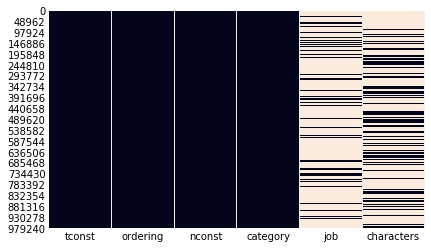
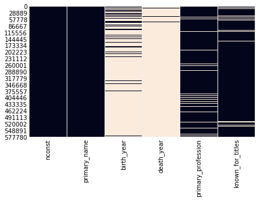
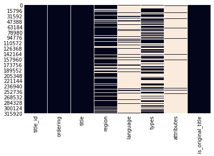
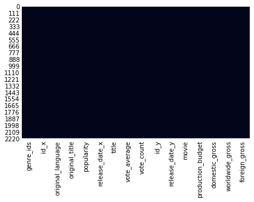
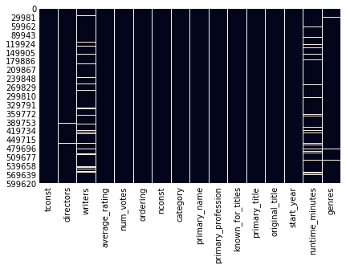
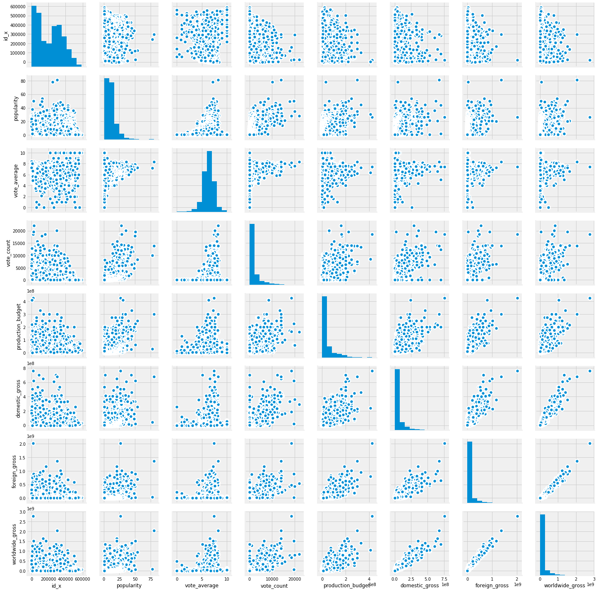
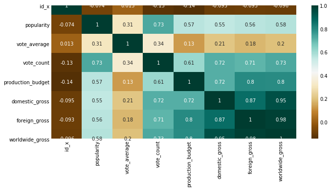
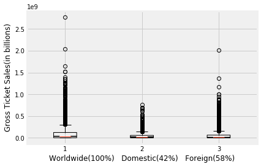
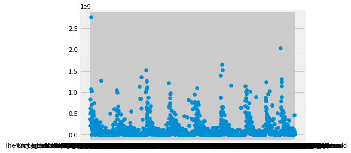
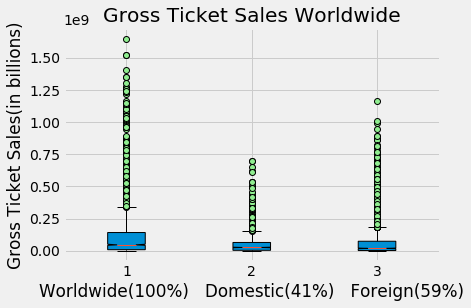

<h1>Table of Contents<span class="tocSkip"></span></h1>
<div class="toc"><ul class="toc-item"><li><span><a href="#-Final-Project-Submission" data-toc-modified-id="-Final-Project-Submission-1"><span class="toc-item-num">1&nbsp;&nbsp;</span> Final Project Submission</a></span></li><li><span><a href="#-Client-Interest-Statement-:" data-toc-modified-id="-Client-Interest-Statement-:-2"><span class="toc-item-num">2&nbsp;&nbsp;</span> Client Interest Statement :</a></span><ul class="toc-item"><li><ul class="toc-item"><li><span><a href="#Client-is-interested-in-going-into-the-movie-making-business-space." data-toc-modified-id="Client-is-interested-in-going-into-the-movie-making-business-space.-2.0.1"><span class="toc-item-num">2.0.1&nbsp;&nbsp;</span>Client is interested in going into the movie-making business space.</a></span></li></ul></li></ul></li><li><span><a href="#-Mission:" data-toc-modified-id="-Mission:-3"><span class="toc-item-num">3&nbsp;&nbsp;</span> Mission:</a></span><ul class="toc-item"><li><ul class="toc-item"><li><span><a href="#Analyze-the-movie-market-to-determine-what-makes-a-great-movie-using-market-data,-web-data-and-financial-information." data-toc-modified-id="Analyze-the-movie-market-to-determine-what-makes-a-great-movie-using-market-data,-web-data-and-financial-information.-3.0.1"><span class="toc-item-num">3.0.1&nbsp;&nbsp;</span>Analyze the movie market to determine what makes a great movie using market data, web data and financial information.</a></span></li><li><span><a href="#1.-Importing-the-required-libraries-for-EDA" data-toc-modified-id="1.-Importing-the-required-libraries-for-EDA-3.0.2"><span class="toc-item-num">3.0.2&nbsp;&nbsp;</span>1. Importing the required libraries for EDA</a></span></li></ul></li></ul></li><li><span><a href="#-Transform-Data" data-toc-modified-id="-Transform-Data-4"><span class="toc-item-num">4&nbsp;&nbsp;</span> Transform Data</a></span><ul class="toc-item"><li><ul class="toc-item"><li><span><a href="#Import-other-files-to-dictionaries" data-toc-modified-id="Import-other-files-to-dictionaries-4.0.1"><span class="toc-item-num">4.0.1&nbsp;&nbsp;</span>Import other files to dictionaries</a></span></li></ul></li></ul></li><li><span><a href="#-Cleaning-the-Data" data-toc-modified-id="-Cleaning-the-Data-5"><span class="toc-item-num">5&nbsp;&nbsp;</span> Cleaning the Data</a></span><ul class="toc-item"><li><span><a href="#All-Files-Review" data-toc-modified-id="All-Files-Review-5.1"><span class="toc-item-num">5.1&nbsp;&nbsp;</span>All Files Review</a></span><ul class="toc-item"><li><span><a href="#1.-check-for-na's" data-toc-modified-id="1.-check-for-na's-5.1.1"><span class="toc-item-num">5.1.1&nbsp;&nbsp;</span>1. check for na's</a></span></li><li><span><a href="#2.-review-shape-of-dfs" data-toc-modified-id="2.-review-shape-of-dfs-5.1.2"><span class="toc-item-num">5.1.2&nbsp;&nbsp;</span>2. review shape of dfs</a></span></li><li><span><a href="#3.-check-for-duplicates" data-toc-modified-id="3.-check-for-duplicates-5.1.3"><span class="toc-item-num">5.1.3&nbsp;&nbsp;</span>3. check for duplicates</a></span></li><li><span><a href="#4.-check-column-consistency" data-toc-modified-id="4.-check-column-consistency-5.1.4"><span class="toc-item-num">5.1.4&nbsp;&nbsp;</span>4. check column consistency</a></span></li><li><span><a href="#NA's-for-all-files" data-toc-modified-id="NA's-for-all-files-5.1.5"><span class="toc-item-num">5.1.5&nbsp;&nbsp;</span>NA's for all files</a></span></li><li><span><a href="#check-for-duplicates" data-toc-modified-id="check-for-duplicates-5.1.6"><span class="toc-item-num">5.1.6&nbsp;&nbsp;</span>check for duplicates</a></span></li><li><span><a href="#3.-check-for-column-name-consistency" data-toc-modified-id="3.-check-for-column-name-consistency-5.1.7"><span class="toc-item-num">5.1.7&nbsp;&nbsp;</span>3. check for column name consistency</a></span></li></ul></li><li><span><a href="#movies-file" data-toc-modified-id="movies-file-5.2"><span class="toc-item-num">5.2&nbsp;&nbsp;</span>movies file</a></span><ul class="toc-item"><li><span><a href="#1.--check-genre_ids
----2.--primary-key-
----3.--change-datetime" data-toc-modified-id="1.--check-genre_ids
----2.--primary-key-
----3.--change-datetime-5.2.1"><span class="toc-item-num">5.2.1&nbsp;&nbsp;</span>1.  check genre_ids
    2.  primary key 
    3.  change datetime</a></span></li><li><span><a href="#2.-Primary-Key-is-ID" data-toc-modified-id="2.-Primary-Key-is-ID-5.2.2"><span class="toc-item-num">5.2.2&nbsp;&nbsp;</span>2. Primary Key is ID</a></span></li><li><span><a href="#3.-datetime-changed" data-toc-modified-id="3.-datetime-changed-5.2.3"><span class="toc-item-num">5.2.3&nbsp;&nbsp;</span>3. datetime changed</a></span></li></ul></li><li><span><a href="#title_crew-file" data-toc-modified-id="title_crew-file-5.3"><span class="toc-item-num">5.3&nbsp;&nbsp;</span>title_crew file</a></span></li><li><span><a href="#tn_budgets-file" data-toc-modified-id="tn_budgets-file-5.4"><span class="toc-item-num">5.4&nbsp;&nbsp;</span>tn_budgets file</a></span><ul class="toc-item"><li><span><a href="#budgets-file-changes:
" data-toc-modified-id="budgets-file-changes:
-5.4.1"><span class="toc-item-num">5.4.1&nbsp;&nbsp;</span>budgets file changes:
</a></span></li><li><span><a href="#2.-Primary-Key-is-ID" data-toc-modified-id="2.-Primary-Key-is-ID-5.4.2"><span class="toc-item-num">5.4.2&nbsp;&nbsp;</span>2. Primary Key is ID</a></span></li></ul></li><li><span><a href="#title_ratings-File" data-toc-modified-id="title_ratings-File-5.5"><span class="toc-item-num">5.5&nbsp;&nbsp;</span>title_ratings File</a></span><ul class="toc-item"><li><span><a href="#2.-Primary-Key-is-tconst" data-toc-modified-id="2.-Primary-Key-is-tconst-5.5.1"><span class="toc-item-num">5.5.1&nbsp;&nbsp;</span>2. Primary Key is tconst</a></span></li></ul></li><li><span><a href="#name_basics-File" data-toc-modified-id="name_basics-File-5.6"><span class="toc-item-num">5.6&nbsp;&nbsp;</span>name_basics File</a></span><ul class="toc-item"><li><span><a href="#name_basics-file-changes:" data-toc-modified-id="name_basics-file-changes:-5.6.1"><span class="toc-item-num">5.6.1&nbsp;&nbsp;</span>name_basics file changes:</a></span></li><li><span><a href="#1.-delete-birth/death-years" data-toc-modified-id="1.-delete-birth/death-years-5.6.2"><span class="toc-item-num">5.6.2&nbsp;&nbsp;</span>1. delete birth/death years</a></span></li><li><span><a href="#1.-fill-na's" data-toc-modified-id="1.-fill-na's-5.6.3"><span class="toc-item-num">5.6.3&nbsp;&nbsp;</span>1. fill na's</a></span></li><li><span><a href="#2.-Primary-Key-is-nconst" data-toc-modified-id="2.-Primary-Key-is-nconst-5.6.4"><span class="toc-item-num">5.6.4&nbsp;&nbsp;</span>2. Primary Key is nconst</a></span></li></ul></li><li><span><a href="#title_principals-file" data-toc-modified-id="title_principals-file-5.7"><span class="toc-item-num">5.7&nbsp;&nbsp;</span>title_principals file</a></span><ul class="toc-item"><li><span><a href="#title_principals-file-changes:" data-toc-modified-id="title_principals-file-changes:-5.7.1"><span class="toc-item-num">5.7.1&nbsp;&nbsp;</span>title_principals file changes:</a></span></li><li><span><a href="#2.-Primary-Key-is-tconst/nconst" data-toc-modified-id="2.-Primary-Key-is-tconst/nconst-5.7.2"><span class="toc-item-num">5.7.2&nbsp;&nbsp;</span>2. Primary Key is tconst/nconst</a></span></li></ul></li><li><span><a href="#title_akas-file" data-toc-modified-id="title_akas-file-5.8"><span class="toc-item-num">5.8&nbsp;&nbsp;</span>title_akas file</a></span></li><li><span><a href="#bom_movie_gross-file" data-toc-modified-id="bom_movie_gross-file-5.9"><span class="toc-item-num">5.9&nbsp;&nbsp;</span>bom_movie_gross file</a></span></li><li><span><a href="#title_basics" data-toc-modified-id="title_basics-5.10"><span class="toc-item-num">5.10&nbsp;&nbsp;</span>title_basics</a></span></li></ul></li><li><span><a href="#Merging-the-Data" data-toc-modified-id="Merging-the-Data-6"><span class="toc-item-num">6&nbsp;&nbsp;</span>Merging the Data</a></span><ul class="toc-item"><li><span><a href="#Explode-the-list-in-the-tn_budgets-file" data-toc-modified-id="Explode-the-list-in-the-tn_budgets-file-6.1"><span class="toc-item-num">6.1&nbsp;&nbsp;</span>Explode the list in the tn_budgets file</a></span></li><li><span><a href="#Merge-Files" data-toc-modified-id="Merge-Files-6.2"><span class="toc-item-num">6.2&nbsp;&nbsp;</span>Merge Files</a></span></li></ul></li><li><span><a href="#Analysis" data-toc-modified-id="Analysis-7"><span class="toc-item-num">7&nbsp;&nbsp;</span>Analysis</a></span><ul class="toc-item"><li><span><a href="#Pair-plot" data-toc-modified-id="Pair-plot-7.1"><span class="toc-item-num">7.1&nbsp;&nbsp;</span>Pair plot</a></span><ul class="toc-item"><li><span><a href="#pair-plot-shows-popularity,-vote_average,-vote_count-have-little-relationship-with-the-ticket-sales/costs---concentrate-on-ticket-sales" data-toc-modified-id="pair-plot-shows-popularity,-vote_average,-vote_count-have-little-relationship-with-the-ticket-sales/costs---concentrate-on-ticket-sales-7.1.1"><span class="toc-item-num">7.1.1&nbsp;&nbsp;</span>pair plot shows popularity, vote_average, vote_count have little relationship with the ticket sales/costs - concentrate on ticket sales</a></span></li></ul></li><li><span><a href="#Heat-map" data-toc-modified-id="Heat-map-7.2"><span class="toc-item-num">7.2&nbsp;&nbsp;</span>Heat map</a></span></li><li><span><a href="#-check-sales-data-for-outliers" data-toc-modified-id="-check-sales-data-for-outliers-7.3"><span class="toc-item-num">7.3&nbsp;&nbsp;</span> check sales data for outliers</a></span><ul class="toc-item"><li><span><a href="#Worldwide-grosses-up-to-1.6-billion-in-ticket-receipts-with-average-film-grossing-$129-million.--Foreign-has-more-upside-potential-with-more-movies-and-higher-value-movies-above-the-75%-level" data-toc-modified-id="Worldwide-grosses-up-to-1.6-billion-in-ticket-receipts-with-average-film-grossing-$129-million.--Foreign-has-more-upside-potential-with-more-movies-and-higher-value-movies-above-the-75%-level-7.3.1"><span class="toc-item-num">7.3.1&nbsp;&nbsp;</span>Worldwide grosses up to 1.6 billion in ticket receipts with average film grossing $129 million.  Foreign has more upside potential with more movies and higher value movies above the 75% level</a></span></li></ul></li></ul></li><li><span><a href="#Previous-sequel-work" data-toc-modified-id="Previous-sequel-work-8"><span class="toc-item-num">8&nbsp;&nbsp;</span>Previous sequel work</a></span></li></ul></div>

                                            wa`132111`1`w`q`11111`# `````##            `6rx43ws`1321`

<h1> Final Project Submission</h1>
<h4> Student name: Joan Leonard Short</h4>             <h4> Scheduled project review date/time:</h4>       
<h4> Student pace: full time online </h4>             <h4> Blog post URL:  https://israeljls-j.github.io/</h4>


```python

```

<h1> Client Interest Statement :</h1>
<h3>Client is interested in going into the movie-making business space.</h3>

<h1> Mission:</h1> 
<h3>Analyze the movie market to determine what makes a great movie using market data, web data and financial information.</h3> 


```python

```

<H3>1. Importing the required libraries for EDA</H3>


```python
import sqlite3
import pandas as pd
import numpy as np
import matplotlib.pyplot as plt
%matplotlib inline
import glob
import os
from os import listdir
from os.path import splitext, basename
from datetime import datetime
import io
import seaborn as sns
import plotly.express as px


```

<h1> Transform Data</h1>


```python
filenames = []
df_list = []
path = '/Users/owner/flatiron1/myproject1/dsc-mod-1-project-v2-1-onl01-dtsc-ft-070620/zippedData/'
filenames = [(path + filename) for filename in os.listdir(path) if filename.endswith('.csv')]
df_list = [filename.split('.csv') for  filename in filenames] 

filenames
```


    ['/Users/owner/flatiron1/myproject1/dsc-mod-1-project-v2-1-onl01-dtsc-ft-070620/zippedData/tmdb.movies.csv',
     '/Users/owner/flatiron1/myproject1/dsc-mod-1-project-v2-1-onl01-dtsc-ft-070620/zippedData/imdb.title.crew.csv',
     '/Users/owner/flatiron1/myproject1/dsc-mod-1-project-v2-1-onl01-dtsc-ft-070620/zippedData/tn.movie_budgets.csv',
     '/Users/owner/flatiron1/myproject1/dsc-mod-1-project-v2-1-onl01-dtsc-ft-070620/zippedData/imdb.title.ratings.csv',
     '/Users/owner/flatiron1/myproject1/dsc-mod-1-project-v2-1-onl01-dtsc-ft-070620/zippedData/imdb.name.basics.csv',
     '/Users/owner/flatiron1/myproject1/dsc-mod-1-project-v2-1-onl01-dtsc-ft-070620/zippedData/imdb.title.principals.csv',
     '/Users/owner/flatiron1/myproject1/dsc-mod-1-project-v2-1-onl01-dtsc-ft-070620/zippedData/imdb.title.akas.csv',
     '/Users/owner/flatiron1/myproject1/dsc-mod-1-project-v2-1-onl01-dtsc-ft-070620/zippedData/bom.movie_gross.csv',
     '/Users/owner/flatiron1/myproject1/dsc-mod-1-project-v2-1-onl01-dtsc-ft-070620/zippedData/imdb.title.basics.csv']


```python

for item in df_list:
    print(item)
```

    ['/Users/owner/flatiron1/myproject1/dsc-mod-1-project-v2-1-onl01-dtsc-ft-070620/zippedData/tmdb.movies', '']
    ['/Users/owner/flatiron1/myproject1/dsc-mod-1-project-v2-1-onl01-dtsc-ft-070620/zippedData/imdb.title.crew', '']
    ['/Users/owner/flatiron1/myproject1/dsc-mod-1-project-v2-1-onl01-dtsc-ft-070620/zippedData/tn.movie_budgets', '']
    ['/Users/owner/flatiron1/myproject1/dsc-mod-1-project-v2-1-onl01-dtsc-ft-070620/zippedData/imdb.title.ratings', '']
    ['/Users/owner/flatiron1/myproject1/dsc-mod-1-project-v2-1-onl01-dtsc-ft-070620/zippedData/imdb.name.basics', '']
    ['/Users/owner/flatiron1/myproject1/dsc-mod-1-project-v2-1-onl01-dtsc-ft-070620/zippedData/imdb.title.principals', '']
    ['/Users/owner/flatiron1/myproject1/dsc-mod-1-project-v2-1-onl01-dtsc-ft-070620/zippedData/imdb.title.akas', '']
    ['/Users/owner/flatiron1/myproject1/dsc-mod-1-project-v2-1-onl01-dtsc-ft-070620/zippedData/bom.movie_gross', '']
    ['/Users/owner/flatiron1/myproject1/dsc-mod-1-project-v2-1-onl01-dtsc-ft-070620/zippedData/imdb.title.basics', '']


```python

```


```python
# read in datafiles
df_list = [pd.read_csv(filename, parse_dates= True) for filename in filenames]


```


```python
#create separate dfs
movies = df_list[0]
title_crew = df_list[1]
tn_budgets = df_list[2]
title_ratings = df_list[3]
name_basics = df_list[4]
title_principals = df_list[5]
title_akas = df_list[6]
bom_movie_gross = df_list[7]
title_basics = df_list[8]

```


```python
md = { 'movies' : movies, 'title_crew' : title_crew, 'tn_budgets' : tn_budgets, 'title_ratings' : title_ratings, 'name_basics' : name_basics, 'title_principals' : title_principals,'title_akas' : title_akas, 'bom_movie_gross' : bom_movie_gross, 'title_basics' : title_basics}
md.keys()
```


    dict_keys(['movies', 'title_crew', 'tn_budgets', 'title_ratings', 'name_basics', 'title_principals', 'title_akas', 'bom_movie_gross', 'title_basics'])


```python
md['movies'].info()
```

    <class 'pandas.core.frame.DataFrame'>
    RangeIndex: 26517 entries, 0 to 26516
    Data columns (total 9 columns):
    genre_ids            26517 non-null object
    id                   26517 non-null int64
    original_language    26517 non-null object
    original_title       26517 non-null object
    popularity           26517 non-null float64
    release_date         26517 non-null object
    title                26517 non-null object
    vote_average         26517 non-null float64
    vote_count           26517 non-null int64
    dtypes: float64(2), int64(2), object(5)
    memory usage: 1.8+ MB


<h3>Import other files to dictionaries</h3>


```python
genre_ids = {'Action': 28, 'Adventure': 12, 'Animation': 16, 'Comedy': 35, 'Crime': 80, 'Documentary': 99, 'Drama': 18, 'Family': 10751, 'Fantasy': 14, 'History': 36, 'Horror': 27, 'Music': 10402, 'Mystery': 9648, 'Romance': 10749, 'Science_fiction': 878, 'TV_movie': 10770, 'Thriller': 53, 'War': 10752, 'Western': 3}
genre_ids

```


    {'Action': 28,
     'Adventure': 12,
     'Animation': 16,
     'Comedy': 35,
     'Crime': 80,
     'Documentary': 99,
     'Drama': 18,
     'Family': 10751,
     'Fantasy': 14,
     'History': 36,
     'Horror': 27,
     'Music': 10402,
     'Mystery': 9648,
     'Romance': 10749,
     'Science_fiction': 878,
     'TV_movie': 10770,
     'Thriller': 53,
     'War': 10752,
     'Western': 3}


<h1> Cleaning the Data</h1>

<h2>All Files Review</h2>
<h3>1. check for na's</h3>
<h3>2. review shape of dfs</h3>
<h3>3. check for duplicates</h3>
<h3>4. check column consistency</h3>


<h3>NA's for all files</h3>


```python
for key in md:
    a = md[key].isna().sum()
    b = (a[a>0])
    c = key
    print(b, 'FILE', c)
    
```

    Series([], dtype: int64) FILE movies
    directors     5727
    writers      35883
    dtype: int64 FILE title_crew
    Series([], dtype: int64) FILE tn_budgets
    Series([], dtype: int64) FILE title_ratings
    birth_year            523912
    death_year            599865
    primary_profession     51340
    known_for_titles       30204
    dtype: int64 FILE name_basics
    job           850502
    characters    634826
    dtype: int64 FILE title_principals
    region                53293
    language             289988
    types                163256
    attributes           316778
    is_original_title        25
    dtype: int64 FILE title_akas
    studio               5
    domestic_gross      28
    foreign_gross     1350
    dtype: int64 FILE bom_movie_gross
    original_title        21
    runtime_minutes    31739
    genres              5408
    dtype: int64 FILE title_basics


```python
#will not use job or characters
sns.heatmap(md['title_principals'].isnull(), cbar=False)
```


    <matplotlib.axes._subplots.AxesSubplot at 0x1a89b921d0>





```python

```


```python
#will not use job, characters
sns.heatmap(md['name_basics'].isnull(), cbar=False)
```


    <matplotlib.axes._subplots.AxesSubplot at 0x1a89c57048>





```python
#will not use birth/death years
sns.heatmap(md['name_basics'].isnull(), cbar=False)
```


    <matplotlib.axes._subplots.AxesSubplot at 0x1a8ab66780>


```python
# will not use language or attributes.  Look at types and region for fills
sns.heatmap(md['title_akas'].isnull(), cbar=False)
```


    <matplotlib.axes._subplots.AxesSubplot at 0x1a8b0ece48>





```python
for key in md:
    print(key, '   ',md[key].shape)


```

    movies     (26517, 9)
    title_crew     (146144, 3)
    tn_budgets     (5782, 6)
    title_ratings     (73856, 3)
    name_basics     (606648, 6)
    title_principals     (1028186, 6)
    title_akas     (331703, 8)
    bom_movie_gross     (3387, 5)
    title_basics     (146144, 6)


<h3>check for duplicates</h3>


```python
for key in md:
    a = md[key].duplicated().sum()
    b = (a[a>0], key)
    print(a, 'FILE:', b, )
#     a = md[item].duplicated()
# print(a[a])
```

    1020 FILE: (array([1020]), 'movies')
    0 FILE: (array([], dtype=int64), 'title_crew')
    0 FILE: (array([], dtype=int64), 'tn_budgets')
    0 FILE: (array([], dtype=int64), 'title_ratings')
    0 FILE: (array([], dtype=int64), 'name_basics')
    0 FILE: (array([], dtype=int64), 'title_principals')
    0 FILE: (array([], dtype=int64), 'title_akas')
    0 FILE: (array([], dtype=int64), 'bom_movie_gross')
    0 FILE: (array([], dtype=int64), 'title_basics')


<h3>3. check for column name consistency</h3>


```python

for key in md:
    columns = (md[key].columns)
    print(key, columns)
```

    movies Index(['genre_ids', 'id', 'original_language', 'original_title', 'popularity',
           'release_date', 'title', 'vote_average', 'vote_count'],
          dtype='object')
    title_crew Index(['tconst', 'directors', 'writers'], dtype='object')
    tn_budgets Index(['id', 'release_date', 'movie', 'production_budget', 'domestic_gross',
           'worldwide_gross'],
          dtype='object')
    title_ratings Index(['tconst', 'averagerating', 'numvotes'], dtype='object')
    name_basics Index(['nconst', 'primary_name', 'birth_year', 'death_year',
           'primary_profession', 'known_for_titles'],
          dtype='object')
    title_principals Index(['tconst', 'ordering', 'nconst', 'category', 'job', 'characters'], dtype='object')
    title_akas Index(['title_id', 'ordering', 'title', 'region', 'language', 'types',
           'attributes', 'is_original_title'],
          dtype='object')
    bom_movie_gross Index(['title', 'studio', 'domestic_gross', 'foreign_gross', 'year'], dtype='object')
    title_basics Index(['tconst', 'primary_title', 'original_title', 'start_year',
           'runtime_minutes', 'genres'],
          dtype='object')


```python

md['title_ratings'].columns     
md['title_ratings'].columns = ['tconst', 'average_rating', 'num_votes']
md['title_ratings'].columns

    
    
```


    Index(['tconst', 'average_rating', 'num_votes'], dtype='object')


```python
md['movies'].head(2)
```


<div>
<style scoped>
    .dataframe tbody tr th:only-of-type {
        vertical-align: middle;
    }

    .dataframe tbody tr th {
        vertical-align: top;
    }

    .dataframe thead th {
        text-align: right;
    }
</style>
<table border="1" class="dataframe">
  <thead>
    <tr style="text-align: right;">
      <th></th>
      <th>genre_ids</th>
      <th>id</th>
      <th>original_language</th>
      <th>original_title</th>
      <th>popularity</th>
      <th>release_date</th>
      <th>title</th>
      <th>vote_average</th>
      <th>vote_count</th>
    </tr>
  </thead>
  <tbody>
    <tr>
      <td>0</td>
      <td>[12, 14, 10751]</td>
      <td>12444</td>
      <td>en</td>
      <td>Harry Potter and the Deathly Hallows: Part 1</td>
      <td>33.533</td>
      <td>2010-11-19</td>
      <td>Harry Potter and the Deathly Hallows: Part 1</td>
      <td>7.7</td>
      <td>10788</td>
    </tr>
    <tr>
      <td>1</td>
      <td>[14, 12, 16, 10751]</td>
      <td>10191</td>
      <td>en</td>
      <td>How to Train Your Dragon</td>
      <td>28.734</td>
      <td>2010-03-26</td>
      <td>How to Train Your Dragon</td>
      <td>7.7</td>
      <td>7610</td>
    </tr>
  </tbody>
</table>
</div>


<h2>movies file</h2>


```python
# for num in genre_ids.values():
for num in md['movies']['genre_ids']:
    print(num)

```

    [12, 14, 10751]
    [14, 12, 16, 10751]
    [12, 28, 878]
    [16, 35, 10751]
    [28, 878, 12]
    [12, 14, 10751]
    [28, 12, 14, 878]
    [16, 10751, 35]
    [16, 10751, 35]
    [16, 28, 35, 10751, 878]
    [16, 35, 10751]
    [10751, 14, 12]
    [53, 12, 28]
    [16, 10751]
    [27, 80]
    [12, 14, 18, 10749]
    [28, 53, 878]
    [10402, 10749]
    [28, 18, 53]
    [18, 53, 9648]
    [28, 18, 9648, 53]
    [28, 35]
    [12, 10751, 14]
    [18, 10749]
    [53, 28, 12, 35, 80]
    [18, 36]
    [28, 35, 80, 53]
    [28, 12, 10751, 14]
    [28, 878, 12, 53]
    [18]
    [28, 53]
    [18, 36]
    [28, 53, 878, 12]
    [28, 18, 9648, 53]
    [12, 14, 28]
    [35, 10749]
    [28, 12, 18]
    [35, 14, 10751]
    [35, 12, 14, 16, 10751]
    [35]
    [14, 12, 28, 35, 18]
    [28, 35, 10749]
    [35]
    [35, 10749]
    [80, 18, 28, 53]
    [27]
    [28, 53]
    [18, 53]
    [16, 12, 10751, 14]
    [10749, 18]
    [12, 28, 18]
    [28, 35, 80]
    [80, 18, 53]
    [28, 37, 18, 14, 53]
    [12, 28, 878]
    [12, 14, 28, 10749]
    [35, 16, 10751]
    [14, 18]
    [18]
    [18, 12, 37]
    [53, 80, 27]
    [28, 80]
    [35, 878, 16]
    [28, 9648, 53]
    [10770, 16, 14, 10751]
    [28, 80, 53]
    [28, 16, 9648]
    [16, 12, 14, 10751]
    [35, 10751, 14]
    [28, 35, 53]
    [80, 18, 9648, 10749]
    [35]
    [35, 18]
    [28, 878, 53, 80]
    [16, 28]
    [16]
    [28, 12, 18, 10751]
    [35, 10751]
    [9648, 27, 28]
    [28, 53, 80, 9648]
    [35, 10749]
    [28, 12, 35, 80, 53]
    [18, 10749, 10752]
    [27]
    [12, 14, 16, 878]
    [10749, 35]
    [35, 10749, 18]
    [18, 28, 53, 80, 9648]
    [18, 53]
    [35, 10402, 10770]
    [10752, 28, 12, 18, 53]
    [28, 12, 16]
    [18, 10749]
    [12, 18, 53]
    [9648, 14, 35, 12]
    [35, 27]
    [12, 18, 28, 14]
    [80, 18, 9648, 53]
    [14, 12, 28, 9648]
    [35, 10749]
    [10749, 18, 53, 80]
    [16, 10751, 10770]
    [18, 53, 9648]
    [28, 18, 36]
    [12, 28, 35, 53]
    [35, 12, 10751, 14]
    [16, 12, 10751, 14]
    [28, 35, 10751]
    [35, 99, 28]
    [18]
    [28, 53, 80]
    [53, 27]
    [12, 16, 10751, 35]
    [35, 18, 10749]
    [53, 80, 18, 28]
    [35, 10751, 28, 14]
    [18]
    [18, 10402, 10749]
    [28, 53, 10749]
    [18, 10749]
    [878]
    [16, 10751, 14]
    [18, 28, 36]
    [28, 35, 53, 10749]
    [35, 10749]
    [27, 9648, 53]
    [28, 12, 80, 9648, 53]
    [18, 53, 80, 9648]
    [18, 80]
    [18, 53, 878]
    [878, 35, 12]
    [16, 35, 10751, 80, 9648]
    [18, 35, 10749]
    [14, 18, 10751]
    [18, 10749, 878]
    [35, 18]
    [18]
    [35, 18, 10749]
    [35, 80, 18]
    [35, 14, 10749]
    [28, 35, 18]
    [18]
    [18, 10749]
    [18, 27, 9648, 53]
    [27, 9648, 53]
    [10749, 18]
    [18, 27, 9648]
    [18, 53]
    [53]
    [28, 35, 80, 53]
    [14, 18]
    [80, 27]
    [99]
    [80, 53]
    [27, 53]
    [18, 10749]
    [35, 10751]
    [80, 35, 18]
    [35, 10749, 10770, 10402]
    [10749, 35]
    [18, 27, 9648, 53]
    [35, 18]
    [35, 18, 10749]
    [18]
    [28, 35]
    [27, 18, 53]
    [53, 18]
    [16, 10751, 35]
    [18, 28, 35, 53, 80]
    [10749, 35]
    [18, 10751, 10749]
    [35]
    [35, 27]
    [35, 10751, 16, 12]
    [80, 18, 53]
    [18]
    [18]
    [80, 18, 53]
    [18, 10749]
    [35, 27]
    [18, 10752, 9648]
    [28, 80, 18, 53]
    [16, 35, 878]
    [28, 12, 16, 10751, 878]
    [878, 28]
    [28, 35, 80]
    [18, 53, 9648]
    [18, 27, 878]
    [10752, 18, 36, 28]
    [99, 10751]
    [12, 27, 53]
    [28, 12, 53]
    [28, 12, 16, 27]
    [28, 80, 53]
    [99]
    [18, 10749]
    [18, 10749]
    [35, 18]
    [18, 53, 80]
    [14, 18, 27, 10749]
    [18, 10749]
    [53, 27]
    [27, 35, 53]
    [35]
    [80, 53, 35, 9648]
    [10751, 35]
    [35]
    [10749, 878]
    [18, 80]
    [53, 18, 28, 80]
    [14, 18, 28, 53, 16]
    [35, 18]
    [28, 12, 14, 27]
    [9648, 53]
    [14, 27, 53]
    [16, 18]
    [18, 53]
    [18]
    [35, 18, 14, 27, 9648]
    [53, 28, 18]
    [35, 18, 10749]
    [27, 53]
    [12, 14, 28, 37, 53]
    [18, 10749]
    [35, 18, 9648]
    [35, 18, 10749]
    [18, 10402]
    [18, 10749]
    [27, 53]
    [12, 16, 10751, 35]
    [18, 28, 53, 80]
    [28, 27, 878]
    [16, 18, 878, 53]
    [18]
    [16, 10751, 35, 12, 10749]
    [10770, 18, 10751, 14]
    [27, 53]
    [16, 35, 10751]
    [16, 28, 878]
    [18, 53]
    [27, 878]
    [18]
    [18, 28, 53]
    [10751, 16]
    [27, 35, 878, 53, 10770, 28]
    [18, 27, 53]
    [18, 14]
    [18, 9648, 53, 80, 10749]
    [18, 28, 35, 80]
    [27, 28, 53, 878]
    [16, 10751]
    [28, 35, 80]
    [53, 9648]
    [18, 28, 53]
    [35]
    [18, 53]
    [35, 10749]
    [27]
    [18, 35]
    [35]
    [35, 10749, 18]
    [35, 18, 10749]
    [35, 10749]
    [28, 53, 80, 18]
    [35]
    [18]
    [28, 12, 18, 36, 10752]
    [35, 18, 10749]
    [28, 12, 35]
    [27, 9648, 53]
    [27, 53, 9648]
    [36, 28]
    [18, 10749]
    [18, 28]
    [28, 35, 12]
    [35, 18]
    [35, 18, 10749]
    [18, 10749, 10402]
    [10402, 14, 28, 10751]
    [99, 10751]
    [18]
    [18, 12, 36]
    [10751, 12]
    [35, 10751]
    [18]
    [18]
    [18, 36, 10770]
    [18, 35, 10749]
    [35, 10749]
    [35, 18]
    [18, 37]
    [27, 53]
    [27, 878, 53]
    [35, 18, 36]
    [14, 16, 18, 35, 878, 10751]
    [35, 10749, 10770]
    [12, 878]
    [99]
    [16, 35]
    [18, 53, 9648]
    [27]
    [35]
    [18]
    [18]
    [99, 10752]
    [16, 35, 10751]
    [35]
    [18]
    [18, 53]
    [80, 18, 53]
    [14, 18, 27, 35]
    [16, 35, 10751]
    [35, 18, 10749]
    [28, 12, 16, 10751]
    [35]
    [35, 18, 10751, 10770]
    [18]
    [53, 9648, 80, 18]
    [18, 28, 53, 80]
    [35]
    [28, 27, 878, 53]
    [18, 9648, 10749]
    [16, 10751]
    [35, 18, 10749]
    [18, 36]
    [27, 878, 10770]
    [10749, 35, 18]
    [18, 10402]
    [16, 35]
    [35]
    [35, 10749, 18]
    [35, 10749]
    [27, 53]
    [35]
    [18, 10749]
    [27, 53, 80, 9648]
    [12, 14, 16, 28, 53, 878, 10751]
    [35, 10749]
    [80, 18, 53, 36]
    [18, 10751, 12]
    [35, 18, 10749]
    [35, 10749]
    [16, 28, 53, 878]
    [9648, 18]
    [27]
    [99]
    [28, 12, 27, 878]
    [27, 53]
    [18]
    [35, 18]
    [53, 80, 18, 9648]
    [27, 28, 878, 53]
    [10402, 35, 18]
    [10751, 14, 27, 10770]
    [99]
    [18, 53, 80, 9648]
    [16, 878]
    [10749, 35]
    [10751, 16]
    [27, 28, 53, 878]
    [18]
    [18, 14]
    [16, 35]
    [35]
    [28, 53, 37]
    [18]
    [10770, 10751]
    [18, 36, 10752]
    [18, 35]
    [35, 18, 10749]
    [35]
    [35, 28, 80]
    [18]
    [16, 14]
    [16, 35]
    [35, 10749]
    [35, 53, 80]
    [99]
    [18, 28, 10749]
    [18, 878, 35, 9648]
    [28, 80, 18, 53]
    [35, 80, 53]
    [18]
    [35, 10749]
    [27, 878]
    [35, 18]
    [18]
    [9648, 99, 27, 80]
    [18, 10749]
    [80, 27, 9648, 53]
    [80, 28, 12, 53]
    [27, 53]
    [35, 10751, 10770]
    [878, 53, 18, 9648]
    [16, 35, 10751, 9648, 14]
    [16]
    [28, 53]
    [35]
    [53, 27]
    [80, 18, 53]
    [28]
    [99]
    [14]
    [28, 12, 53]
    [16, 28, 37]
    [9648, 27, 53, 80]
    [99, 10402]
    [18, 27, 53]
    [18]
    [28, 18, 53]
    [53, 80, 18, 9648]
    [99]
    [16, 35, 10751]
    [35]
    [53, 28, 35]
    [14, 18, 27, 28, 53, 9648]
    [99]
    [18]
    [80, 18, 9648]
    [35, 27]
    [16]
    [10751, 18, 10749, 35]
    [12]
    [27, 53, 18]
    [10770, 14, 35, 10749, 10751]
    [35, 10751]
    [18, 36]
    [27, 878]
    [18]
    [35, 18]
    [18]
    [80, 53, 35]
    [28, 80, 53]
    [18, 35, 10749]
    [28, 18, 53]
    [53, 10752]
    [18, 27, 53]
    [35, 18, 10749]
    [18]
    [35, 18, 10749]
    [35]
    [99]
    [18, 10749]
    [18, 10751, 14]
    [35]
    [16, 35]
    [35]
    [28, 878]
    [28, 18, 53]
    [53, 80, 9648]
    [18, 28, 80]
    [18, 10751]
    [18, 53]
    [12, 18]
    [28, 27, 53]
    [14, 27, 28, 53]
    [28, 53]
    [18]
    [28, 12, 35, 27]
    [35]
    [35, 10749]
    [36, 18, 10749]
    [35, 10749, 18]
    [35, 18]
    [18]
    [53, 878, 28]
    [35, 10749]
    [18, 10402, 10749]
    [18, 28, 53]
    [35, 18, 10749]
    [53, 18, 10749, 80]
    [10749]
    [16]
    [53, 35]
    [35, 10749]
    [35, 18]
    [35, 18, 10749]
    [35, 80, 18]
    [35]
    [18, 35, 10749]
    [14, 9648, 53]
    [18]
    [27, 53]
    [27, 28, 53]
    [18, 10749]
    [18, 28]
    [35, 18, 10402, 10749]
    [18, 10751]
    [18, 9648, 53]
    [35]
    [16, 12]
    [99]
    [10749, 18]
    [99]
    [12, 28, 53]
    [80, 35]
    [27, 28, 53]
    [18, 28]
    [35]
    [14, 18, 28, 53, 80, 878, 10749]
    [27, 878]
    [16, 10751, 35, 12]
    [18, 10749]
    [27, 53]
    [35, 18]
    [18, 10749]
    [10752, 35, 18]
    [28, 12, 53]
    [27, 53]
    [28, 80]
    [10751, 16]
    [35, 10749]
    [18]
    [28, 53]
    [10749, 18]
    [10751, 12]
    [35, 18, 10749]
    []
    [12, 16]
    [16, 80, 9648]
    [99]
    [35, 10751]
    [16]
    [28, 12, 53]
    [878, 53]
    [37]
    [35]
    [99]
    [18]
    [16, 35]
    [18, 53]
    [18, 53]
    [35, 18]
    [27]
    [35, 18]
    [28, 878, 27, 53]
    [18, 35]
    [18, 10751]
    [53]
    [35]
    [16]
    [10751, 35, 18]
    [28, 18, 53, 12]
    [18]
    [18, 53]
    [28, 10749]
    [28, 878, 53]
    [18, 35, 10749]
    [16, 10751]
    [18, 53, 9648]
    [10749, 12, 18, 36]
    [18, 53]
    [12, 28]
    [35, 10749]
    [80, 18, 53]
    [53, 18]
    [18, 35, 10749]
    [18, 27, 53]
    [18]
    []
    [18, 35, 10749, 10751, 14]
    [14, 10770, 35]
    [18, 27, 53]
    [16, 18]
    [28, 53]
    [99]
    [27, 53, 9648]
    [35]
    [27, 53]
    [28, 9648, 53, 27]
    [18]
    [12, 35, 10751, 14]
    [18, 53]
    [53, 27]
    [18]
    [10749, 18]
    [18]
    [35, 18]
    [10752, 14, 28, 18]
    [35]
    [35]
    [27, 878]
    [35]
    [35, 18]
    [27]
    [35, 27]
    [27, 28, 53, 878]
    [18, 14]
    [10770, 878]
    []
    [53, 28, 12]
    [18]
    [18]
    [27, 878, 28]
    [18]
    [35]
    [28, 14]
    [18, 10749]
    [99]
    [80, 18, 53]
    [35, 10751]
    [35, 18, 10749]
    [99, 10402]
    [16]
    [10749, 35, 18]
    [99]
    [18]
    [27, 53, 9648]
    [99, 10402]
    [99]
    [18, 53, 80]
    [35]
    [27, 878, 12]
    [10770, 14, 27]
    [35]
    [80, 18, 53]
    [18, 53]
    [14, 18, 10751, 10770]
    [16]
    [35, 18, 10749]
    [18, 10749]
    [10749, 10770, 18, 10751]
    [18, 27, 53]
    [99, 36]
    [27]
    [12, 27, 53]
    [878, 14, 27]
    [27, 28, 53]
    [18, 10749]
    [18, 35]
    [27, 18, 53]
    [35, 18, 10751]
    [35, 18, 10749]
    [35]
    [18]
    [18]
    [28, 12, 53]
    [27, 53, 18, 80]
    [16]
    [28, 27, 37]
    [28, 99]
    [12, 28, 14]
    [16]
    [16, 18, 10749]
    [27, 878, 53]
    [18, 35]
    [99]
    [27, 35]
    [10770, 35, 18, 10749]
    [35, 18, 27, 53]
    [10751]
    [35, 10402]
    [16, 35]
    [27]
    [18]
    [27, 878, 53]
    [18, 10749]
    [99]
    [35, 18]
    [27, 53, 878]
    [27]
    [99, 18]
    [10749, 18]
    [18, 28, 53]
    [18]
    [80, 27, 9648, 53]
    [28, 35, 80, 18]
    [18]
    [27]
    [18, 10751]
    [35, 10751]
    [18, 35, 10749]
    [99]
    [18, 10749]
    [18]
    [18]
    [10751, 16]
    [27]
    [99]
    [28, 12, 99]
    [27, 53]
    [35, 53, 9648]
    [14, 28, 53, 878]
    [27, 53]
    [27, 53]
    [28, 35, 27]
    [12]
    [16]
    [10770, 80, 9648, 53]
    []
    [28, 878, 53]
    [27, 53]
    [18, 53, 10749]
    [53, 9648]
    [99]
    [35, 10749]
    [27]
    [99]
    [27, 53]
    [28, 80, 53]
    [28, 12, 16, 878, 10752]
    [99]
    [12, 14, 27, 28, 53, 878]
    [18, 9648]
    [35, 99]
    [18]
    [18, 53, 80, 9648]
    [35, 10751, 14, 10770]
    [18]
    [878, 28]
    [18, 878, 53]
    [99, 10402]
    [27]
    [27]
    [99]
    [14, 36, 10749]
    [80, 53, 9648]
    [10770, 10751, 14]
    [18]
    [27, 9648, 53]
    [16, 10751, 35]
    [53, 80, 9648]
    [27]
    [18, 9648, 53]
    [18, 10749, 53]
    [35, 10749]
    [27, 14]
    [99]
    [27]
    [36, 18, 10752]
    [35, 18, 10749]
    []
    [35, 18]
    [35]
    [9648, 18, 35, 53]
    [18]
    [18]
    [18]
    [10402, 99]
    [27, 878]
    [10770, 53, 18]
    [35]
    [28, 18, 37]
    [35, 10749]
    [27, 53]
    [18]
    [10770, 80, 18, 9648]
    [53]
    [27, 28, 35, 53]
    [10770, 35, 10751]
    [28, 35]
    [35]
    [35, 18]
    [18, 10749]
    [18, 35, 10749]
    [18, 35, 10749]
    [12, 35, 10751]
    [14, 18, 878, 10749, 10751]
    [27, 878, 10770]
    [35, 80]
    [18, 35, 10749]
    [99]
    [10749, 35]
    [18, 80]
    [27, 53]
    [18, 53]
    [18]
    [18]
    [878, 14]
    [10749, 10770]
    [28, 80, 18, 53]
    [53]
    [18, 10749]
    [18]
    [16]
    [36, 99]
    [27, 53, 9648]
    [99]
    [18, 10749]
    [18]
    [28, 12, 18, 27, 878, 53]
    [18, 28, 53]
    [27, 9648]
    [27]
    [28, 12, 18, 53]
    [35]
    [35, 18, 10749]
    [35, 99, 18]
    [10749, 18]
    [10752, 18]
    [35, 10751]
    [28, 12, 80, 18, 53]
    [18]
    [28, 27, 878]
    [35]
    [99]
    [18]
    [99]
    [18]
    [28, 12, 35, 18, 878, 53]
    [27, 28, 53, 878]
    [878]
    [18, 10749]
    [10770, 16, 12]
    [18]
    [35, 99]
    [99]
    [18, 10749]
    [18]
    [35, 27]
    [99]
    [18]
    [28, 12, 53]
    [35, 10770, 10751]
    [35]
    [18]
    [18, 10749, 10770]
    [28, 18, 9648]
    [28, 14, 878]
    [10402, 99]
    [18]
    [35, 10749]
    [27]
    []
    [28, 35, 10751]
    [53]
    [18, 10751]
    [18, 10749]
    [35, 9648]
    [27, 35]
    [18]
    []
    [35]
    [35, 27]
    [27, 878]
    [10749, 53, 27, 18]
    [99, 37]
    [18]
    [28, 27, 53]
    [35, 99]
    [18, 878]
    [27, 35]
    []
    [99]
    [18, 28, 53, 878]
    [99]
    [35, 18, 10749]
    [18]
    [99]
    [27]
    [18, 53, 27, 878]
    [27, 14, 878]
    []
    [35, 36]
    [18]
    [18, 35, 10749]
    [99]
    [80, 99, 18]
    [18, 10749, 35]
    [27, 53]
    [80, 27]
    [28, 12, 18, 9648, 878, 53]
    [28, 53, 37]
    [18, 10751, 10749]
    [35]
    [18]
    [28, 53]
    [18, 35]
    [80, 18, 9648, 53]
    [18, 35]
    [99]
    [18]
    [18, 10749]
    [878, 27]
    [35, 18, 10749]
    [99]
    [99, 18]
    [99]
    [35, 18]
    [35]
    [27, 53]
    [35, 10749, 878]
    [28, 35, 37]
    [878, 28]
    [28, 37]
    [28, 18, 80]
    [28, 53]
    [18, 878]
    [27, 53]
    [27]
    [80, 18, 53]
    [35]
    [99, 16]
    [27]
    [28]
    [35, 18, 10749]
    [53, 18]
    [10770, 35, 18, 10749]
    [80, 18, 53]
    [878, 12]
    []
    [80, 18]
    [28, 80]
    [28, 53]
    [35]
    [37, 28]
    [35, 27]
    [27, 28, 53, 878]
    [18]
    [10751, 12]
    [99]
    [18]
    [99]
    [18]
    [35]
    [9648, 53]
    [99, 10402]
    [10402]
    []
    [99]
    [27, 53]
    [18]
    [35]
    [28, 53]
    [16, 28]
    [27, 53]
    [35, 10751]
    [14, 9648, 53, 10749]
    [18, 28, 36]
    [14, 27, 53]
    [18, 10770]
    [99]
    [18, 28, 10749]
    [18, 53]
    [35, 18, 10749]
    [18, 27, 53]
    [18, 10402, 10749]
    [27]
    [27, 9648, 80]
    [35]
    [53, 9648]
    [18, 10749]
    [35, 10749]
    [27]
    [10770, 18, 36]
    [18]
    [18, 53]
    [35, 18, 10749]
    [53]
    [99]
    [28, 12, 18]
    [18]
    [28, 53]
    [18, 10749]
    [35, 80, 28]
    [28, 12, 35, 53]
    [35, 18, 10749]
    [10749, 18]
    [99]
    [35]
    [99, 28]
    [18, 10751]
    [18, 10749]
    [99]
    [35]
    [35, 10749]
    [35, 10749]
    [53, 878]
    [27]
    [99]
    [27, 53]
    [28, 16]
    [10751, 18]
    [28, 12, 53]
    [53]
    [10770, 28, 12, 10751, 14, 878]
    [99]
    [27]
    [27]
    [28, 12, 27]
    [16, 10751]
    [18, 53]
    [18, 35]
    [35, 99]
    [99]
    [35]
    [35, 10749]
    [18, 10749]
    [18]
    [27, 28, 35, 53]
    [99]
    [18]
    [99]
    [28, 35]
    [18]
    [80, 99]
    [27, 878, 53]
    [35]
    [27, 53]
    [35, 10402]
    [35, 18]
    [18, 10749]
    [99, 35]
    [35, 27]
    [12, 80]
    [18, 10751]
    [99]
    [14, 9648]
    [16, 10751]
    [35]
    [99]
    [28, 80, 18]
    [99]
    [99]
    [10770, 80, 18]
    [18]
    [28, 12, 35, 27]
    [35, 80]
    [99]
    []
    []
    [18, 10770]
    [18]
    [18, 14, 9648]
    [99]
    [35]
    [35]
    [99]
    [80, 18]
    [99]
    [99]
    [18, 53, 878]
    [35, 10751]
    [35, 18, 10402]
    [99]
    [35, 18, 10751]
    [53, 18]
    [35, 18, 10749]
    [27]
    [27]
    [18]
    [27, 53, 18]
    [28, 80, 18, 27, 53]
    [27]
    [18, 10751]
    [35, 53]
    [37]
    [18]
    [10770, 80, 18, 9648]
    [18, 10749]
    [27]
    [10749, 35]
    [27]
    [99]
    [27, 53]
    [18, 14]
    [35, 878]
    [18, 28, 35, 53]
    [10770, 99]
    [27, 53]
    [99]
    [16, 12, 10751, 14]
    [35, 99]
    [9648, 53]
    [10402]
    [28]
    [18]
    [99, 18]
    [18]
    []
    [35, 10402]
    [18, 28, 35, 53]
    [99]
    [99]
    [99, 18, 36]
    [35, 10749]
    [16, 99]
    [10402, 10749, 35]
    [99, 35]
    [99]
    [99]
    [10402]
    [10402]
    [18, 28]
    [18]
    []
    [10770, 18]
    []
    [18, 10751, 10770]
    []
    [80, 18]
    []
    []
    [99]
    [53, 878]
    [18, 9648, 53]
    [10770]
    [18]
    [18, 10749, 80]
    [18, 10752, 878]
    [18]
    [28, 14, 53]
    [18]
    []
    [53]
    [10749, 35]
    [35, 18, 10749]
    []
    [10751]
    [80, 18, 27]
    [18, 35, 14, 10749]
    [27]
    [18, 53]
    [27, 35]
    [99]
    [10770, 10751]
    [18]
    [35, 10749]
    [18, 10749]
    [18, 35, 10749]
    [80, 18, 9648, 10770]
    [99]
    [18]
    [10402]
    [35]
    [99]
    [99]
    [35]
    [10402]
    [28, 12]
    [35]
    [18, 10770]
    [18]
    [16]
    [28, 27, 53, 878]
    [53, 10770]
    [35, 18, 10749, 53]
    [27]
    [12, 35]
    [10749, 80, 18, 53, 12]
    [18]
    [35, 27]
    []
    [99]
    [99]
    [28, 12, 18, 9648, 53]
    [99]
    [80, 10749, 53, 9648]
    [35, 18, 10749]
    [878, 18]
    [16, 37]
    [99]
    [18, 10751, 10752]
    [28, 53]
    [16]
    [18]
    [35, 10402]
    [35, 18, 10402]
    []
    [80, 53]
    [18, 35]
    [99]
    []
    [27, 878, 53]
    [27, 35]
    [99]
    [35, 10402, 36]
    [27, 53]
    [99]
    [99, 35]
    [35]
    [35, 18, 27]
    [35, 18]
    [99]
    [16, 878, 35, 10751]
    [18, 27, 9648]
    [18, 80]
    []
    [99]
    [18]
    [18, 10751]
    [27, 53]
    [28, 10751]
    [18, 10749]
    [35, 10749]
    [12, 35]
    [35, 10751]
    [10749, 35, 18]
    [16, 10751]
    [18, 10749, 10770]
    [18]
    [18]
    [53, 18, 27]
    [12, 10751, 9648]
    [99]
    [27, 35]
    []
    [27]
    [18]
    [10749]
    [878]
    [99, 18]
    []
    [28, 12, 18, 53]
    [28, 12, 878, 53]
    [99, 12]
    [18, 27, 53]
    [18, 27]
    [28, 80, 18, 53]
    [27, 28, 53]
    [99]
    [12, 14, 28, 878, 10751]
    [53, 18]
    [18, 10749]
    [99]
    [99, 12, 36]
    [35]
    [99]
    [35, 80, 18]
    [27, 53]
    [10402]
    [80, 18]
    [80, 9648, 53, 10770]
    [28, 35, 27]
    [18, 10749]
    [99]
    [99]
    [10770, 53]
    [12, 35, 27]
    [35]
    []
    [18, 36, 10749]
    [35, 16]
    [99]
    [18, 10770]
    [99]
    [35, 10402, 10751]
    [18]
    [16, 35, 10402]
    [99, 10402]
    [18, 10749]
    []
    [99, 10402]
    [35]
    [35]
    []
    [18, 35]
    [18, 35]
    [878]
    [99]
    [18, 35, 10749]
    [99]
    [18, 53]
    [53]
    [99, 35]
    [16, 10402]
    [10402]
    [99]
    [27, 53]
    [18, 35, 10749]
    [27, 35]
    [99, 35]
    [99]
    [35]
    [99]
    [27, 28, 53]
    [27, 53]
    [18, 9648, 878]
    [27, 53, 878]
    [18]
    [14, 35, 878, 10751]
    [99]
    []
    [28]
    [18, 10751]
    [18, 35]
    [35, 16]
    [18]
    []
    [35]
    [35]
    [99, 10770]
    [99]
    [99]
    []
    []
    [35]
    [18, 12]
    [35]
    [10751]
    [53, 27]
    [18, 80, 53]
    [18]
    [80, 18, 9648]
    [10749, 35]
    [18, 10402, 10749]
    [35]
    [99]
    [18]
    [9648, 53]
    [18, 9648, 53]
    [99]
    [18, 27, 878]
    [10749]
    [35, 10402]
    [99]
    []
    [10402]
    [10770, 18, 10749]
    [27]
    [10749, 35]
    [27]
    [18]
    [18, 53]
    [10751, 14, 18, 10770]
    [9648, 53]
    [35, 18]
    [28, 10749]
    [99]
    [99]
    [99]
    []
    [99]
    [35]
    [18, 9648, 53]
    [99]
    [27]
    [35, 99]
    [18, 99]
    [18, 10751]
    [99]
    [99]
    [18]
    [18]
    [99]
    [18, 10770]
    [99]
    [10751]
    [18, 10749]
    []
    [99]
    [99]
    [35, 99]
    [35]
    [35]
    [35, 99]
    [18]
    [99, 18, 27]
    [35, 10749]
    [99, 10402]
    [35, 53, 9648]
    [99, 10402]
    [99]
    [18, 35]
    [18]
    [99, 18]
    [18]
    [99, 18]
    [35, 99]
    []
    [27, 35]
    [28, 80, 53]
    [35, 80]
    [35]
    [99]
    [18]
    [99, 10402]
    [35, 878]
    [99]
    [18, 10749]
    [99]
    [10402, 35]
    [35, 53]
    [99]
    [16, 878]
    [28, 35]
    []
    []
    [99]
    [18, 53, 10749]
    [35, 18, 10751]
    [35]
    []
    [10751]
    [99, 10402]
    [27, 53]
    [10402]
    []
    [18, 10749]
    [18]
    [9648, 53, 80]
    [18, 80]
    [28, 35, 18, 14, 27, 10749]
    [16, 10751]
    [99]
    []
    [18]
    [10402]
    [10402, 99]
    [35]
    [10402]
    [99, 36]
    [28, 12, 35, 18]
    [10749, 18]
    [18]
    [878]
    [28, 27, 878]
    [27]
    [18, 53]
    [99]
    [12, 35, 99, 10751]
    [35]
    [35]
    []
    [99]
    []
    [99]
    [10402]
    [18, 53]
    [99, 35]
    []
    [35]
    []
    [35]
    []
    [35, 18]
    [99, 10402]
    []
    []
    [18]
    [18]
    [28, 18]
    [35]
    [10402]
    [27, 35]
    [18, 10749]
    [35, 18, 10751]
    [35]
    [99, 878]
    [53]
    [99]
    []
    [27]
    [18]
    [99]
    [37]
    [10749, 35]
    [99]
    [12, 18, 28, 10751]
    [35, 28]
    [14]
    [28, 12]
    []
    []
    []
    [80, 99]
    []
    [35, 10749]
    [10402]
    [16, 35, 10751]
    [28, 35]
    [36, 99]
    [10402]
    []
    [35]
    [35]
    [99]
    [10402]
    [35]
    [99]
    [35, 27]
    [18, 10770]
    []
    [35]
    [27]
    [35, 80]
    [10402, 14, 10749]
    [18, 53]
    [28, 18, 36]
    [27, 28]
    [28, 18, 14, 878, 53]
    [99]
    [27, 16, 878]
    [18, 10749]
    [99]
    [28]
    []
    []
    [99]
    [18]
    [99]
    [16, 18]
    [99]
    []
    [878]
    [99]
    [99]
    [99]
    []
    [99]
    [10402, 99]
    [28, 18]
    [53, 18, 878]
    []
    [99, 53]
    [18, 35, 10749]
    [53, 27, 9648]
    [18]
    [99]
    []
    [27, 18]
    [99]
    [99]
    [99, 10770]
    [53]
    [18, 10749]
    [99]
    [99]
    []
    [35, 878, 10402]
    [27, 28, 53]
    [53, 27, 28]
    [18, 14, 35]
    [27]
    [27]
    []
    [28, 878]
    [53, 80]
    [28, 18]
    [35]
    [99]
    [35, 16]
    []
    [99]
    [99]
    [99, 36]
    [18]
    [18]
    []
    [18, 27, 53]
    []
    [16, 28, 878]
    [28, 12, 14]
    [18]
    [99]
    [35, 18]
    [28, 53]
    [10402]
    [18, 10749]
    [99]
    [35]
    [35, 10749]
    [99]
    [16, 10751]
    [10751]
    []
    [28, 53, 80]
    [18]
    [99]
    [18, 10749]
    [35, 18, 10749]
    []
    [27]
    [10402]
    [35, 10749]
    [35]
    [27]
    [18]
    [35]
    [878, 10402]
    [99]
    [35, 99, 10749]
    [99]
    [99]
    []
    [99]
    [99]
    [99]
    []
    [27, 53]
    []
    [53, 9648, 80, 878]
    [27]
    [99, 10752]
    [35]
    [35]
    [18, 28]
    [35, 99]
    [18]
    [35]
    [12, 16, 35, 10751]
    [10402]
    [28, 53, 10402]
    []
    [99]
    [99]
    [99]
    [99, 10402]
    [14, 53, 878]
    [10770, 12, 10751]
    [10751]
    [27, 9648, 878]
    [28, 35]
    [18]
    [27, 878]
    [99]
    []
    [99]
    [18]
    [35, 99]
    [10402]
    [10402]
    [10402]
    [99]
    [35]
    [53, 18]
    [99, 10402]
    [99, 36]
    [28, 18, 878]
    [35]
    [99]
    [53]
    [99]
    [35, 18]
    [99]
    [18]
    [99]
    [14, 18]
    [10402]
    [28, 12, 27, 878]
    [99, 18]
    [35]
    [18]
    [18, 27, 878]
    [37]
    [35]
    [16, 35, 878]
    [10402]
    []
    [35]
    [18, 53, 9648]
    [99]
    [18]
    [18, 53]
    [99]
    []
    [99]
    [28, 35]
    [10752, 99]
    [18]
    [99]
    [35, 18]
    [18]
    [35, 10749]
    [99]
    [99]
    [10751]
    [35, 99]
    [80, 18]
    [10402, 99]
    [10402]
    [10402]
    [99, 10402]
    [99]
    [16, 10752]
    [12, 35, 10751, 37]
    [10402]
    [10402]
    [27]
    [16, 35]
    [99]
    [99]
    [99]
    [99, 35]
    [10402]
    [99]
    [10402]
    [35]
    [10402]
    [35]
    [27, 9648]
    []
    [18, 27]
    []
    [99, 10402]
    [99]
    []
    [18, 53]
    [99]
    [99, 10402]
    [35, 10749]
    []
    [10402]
    []
    [99]
    []
    []
    [18]
    [18, 28, 53]
    [10402]
    [35]
    [18]
    []
    []
    [10402]
    []
    []
    [99]
    [9648, 18, 14]
    [35]
    [10402]
    []
    [99]
    [878, 10749, 16, 28]
    [99]
    [16]
    [18]
    [18]
    [99]
    [18, 53]
    []
    [99]
    []
    [99]
    [18, 28]
    [35, 10749]
    []
    [99]
    []
    [99]
    [18]
    [14, 18]
    [99]
    [28, 878]
    [35]
    [10402]
    [35]
    [99]
    []
    [10751, 16]
    [99]
    [99]
    [99]
    [18]
    [35]
    [53]
    [16, 878]
    [99]
    [18, 10751]
    [18]
    [18, 53, 9648]
    []
    []
    [10751, 12]
    [27]
    [35]
    []
    [35, 27]
    [27, 18, 35]
    [27]
    [99]
    [28, 12]
    [878]
    []
    [18]
    [35, 10749, 18]
    [53, 10770]
    [18]
    [10402]
    [35, 10749]
    [80, 18]
    [28, 16]
    [18, 80, 18]
    [18]
    [99]
    [99]
    [99, 36, 10402]
    []
    []
    [35]
    [28]
    [99]
    [35]
    [99]
    []
    [99]
    [99]
    [99]
    [18]
    [18]
    [99]
    [53]
    [27, 35]
    [99, 10402]
    []
    []
    []
    [99]
    [99]
    [10751, 99]
    []
    [18]
    [35, 28]
    []
    []
    [99]
    [35, 10402]
    [99]
    []
    []
    [99]
    []
    []
    [10402]
    []
    []
    [10402]
    []
    []
    [99]
    [35]
    [10402]
    []
    [18, 28, 10751]
    [99]
    []
    []
    []
    [18]
    []
    []
    []
    []
    []
    [35, 14, 9648, 878]
    [99]
    [99]
    []
    [99, 36]
    [99]
    [10402]
    []
    []
    []
    []
    [10402]
    [35]
    []
    [99]
    [10770, 10402, 10749]
    [16]
    [18, 35]
    [99]
    [99]
    []
    []
    [10402, 99]
    [99, 10749]
    [99]
    [99]
    [99, 10402]
    [16]
    [28]
    [99]
    [16, 35]
    [10402]
    []
    [53, 27, 9648]
    []
    [99]
    []
    [99, 10402]
    [18, 35]
    []
    []
    [27]
    []
    []
    []
    []
    [99]
    []
    []
    []
    []
    [99]
    []
    [27]
    [35]
    [99]
    []
    [99]
    [10402]
    [18]
    [10402]
    [14, 35, 12]
    [18]
    [35, 28, 12]
    []
    []
    [35, 18]
    [35, 27]
    [35]
    []
    [99, 18]
    []
    []
    [10402]
    [99]
    [99]
    [18]
    []
    [18, 53]
    [99]
    [99]
    []
    [99]
    [35]
    [99]
    [80, 53]
    []
    [16, 18]
    [99]
    []
    []
    [99]
    [99]
    [99]
    [9648, 99]
    [10749, 16, 28, 80]
    [27, 14, 18]
    [10402]
    []
    []
    [99]
    [99, 36]
    []
    [10402]
    [35]
    []
    [99]
    [16, 99]
    [99]
    [16]
    []
    [10402]
    []
    [99]
    []
    [18]
    [16]
    [18]
    [35]
    [27]
    []
    [35, 80]
    [99]
    [99]
    []
    []
    []
    []
    []
    [99]
    [99]
    [99]
    [53]
    []
    []
    []
    []
    []
    [99]
    [27, 878]
    [16]
    [18, 53]
    [18]
    [18, 35]
    [18]
    [18]
    []
    [18]
    [99]
    []
    [99]
    []
    []
    [35]
    [18]
    [80, 99]
    [99]
    []
    []
    []
    [99]
    [35]
    [99, 36]
    [99]
    [99]
    [18]
    [36, 99, 18, 10752]
    [99]
    [35, 14]
    [12, 10751, 14, 878]
    []
    [99]
    [99, 35]
    [18]
    [99]
    [99, 10749]
    [10402]
    [12, 18, 10751]
    [99]
    [35]
    [18, 35, 10749]
    [99, 18, 10751]
    []
    [18, 35, 10749]
    [878]
    [18]
    [35, 10749]
    []
    [16]
    [99]
    [35]
    [18]
    [27]
    []
    [99]
    [35]
    [35]
    [99]
    [10402]
    [99]
    [18]
    [27]
    [99]
    []
    [35]
    [35]
    [18]
    [99]
    []
    [18, 10749]
    [18]
    []
    [99]
    [99]
    [99]
    [99]
    [99]
    [16, 10751]
    [35]
    [18, 14]
    []
    []
    [18, 35]
    [99]
    [18]
    [18]
    [35, 18, 10749]
    []
    [18, 35, 10749]
    [99]
    [99]
    [99]
    [99]
    [99]
    [28]
    [99]
    [99]
    [99, 10402]
    [99]
    [27]
    [99]
    [16]
    [99]
    [99]
    []
    [36, 99]
    []
    []
    [10749, 35]
    [16, 27]
    []
    []
    [35]
    [99]
    [99]
    [16, 27]
    [27]
    []
    [16]
    []
    [99]
    []
    [10402, 99]
    []
    []
    []
    [18]
    [99]
    [18]
    [99]
    [27]
    []
    [99]
    [35]
    []
    [99]
    [9648, 10749]
    [35]
    [99]
    []
    [878, 35, 27]
    []
    []
    []
    [16]
    [99]
    []
    []
    []
    []
    [99]
    [99]
    [27, 10770]
    [14, 878]
    [99]
    []
    []
    [18, 10749]
    [18]
    [99]
    [99, 27]
    [18]
    [28, 18]
    [99]
    [35]
    [35, 27, 9648, 53]
    [35, 10749]
    [99]
    [18, 80]
    [35]
    [35, 10751]
    [18]
    [18, 35, 10749]
    [99]
    [18]
    [18]
    [18, 53]
    [99]
    [18]
    [27, 53]
    [18]
    [28]
    [27, 28, 53, 878]
    [35, 10749]
    [99]
    [99]
    [10770, 99]
    [99]
    [99]
    [18]
    [99]
    [99]
    [99]
    [16, 35, 10749, 878]
    [99]
    []
    [35]
    [99, 10402]
    [99, 10402]
    []
    []
    [99, 10751]
    []
    [35, 27, 53]
    [99]
    [36, 10752, 35]
    []
    [27, 35]
    [53, 27]
    [18]
    [99]
    [10402]
    [99]
    [35]
    [28, 35, 18]
    [18, 99, 878]
    [35]
    [99]
    []
    [99, 36]
    [10402]
    [35, 16, 12]
    [35]
    [28, 18]
    [18, 10751, 10749, 10770]
    [12, 10751]
    [99]
    [18, 27]
    [28, 12, 37]
    [10402]
    [99, 35]
    [99]
    [18]
    [35]
    [53]
    [10402]
    [35, 27, 18]
    []
    [18, 53]
    [18, 10749]
    [10751]
    []
    [18, 10749]
    []
    [9648, 10770]
    [99]
    [9648]
    []
    []
    []
    [53, 18, 9648]
    []
    [10749, 18]
    []
    []
    []
    [18]
    []
    [18]
    []
    [99]
    [10751, 18]
    []
    [10749, 35, 18]
    []
    []
    []
    []
    [18]
    [99]
    [10749, 18, 10402]
    [35, 18]
    []
    []
    []
    [99]
    [10402]
    [18, 878]
    []
    [35, 18]
    []
    [18]
    []
    [99]
    []
    []
    []
    []
    []
    [35]
    [10749]
    [18]
    []
    [18, 99]
    []
    [10402, 99]
    [28]
    [99]
    []
    [99]
    [99]
    [99]
    [10751]
    [99]
    [18]
    [18]
    []
    [35, 18]
    [28, 80]
    [28]
    [16, 10751]
    [53]
    [12, 28, 99]
    []
    [10402]
    [10402, 99]
    [18]
    [10751]
    [99]
    [28, 12]
    [18]
    [99]
    [18]
    [99, 10402]
    [35]
    []
    [10751]
    [27]
    [99]
    [35, 18]
    [10402]
    [18]
    [27, 53]
    []
    [99]
    [10402]
    [10402]
    [99]
    [99]
    [10402]
    [10402]
    [99, 36]
    [80, 18, 10402, 53]
    []
    [53, 80, 18]
    [10402]
    [10402]
    [14, 16, 12]
    [99]
    [99, 10402]
    []
    [35]
    [99]
    [10402]
    [18]
    [18, 10770]
    [10749, 35]
    []
    []
    [27]
    []
    [10751]
    [99]
    [99]
    []
    [10402]
    [35, 18]
    [99]
    [27, 18]
    [99]
    [18, 53]
    [28]
    []
    [80]
    []
    []
    [99]
    []
    [99]
    [18, 14]
    [10402]
    [27]
    [18, 28, 53, 878]
    [99]
    [12, 28, 53]
    [99]
    [27, 53]
    [35]
    [18, 35]
    [18]
    [28, 878, 35, 14, 27]
    [18, 9648, 53]
    [10402]
    [12, 35, 36]
    [18, 53]
    []
    [10402]
    [99]
    [10402]
    [53, 18, 27]
    []
    []
    [27]
    [53]
    [28, 12, 53]
    [16]
    [18]
    [35, 10749]
    [27]
    []
    [18, 10749]
    [53]
    []
    [35, 18, 10749]
    []
    [18, 35]
    []
    []
    []
    [27, 53]
    []
    []
    []
    [18, 35]
    [14, 18, 28, 35, 878]
    [27]
    [28]
    [35]
    [18]
    [35]
    [878]
    [27, 53]
    [18, 10749]
    [28, 12, 53]
    [27]
    [18]
    [10749, 878]
    [35]
    [28]
    [27]
    [35]
    [18]
    [27]
    [878, 18, 27]
    [27]
    []
    [27]
    [27]
    [53]
    [16, 10751]
    [28, 80]
    []
    []
    []
    [27]
    [14, 27, 878]
    [27]
    []
    [14, 35, 27]
    [53]
    [28, 37, 53]
    [35]
    [10751]
    [28, 10752]
    [28, 12, 35, 27]
    []
    [35]
    [35, 80, 27, 9648, 53]
    [35, 27]
    []
    []
    [10749, 35]
    [12, 28]
    [10402, 99]
    []
    [99]
    [10402, 35]
    [27, 9648, 53]
    []
    []
    []
    [18]
    [27]
    [18]
    []
    []
    [99]
    [35, 10751]
    [27, 28, 53]
    [35]
    [18]
    [18, 10749]
    [10749, 18]
    []
    [12, 14, 28]
    [35]
    [12, 28, 14]
    [10751, 14, 12]
    [10751, 16, 18]
    [16, 35, 10751]
    [28, 12, 878]
    [16, 10751, 12, 35]
    [53, 28, 18, 878]
    [16, 35, 10751]
    [35, 10749]
    [53, 9648, 878]
    [12, 14, 10749]
    [28, 53, 878]
    [28, 14, 53]
    [28, 53, 12]
    [12, 28, 80, 9648]
    [18]
    [53, 80, 9648, 18]
    [53, 28, 9648]
    [27, 53]
    [16, 10751]
    [12, 28, 53, 878]
    [878, 18, 10749, 14]
    [12, 14, 28]
    [80, 28, 53]
    [18, 36, 10752]
    [16, 10751, 12, 35, 14]
    [16, 10751]
    [28, 878, 53, 37]
    [27, 53]
    [27, 9648]
    [27, 28, 53, 80]
    [80, 35, 28]
    [18, 28, 53, 80]
    [80, 12, 28, 35, 53]
    [18]
    [18]
    [27, 35, 53]
    [14, 27]
    [12, 35, 878]
    [28, 12, 53]
    [28, 35, 80]
    [18, 35]
    [10402, 35, 28, 80]
    [28, 878, 18]
    [14, 28, 18]
    [16, 35, 10751]
    [53, 28, 80]
    [16, 12, 35, 10751]
    [53]
    [28, 80, 35]
    [16, 35, 10751, 37, 12]
    [28, 14, 53]
    [18]
    [53, 878, 9648]
    [28, 53, 80]
    [35, 10749]
    [80, 28]
    [14, 53, 28, 80]
    [35, 80]
    [10749, 35]
    [28, 12, 18, 53]
    [18, 27, 80]
    [878, 53, 10749]
    [35]
    [28, 12, 53, 18]
    [53, 878, 9648]
    [12, 28, 878]
    [27, 9648]
    [35, 18, 10749]
    [14, 35, 10749]
    [18]
    [18, 28]
    [18, 16, 10751, 35]
    [18, 53, 28, 12]
    [12, 18, 10751]
    [16, 10751, 10770]
    [28, 80, 18, 9648, 53]
    [28, 878]
    [18, 53]
    [28, 53, 878]
    [35, 14, 10751, 10402, 16]
    [27, 53]
    [18]
    [12, 14, 878, 28]
    [12, 14, 28]
    [9648, 53]
    [35, 18]
    [18, 28, 36, 53]
    [27, 878, 9648, 53]
    [18, 10749]
    [35, 12, 14]
    [28, 35]
    [16, 10751]
    [35]
    [18]
    [28, 9648, 53]
    [27, 35]
    [878, 28, 12]
    [18, 35]
    [12, 16, 9648]
    [18, 53]
    [12, 28, 53]
    [80, 18, 53, 9648]
    [35, 10749]
    [14, 53, 27]
    [80, 18, 53]
    [35]
    [18, 14]
    [28, 53, 878, 12]
    [80, 28, 878]
    [80, 27, 53]
    [35, 28, 18]
    [35, 10751, 10402]
    [35, 18, 10749]
    [28, 12, 35]
    [35]
    [35, 10751, 10749]
    [18, 53, 80]
    [53, 18]
    [27]
    [16, 10751]
    [35, 10749]
    [18, 878]
    [28, 12, 18, 9648]
    [18, 10402]
    [12, 35, 10749]
    [16, 10751]
    [18, 53, 9648]
    [35, 10749, 10751]
    [35, 18, 10751, 10770]
    [27, 53, 9648]
    [27, 53]
    [27, 28, 53, 878]
    [35, 18]
    [18, 10751]
    [28, 53, 80, 18]
    [28, 12, 80, 53]
    [12, 14]
    [16, 35, 12, 10751]
    [18]
    [35, 18]
    [18, 53, 878]
    [35, 10749]
    [18, 10752]
    [9648, 27, 53]
    [18, 53]
    [18, 10749, 35]
    [28, 14]
    [18, 10749]
    [18, 10402, 10749]
    [10749, 12, 28, 36]
    [35, 18]
    [28, 35, 53, 80]
    [18, 35, 10749]
    [18, 14, 10749, 878]
    [18, 28]
    [18]
    [35]
    [10751, 16, 14]
    [18, 10749]
    [28, 80, 18]
    [28, 12, 16, 878, 18]
    [14, 16, 28, 35, 10751]
    [18, 878]
    [28, 53, 9648]
    [10751, 35, 28]
    [35, 10749]
    [16, 10751]
    [18, 35, 10751]
    [18, 10749]
    [28, 14]
    [18]
    [28, 18, 27, 9648, 53]
    [35, 10749]
    [28, 53, 12]
    [18, 53, 27]
    [27]
    [16, 28, 12]
    [28, 35, 878]
    [18, 53, 80]
    [878, 14]
    [28, 18, 80]
    [35, 18]
    [80, 18, 28, 53, 878]
    [53, 18]
    [16, 10751]
    [18, 53]
    [80, 18]
    [35, 18]
    [35]
    [18, 27]
    [16, 35, 10751, 10770]
    [35, 10751]
    [99]
    [18]
    [18, 35]
    [28, 53, 80]
    [12, 28, 53, 80]
    [28, 12, 16, 10751, 14, 35]
    [18, 35]
    [18, 53, 9648]
    [18, 35]
    [28, 53, 878]
    [18, 10749]
    [27, 53, 9648]
    [36, 18]
    [16, 10751, 14]
    [18, 35, 10749]
    [10751, 35]
    [53, 27]
    [80, 18, 27, 9648]
    [12, 18, 28]
    [12, 16, 10751]
    [80, 28, 53]
    [35]
    [53, 80]
    [35]
    [18, 35]
    [18, 53]
    [18]
    [28, 53, 14, 80]
    [35]
    [18, 10749]
    [10752, 18]
    [18, 80, 36]
    [878, 10402, 16, 12]
    [99, 10402, 10751]
    [10402, 99]
    [28, 18]
    [35]
    [35, 18]
    [18, 53, 80, 9648]
    [18]
    [27, 53]
    [35]
    [53, 27]
    [10751, 28, 18]
    [12, 28, 53]
    [18, 35, 10749]
    [12, 18]
    [35, 10751]
    [27, 53, 878]
    [18]
    [10770, 35, 10751]
    [18, 878]
    [35, 18]
    [18, 10749]
    [35, 18, 14, 27, 9648]
    [12, 16, 10751]
    [35, 10751]
    [10749, 35]
    [35]
    [35, 27, 878]
    [16, 12, 14]
    [10751, 10402]
    [14, 27]
    [53, 9648]
    [35, 27]
    [27, 9648, 53]
    [35]
    [18, 10749]
    [28, 80, 18, 53]
    [18, 53]
    [27]
    [53, 18, 27]
    [16, 35, 10751]
    [18, 36, 53]
    [28, 35, 53]
    [16, 28, 35, 10751]
    [27]
    [10752, 28, 53, 18]
    [35, 18, 10402]
    [28, 80, 35, 10749]
    [18]
    [16, 12, 18, 14]
    [12, 18]
    [9648, 53, 18]
    [53]
    [18]
    [28, 16]
    [35, 10749]
    [27, 53]
    [35, 18, 10749]
    [28, 80, 53]
    [18, 10749]
    [18, 35]
    [12, 16, 35, 10751, 14]
    [53, 28, 878]
    [27, 28, 53]
    [80, 18, 53]
    [27, 878, 18]
    [18]
    [18, 28, 35, 10749]
    [18, 878, 10749]
    [12, 35, 18, 10751, 10770]
    [9648, 27, 53]
    [99, 10751, 12]
    [35]
    [18]
    [28, 12, 16, 80, 9648]
    [35, 18, 10749]
    [18, 28, 80]
    [16, 14, 35, 878]
    [18, 53, 80]
    [18, 53, 27, 878]
    [28]
    [18, 9648]
    [35, 18, 10749]
    [35]
    [16, 10751]
    [12, 28, 37]
    [53, 9648, 80, 18]
    [80, 35]
    [35]
    [35, 80, 18]
    [28, 35, 27, 9648, 878, 53]
    [18, 28, 53, 80, 10752]
    [18, 10749]
    [35, 18, 10749]
    [35]
    [12, 35, 10751, 14, 10770, 27]
    [16]
    [10751, 14]
    [28, 53]
    [12, 18, 28, 36, 10752]
    [35]
    [12, 16, 10751]
    [18, 35, 10749]
    [99]
    [12, 28, 878]
    [18]
    [28, 53, 878, 9648]
    [18, 36]
    [35, 18]
    [18]
    [14, 878, 27]
    [9648, 35, 80]
    [878, 18]
    [18, 53]
    [18, 35, 10749]
    [18, 36]
    [18, 10749]
    [35, 10749, 18]
    [18]
    [18, 10749]
    [878, 18, 9648, 53]
    [18]
    [35, 18]
    [27, 53]
    [35, 18, 10751]
    [99]
    [18, 10752]
    [28, 80, 53, 18]
    [18, 28, 53]
    [35]
    [16, 28]
    [99]
    [27, 9648]
    [35]
    [35, 18]
    [27, 9648, 878]
    [18, 10752]
    [16, 10751]
    [18, 53, 9648]
    [35]
    [35, 10751, 12]
    [18, 27, 9648, 53]
    [35, 10749]
    [18, 10749]
    [35, 16, 10751]
    [9648, 878, 53]
    [28, 53, 10749]
    [28, 53]
    [35]
    [18, 14, 35]
    [35, 18, 10749]
    [18, 53]
    [18]
    [18, 10749]
    [18]
    [28, 9648, 53]
    [18]
    [27]
    [18, 10749]
    [28, 27, 878]
    [18, 10749]
    [18, 28, 53, 10752]
    [35, 18, 14]
    [35, 99]
    [35, 10751, 14, 10749, 10770]
    [27]
    [18, 878]
    [35, 53]
    [18, 10749]
    [35, 53, 28, 18]
    [18, 27, 9648, 53]
    [10749, 35]
    [18, 35, 36, 10751]
    [80, 18, 36]
    [99]
    [27]
    [18, 27, 53]
    [16, 12, 10751]
    [28, 35, 80, 36, 9648]
    [35]
    [35]
    [27]
    [18]
    [18, 10749]
    [53, 27]
    [16, 35]
    [35, 10749]
    [18, 53, 878, 9648]
    [35, 27]
    [16, 18, 53]
    [99, 80]
    [18]
    [10749, 18]
    [16, 10751, 12]
    [28, 12, 16, 878]
    [28, 53]
    [53]
    [28, 53]
    [53]
    [18, 10749]
    [10751, 10770, 10749]
    [18, 28]
    [35, 10749]
    [35, 10749, 18]
    [27]
    [99, 10402, 10751]
    [27, 35, 878]
    [35]
    [35, 10751, 16, 14]
    [12, 99]
    [18]
    [18, 36, 10752]
    [80, 18]
    [35, 18, 10751]
    [35, 10751]
    [35, 10749]
    [28]
    [28, 53, 80]
    [80, 18]
    [18, 35]
    [18, 10402, 10749]
    [18, 35]
    [35, 18]
    [53, 18]
    [18]
    [18]
    [28, 53]
    [18]
    [99, 18]
    [18]
    [18, 35]
    [35, 80, 18]
    [18, 10770]
    [27, 53]
    [18]
    [99, 18]
    [99]
    [18, 10752]
    [28, 12, 53, 18]
    [99, 10751]
    [12, 35, 18]
    [18]
    [18]
    [878, 28, 35, 16]
    [18]
    [18]
    [18, 10749, 10402]
    [35]
    [18]
    [27, 53]
    [16, 10751, 35]
    [28, 18, 53]
    [12, 35, 27]
    [18, 36]
    [28, 12, 878]
    [27]
    [18, 80, 9648]
    [99]
    [28]
    [35, 18]
    [35, 99]
    [35, 10749]
    [99, 18]
    [12, 10770]
    [18, 53]
    [16, 10751, 878]
    [35, 10751]
    [27]
    [28, 18, 10749]
    [80, 18, 27, 53]
    [18, 36, 27]
    [28, 878, 12]
    [35]
    [18]
    [12, 27, 35, 10751]
    [28]
    [12, 14, 18, 28]
    [28, 14]
    [80, 18, 35]
    [878, 53]
    [18]
    [35, 80, 18, 9648, 53]
    [28, 10751, 12, 18, 35]
    [27, 53]
    [18]
    [16, 35, 12]
    [53]
    [35]
    [35]
    [16, 18]
    [27, 878]
    [35, 18]
    [18]
    [27]
    [80, 18]
    [18, 10749, 14]
    [18, 10749, 10752]
    [18, 53]
    [18, 9648]
    [28, 35, 53, 10749]
    [18, 35, 10749]
    [35]
    [18, 10749]
    [80, 28, 53]
    [14, 18]
    [27, 53]
    [18]
    [35, 10751, 28]
    [35, 18]
    [28]
    [35, 10751]
    [35]
    [35, 10749]
    [18]
    [27, 53]
    [18, 10749]
    [10770, 18, 53, 80, 9648]
    [18, 10402]
    [18, 27]
    [28, 53, 80, 9648, 10749]
    [35, 18]
    [18, 80]
    [18, 53, 80]
    []
    [9648, 53]
    [35]
    [18, 10751, 14]
    [14, 16]
    [99, 10752]
    [27, 53]
    [35, 18, 10751]
    [28, 16]
    [18, 10749]
    [18, 53]
    [53]
    [53, 18, 10749, 80]
    [18, 53]
    [16, 10751, 14]
    [27, 53]
    [16]
    [18, 36]
    [18]
    [80, 18, 53]
    [27]
    [16, 18, 9648, 878]
    [10749, 35]
    [10749, 18, 35]
    [99]
    [12, 28, 14]
    [35, 80, 18]
    [35]
    [35, 10751]
    [16, 35, 10751]
    [27, 53, 10749]
    [28, 53]
    [28, 53, 878]
    [10749]
    [9648, 18]
    [18, 27, 53, 878]
    [18]
    [18, 35, 10749]
    [99]
    [35, 10749]
    [16, 14]
    [10749, 18]
    [27, 53]
    [18, 53, 9648]
    [10770, 28, 878, 14]
    [35, 10749]
    [53, 9648]
    [18, 10749, 35]
    [28, 12, 14]
    [80, 18]
    [27]
    [10402, 99]
    [53, 27, 878]
    [10749, 35]
    [27]
    [80, 18, 9648, 10749, 53]
    [35, 80, 9648]
    [14, 18, 878, 10751]
    [18, 28, 53, 80, 10749]
    [18, 9648]
    [14, 12]
    [18]
    [18, 35]
    [16, 12, 35, 10751]
    [27]
    [99]
    [18, 27, 53]
    [35, 18]
    [18]
    [18]
    [35, 18]
    [27]
    [18, 10752, 10749, 10770]
    [27, 53]
    [16, 10751]
    [27, 53, 9648]
    [27, 28, 53, 878]
    [10770, 35, 10749]
    [99, 878]
    [18]
    [18]
    [18, 28]
    [35, 18, 10749]
    [10751, 18, 35]
    [18, 53, 80]
    [18, 878]
    [878, 27]
    [12, 28, 53, 878]
    [27]
    [99]
    [10402]
    [9648]
    [35, 18, 878]
    [99]
    [16, 27, 878]
    [18]
    [35, 10749]
    [12, 18, 10751]
    [27, 53]
    [28]
    [18, 53]
    [16, 35, 10751]
    [10770, 10751]
    [10749, 35, 18]
    [28, 12]
    [18, 35]
    [36, 16, 35]
    [99]
    [35, 10749]
    [99]
    [18, 28, 36, 10752]
    [35, 18, 10749]
    [12, 16]
    [878, 53]
    [27, 53]
    [18, 10751, 14]
    [18]
    [53]
    [35]
    [12, 18]
    [35, 18]
    [99]
    [27]
    [35]
    [27]
    [18, 27, 9648, 53]
    [18, 28, 53, 878]
    [35, 18]
    [12, 18, 10749]
    [99]
    [16]
    [28, 53]
    [10751, 18]
    [16]
    [18, 10751]
    [27, 53]
    [28, 12, 9648]
    [16]
    [27, 878]
    [18]
    [35]
    [28, 878]
    [18]
    [10402]
    [80, 18, 10770]
    [35]
    [18, 53]
    [27, 28, 53, 878]
    [35]
    [28, 35, 27]
    [878, 53]
    [27, 35, 878]
    [28, 35, 878]
    [99]
    [35, 10402]
    [35, 27]
    [10402, 99]
    [99, 10402]
    [27]
    [10402, 35]
    [18, 10749, 10751]
    [35]
    [27]
    [18]
    [18, 36]
    [35, 10751, 14]
    [10749, 35, 18]
    [18, 878, 53]
    [28, 18]
    [27]
    [35]
    [10770, 10749, 18]
    [18]
    [35, 18, 10749]
    [18, 27, 878]
    [28, 18, 10751]
    [878]
    [35, 18]
    [99]
    [18, 10751]
    [35]
    [10770, 28, 878]
    [28, 27]
    [53]
    [18, 27, 53]
    [53, 27]
    [28, 878, 10770]
    [53, 27, 9648]
    [35, 10749]
    [27]
    [10752, 16, 35]
    [27, 878, 53]
    [99, 36]
    [27, 53]
    [35]
    [35]
    [18]
    [35]
    [27, 53]
    [99]
    [35, 10749]
    [35]
    [18, 10770]
    [18]
    [18]
    [12, 16, 28]
    [35]
    [18]
    [80, 18]
    [35]
    [878, 14]
    [28, 878]
    [53]
    [99, 10402]
    [99]
    [16]
    [18, 35, 10749]
    [36, 28, 18]
    [18, 36]
    [35, 18]
    [18]
    [18, 10749]
    [35, 18]
    [18, 28, 878]
    [53]
    [878]
    [14, 28, 878]
    [27]
    [27, 37]
    [18]
    [18, 10749]
    [18, 27, 28, 53, 878]
    [18, 35]
    [18, 36, 10751, 10749]
    [99, 10770]
    [10751, 16, 14]
    [16, 35]
    [99, 36]
    [35, 10749]
    [18]
    [99]
    [99]
    [878, 18]
    [27]
    [53, 18, 28]
    [35]
    [27, 878]
    [35, 28]
    [35]
    [18, 878, 53, 27]
    [80, 18, 28, 53, 9648]
    [18, 53, 10749]
    [35]
    [18, 10749]
    [35, 18]
    [35, 18]
    [35, 18]
    [18, 27, 28, 53]
    [35, 18, 10749]
    [35, 10749]
    [12, 27, 53]
    [18, 28, 53]
    [35, 10749, 14]
    [35, 18, 10749, 10770]
    [10751, 14, 27]
    [28, 10751]
    [27]
    [18]
    [18, 35, 10749]
    [27, 9648, 14, 28]
    [16, 12, 10751, 35]
    [35, 27]
    [35]
    [35]
    [35, 10749]
    [35]
    [10751, 18, 10749]
    [35]
    [35]
    [99]
    [10770, 80, 9648, 53]
    [27]
    [99]
    [878]
    [18, 10751]
    [18]
    [16]
    [35]
    [14, 878, 10770]
    [28]
    [18, 10749]
    [28, 18, 35]
    [18]
    [80, 10770, 53]
    [18, 53, 10749]
    [53, 9648, 10749]
    [35, 10749]
    [10402]
    [35]
    [99]
    [18]
    [18, 9648, 53]
    [10749, 10770]
    [53, 27, 28]
    [99]
    [27]
    [27, 878]
    [53, 18]
    [99]
    [10402, 18]
    [99]
    [10749]
    [28, 53]
    [28, 53, 878]
    [18, 53]
    [99, 35]
    [35]
    [10770, 10749]
    [99]
    [10751, 35, 10749]
    [28, 18, 53]
    [18, 10751, 10770]
    [18, 10751]
    [27, 878]
    [99]
    [18, 28, 35]
    [35]
    [18]
    [18, 10770]
    [16, 18]
    [18, 10749]
    [99]
    [16, 10751]
    [27, 53]
    [18, 28, 10751]
    [35, 18]
    [18]
    [35, 10749]
    [18]
    [99]
    [27]
    [35, 878]
    [28, 36, 10752]
    [27]
    [18]
    [18, 53]
    [35]
    [28, 18, 10751, 36, 10752]
    [18, 53]
    [18]
    [28, 36, 18]
    [53, 80]
    [18, 53, 9648, 10749]
    [18, 28, 10752]
    [35]
    []
    [53, 80, 878]
    []
    [18]
    [10770, 10751]
    [10749, 35, 12]
    [18]
    [10749, 18]
    [99]
    [10749, 18]
    [18]
    [27, 35]
    [18, 53, 10749]
    [9648, 53]
    [878, 27, 53]
    [10751]
    [35, 10749]
    [28, 12, 53]
    [35, 18, 53]
    [99]
    [99]
    [99]
    [27]
    [12, 878]
    [99, 80, 36]
    [35]
    [35, 18]
    [18, 36]
    [35, 18]
    [99, 10402]
    [99, 18]
    [18]
    [18]
    [28, 18]
    [99]
    [18]
    [18, 9648]
    [27]
    []
    [28, 27, 878]
    [27, 53, 9648]
    [27, 53]
    [27]
    [18]
    [18]
    [14, 28, 12]
    [10749, 10770, 35]
    [18, 37, 10770]
    [9648, 10770, 53, 80, 18]
    [35]
    [27, 53]
    [28, 53, 80]
    [18]
    [27]
    [18]
    [35, 10749, 18]
    [878]
    [9648, 53]
    [10749, 10770]
    [28, 53]
    [99]
    [99]
    [28, 12, 36, 37]
    [53, 18, 10749]
    [35]
    [35]
    [18]
    [18, 10751]
    [28, 27]
    [35, 14]
    [35, 18, 80]
    [28, 16]
    [35]
    [35, 27]
    [35]
    [27]
    [18]
    []
    [53, 27]
    [35]
    [18]
    [28, 53, 37]
    [35, 10749]
    [35, 16, 10751]
    [35, 18, 10749]
    [35]
    [16, 10751]
    [18, 10752]
    [35, 10749]
    [27, 53]
    [35, 18, 10749, 53]
    [35]
    [878, 28]
    [99, 10402]
    [10751]
    [35, 10749]
    [36, 18, 12]
    [99]
    [28, 37, 53]
    [27, 53, 9648, 18]
    [99]
    [99]
    [18]
    [18]
    [18, 10749]
    [18]
    [10749, 18]
    [10770, 18]
    [18, 80]
    [18, 10402]
    [99, 35]
    [10751, 16]
    [35, 27, 878, 53]
    [35]
    [35]
    [80, 53]
    [878, 28]
    [18, 28, 10752]
    [35, 10749]
    [18, 53]
    [99]
    [99]
    [10749, 18, 35]
    [99, 36]
    [99, 10402]
    [37, 27, 16]
    [53]
    [18, 27, 53]
    [35, 10749]
    []
    [35, 10749]
    [35]
    [35, 28]
    [18, 10749]
    [27, 53, 80, 9648]
    [99]
    [53]
    [18]
    [10402, 27]
    [18, 53, 10749]
    [99]
    [35, 18]
    [28, 80]
    [99]
    [27]
    [18, 99]
    [28, 53, 878]
    [99]
    [28, 12, 18, 10751]
    [99]
    [35, 27, 878]
    [99]
    [18, 9648]
    [53, 18]
    [12, 14]
    [18, 35, 10749]
    [53, 28, 27]
    [27, 35]
    [35, 18]
    [27]
    [9648, 10770]
    [10770, 10751]
    [27, 53]
    [99]
    [99]
    [18]
    [10770, 14, 35, 18]
    [28, 35, 27]
    [10770, 9648, 53]
    [35]
    [80, 18]
    [27]
    [18, 35, 10749]
    [99]
    [35, 80, 18, 10749]
    [878, 16, 28]
    []
    [27]
    [18]
    [10749, 35]
    [53, 18]
    [27]
    [12, 28]
    [18]
    [18]
    [27]
    [18]
    [18, 10749]
    [35, 14, 10770]
    [99, 28, 35, 18]
    [12, 28, 14]
    [35, 18]
    [18, 35]
    [18, 53]
    [28, 37]
    [18, 10752]
    [28, 18]
    [27]
    [99, 18]
    [18]
    [35, 27, 53]
    [18, 10770]
    [99]
    [27]
    [10749, 35]
    [99]
    [99]
    [35, 18, 10749]
    [28, 80]
    [99]
    [99]
    [18]
    [35]
    [27, 28, 53]
    [14, 18, 878, 10751]
    [53]
    [18]
    [27, 53]
    [28, 12]
    [18, 10749]
    [10402]
    [35, 878]
    [18]
    [27]
    [99]
    [35]
    [27]
    [35]
    [18]
    [53, 80, 18]
    [99]
    [99]
    [18, 10751]
    [99]
    [18]
    [99]
    []
    [27]
    [18]
    [18]
    [18]
    [10749, 18, 35]
    [27]
    [35, 27, 10749]
    [18, 28, 53, 80]
    [18, 35, 16]
    [10749, 18, 35]
    [28, 12, 53]
    [10770, 28, 53]
    [35, 10749]
    [99, 10402]
    [18, 10749]
    [35, 18]
    [28, 53]
    [27]
    [35]
    [28, 27]
    [99, 10402]
    [35, 99]
    [18, 10749]
    [18, 10749]
    [10402]
    [28]
    [18]
    [16, 10751]
    [99]
    [10770, 10751]
    [99]
    [99]
    [35]
    [28, 16]
    [14, 18, 10749]
    [18]
    [9648, 28, 18]
    [10751]
    [16]
    [35, 27, 10749]
    [53]
    [18, 28, 80]
    [35, 10749]
    [53]
    [28, 18, 53]
    [35]
    [35, 99]
    [18]
    [18, 35]
    [18, 10752, 36]
    [14, 12, 35]
    [99]
    [35, 10751]
    [99]
    [18, 53]
    [18, 27, 53, 9648]
    [27, 53]
    [80, 18, 53]
    [35, 14, 10751]
    [27]
    []
    [878, 28]
    [28, 878, 12]
    [35]
    [27, 878]
    [18, 9648]
    [99]
    [18, 28, 53, 80, 10749]
    [18, 14, 27]
    [18, 10749]
    [18, 28]
    [99]
    [53, 9648]
    [37, 80, 18]
    [28]
    [18, 36]
    [27, 28, 35, 10749]
    [35, 14, 18, 10749]
    [99]
    [16, 10751]
    [10402, 99]
    [99, 36]
    [35, 53]
    [18, 16]
    [35]
    [99, 36]
    [99]
    [18]
    [99, 18, 36]
    [80, 53, 18]
    [35, 18]
    [28, 80, 18, 9648, 53]
    [27, 878, 53]
    [18]
    [99]
    [53]
    [99]
    [99, 27]
    []
    [18]
    [35, 18, 10749]
    [18, 10749]
    []
    [10402]
    [35, 18, 10749]
    []
    []
    [16]
    [10402]
    [99]
    [18, 10751, 10770]
    [99]
    [18, 35]
    [18, 10749]
    []
    [10402]
    [36, 10402]
    [16, 35]
    [99, 10751]
    [16, 10751]
    [10402, 99]
    [878, 14]
    [35]
    [18, 53]
    [99]
    [99]
    [28, 35, 53]
    [18, 53]
    [53, 18, 9648]
    [35, 18, 10751]
    [27]
    [12, 16, 35, 10751]
    [18, 10751]
    [18, 53, 9648]
    [53, 14, 27]
    []
    [53, 27]
    [35]
    [18]
    [18, 53, 10770]
    [35, 10749]
    [18, 53, 80, 10749]
    [28, 53]
    [27]
    [35]
    [28, 18, 53]
    [18]
    [35, 10749, 18]
    [28, 12, 16, 35, 10751]
    [28, 53]
    [27, 53]
    []
    [28, 37]
    [18]
    [18]
    [18]
    [27, 9648, 53]
    [18]
    []
    [18, 10749]
    [18]
    [14, 18, 10770]
    [10402]
    [53, 18]
    [878, 27]
    [18, 36]
    [14, 10751]
    [99]
    [53, 28]
    [99, 10402]
    [35, 10749]
    [99, 36]
    [16]
    [10402, 99, 18, 35]
    [80, 53, 28]
    [12, 35, 14]
    [53]
    [99]
    [53, 9648]
    [14, 35]
    [10770, 10751, 35, 18]
    [878]
    [35, 27]
    [10751]
    [99]
    [18, 36, 10752]
    [18, 37]
    [35]
    [18, 53]
    []
    [10751, 14, 878]
    [12, 14, 28, 10751]
    [53, 18, 27, 9648]
    [18]
    [18]
    [18, 35]
    [27, 35, 10749]
    [99]
    [18, 35, 10749]
    [35]
    [878]
    [18, 10770]
    [35, 10751]
    [35, 10749]
    [16, 10751]
    [18, 35]
    [878, 18, 27]
    [18, 35, 10749]
    []
    [18]
    [99]
    [12, 35]
    []
    [35, 10749]
    [10402]
    [99, 10770]
    [35]
    []
    []
    [35]
    [99]
    [35]
    [18]
    [18, 10749]
    [27, 53]
    [35, 18]
    [28, 80, 9648]
    [35]
    [28, 99]
    [18]
    [28, 12, 37]
    [99]
    [18, 27, 878]
    [27]
    [36, 10770]
    [10751, 878, 35]
    [18]
    [27, 35]
    [10751]
    [35]
    [27]
    [99]
    [14, 18]
    [37]
    [35, 18]
    [35, 10749]
    [18, 27, 28]
    [10402, 99]
    [18]
    [27, 53]
    [28, 878]
    [18, 53]
    [27]
    []
    [27]
    [99]
    []
    [18]
    [10770, 10751]
    [53]
    [99]
    [35]
    [53, 10770, 18, 9648]
    [27, 53, 9648]
    [35, 10749]
    [27, 53, 9648]
    [35]
    [18]
    [18, 35]
    [35, 10402, 10751]
    [99]
    [18, 10752]
    [99]
    [18, 35, 10749]
    [18]
    [99]
    []
    [10402]
    [27, 53, 9648]
    [18, 10751]
    [99]
    [18, 35]
    [28, 53]
    [53]
    [99]
    [99, 28, 18]
    [18]
    [28]
    []
    [10749, 80, 18, 35]
    [35, 10751]
    [18]
    [10402]
    [99]
    [35, 18, 10749]
    [99]
    [35, 18, 10751]
    [99]
    [10402]
    [18]
    [10402, 35]
    []
    [18, 36]
    []
    [27, 53]
    [18, 10749]
    [28, 99]
    [10749, 35, 10751]
    [28, 53]
    [35, 18, 10749]
    [10402]
    [18]
    [18]
    [28, 53]
    [18]
    [18]
    [18]
    [18, 53, 9648, 10749]
    [99]
    [27]
    []
    [18]
    [99]
    [99]
    []
    [99]
    [27]
    [18, 10402, 10749]
    [35]
    [9648, 53, 18]
    [18]
    [99]
    [35, 99]
    [28, 12, 878, 53]
    [18]
    [35]
    [10402]
    [35, 18]
    [878, 27]
    [99]
    [99]
    [10770, 18, 80]
    [28, 53, 80]
    [10402]
    [99]
    [27]
    [99]
    [9648, 53, 18, 80]
    [18, 10402]
    [35, 18, 10749]
    [99]
    [35]
    [10402]
    [99]
    [35, 27]
    [28, 18, 9648, 10770]
    [99]
    [53, 35, 80]
    [35, 10770]
    [18, 28, 80]
    [53, 27]
    [18, 9648, 878, 53]
    []
    [18]
    [18, 80]
    [35, 10749]
    [99]
    [99]
    [99]
    [28]
    [18]
    [16]
    [99, 80]
    [99, 12, 18]
    [18, 10749]
    [99, 10402]
    [18]
    [18, 27]
    [99]
    [18]
    []
    [10402]
    [10402]
    [12, 99]
    [99]
    [99]
    [27, 35]
    [28, 35, 878]
    [10751, 16]
    [99]
    [35]
    [10402]
    [99]
    [18]
    [99]
    [10751, 18]
    [16]
    [99]
    [18]
    [28, 18]
    [27, 18]
    [35, 18, 10749]
    [10402]
    [35]
    [18]
    [18, 53]
    [99]
    [99]
    [99]
    [99]
    [10770, 53, 12, 18, 27]
    [27, 35, 14]
    [53, 28, 27]
    [10402]
    [99]
    []
    [36, 99]
    [10751]
    [99, 10402]
    [18]
    [10751, 16]
    [18]
    [99]
    [27]
    []
    [99]
    [16, 99]
    [99]
    [28, 53]
    []
    [99, 10402, 10749]
    [12, 18]
    [35]
    [99]
    [10770, 99]
    [18, 10751, 10770]
    []
    []
    [18, 35]
    [99]
    [99]
    [10402]
    [99, 18]
    [35, 18]
    []
    [18]
    [99]
    [99]
    []
    [99]
    [10402]
    [35, 99]
    []
    [99]
    [35]
    [35]
    []
    []
    [99, 36, 10752]
    [27]
    [35]
    [35]
    [99]
    [53, 27]
    [35, 18]
    []
    [53]
    []
    [28, 27, 878, 37]
    [27, 35]
    [28]
    [99]
    [878, 28]
    []
    [99]
    [99, 16, 18]
    [18]
    [18]
    [18]
    [18]
    []
    [99]
    [878, 27]
    [53]
    [35, 10749, 10402]
    [14, 18]
    [28, 16]
    []
    [99]
    [18]
    []
    [35]
    [99]
    [99]
    [36]
    [99, 10751]
    []
    [27]
    []
    [99]
    [53]
    [18]
    [99]
    []
    []
    [10749, 18]
    [99]
    [99]
    [99, 36]
    [35, 27]
    [27, 18]
    [35]
    [18]
    [12, 18, 36, 10749]
    [16, 28, 12, 80]
    [99]
    [99]
    [27]
    [53]
    []
    []
    [18, 28, 53]
    [10402]
    [16]
    [10751, 35, 10749, 10770]
    [99]
    [18]
    [18]
    [10402]
    [18]
    [99, 18]
    [99]
    [99]
    [18, 36, 10752]
    [35, 18]
    [36, 99]
    [10402]
    []
    [28, 35, 80]
    [27, 35]
    [18]
    [35, 53, 10749]
    []
    []
    [35]
    [18]
    [27]
    [27]
    [12, 28, 37, 10751]
    [878]
    []
    [80, 18]
    [27]
    [14]
    [35]
    [10770, 35, 10751, 14]
    [10770, 18, 53, 80, 9648]
    []
    [99]
    [99]
    [18]
    [27]
    [35, 878, 27]
    [99]
    [10402]
    [35]
    [99, 27]
    [878, 12]
    [878]
    [27]
    [18, 28, 53]
    [10749, 10770]
    [99]
    [18, 10402]
    []
    [35]
    [27, 99, 18]
    [9648, 53, 10770]
    [80, 18]
    [10749, 18]
    [35]
    [35]
    [28, 18, 53]
    [18, 10749]
    [28, 53]
    [35, 18, 9648]
    [18, 9648]
    [10402, 10770]
    [18]
    [10751, 35, 18]
    [99, 10770]
    [10402]
    [18]
    [27]
    [18]
    [99, 10402]
    [10402]
    [16, 35]
    [99]
    [35]
    [99, 18]
    []
    [99, 18]
    [35]
    [35]
    [27, 53, 878]
    [35]
    [35]
    [35]
    [99]
    []
    [18, 35]
    [35]
    [18]
    [53, 878]
    [18, 53]
    [10402]
    [878]
    [35]
    [28, 12, 53]
    [27]
    [99]
    [18, 53]
    [18]
    [27, 35]
    [18, 10749, 53]
    [27]
    []
    [35]
    [35, 18, 10749]
    [99, 18, 10751]
    [99]
    [27]
    [36]
    [10402]
    [18]
    [10751]
    [28, 18]
    [99, 10770]
    [35]
    [99, 36]
    [10770, 80, 18, 53]
    [99]
    [28, 27]
    [35]
    [35, 99, 10402]
    [10751]
    [99]
    [99]
    [10751, 16]
    []
    [18]
    [99]
    []
    [99, 10402]
    [16]
    [27, 53, 80]
    [18]
    [10749, 80]
    [18, 53]
    [10751]
    [35, 10749]
    [10749, 35, 18]
    []
    [53, 18]
    [99, 10402]
    [10402]
    []
    [99]
    [35]
    [99]
    [99]
    [35]
    []
    [35, 28, 12, 16]
    [28, 35]
    [10402]
    [99]
    [27, 35]
    []
    [18]
    [12, 28, 53]
    []
    [16]
    [99]
    [35]
    [18, 35, 10749, 10751]
    [18]
    [99, 35]
    [99]
    [27, 53, 9648]
    [10402, 18, 10752]
    [99]
    [53, 18, 27]
    [18, 14]
    [35]
    [35]
    [35, 18, 36, 10749]
    [10402]
    [10402]
    [16, 18]
    [18, 28]
    [10402]
    [99]
    [10402]
    [10402, 99]
    [35, 18]
    [18]
    [27, 35]
    [27, 53]
    [53]
    [18]
    [16, 878]
    [99]
    []
    [18]
    [878, 9648, 28]
    [99]
    [53, 27]
    [10402]
    [18, 35]
    [10402, 35, 14]
    [16]
    []
    [35]
    [99]
    []
    [28]
    [99]
    [99]
    [99]
    []
    [99]
    [99]
    []
    [18]
    []
    [99, 36, 10402]
    []
    []
    [10402]
    []
    []
    []
    [99]
    [99]
    [99, 10402]
    [99]
    [99]
    [18, 9648, 10749]
    [35, 27]
    []
    [99]
    [18]
    [53, 80, 18]
    []
    []
    [18]
    [18, 53, 37]
    []
    []
    []
    [35]
    [35, 36, 18]
    [18, 80]
    [99]
    [35]
    []
    [18, 10749]
    [16]
    [878]
    [99]
    [18]
    [99]
    []
    [35]
    [18]
    [36, 99, 10752]
    [12, 99]
    [99]
    [53, 80, 18, 9648]
    [80]
    [53, 27]
    [18]
    []
    [18, 878]
    []
    [99]
    [99]
    []
    [18]
    [99]
    [10402, 99]
    [99]
    []
    []
    []
    [10751, 16]
    [35, 27]
    [878, 10751, 14]
    []
    [99]
    [18]
    [878, 99]
    [18]
    [99, 36]
    [35, 18, 10749]
    [99]
    [27, 35]
    []
    [18]
    [18]
    [18, 10752]
    [35, 18, 10749]
    [53, 18]
    [35, 27]
    []
    [14, 18, 35, 878]
    [35, 10751, 10749]
    [99]
    [80, 18, 10770]
    [18, 10749]
    []
    [35, 18, 27]
    [35]
    [9648, 35, 16]
    [10751]
    [35, 18]
    []
    []
    [99, 36]
    [99]
    []
    []
    [16]
    []
    [35, 10751]
    []
    [99]
    [99]
    [18]
    []
    []
    [99]
    []
    []
    [16, 10751, 10402]
    [18, 53]
    [10402]
    [27]
    [18]
    [99, 10402]
    [99]
    []
    [10749, 35, 18]
    []
    [10402]
    []
    []
    []
    [99]
    []
    [99]
    []
    [36, 99]
    [99]
    []
    []
    [35]
    []
    [35, 10749]
    [99]
    [12, 99]
    [35]
    [99]
    []
    [10751, 16]
    [18]
    [18]
    [10402]
    [10402]
    [35, 99]
    []
    []
    [99]
    [99]
    [18]
    [878]
    []
    [80, 9648, 53]
    [10402]
    [28, 80, 27, 53]
    []
    [18]
    [18, 35]
    [99]
    [35, 18]
    [99, 10751]
    [35]
    [99]
    []
    [99, 10751]
    [99, 18, 10751]
    [99]
    []
    []
    []
    []
    [10402]
    [99]
    []
    [10770, 35]
    []
    []
    []
    [99]
    [99, 10402]
    [18, 28, 80]
    [18]
    [35]
    []
    [99]
    [18, 99]
    []
    [10752]
    [99, 80, 36, 10770]
    [99]
    [9648, 27, 53]
    [14, 12, 18]
    []
    [10402]
    [10402]
    [10402]
    [99]
    [99]
    [35, 16]
    []
    [99]
    [99]
    []
    [99]
    [53]
    [18]
    [27]
    [99]
    [99, 10751, 36]
    [35, 14, 10402]
    [10402]
    [10752, 18]
    []
    [99]
    [35, 18, 10749]
    []
    []
    [16]
    [99]
    [99]
    [99]
    [35, 18, 10749]
    []
    [99]
    []
    [18, 9648]
    [18]
    [99, 10402]
    [99]
    [99]
    [99]
    [18]
    [35]
    []
    [35]
    [10402]
    []
    [10402, 99]
    [99, 10402]
    [36, 99]
    [99]
    [99]
    [99, 36]
    [10402]
    [99, 12, 28]
    [99]
    []
    [16]
    [35]
    [99, 10402]
    [99]
    []
    [35]
    [18, 53, 9648]
    [18]
    []
    []
    [53]
    [28, 18, 10752]
    [35, 878, 12]
    [10402]
    [878]
    [99]
    [18]
    [18, 53]
    [99]
    []
    []
    [10402]
    []
    []
    []
    [9648]
    [99]
    []
    [16]
    [18]
    []
    [99, 18]
    [99]
    [99]
    [99]
    []
    []
    [99]
    [35]
    [10402, 99]
    [28, 80, 18]
    [18, 18]
    [35, 28]
    [18]
    [27, 35]
    [14, 18]
    [16, 10749]
    [53]
    [14, 35]
    [14]
    []
    [18]
    []
    []
    [16]
    []
    []
    []
    [35]
    [99]
    [99]
    [99, 18]
    [18]
    []
    [18, 10751]
    [99]
    [35, 18]
    [35]
    [16, 10751, 35]
    []
    []
    [99]
    [10402]
    []
    [27]
    [80, 18]
    []
    [99]
    [99]
    [99]
    [99]
    []
    [10402]
    [18]
    [99]
    [12, 99]
    [99]
    [99]
    [99]
    [10402]
    [10770, 35, 10751, 18]
    [99]
    [10402]
    [99]
    [14, 18, 878]
    [99, 10402]
    [10402]
    []
    [28, 80, 18, 53]
    [35]
    [99]
    []
    [18]
    [99]
    [16, 10751]
    [18, 10749]
    []
    [99]
    [99]
    [99, 16]
    [99, 10402]
    [27, 10402, 80]
    [99]
    [18]
    [99]
    [18]
    [99]
    [35, 28]
    [10402]
    [35]
    [99]
    [99]
    [99]
    [878]
    [99]
    [16, 35]
    [99]
    [18]
    []
    [35]
    [18]
    [28, 37]
    [53]
    [10402]
    [18]
    [18, 99, 36]
    []
    [36, 99]
    []
    []
    [99]
    [99]
    []
    [99]
    [27]
    [35]
    [27]
    [18]
    []
    [99]
    [99]
    [99]
    [10402, 35, 28, 878, 18, 27]
    [35, 18]
    [18]
    [99]
    [18, 10751]
    []
    [27, 99]
    []
    [35, 14, 18]
    [99, 36]
    [35]
    [27, 18]
    [35, 27]
    [18]
    [18]
    [99]
    [53]
    [80, 18]
    []
    []
    []
    []
    [99, 10751]
    [27]
    [35]
    [99]
    [18, 27, 9648]
    [16]
    [18]
    [99, 16]
    [27, 53]
    []
    [27]
    [35]
    [99]
    [35, 18]
    [35, 18]
    [99, 35, 18]
    [18]
    []
    []
    []
    []
    [10402]
    []
    []
    []
    []
    [878]
    []
    [99]
    []
    []
    []
    [35, 27, 18]
    [18, 99]
    [35, 18]
    [35]
    [27, 53, 99]
    [10402]
    [18]
    [10749, 35]
    [35]
    [80, 18]
    [99]
    [18, 53]
    [99]
    [99, 18]
    [99]
    [99]
    [18, 10751]
    [14, 35]
    [99]
    [35, 28, 53]
    [80, 18, 10770]
    [35]
    [878, 28]
    [18]
    [99]
    [99]
    [16]
    [18]
    [35, 27]
    [18, 10749]
    [99, 36]
    [35]
    [10402, 99]
    [99]
    []
    [53, 18, 27]
    [99]
    [18]
    [37]
    [16]
    [27]
    [27]
    []
    [10402]
    [99]
    [35, 18]
    [18]
    [10402]
    [99]
    [16, 35]
    []
    []
    [28]
    [18]
    [99]
    [18, 10402, 10749, 10751]
    [10402, 35]
    [18]
    [10770, 35]
    [18]
    [18]
    [35]
    [99, 18]
    [27]
    [18, 14, 27, 10749, 53]
    [99, 27]
    [18]
    []
    [18]
    [10402]
    [18]
    []
    [53, 10752]
    [35]
    [35]
    [10402]
    [10749, 10751]
    [99]
    [99]
    []
    [10751]
    [10402]
    [10402]
    [35]
    [10402]
    [99]
    [10751]
    []
    [10402, 99]
    [35, 10751, 10749]
    [99, 10751]
    [28, 53, 18]
    [99]
    [18, 10749]
    [99]
    [99, 36]
    []
    []
    [35]
    [27, 18]
    [35, 18]
    []
    [99]
    [18]
    []
    [27]
    [10402, 99]
    []
    [27]
    []
    [18]
    []
    []
    []
    []
    [35, 18]
    []
    []
    []
    [35, 10749]
    [35, 878]
    []
    [14, 10402, 10749]
    []
    []
    []
    []
    [18]
    []
    [16]
    [99]
    [99]
    [28, 27, 53]
    [99, 10402]
    []
    []
    []
    []
    []
    [99]
    []
    []
    [99]
    []
    [18]
    []
    [14, 35]
    []
    [18]
    [18, 878]
    [35, 12]
    [99]
    [99]
    [10752, 18, 36]
    []
    [36, 18, 10752]
    []
    [18]
    [80, 27, 53]
    [99]
    [18]
    [99]
    [18]
    [35, 80]
    [12]
    [18, 99]
    [35]
    [99]
    [10402]
    []
    [18]
    [18, 35]
    [99]
    [99]
    []
    [10402]
    [99]
    [28, 37]
    [10751]
    []
    [35, 10749]
    [10402]
    [35, 10749]
    [99]
    [18, 28, 10749, 10752]
    [35, 10749]
    [28, 18]
    [99, 10402]
    [99]
    [18]
    [18, 10749]
    [99]
    [10751]
    []
    [99]
    [10402]
    [99]
    [18, 9648]
    [14, 27]
    [35, 18]
    [16, 18, 14]
    [35]
    []
    [35, 18]
    [27]
    [10751]
    [28, 53, 10749]
    [878]
    [27, 53]
    []
    [18]
    [35, 18]
    [99, 10402]
    [99, 10402]
    [27]
    [35]
    []
    [99]
    [27, 18]
    [35, 10749]
    []
    [18, 10749]
    [10402]
    [99]
    [35]
    [10752, 28]
    [99, 12, 35]
    [35]
    [99]
    []
    [35, 80]
    []
    []
    [99]
    [27, 35, 14]
    [99]
    []
    []
    [27]
    [27, 35]
    [27, 35]
    [18]
    [27]
    [10770, 10751]
    [35, 80]
    [18]
    [99]
    []
    []
    []
    []
    []
    [99]
    [99]
    [99]
    [99]
    [27, 53]
    [18]
    [99]
    [35, 18]
    []
    [27, 9648, 53]
    [18, 28, 10749]
    [80, 18]
    [10749, 35]
    [16, 18, 14, 10749]
    [28, 12, 53]
    [35]
    [10749]
    [53, 27]
    [9648, 27]
    [10402]
    [10402]
    []
    [16]
    [28]
    [53]
    [18, 10751]
    [16, 10751]
    [35]
    [80, 99]
    [99, 18]
    [80, 53]
    [35]
    [99]
    []
    [10402, 18]
    [27, 9648]
    [10751]
    [10749]
    [16]
    [35]
    [27, 35]
    []
    []
    []
    [878]
    [28, 10749, 878]
    [53]
    [10749, 18]
    [27, 35]
    [99]
    []
    [27, 878]
    [27]
    [10402, 99]
    [99]
    [99]
    [18, 9648, 53]
    [14]
    []
    [27, 10749]
    [27]
    [35, 10751]
    [27]
    [35, 18, 27]
    []
    []
    [35]
    [27, 35, 53]
    [35]
    [18]
    [27]
    [53, 27]
    []
    []
    []
    [99]
    [27, 9648]
    [27]
    []
    []
    [27]
    [27]
    [27]
    [18]
    [18]
    [18, 10749]
    [27]
    [35, 10749]
    [10402, 99]
    []
    []
    []
    []
    [53]
    [27, 35]
    [27]
    [27]
    []
    []
    [16]
    []
    []
    []
    [35]
    []
    [12, 35, 18, 53]
    [27]
    [99]
    [18, 53]
    [35]
    []
    [27]
    [99]
    []
    [27, 28]
    [53]
    [27]
    []
    [10749, 35]
    [99]
    []
    []
    []
    []
    [18, 9648, 53]
    [18]
    [99]
    [878, 28, 12]
    [12, 14, 28]
    [10749, 10751, 16, 14]
    [28, 80, 18, 53]
    [28, 35, 878]
    [878, 12, 9648]
    [35, 10749]
    [28, 12, 14]
    [10751, 16, 35, 12]
    [53, 28, 12, 878]
    [18, 37]
    [12, 14, 18]
    [35, 18]
    [18, 9648, 53, 14]
    [28, 12, 53]
    [18, 12, 10749, 10770]
    [16, 12, 35, 10751, 28, 14]
    [16, 10751, 35]
    [28, 12, 878]
    [80, 18, 53, 28]
    [27, 53]
    [28, 53]
    [18, 80]
    [16, 35, 12, 10751]
    [28, 878, 12, 53]
    [28, 12, 53]
    [35]
    [27, 28]
    [28, 53, 878]
    [12, 14, 18, 10749]
    [28, 80, 53]
    [35, 18]
    [16, 10751, 14, 12]
    [18, 53]
    [35, 14]
    [28, 16, 9648]
    [28, 80, 53]
    [14, 27, 28, 53]
    [28]
    [18, 35, 10749]
    [27, 35, 53]
    [16, 35, 10751, 14]
    [14, 16, 10751]
    [18]
    [12, 18, 28]
    [14, 12, 28]
    [16, 10751, 14]
    [28, 35, 80]
    [18, 878]
    [53, 18]
    [27, 53]
    [16, 35, 10751]
    [35, 14]
    [12, 28, 878]
    [28, 18, 53]
    [53, 18, 36]
    [878, 12, 14]
    [35, 18, 10749]
    [10752, 28, 53, 878]
    [16, 28, 878]
    [35, 10402, 10749]
    [80, 18, 53]
    [18, 35]
    [53, 27, 9648]
    [35, 16, 10751]
    [10751, 16, 12, 35]
    [14, 28, 27]
    [28, 878]
    [12, 35, 18, 10751, 14]
    [80, 18, 53]
    [18, 10749]
    [27, 53, 9648]
    [28, 53]
    [18, 10749]
    [18, 53, 28, 12]
    [16, 12, 10751, 35]
    [18]
    [35]
    [18, 27, 53]
    [36, 18]
    [16, 27]
    [35]
    [878, 18, 53]
    [28, 14, 27]
    [80, 28, 53]
    [18, 35, 10749]
    [53, 28, 18, 80]
    [10749, 35, 18]
    [28, 53, 10752]
    [80, 18]
    [18, 53]
    [28, 53, 80, 18]
    [28, 35, 10749]
    [18, 53]
    [16, 10751]
    [80, 53, 9648]
    [18]
    [16, 18]
    [27, 53, 35]
    [35, 18, 10402, 10749]
    [35, 10751]
    [16, 35, 10751, 14]
    [80, 53]
    [28, 53, 878]
    [28, 53, 80]
    [18, 35, 10749]
    [53, 80, 18]
    [18, 10749, 35]
    [28, 53, 80]
    [35, 80]
    [27, 35]
    [10402, 18, 10749]
    [28, 18, 53, 10752]
    [10749, 35]
    [18, 10749]
    [53, 27, 14]
    [36, 18]
    [12, 16, 35, 10751]
    [35, 10751, 878]
    [35]
    [28, 35]
    [18, 28, 12, 36, 10752]
    [28, 35, 878]
    [80, 18, 9648, 53]
    [35]
    [18, 10749]
    [28, 53, 80, 9648]
    [18]
    [35, 10749]
    [28, 80, 18, 53]
    [53]
    [16, 35, 28, 10751]
    [80, 53]
    [27, 9648, 53]
    [28, 80, 53]
    [35, 80, 10751]
    [28, 14, 12, 18]
    [28, 18, 36]
    [35, 80]
    [12, 878, 53, 9648]
    [27]
    [53, 9648]
    [35, 10749, 14, 18]
    [10749, 35, 18]
    [35, 18, 10751, 10770]
    [35]
    [80, 18, 53]
    [10751, 16]
    [35, 18]
    [28, 35, 878]
    [18, 53, 12]
    [18]
    [35]
    [10751]
    [28, 16, 53]
    [53, 35, 28]
    [80, 53]
    [14, 18, 35, 10751]
    [35, 10749, 878, 18]
    [35, 18]
    [18]
    [18, 28, 53]
    [27, 53]
    [12, 35, 10751]
    [18, 36, 10752]
    [28]
    [27, 53]
    [28, 53, 9648]
    [27]
    [35]
    [18, 53, 9648]
    [12, 18]
    [18, 10749]
    [80, 18, 878, 53]
    [12, 18, 28, 53]
    [10770, 18, 36]
    [35, 10749]
    [878, 28, 14]
    [27, 53]
    [18]
    [35, 10749, 18]
    [35, 18]
    [18, 35]
    [80, 53, 9648]
    [99]
    [28, 35, 80]
    [53, 28, 80, 18]
    [18]
    [18, 10749]
    [99]
    [16, 14, 10751]
    [10751, 10402, 10770]
    [27]
    [99, 9648]
    [35, 10749]
    [28, 80, 53]
    [35]
    [35, 80]
    [27, 28, 53, 878]
    [80, 28, 53]
    [18, 27, 53]
    [18, 35, 10749]
    [18, 10751, 10770, 35]
    [35, 10749]
    [28, 878, 53]
    [53]
    [28, 12, 18]
    [18, 10749]
    [35]
    [16, 28]
    [27, 9648, 53]
    [53, 18, 9648]
    [35]
    [27, 35]
    [27, 53, 9648]
    [35, 18, 10749, 878]
    [18, 10749]
    [10749, 35, 18]
    [27, 53]
    [35, 18]
    [18, 35]
    [18, 53]
    [35, 16, 12, 10751]
    [35, 10749]
    [18, 28, 53, 80]
    [18, 35]
    [16]
    [27, 878]
    [16, 10751]
    [18, 53, 80]
    [27, 53]
    [9648, 53]
    [18]
    [18, 10749]
    [28, 53, 80]
    [18]
    [35, 37]
    [35]
    [80, 18, 53]
    [18, 36, 10749]
    [28, 18, 27, 878]
    [16, 10751]
    [18, 10749]
    [28, 18]
    [16, 10751, 10749]
    [35, 18, 10749]
    [28, 80]
    [18, 14, 878, 53]
    [18, 10749]
    [35, 10749, 18]
    [18, 14, 12]
    [99]
    [35, 80, 18]
    [28, 80, 18]
    [10770, 35, 18]
    [27, 53, 9648]
    [80, 18, 53]
    [99]
    [35, 18]
    [878, 35, 18, 80]
    [28, 35, 10749]
    [99, 10402]
    [12, 35, 10751, 14, 10770, 27]
    [35, 18]
    [18, 53, 80]
    [53, 27]
    [12, 14, 16, 28, 878]
    [35, 18, 10749]
    [18, 35, 10749]
    [27, 53]
    [18, 36]
    [18]
    [35, 18, 10749]
    [28, 18, 10752]
    [18, 10749]
    [35, 10751]
    [35, 10751]
    [27, 878, 53, 9648]
    [18, 53]
    [35, 18]
    [18]
    [53, 27]
    [16, 10751]
    [99]
    [18, 35]
    [35]
    [99, 10402]
    [53, 12, 18]
    [28, 27, 53]
    [18, 35]
    [18, 35, 80]
    [27, 878]
    [35]
    [878, 53]
    [35, 10749]
    [35, 18]
    [12, 18, 28, 10752]
    [27, 53]
    [9648, 18, 28, 80]
    [27, 53, 80]
    [27, 53]
    [35, 18, 36]
    [16, 10751]
    [35]
    [27, 53]
    [18, 27]
    [28, 12]
    [27, 53]
    [16, 35]
    [18, 53, 80, 9648]
    [27, 53]
    [27, 53]
    [9648, 878, 53]
    [18, 35]
    [18]
    [18, 28]
    [10402, 99]
    [53, 28, 80]
    [10749, 18]
    [35, 18, 10749]
    [18, 10749]
    [35, 10402]
    [12, 18, 10749]
    [10749, 35]
    [18, 35]
    [35, 18]
    [28, 53]
    [10751, 12]
    [80, 18, 9648, 53]
    [28, 53]
    [35, 10749, 27]
    [35, 27, 53, 9648]
    [27, 35]
    [35, 10749]
    [35, 10749]
    [35]
    [28, 53]
    [35, 18]
    [18]
    [14, 10751, 10402, 18]
    [16, 10402, 10749]
    [18]
    [18]
    [27, 878, 9648, 53]
    [18, 10749, 35]
    [18, 27, 53]
    [53, 27]
    [28, 27]
    [35]
    [27]
    [53, 18]
    [27]
    [27]
    [53, 16, 14]
    [28, 53]
    [18]
    [27, 53]
    [18]
    [35, 10751]
    [18, 10749]
    [53, 27]
    [18, 35]
    [99]
    [35]
    [18, 27, 10749]
    [18]
    [99]
    [35, 10749]
    [80, 53]
    [16, 12, 35, 10751]
    [35]
    [10770, 35, 18, 10751]
    [35, 18]
    [18, 35]
    [18]
    [18]
    [10402, 18]
    [99]
    [27, 53, 80]
    [99]
    [18]
    [18, 878, 9648]
    [28, 12, 53]
    [35, 16]
    [18]
    [18]
    [99]
    [27, 9648, 14, 35]
    [18, 10749]
    [35, 18]
    [35, 10749]
    [16, 10751]
    [35]
    [35]
    [18, 99]
    [18, 28, 36, 10752]
    [10751, 16]
    [80, 18, 27, 53]
    [28, 18, 35]
    [35, 10749, 10770]
    [53, 28, 18]
    [80, 53]
    [18]
    [16, 35, 14, 12, 10751]
    [18]
    [35, 18, 10749]
    [18, 14]
    [35, 27, 53]
    [35]
    [35, 10749]
    [99]
    [18, 53]
    [18]
    [27, 53]
    [99]
    [27, 53]
    [27]
    [35, 10749]
    [10751, 35]
    [53]
    [27, 35]
    [35]
    [18, 35, 10749]
    [18, 27]
    [16]
    [28, 53]
    [99]
    [18]
    [18]
    [27]
    [80, 18]
    [28, 12, 14, 10752]
    [18]
    [35]
    [27, 14]
    [18, 35]
    [18, 35, 10749]
    [18, 10749]
    [27]
    [12, 28, 27, 878, 53]
    [16, 35, 10751]
    [16, 35]
    [80, 18, 53]
    [878]
    [18]
    [99]
    [18, 35]
    [10770, 878, 28]
    [27, 35]
    [18, 53]
    [10749, 35, 80, 18]
    [18]
    [18, 14]
    [99]
    [35, 80]
    [53, 16, 14]
    [16, 35, 10751, 12]
    [878, 16, 28, 10751, 35]
    [53]
    [27]
    [18]
    [99]
    [27, 878, 53]
    [28, 18]
    [35]
    [18]
    [80, 18]
    [27, 53]
    [18]
    [35, 18, 10749]
    [18, 10751]
    [35, 10749]
    [28, 53]
    [35, 18]
    [16, 35]
    [35, 10751]
    [18, 14]
    [35]
    [27, 28]
    [53]
    [18, 53, 80, 9648]
    [18, 27, 53, 9648]
    [80, 18]
    [35]
    [18, 10749]
    [18, 10749]
    [28, 878, 12, 53]
    [18]
    [28, 27, 53]
    [28, 878, 53, 10752]
    [18, 28]
    [18, 28, 53, 80]
    [28, 12, 18, 878]
    [27]
    [35]
    [16]
    [16, 10751]
    [28, 10752]
    [53]
    [16, 10751, 9648]
    [35]
    [35]
    [18, 35, 10749]
    [28, 53, 878, 10752]
    [18, 10749]
    [18]
    [28]
    [28, 9648]
    [36, 18]
    [28, 53]
    [99]
    [18]
    [35]
    [35, 18]
    [35]
    [35, 14, 10751]
    [18, 35, 10749]
    [35, 18, 9648]
    [10770, 28, 878]
    []
    [18, 10402]
    [27]
    [28, 878]
    [28, 53]
    [53, 27, 35]
    [18, 10749]
    [878, 18, 35]
    [18, 53]
    [35, 10749]
    [80, 18, 36, 99]
    [99]
    [18, 10749]
    [16]
    [10770, 10751, 14]
    [35, 27]
    [18, 53, 36]
    [16, 10751, 12, 35]
    [35, 53, 9648]
    [35, 9648, 53]
    [18]
    [10770, 10751, 14]
    [10770, 80, 9648, 53]
    [27, 53]
    [18]
    [18, 10749]
    [35, 10749]
    [35]
    [18, 53, 9648]
    [27]
    [35]
    [35, 18]
    [99]
    [99]
    [27, 878]
    [14]
    [35, 18]
    [10751, 14]
    [18, 10751]
    [18]
    [10751, 16, 35]
    [18, 27, 10749, 53]
    [10751]
    [18]
    [18, 36]
    [18, 16]
    [35]
    [10752, 99]
    [28, 80, 9648]
    [18]
    [10749, 10770]
    [18]
    [18]
    [16, 35, 10751]
    [28, 27]
    [10749, 35, 10751]
    [99, 18]
    [18, 10751]
    [878, 28, 53]
    [53, 18, 80]
    [99]
    [18, 53, 10770]
    [35, 18]
    [10751, 10749]
    [10749]
    []
    [80, 18]
    [27, 53]
    [27]
    [18]
    [28, 878]
    [14, 10770, 35, 18]
    [18, 35]
    [35]
    []
    [27]
    [10402, 35, 10749]
    [99]
    [18, 27, 53]
    [10749, 35, 18, 12]
    [18]
    [53, 27]
    [35, 10751]
    [16, 10751, 14]
    [27]
    [16, 10751, 35]
    [878, 28, 14]
    [35, 18]
    [16, 10751]
    [18, 28, 36, 53]
    [80, 18]
    [18]
    [16, 35, 878]
    [35, 10749]
    [99]
    [35]
    [12, 14]
    [28, 878]
    [18]
    [10751, 14]
    [878]
    [18]
    [27, 53]
    [27]
    [27, 53]
    [16, 10751, 14]
    [28, 80]
    [35]
    [28, 53]
    [27]
    [28, 35]
    [28, 80, 53]
    [18, 35, 10749]
    [18]
    [18, 35]
    [27, 878]
    [53, 9648]
    [18]
    [35, 16]
    [28]
    [18, 80, 53]
    [18, 14]
    [35, 27]
    [10751, 10402]
    [12, 10751]
    [27]
    [10749]
    [27, 9648, 878, 53]
    [99, 10402]
    [35]
    [35, 27]
    [27, 9648, 53]
    [10770, 35, 18]
    [53, 10770]
    [35, 16]
    [80]
    [27, 28, 35]
    [18, 10749]
    [18, 10749]
    [10770, 18]
    [18, 53]
    [35, 18, 10402, 10770]
    [35, 10751]
    [18]
    [18, 10751]
    [99]
    [18, 35]
    [18, 36, 10752]
    [99]
    [9648, 27, 53]
    [35, 18]
    [80, 27, 53]
    [53]
    [35]
    [27, 878]
    [16, 35]
    [80, 53]
    [27]
    [27]
    [18, 80, 9648, 10749]
    [18]
    [53, 27]
    [53, 28, 35]
    [35, 18]
    [18]
    [18]
    [35]
    [10770, 80, 9648, 53]
    [35, 10749, 18]
    [27, 14]
    [53, 18]
    [35]
    [27, 28, 53]
    [53, 80]
    [27, 878, 12]
    [28]
    [35, 10749, 10770]
    [18, 9648, 53, 10770]
    [27]
    [18]
    [53]
    [53, 27]
    [18, 28, 53, 80]
    [27]
    [18, 28, 36]
    [99]
    [35]
    [35, 10749]
    [27]
    [10770, 878]
    [10751, 16]
    [28, 27]
    [18]
    [53]
    [28, 35]
    [27, 53]
    [27]
    [14, 18, 10749]
    [35]
    [99]
    [53, 9648]
    [27, 35]
    [53]
    [27]
    [99]
    [35]
    [36, 12]
    [18, 878, 53, 27]
    [14, 27, 878, 10770]
    [35, 10749]
    [80, 18]
    [18, 28, 53]
    [27, 53]
    [35]
    [18]
    [18]
    [12, 18]
    [28, 53]
    [35]
    [35, 10751]
    [27]
    [18]
    [99]
    [27]
    [27]
    [27]
    [18]
    [37, 10770]
    [10751]
    [35, 18]
    [80, 28, 18, 10770]
    [28, 37]
    [27, 9648, 53]
    [35, 18]
    [99]
    [10770, 18]
    [18, 99, 10749]
    [35, 27]
    [35, 12, 10749]
    [27]
    [35, 18, 10749, 10770]
    [35]
    [35]
    [99]
    [35]
    [35, 10749]
    [27]
    [14, 16]
    [18, 53]
    [18]
    [16, 36, 18]
    [35]
    [28, 10749]
    [35]
    []
    [18, 36]
    [53, 9648, 10749]
    [53]
    [53, 10770]
    [28, 18]
    [12, 18]
    [99]
    [18]
    [10749, 35, 18]
    [18]
    [28, 12, 35]
    [53]
    []
    [53, 18]
    [9648, 16]
    [35]
    [28, 18]
    [18]
    [99]
    [99]
    [99]
    [27]
    [35, 18]
    [16, 35, 10751]
    [28, 27, 878, 10770]
    [28, 27]
    [18, 28, 12, 37]
    [10749, 18]
    [18, 10749]
    [18]
    [53, 18]
    [28, 53]
    [28, 80, 53]
    [35, 18]
    [18, 53, 10749]
    [18]
    [53, 18, 27]
    [35, 10749]
    [27, 53]
    [10402, 18]
    [99]
    [99, 18, 10749]
    [27]
    [878]
    [28]
    [18]
    [35]
    [35]
    [53, 18]
    [35, 10749]
    [35, 10749]
    [18, 99]
    [35]
    []
    [16, 28, 35]
    [99]
    [35]
    [35, 10770]
    [53]
    [27]
    [27]
    [10751, 16, 12, 35]
    [99]
    [53, 878]
    [18]
    []
    [14, 27, 878]
    [35]
    [16, 18]
    [27]
    [99]
    [27, 53, 878]
    []
    [35, 27]
    [28, 10749, 53]
    [878, 53, 18]
    [27]
    [99]
    [27, 80, 9648, 18]
    [10749, 18, 9648, 53, 27]
    [18, 36]
    [35]
    [35, 10749]
    [99]
    [35, 18]
    []
    [16, 10751]
    [28, 53]
    [99]
    [53]
    [16]
    [18]
    [18]
    [99]
    [27, 53]
    [35, 28, 27]
    [28, 80, 53]
    [53]
    [99]
    [35, 18]
    [18]
    [99]
    [18]
    [18]
    [28, 18, 14]
    [35, 18]
    [18]
    [16, 10751]
    [80, 18, 53]
    [18, 10749]
    [35, 18]
    [16, 27]
    [37, 35, 18]
    [35, 10751]
    [27, 53, 18]
    [10770, 35, 18, 10751]
    [27, 53, 9648]
    [12, 36]
    [10402]
    [53]
    [80, 9648, 53]
    [99]
    [18, 28]
    [53, 35, 80]
    [35, 18, 10749]
    [18, 878]
    [27]
    [18, 10751]
    [18, 53, 80, 9648]
    [10751, 35]
    [35]
    [18, 53, 10770]
    [35, 18]
    [99]
    [35]
    [16, 35, 14]
    [878]
    [99, 27]
    [53, 27]
    [27]
    [18, 99]
    [16, 28, 878]
    [27, 35, 14]
    [35, 10749, 14, 10770]
    [27, 9648, 53]
    [10402]
    [18]
    [10770, 35]
    [28, 53]
    [10402, 99]
    [18, 80]
    [16, 99]
    [18, 36]
    [16, 10751]
    [35, 878]
    [18, 9648]
    [35, 28]
    [99]
    [53, 18]
    [53]
    [35]
    [35, 99, 18]
    [18]
    [18]
    [35]
    [35]
    [27]
    [10402, 99]
    [35, 10749, 10770]
    [18]
    [27, 53]
    [35, 18]
    [27]
    [35]
    [99]
    [35, 16, 14]
    [99]
    [27]
    [18, 35]
    [27]
    [35]
    [28, 878, 16, 53]
    [35, 10749]
    [27]
    [10770, 18, 53, 9648]
    [27]
    [12, 99]
    [18, 10402, 10749]
    [35, 27]
    [35, 10749]
    []
    [18]
    []
    [12, 14, 27, 10770]
    [18]
    [18]
    [10749, 18, 35]
    [27, 53]
    [18, 35, 10749]
    [10770, 80, 18]
    [10770, 35]
    [27, 35]
    [28, 80, 53]
    [10770, 53]
    [28, 35]
    [99, 10402]
    [18]
    [35, 10751, 10749]
    [99]
    [53, 28, 27]
    [18]
    [35]
    [27]
    [35, 10749, 878]
    [10749, 10770]
    [18, 36]
    [12, 28, 35, 878]
    [35]
    [878, 53]
    []
    [35]
    [53]
    [10770, 28, 878]
    [99]
    [18]
    [878, 27]
    [27]
    [99]
    [18]
    [10749, 18]
    [10751, 35]
    []
    [35, 27, 12]
    [99]
    [18]
    [18]
    [18]
    [10751, 35]
    [28, 12, 10752]
    [99]
    [99]
    [53, 27, 18]
    [10751]
    [35]
    [27, 53]
    [18]
    [18, 35]
    [18]
    [18]
    [35, 18]
    [18, 10751]
    []
    []
    [99]
    [18, 10751, 10770]
    [35, 878, 10402]
    [27, 16, 14]
    [10751, 10749, 10770]
    [16, 35]
    [18, 10749, 878]
    [14, 53, 878]
    [35]
    [16, 10751, 10770]
    [53]
    [10749]
    [878, 16]
    [27]
    [99]
    [99]
    [53]
    [27, 80, 18]
    [35]
    [10402]
    [99]
    [10770]
    [18]
    [18, 10749, 10770]
    [10751, 14]
    [878]
    [35]
    [35]
    [10770, 80, 9648, 53]
    [18]
    [18]
    [10402]
    [28, 35, 18]
    [27, 53]
    [99]
    [18]
    [53]
    [18]
    [99]
    [35]
    [35, 18]
    [35, 27]
    [10402, 99]
    [878]
    [18, 9648, 53]
    [14, 35, 10770, 27]
    [18, 878, 53]
    [10751]
    [10751, 14]
    [18, 10749]
    [99]
    [35]
    [18, 878]
    [99]
    [878, 18, 28, 10770]
    [16, 27]
    [27]
    [53]
    []
    [18, 35]
    []
    [18]
    [10770, 80, 53]
    [18]
    [80, 18, 27]
    [99]
    [99]
    [10770, 18, 28]
    [35]
    [27]
    [99, 10402]
    [18, 10770]
    [35]
    [35, 80]
    [18, 10749]
    [18, 80, 10770]
    [10770, 35]
    [18]
    [18, 9648]
    [18, 27]
    [53]
    [35]
    [16]
    []
    [53]
    [99, 36]
    [35]
    [35]
    [18]
    [18, 10752]
    [27, 9648, 53]
    [12, 35, 10751, 14]
    [99, 36]
    [16, 36]
    [99]
    [99]
    [99]
    [18, 10751]
    [878]
    [18, 10749]
    [27]
    [10751, 14]
    [35]
    [37]
    [53]
    [18]
    [18, 10749]
    [27, 53]
    [35]
    [99]
    [9648, 53, 80]
    [18]
    [10402]
    []
    []
    [99]
    [10402]
    [99]
    [36, 99]
    [99]
    [10749, 18]
    [35, 10749]
    [99]
    [99]
    []
    [35, 18]
    []
    [99]
    [35, 27]
    [99]
    [99]
    [99]
    [18]
    [10402, 27]
    [18]
    [18, 9648, 53]
    []
    [18, 35, 14, 10749]
    [99]
    []
    []
    [18, 35, 53, 99]
    [18, 35, 10749, 10751]
    [16]
    [10751, 16]
    [27]
    [53, 35, 80]
    [18, 27, 53]
    [99]
    [53, 18, 27]
    [53]
    [18, 28, 53]
    [27, 53]
    [53, 18]
    [27, 53]
    [35]
    []
    []
    [35, 10751]
    [18, 878]
    [10770, 35]
    [99]
    [16, 12]
    [18, 10749]
    [18]
    [35, 10749]
    [18, 27, 53]
    [10749, 18, 10770]
    [99]
    [12, 28, 53, 878]
    [18]
    [10402, 99]
    []
    [18]
    [53, 18]
    [10402]
    [99]
    [99]
    [18, 28, 80]
    [18, 10751]
    [35, 27]
    []
    [99]
    [99]
    [99]
    []
    [99]
    [18]
    [53, 18, 14, 27]
    [53]
    [99]
    [18, 10749]
    [10770]
    [99]
    [18, 53]
    [28, 27, 878]
    [35, 18]
    [18, 27, 53]
    [35, 99, 18]
    [18, 10770]
    [99, 12, 18]
    [35]
    [18, 28, 53]
    [10770, 53]
    [99]
    [16, 35, 10751]
    [99]
    [99, 16, 36]
    [35, 878]
    [10751]
    [80, 18]
    [28, 53]
    [35, 10751]
    [99]
    [35, 27]
    [35, 16]
    [10749, 18]
    []
    [35]
    [99]
    [53, 27]
    [28, 35]
    [27, 878]
    [18, 27, 53]
    [16]
    [10770, 18]
    [27]
    [12, 27, 53]
    [35, 10751]
    [35]
    [18, 35]
    [18]
    [27, 10402]
    [35]
    [99]
    [18, 28]
    [35]
    [16]
    [27]
    [53]
    [9648, 18]
    [99]
    [878, 27]
    [27]
    [99]
    []
    [18, 53]
    [99, 18]
    [18]
    [53, 18, 9648]
    [99, 36]
    [99]
    [99, 10402, 10749]
    [35, 28, 12]
    [10751]
    []
    [99]
    [27, 53]
    [18, 28]
    []
    [10752, 18]
    [53]
    [28, 878]
    [27]
    [18, 9648, 53]
    [99]
    [18]
    [10770, 18]
    [18, 28]
    [18, 10749, 878]
    [99]
    [12, 10751]
    [35, 18, 10751]
    [18]
    [99]
    [99]
    []
    [18, 10749]
    [99]
    [99]
    [28, 12, 80, 18]
    [27, 80]
    []
    [12, 16]
    [35, 9648]
    [12]
    [18]
    [99]
    [27]
    [28, 27]
    [10402]
    [27, 53, 18]
    [10751, 35]
    [18, 878, 53]
    [10752, 99]
    [27, 35]
    [878]
    [18, 53]
    [18, 16]
    [35]
    [27]
    [10402, 99]
    [27, 10752]
    [99]
    [18, 53]
    [99, 10402]
    [27]
    [99, 10402]
    [27]
    [53, 27]
    [35]
    []
    [35]
    [16]
    [35, 10749]
    [35]
    [27, 53]
    [35, 18]
    [10751, 18]
    [18, 53]
    [27, 53]
    [27]
    []
    [18]
    [99]
    [99]
    [99]
    [53]
    [27]
    [99]
    [99]
    [27, 9648, 53]
    [99]
    [27, 53]
    [18]
    [18]
    [99]
    [18, 10751]
    [18]
    [99]
    [35]
    [10402]
    [35, 27]
    [99]
    [14]
    [18, 37]
    [35]
    [18, 9648, 53, 27]
    [35]
    [18]
    [18, 10749, 35]
    [99, 878]
    [37]
    [99]
    [18]
    [18, 28, 53, 10752]
    [10749, 18, 35]
    [53]
    [27]
    [28, 53, 878]
    [10749, 35]
    [27, 35]
    [80, 9648, 53]
    [35, 10770]
    [10751]
    [99]
    [27, 35, 28]
    [35]
    [27, 28, 53, 878]
    [16, 10751]
    [99]
    [27, 18]
    [99]
    [27]
    [35]
    [18]
    [35]
    [16, 14, 27]
    [99]
    [28, 35, 14, 878]
    [53]
    [80, 99]
    [35, 27]
    [9648]
    [16, 10751]
    [10402]
    [35, 18]
    [99, 10402]
    [18]
    [18, 35, 10749]
    [99, 18]
    [18]
    [99]
    [18, 10749]
    [18, 10749]
    [99, 36]
    [18, 35]
    [28, 12, 35]
    [35, 10749]
    [28, 16, 80, 18, 10749, 878]
    [27, 53]
    [10402]
    [10402]
    [80, 53]
    [10402, 99]
    []
    [12]
    [28, 80]
    [10749, 35]
    [18, 35]
    [28, 18]
    [10402]
    [18]
    [18]
    [10751]
    [10402]
    [18, 35, 10749]
    [53]
    [35]
    [18, 10749]
    [35]
    [18]
    [27]
    [27]
    [99]
    [16, 10751]
    []
    [10402]
    [35]
    [18]
    [99, 36]
    [12, 37, 99]
    [18]
    [18]
    []
    [10749, 35]
    []
    [35]
    [35]
    []
    [10402]
    [16]
    [18, 10749]
    [99, 18]
    [10402, 10751]
    []
    [10402, 99]
    [35, 10749]
    [99]
    [10749, 35, 10770]
    [99]
    [99]
    [18]
    [10749, 18, 35]
    [53]
    [99]
    [18]
    [53]
    [35, 99]
    []
    [18]
    [80, 878]
    [18]
    []
    [35]
    [35, 99, 27, 878]
    [99]
    []
    [10402]
    [878]
    [36, 99, 18, 10752]
    [18]
    [18]
    []
    [35]
    [18]
    []
    [99, 10752]
    [35, 27]
    [35, 27]
    [35]
    []
    [99]
    [27]
    [99]
    [53]
    [35, 10749]
    []
    [80, 9648]
    [14]
    [27, 35, 53]
    [99]
    [16, 12]
    []
    [99]
    []
    [99]
    [99, 10770]
    [35, 27]
    [99]
    []
    [10402, 99]
    [27]
    [16]
    [99]
    [99, 10402]
    []
    [16, 878]
    []
    []
    [27, 16]
    [14, 18]
    []
    [14, 99, 10749, 10751]
    [99]
    [99]
    [99]
    [10402, 99]
    [27, 35, 14]
    [10752, 99, 36]
    [99]
    [10402, 99]
    []
    [99]
    [18, 99]
    [35, 10749]
    [99]
    [53, 18]
    [878]
    [10749]
    [99, 10402]
    []
    []
    [99]
    [18, 36, 10770]
    []
    [10749, 18, 10751]
    [27]
    []
    [99]
    [18]
    [18]
    []
    [99]
    [99]
    [99]
    [35, 27, 18, 53]
    [99, 10402]
    [99]
    []
    [10770, 53]
    [27]
    [99]
    []
    [18, 14, 878]
    [28, 27]
    [16]
    [99]
    [10751]
    [27]
    [27]
    [27]
    [16]
    [27, 53]
    [27]
    [18]
    []
    [10751]
    [35, 18]
    [99, 36]
    [35, 10770]
    [35]
    [10749, 35]
    [27]
    [18]
    [99]
    [99]
    [35, 10402, 9648]
    [878, 27]
    [99]
    [16, 10751]
    [12, 28, 16, 878]
    [99]
    [18]
    [10402]
    [18]
    [18]
    [10770, 878, 27]
    [10751, 14, 12]
    []
    [27, 10749, 53]
    []
    [35, 99, 10770]
    []
    [27, 53]
    [18, 10749]
    [35]
    [10751]
    [10751]
    [99]
    [53]
    [10770, 18]
    [27, 53]
    [18]
    []
    [99]
    [35]
    [10402]
    [99, 53]
    [878]
    [18]
    [35]
    [99]
    [80]
    [18, 16]
    [18]
    [99]
    [80, 18]
    [35]
    [99, 10402]
    [16]
    [99]
    [18]
    []
    [99]
    [27]
    [99]
    [99]
    [10402, 99]
    [99]
    [99, 10402]
    [99]
    [99]
    [99]
    []
    [99]
    [18]
    [28, 35, 16]
    [16]
    [10402, 99]
    []
    []
    [18, 37, 80]
    [99]
    [27, 99, 18]
    [35, 18]
    [99]
    [99, 35]
    [35]
    [10770, 10751]
    [99]
    [36, 18]
    []
    []
    [99]
    [28]
    [53, 28]
    [99]
    [99, 28]
    []
    [99]
    [35]
    [18]
    [99]
    []
    [16, 27]
    [18]
    [18, 10751]
    [99]
    [35]
    [18, 10751, 10402, 10770]
    [878]
    [99]
    [10402]
    [35, 18]
    []
    []
    [99]
    [12, 18, 10749, 37]
    []
    [99]
    [27]
    [99]
    [99]
    [18]
    [35, 10749, 12]
    [99]
    [27]
    [18, 53]
    [35]
    [18, 36]
    [99, 10402]
    []
    [35]
    [99]
    []
    [35]
    [18, 53]
    []
    [35, 27, 28]
    []
    [18, 10749]
    [35, 28, 878]
    [10402, 99]
    [35, 27]
    [27, 80, 18, 53]
    [10402, 99]
    [18, 35, 10749]
    [53, 27]
    [18]
    [878]
    []
    [10402]
    [99, 36]
    [99]
    [99, 12]
    [99]
    [18]
    [99]
    [53, 27]
    [99]
    []
    [99, 36]
    [18]
    [878, 18]
    [35]
    [27]
    [18]
    [878, 28, 18]
    [99, 10751]
    [878]
    []
    []
    [27]
    [53, 27]
    []
    [28, 12, 36, 9648, 53]
    [14, 35, 10749, 878]
    [10770, 28, 53]
    [53]
    [10749, 10752, 18]
    [35, 18, 10749]
    [53, 80]
    [35, 10749]
    [35]
    [80]
    [18]
    [35, 27]
    [99]
    [10402]
    [18]
    [878, 27]
    [99, 36]
    [18, 99]
    [99, 27]
    [35, 18, 36]
    []
    [28]
    [16, 10402]
    []
    []
    [14, 878]
    []
    []
    [35]
    [99]
    [27]
    [9648, 53, 18]
    []
    []
    [27]
    [27, 99]
    [18, 10749]
    []
    [35]
    []
    []
    [18, 53]
    [18, 80]
    [16]
    [28]
    [99]
    [12, 16, 10751, 14]
    [10749, 18, 35]
    [18]
    [35, 27]
    [27]
    [27]
    [27]
    []
    [99, 12]
    [12, 35, 10749, 10402]
    [35]
    [14]
    [99]
    [35, 18]
    [18, 80, 53]
    [99]
    [16, 18]
    [18, 10749]
    [99]
    []
    [99]
    [99, 10402]
    [10402]
    [28, 37]
    []
    [10402]
    [99, 36]
    []
    [99]
    [99, 10402]
    []
    []
    []
    [99, 10752, 36]
    [18]
    [99]
    [53, 18]
    [35, 18, 10749]
    []
    [14, 878, 10751]
    []
    [18]
    [99, 18]
    [99, 10402]
    [99]
    [99]
    [99, 10402]
    [35, 10749]
    [99, 10402]
    [35]
    [99]
    [10751, 14, 18]
    [18, 18]
    []
    [99]
    [99]
    [28]
    []
    [99]
    [27]
    [53]
    [35, 18]
    [16, 10751]
    []
    [27]
    [99]
    [10749]
    [99]
    [27, 28]
    []
    [10402]
    [99]
    []
    [99]
    []
    [99]
    [35, 18]
    []
    [10402, 99]
    []
    []
    []
    [28, 14, 27]
    [18]
    []
    [28, 27]
    [99]
    []
    [35]
    [99, 36, 18]
    []
    []
    []
    [16]
    [35]
    [18]
    []
    [99]
    []
    []
    [28, 53, 80]
    []
    [80, 9648, 53]
    [35]
    [99]
    [18]
    [99, 12, 28]
    [99]
    [10402]
    []
    [10402]
    [35]
    [99]
    [99, 80, 18, 28, 36]
    []
    [35, 18, 9648]
    [99]
    [99]
    []
    []
    [99]
    []
    [14, 12, 35]
    []
    [99]
    [35, 18]
    []
    [18]
    [99]
    [35, 9648]
    [99]
    [99]
    [10402]
    [99, 10752]
    []
    []
    []
    []
    [99]
    [99]
    [18, 10770]
    []
    []
    []
    []
    [35]
    []
    [99]
    [35]
    [99]
    [99]
    [99, 53]
    [16, 35]
    [99, 9648]
    [99]
    [16]
    []
    [18]
    []
    []
    [99]
    [35, 14, 10402]
    []
    [10749, 16, 14]
    [99]
    [18]
    []
    [99]
    [99]
    [35, 18, 10749]
    [80, 18, 53]
    [16, 99]
    []
    [16, 35, 99]
    [53, 27]
    [18]
    [99]
    []
    []
    [27, 18]
    []
    [99]
    [99]
    [18, 14]
    [28, 12, 878]
    [18]
    []
    [99]
    [12]
    [53, 9648, 10749]
    []
    [10402, 18]
    []
    []
    [35]
    []
    []
    [99]
    [99]
    [16]
    []
    [99, 35]
    [27, 35]
    [10402]
    [99]
    []
    [10402]
    []
    [35]
    []
    [99]
    [18]
    [35, 28, 12]
    [99]
    []
    [10402, 99]
    [99]
    [99]
    [35, 14, 27]
    []
    [35]
    []
    []
    [99]
    [80, 18]
    [99]
    [27]
    [99, 10749]
    [99]
    [99]
    [99]
    []
    [99]
    []
    [18, 878]
    []
    []
    [99]
    [35]
    [35, 10749]
    []
    [99]
    [99, 10402]
    [10402, 99]
    [12, 28]
    [99]
    []
    [18, 35]
    [10402]
    [35]
    [35]
    []
    []
    [99, 36]
    []
    [10402]
    []
    []
    [10402]
    [99]
    [18]
    [99]
    [99]
    []
    [16, 27, 878]
    [99]
    [99]
    [35]
    [99]
    [18]
    []
    []
    [18]
    [18]
    [99]
    [99]
    [10402, 99]
    [878]
    [99]
    [36, 10752, 28]
    [9648, 53]
    [10770, 99]
    []
    []
    [18]
    []
    [99]
    [18]
    [99]
    [27]
    [10749, 18]
    [10402, 99]
    []
    [99]
    []
    [99]
    [99]
    []
    []
    [99]
    [18]
    [10749, 18]
    [35]
    [35, 14, 10402]
    [10402]
    []
    [99]
    []
    []
    [27]
    [18]
    [99]
    [18, 10749]
    [99]
    []
    [27, 35, 878]
    [35, 878, 10749]
    [35, 18]
    [99]
    [99]
    [99]
    [53]
    [18]
    [18]
    []
    [99, 10751]
    [28]
    []
    []
    [99]
    []
    [99]
    [99]
    []
    [99]
    []
    []
    []
    [99, 35]
    [99]
    []
    [27, 53]
    [99]
    [99]
    []
    [99]
    [99]
    []
    [18]
    []
    [99]
    [27]
    [99]
    [18]
    [35]
    [99]
    []
    []
    [10402]
    [18]
    [878, 18]
    [27]
    [99]
    [99]
    [99]
    []
    [35]
    []
    [99]
    [99]
    [10402]
    [878]
    [35]
    []
    [18]
    [18]
    []
    [99]
    [99]
    []
    [99]
    []
    [99, 36, 10402]
    [99, 10770]
    [99]
    [99]
    [18]
    []
    [99]
    [35, 18]
    []
    []
    [35]
    [27, 28, 53, 99]
    [99]
    [99]
    [10402, 99]
    [99]
    [18, 53]
    [99]
    [35]
    [18]
    [35, 10770]
    []
    [10402]
    [99]
    [878, 53]
    [35, 27, 16, 878]
    [18]
    [18]
    [99]
    []
    [99]
    [18]
    [99, 36]
    [36, 10402, 99]
    [99, 35, 10751]
    [99]
    [18, 53, 9648]
    [18]
    []
    [27]
    [80, 18]
    [35]
    [99]
    []
    []
    []
    [10751, 12, 18]
    []
    [16]
    [18]
    [16, 18]
    []
    [99]
    [99]
    []
    [99]
    [99]
    [99]
    [12, 99]
    []
    [10402, 18]
    []
    [18]
    [99]
    []
    [16, 35]
    []
    []
    [99]
    [27]
    [27]
    [35]
    [10402, 99]
    [35]
    []
    [27, 16]
    []
    [10749, 35]
    [18]
    [99, 35]
    [18]
    [35, 18]
    [99]
    []
    [18, 878]
    []
    [18]
    [10752, 18]
    []
    []
    [99]
    []
    []
    [16, 10751]
    [99]
    [99]
    [14, 10751, 16, 10402]
    [99]
    []
    [28, 37]
    [99]
    [99]
    [16]
    []
    []
    [99]
    [99]
    [18]
    [99]
    [99, 37]
    [99]
    []
    [35, 18]
    [99]
    [27]
    [99]
    [10402]
    [18]
    [10402, 99]
    [99]
    [27, 53]
    [18]
    [18, 28, 12]
    [99]
    [99, 18]
    [28]
    [99]
    [18]
    []
    [35]
    [35, 27]
    [16, 878]
    [10749, 18]
    []
    [99]
    [18, 28]
    [27, 53]
    [10749, 18]
    [10402]
    [27]
    [10770, 18, 53]
    [27]
    [99]
    [27]
    [18, 35]
    [9648]
    []
    []
    [99]
    []
    []
    [27, 16]
    [35, 10749]
    []
    []
    [99]
    []
    [878, 35, 27]
    [99]
    []
    []
    []
    []
    [28, 27, 18, 53]
    [18]
    [18]
    [18]
    [35]
    [18]
    []
    [18]
    [53]
    [18]
    [28]
    [99]
    [28, 53]
    []
    [35, 10749]
    [99, 10402]
    [18, 878]
    []
    [35, 18, 10749]
    [99]
    [878]
    [12, 35, 18, 10751]
    [35]
    [10751]
    [18]
    [27]
    [18, 53]
    [18]
    [99]
    [10402, 10751]
    [18, 35]
    [18]
    [99]
    [10402]
    [35, 28]
    [35, 18]
    [18]
    [99]
    [18, 10749]
    [16]
    [99]
    [35, 10751]
    []
    [99]
    [18, 10749]
    []
    [99]
    [28, 878]
    [35, 80, 28]
    [27]
    [99]
    []
    []
    []
    []
    []
    [99]
    [27]
    [35]
    [878]
    [27]
    [14, 18]
    [27]
    []
    []
    []
    []
    [99]
    []
    [28, 12, 18]
    [878, 14, 27]
    [35]
    []
    []
    [27]
    [35]
    [99]
    [18, 28]
    [27, 35]
    [16, 27]
    [35, 27]
    [28, 18]
    [27]
    [99]
    [35, 18]
    [18]
    [18, 35, 9648]
    []
    [99, 18]
    [18, 10749]
    [10402, 99]
    []
    [99]
    []
    [53]
    []
    [35, 10749]
    [18]
    [99]
    [27]
    [99]
    []
    []
    []
    [99]
    [99]
    [10751]
    [10751]
    [35]
    [99]
    [99]
    [18]
    [99]
    []
    [18, 35]
    [878]
    [10402]
    [99]
    []
    [18, 10749]
    [99]
    []
    [99, 10752]
    [99]
    []
    [18]
    []
    [99]
    [18, 28, 53]
    [27, 53]
    [35, 18, 10751]
    [99, 10402]
    [99]
    [99]
    [18]
    [53]
    [18]
    [99]
    [99, 36]
    []
    [16]
    [53]
    [10751]
    []
    [18]
    [18, 10402]
    [18, 10749]
    [27]
    [18]
    [18]
    [27]
    []
    [53, 18]
    [35, 18]
    [9648, 99, 10752]
    [9648, 27]
    [99, 10402]
    [53, 878]
    [99]
    []
    []
    [28, 99]
    []
    [18, 35, 10749]
    []
    [99]
    []
    [99]
    [99, 10402]
    [37]
    [35]
    [18]
    [27]
    []
    [28, 27, 878]
    [10402]
    [99, 36]
    [10402]
    [99]
    [10402]
    [35]
    [99]
    [99, 10402]
    [10402]
    [27]
    [28, 99, 12]
    [35]
    [18]
    [12, 99]
    [10402]
    [99]
    [80, 18, 53]
    [27]
    [10749, 18]
    []
    []
    [878, 16, 12, 10751, 14]
    [99]
    [878]
    []
    []
    [27]
    [99]
    [35, 16, 27]
    [27, 28]
    [27, 28]
    []
    [27, 878]
    [99]
    [10402]
    [53]
    [99]
    []
    [35]
    []
    []
    []
    [10402]
    []
    [80, 28]
    [35]
    [18, 14]
    []
    [99]
    [37, 53]
    [18]
    [18, 35]
    [35]
    []
    [9648, 18, 27]
    [10402]
    [18, 10751]
    [28, 53, 27]
    [10402]
    [99]
    [10402]
    [35]
    [35, 10770]
    [10752, 18]
    [14, 27]
    [99]
    [10770, 28, 18, 9648]
    [80, 27]
    [18, 27, 9648, 53]
    [18, 53]
    [878]
    [16, 12, 35]
    [99]
    []
    [10402]
    [27]
    [27]
    [27]
    [99]
    []
    [35]
    [99]
    []
    []
    [18, 878]
    [18]
    []
    []
    [18]
    [27]
    [27]
    [35]
    [18]
    [27]
    []
    [99, 35]
    [10751]
    []
    [18, 27, 53]
    [35]
    [99]
    [18, 53]
    [18]
    [18]
    []
    []
    [80]
    [35, 80]
    [35]
    [878]
    [35]
    [35]
    [27]
    [27]
    [27]
    []
    [80, 18]
    [878]
    [99]
    []
    [53, 27, 18]
    []
    []
    [27, 53]
    []
    [27, 878]
    [28]
    []
    [878, 14]
    [878]
    [27, 18]
    [14]
    []
    [53, 27]
    [27]
    [53, 80, 9648]
    [28, 14, 53]
    [10751, 35]
    []
    [35, 12]
    [878]
    [99]
    [28, 18, 10751]
    []
    [53, 80, 27]
    [36, 99]
    []
    [35]
    []
    [35, 10749]
    [27]
    [27]
    [35]
    [28]
    [10749, 18]
    [99]
    []
    [27, 53]
    [10751, 16]
    []
    [35, 10770]
    [35]
    []
    [35, 10749]
    [28, 18, 53]
    []
    [99, 10402]
    []
    [18, 10751]
    [18, 10749]
    [99, 10402]
    [35, 10749]
    [16]
    [28, 12, 878]
    [28, 12, 14]
    [80, 18, 35]
    [878, 53, 18]
    [28, 12, 14, 878]
    [16, 12, 10751]
    [18, 28, 12, 14]
    [878, 27, 53]
    [14, 28, 35, 80]
    [12, 14, 28]
    [28, 12, 878]
    [16, 10751]
    [12, 28, 878]
    [16, 35, 10751]
    [27, 53]
    [28, 878, 12, 9648]
    [35]
    [35, 10749]
    [16, 10751, 35]
    [27, 53]
    [28, 53]
    [878, 28, 18, 53]
    [28, 80, 53]
    [878, 28, 53]
    [18, 10749]
    [28, 35, 80]
    [28, 878, 12]
    [53, 18]
    [53, 80]
    [53, 80, 28, 35]
    [18, 36]
    [28, 12, 18, 9648, 10749, 14]
    [35]
    [28, 12, 16, 35, 10751, 14]
    [28, 53]
    [14, 27, 28]
    [10749, 878, 18]
    [28, 80, 53]
    [28, 53]
    [12, 10751, 14]
    [878, 28, 12]
    [28, 18, 53]
    [28, 18, 10752]
    [18, 10749]
    [27, 12, 28]
    [12, 28, 878, 53]
    [14, 18, 35, 10749, 10751]
    [28, 35, 80, 53]
    [28, 80]
    [16, 10751]
    [28, 35, 80]
    [28, 12, 80]
    [35, 80]
    [18, 28]
    [28, 18, 27, 878, 53]
    [28, 53]
    [878, 28, 12]
    [18, 53, 80]
    [27, 53]
    [35, 18, 878]
    [16, 12, 10751, 14]
    [16, 10751, 12, 35]
    [28, 53]
    [28, 12]
    [18]
    [18, 27]
    [35, 18, 10749]
    [28, 12, 27, 53]
    [53, 80, 18]
    [35, 80]
    [14, 12, 10751]
    [28, 16, 9648]
    [27, 35, 10749]
    [28, 18]
    [18]
    [27]
    [28, 12, 878, 14]
    [80, 18, 28, 53]
    [28, 18, 53]
    [18, 80]
    [14, 10751, 35, 16]
    [35]
    [10749, 35, 18]
    [28, 12, 10751, 14]
    [35, 28, 878]
    [18]
    [28, 12, 37]
    [18, 80]
    [10749, 878, 18, 14]
    [18, 36]
    [16, 18, 10751, 14]
    [35]
    [27]
    [14, 878, 16, 28, 12]
    [27, 53]
    [10749, 18]
    [35]
    [878, 53, 27]
    [80, 35, 28]
    [16, 35, 12, 10751]
    [53, 27, 80]
    [28, 12, 10749, 878, 53]
    [27, 53, 9648]
    [28, 80, 53]
    [18, 53, 9648, 28]
    [80, 53]
    [16, 18, 10749]
    [35]
    [18]
    [35]
    [14, 18, 10749]
    [12, 10749]
    [14, 12, 10751, 18, 878]
    [16, 35, 10751]
    [27, 53, 35, 28]
    [878, 53]
    [28, 80]
    [12, 35, 18, 14]
    [18, 27, 53]
    [18, 80]
    [28, 35]
    [28, 878, 53]
    [53, 878]
    [16, 10751, 12]
    [53, 80, 18]
    [18]
    [12, 14]
    [18, 14, 53]
    [35, 18]
    [80, 53, 18]
    [18, 53]
    [28, 80, 53]
    [53, 28, 80, 18]
    [53, 80]
    [18, 53]
    [18, 53, 80]
    [18, 10749]
    [35, 18, 10749]
    [18]
    [27, 9648, 53]
    [35, 18]
    [18]
    [28, 12, 18]
    [18, 10749]
    [16, 10751, 14]
    [27, 18, 53]
    [35]
    [28]
    [16, 12]
    [27]
    [16, 28, 12]
    [16, 12, 10751]
    [18]
    [35, 18]
    [35, 18, 36]
    [53, 80, 18, 9648]
    [28, 18, 53]
    [18, 36, 10749]
    [35, 80]
    [53, 878, 18]
    [18, 12]
    [18, 9648]
    [53, 80, 18]
    [35, 18]
    [35]
    [35, 27]
    [18]
    [53, 35, 28]
    [28, 18]
    [18]
    [9648, 53]
    [16, 35, 12, 10751, 878]
    [28, 53]
    [10751, 10402, 10770, 35]
    [53, 18, 80]
    [18, 10749]
    [18, 10749]
    [10749]
    [80, 18]
    [28, 53]
    [18, 35]
    [18]
    [28, 18, 36]
    [16, 10751]
    [99, 10402]
    [10749, 18]
    [27, 53]
    [18]
    [12, 16, 10751]
    [18, 80]
    [12, 35, 18]
    [12, 27, 9648, 53]
    [12, 36]
    [35]
    [16, 18, 10751]
    [28, 80]
    [27, 53]
    [18]
    [878, 53, 27]
    [35]
    [35, 18, 10749]
    [35, 10749, 18]
    [28, 35, 80]
    [35]
    [28, 12, 16, 10751]
    [35, 18]
    [35]
    [35, 18]
    [35, 99]
    [18, 53]
    [27, 53]
    [35, 14, 16, 18, 10751]
    [14, 12, 10751]
    [28, 53]
    [35]
    [35]
    [18, 35, 10749]
    [35]
    [28, 12, 80]
    [35, 10749]
    [28, 18, 80]
    [18, 36]
    [28, 80, 18, 53]
    [35, 9648]
    [80, 18, 10749, 37]
    [18, 10749]
    [18, 10749]
    [28, 12, 35, 14, 16]
    [35]
    [28, 878, 27]
    [35, 18, 10749]
    [37, 28, 14, 27, 18]
    [53]
    [18, 53]
    [18, 36]
    [80, 53]
    [16, 878]
    [35]
    [16, 10749]
    [99, 18]
    [53, 35, 80]
    [35]
    [53]
    [35, 18, 9648, 53]
    [35]
    [28, 12]
    [99, 10402]
    [878, 16, 28]
    [10770, 10749, 18]
    [27, 53, 18]
    [12, 35, 10770]
    [10749, 35, 28]
    [53, 9648]
    [18]
    [16, 28, 12, 10751]
    [53]
    [35, 10749]
    [18, 53, 9648]
    [35, 10749]
    [28, 12]
    [28, 12, 16, 10751]
    [28, 80, 14, 12]
    [27, 53]
    [18, 53]
    [9648, 18, 80, 53]
    [18, 10749]
    [18]
    [35, 27]
    [18]
    [35]
    [35, 27]
    [28, 12]
    [18]
    [27, 53, 9648]
    [18, 35]
    [18, 53]
    [27, 53, 18]
    [35]
    [27, 35]
    [18, 28, 53, 10752]
    [35, 80, 9648]
    [80, 18, 53]
    [18, 53]
    [10751, 35]
    [27]
    [18, 28, 35]
    [99]
    [53]
    [18, 35, 10749]
    [878, 10770, 28, 12, 35]
    [53]
    [28, 27]
    [53]
    [18, 36]
    [18]
    [18, 35]
    [27, 53, 35]
    [28, 18, 53]
    [878, 53]
    [18, 36, 10770]
    [35]
    [80, 18, 53]
    [27, 53]
    [27, 53, 14]
    [18, 10752]
    [35, 10749]
    [18]
    [18, 10749]
    [18, 10749, 53]
    [10402]
    [35, 10749]
    [35, 27]
    [18]
    [35]
    [18]
    [27, 53]
    [10749, 18]
    [35]
    [53]
    [35]
    [12, 878]
    [27, 9648, 53]
    [12, 28, 35, 14]
    [878, 35, 53, 27, 9648]
    [53]
    [28, 35, 80]
    [28, 18]
    [27, 35]
    [28, 10752, 18]
    [18, 10402]
    [53, 27, 878]
    [9648, 16, 14]
    [18]
    [18]
    [878, 10770]
    [35]
    [16, 10751]
    [35, 10749]
    [53, 18]
    [35]
    [35]
    [80, 53]
    [16, 35, 10751]
    [35, 27]
    [18]
    [35]
    [28, 53]
    [53, 28]
    [35]
    [27, 53]
    [53, 18]
    [35, 18]
    [99]
    [28, 14]
    [27, 53]
    [53, 27]
    [28, 878]
    [27, 53]
    [28, 53]
    [18]
    [28, 35, 18, 10749, 53]
    [37, 53]
    [12, 16, 35, 10751, 878]
    [27]
    [18, 10749, 10752]
    [28, 12, 35, 80, 18]
    [27, 9648, 53]
    [35, 14, 10749]
    [35, 18]
    [10749, 35]
    [12, 35, 80]
    [35, 28, 80]
    [27, 10749, 53]
    [27]
    [35, 14, 27]
    [18]
    [18, 53]
    [27, 878]
    [35]
    [35]
    [80, 53, 18, 28]
    [18, 80, 53]
    [53, 18]
    [35, 18]
    [35]
    [18]
    [35, 14, 53]
    [18, 10749]
    [35, 12, 10751]
    [18]
    [27, 53]
    [35, 18, 9648]
    [27, 878]
    [35, 80, 18]
    [28, 80]
    [878]
    [10749, 35]
    [35, 27]
    [53, 80, 18, 28, 35]
    [18, 878]
    [18, 53]
    [16, 35, 10751, 878]
    [18, 36, 10752]
    [53]
    [53, 18]
    [35, 80]
    [99, 10402]
    [28, 80, 53]
    [878, 27]
    [35, 18]
    [99]
    [28, 80, 18, 53]
    [18, 10402]
    [18, 10749]
    [80, 18, 53]
    [53, 878]
    [18]
    [80, 18, 53]
    [18, 27, 53]
    [16, 10751]
    [35, 18]
    [53, 27, 10749]
    [9648, 10749, 53]
    [18]
    [27]
    [35, 18, 10749]
    [16, 35, 10751, 878]
    [35, 18]
    [35, 18]
    [18, 10752, 53]
    [53, 10749]
    [18]
    [18, 14]
    [27]
    [53]
    [16, 35, 10751, 14, 10402]
    [18, 53, 28]
    [36, 18, 53, 9648]
    [28, 53]
    [80, 18, 9648]
    [12, 10770]
    [35]
    [99]
    [99]
    [18]
    [18, 53]
    [12, 18]
    [35]
    [18, 14]
    [10751, 12, 16]
    [27, 53]
    [28, 35]
    [35, 18]
    [35, 18]
    [18]
    [99]
    [18, 10752]
    [99, 10402]
    [10402, 18]
    [35, 18, 10751]
    [53]
    [27, 53, 18]
    [18]
    [18]
    [35, 18]
    [28, 80]
    [10752, 18]
    [27, 14]
    [18, 10402, 10749]
    [99]
    [28, 12]
    [18, 35]
    [35, 16, 10402]
    [18, 53, 80]
    [99]
    [18]
    [99]
    [36, 28, 12]
    [35, 18]
    [18, 10749]
    [18]
    [27, 878]
    [18, 27, 53]
    [18, 36]
    [16, 35, 10751]
    [18]
    [99, 18, 36]
    [35, 16, 10751, 14]
    [12, 18, 878]
    [10751, 12]
    [878, 18]
    [28, 80, 18, 53]
    [18, 10749]
    [18, 36, 10749]
    [28, 53]
    [99]
    [27]
    [18, 53]
    [18, 10749]
    [35, 10749, 10770]
    [28]
    [28, 80, 18]
    [14, 10751]
    [18]
    [99]
    [18, 35, 53, 9648, 10749]
    [16, 14, 9648, 27]
    [80, 53]
    [53, 80]
    [10751, 14, 10402, 16]
    [35, 27]
    [18, 35]
    [99]
    [28, 12, 878, 27, 35]
    [35, 18]
    [27, 53]
    [28, 878]
    [53, 28, 80, 18, 9648]
    [18]
    [18, 10749]
    [18]
    [35]
    [27, 53]
    [18]
    [99, 18, 80]
    [12, 35]
    [99]
    [35, 12]
    [28, 878]
    [18, 35]
    [16, 14]
    [35, 10749]
    [14, 18]
    [35]
    [18]
    [99]
    [18]
    [18]
    [35]
    [27, 35, 53]
    [16, 12, 35]
    [99]
    [35, 18, 10402]
    [10402, 35, 10749, 18]
    [35]
    [35]
    [80, 18]
    [10770, 18]
    [28]
    [18, 10749]
    [18, 28, 53, 80]
    [28, 16, 35, 10751]
    [18]
    [12]
    [12, 99]
    [27, 53]
    [27]
    [18]
    [18, 35]
    [12, 18, 10751, 878]
    [12, 35, 27]
    [35, 10749]
    [18, 36]
    [28, 878]
    [35]
    [18]
    [27, 53]
    [18, 9648, 53]
    [14, 28, 27]
    [35]
    [16, 35, 10751, 14]
    [27, 53]
    [35]
    [10770, 10751]
    [18]
    [16, 28, 35, 10751]
    [18]
    [28, 35, 27, 878]
    [878, 12, 10751]
    [18, 27, 53]
    [35]
    [99]
    [27, 53]
    [18]
    [18]
    [28]
    [28, 878, 12]
    [35, 10402, 14]
    [10751, 14, 35]
    [18]
    [27, 878]
    [18, 10749, 35]
    [99]
    [18]
    [18, 10749]
    [18]
    [18, 36]
    [28, 36, 12, 18]
    [28, 53]
    [18]
    [35, 18]
    [878, 53]
    [99]
    [28, 878]
    [35, 18]
    [35, 12, 18]
    [27]
    [14, 27]
    [27]
    [18]
    [28, 878, 12, 14]
    [28, 12, 878]
    [35, 10749]
    [27]
    [10770, 10751, 14, 18]
    [18, 53, 36]
    [18, 10402]
    [18, 878, 53]
    [27, 28, 35, 53]
    [35, 10751]
    [28, 878]
    [10751, 10770]
    [18]
    [18]
    [35]
    [99]
    [18, 35]
    [35, 99, 36]
    [35]
    [35, 18]
    [18, 53]
    [53, 10770, 18, 36]
    [80, 18, 53]
    [28, 878]
    [27, 18, 53]
    [27, 53]
    [16, 12, 10751]
    [27]
    [18]
    [18, 80]
    [27, 53]
    [28, 27]
    [18]
    [27]
    [18]
    [53]
    [10402, 10749, 35, 18]
    [18, 10749]
    [28, 80, 53]
    [35, 18]
    [18, 27, 53]
    [18]
    [35]
    [10770, 10749, 35, 18]
    [10749, 35]
    [28, 27, 53]
    [99]
    [18, 10752]
    [18, 36]
    [878, 28, 35, 12]
    [10770, 18, 9648]
    [99]
    [35, 18, 10749]
    [28, 35, 27]
    [16, 10751]
    [18, 35]
    [53, 18, 80]
    [18, 10752, 36]
    [28, 878, 10770, 12, 18, 53]
    [28, 80, 18]
    [35, 18]
    [35]
    [35]
    [27]
    [28, 18]
    [28, 878]
    [35, 10749]
    [53]
    [35, 10749]
    [18]
    [35, 18]
    [27]
    [18]
    [35, 18]
    [35]
    [27, 878]
    [99]
    [35, 18, 10749]
    [35, 10751, 10770, 18]
    [27, 878]
    [35, 18]
    [35]
    [27, 35]
    [35]
    [18, 10749]
    [99]
    [99]
    [27, 14]
    [99]
    [18]
    [35]
    [10770, 35, 10749]
    [35, 18]
    [80, 53]
    [80, 18, 10749]
    [14, 27, 878]
    [10749, 18]
    [18]
    [99]
    [28, 80]
    [28, 18, 53]
    [18]
    [18, 53]
    [18]
    [14, 27, 53]
    [35, 10749]
    [35]
    [99]
    [27]
    [53]
    [16]
    [16, 12, 35]
    [10751, 99]
    [27]
    [16, 28]
    [18, 10749]
    [99, 10402]
    [27]
    [18, 10751]
    [53, 18, 28]
    [53]
    [80, 18]
    [35]
    [99]
    [27, 53, 35]
    [99, 36]
    [53]
    [18]
    [99]
    [35]
    [18, 35]
    [16, 10751]
    [878, 18]
    [99]
    [10749, 10770]
    [35]
    [28, 35, 80]
    [27, 14, 878]
    [9648, 53]
    [35, 27]
    [14]
    []
    [878]
    [99]
    [80, 18, 10749]
    [35, 10751]
    [18, 53]
    [27, 53, 878]
    [28, 14]
    [35]
    [53]
    [35, 14, 10402]
    [18, 80]
    [35, 10749]
    [35]
    [27, 53]
    [9648, 53]
    [80, 53]
    [18]
    [35]
    [35, 27]
    [18]
    [28, 80]
    [9648, 53]
    [18, 53]
    [18]
    [35, 18]
    [99]
    [10770, 18, 10749, 10751]
    [10770, 27, 53]
    [99]
    [27, 53]
    [53]
    [16, 18, 36, 10749]
    [99, 36]
    [99]
    [35, 12]
    [18]
    [9648]
    [53]
    [10751, 35, 10749]
    [18]
    [27]
    [28, 14]
    [99]
    [35, 14, 27]
    [18]
    [18, 10749]
    [10402]
    [27, 35]
    [10751, 10749]
    [18, 10749]
    [53, 878]
    [9648, 53]
    [18]
    [35, 10749]
    [10751]
    [28, 12, 18]
    [80, 99]
    [18, 36]
    [80, 18]
    [18]
    [99]
    [878, 28, 12]
    [27]
    [18, 9648]
    [10770, 27, 878]
    [99, 36, 10402]
    [99]
    [99, 18]
    [878, 28]
    [10402, 99]
    [28, 35, 27]
    [53]
    [10402, 35]
    [10770, 28, 14, 27]
    [80]
    [27]
    [18, 53]
    []
    [878, 27]
    [878, 53]
    [35]
    [35, 878]
    [99]
    [53]
    [18]
    [99]
    [18]
    [80, 18]
    [27]
    [28]
    [14, 53]
    [99]
    [35, 878]
    [12, 18]
    [53]
    [10770]
    [27, 35]
    [35]
    [27, 53]
    [878, 10770]
    [99]
    [80, 27, 53]
    [37, 18, 36, 12]
    [35]
    [99, 9648, 36, 80]
    [18]
    [18]
    [99]
    [18, 99]
    [80, 27]
    [99]
    [18, 10770]
    [28, 18, 53]
    [53]
    [16, 12, 18, 10751, 878]
    [9648, 53]
    [35]
    [18]
    [27, 53]
    [99]
    [10749]
    [27]
    [99]
    [53, 18]
    [16, 12, 10751]
    [53, 80, 18]
    [27]
    [99]
    [18, 10749, 53]
    [18, 9648, 53, 10770]
    [53]
    [10402, 35]
    [12, 18]
    [10749, 10751, 18]
    [35, 27]
    [27, 28, 12, 878]
    [10752, 28, 18]
    [99]
    [35, 10749]
    [53]
    [27, 878]
    [27]
    [53, 18]
    [18]
    [18]
    [53, 18]
    [35]
    [10749, 36, 18, 10751]
    [35, 18]
    [35]
    [18]
    [10749]
    [10752]
    [10751, 35, 10749]
    [18, 9648, 53]
    [10770, 35, 18]
    [27, 35]
    [53]
    [28, 12, 14]
    [99]
    [18]
    [99]
    [99]
    [10751, 18]
    [18, 53]
    [12]
    [14, 27, 878]
    [878]
    [878]
    [99, 28, 80]
    [28, 53]
    [12, 10751]
    [9648]
    [10749, 35]
    [18, 53, 10749]
    [35, 10751]
    [35, 10749]
    [27]
    [18, 10749, 10752]
    [10770, 9648]
    [53, 9648]
    [80, 35]
    [27, 53]
    [18]
    [10770, 18, 9648, 53]
    [27]
    [10770, 18, 9648, 53]
    [18]
    [18, 10749, 35]
    [53]
    [12, 99]
    [99]
    []
    [53, 27]
    [53]
    [35]
    [35, 27]
    []
    [18, 36, 10749]
    [35]
    [35, 18]
    [35, 12]
    [53]
    [18, 10749]
    [878, 53]
    [35, 28, 18]
    [28, 12, 27]
    [27, 53, 10770]
    [878, 35]
    [10749, 28, 35]
    [35]
    [18]
    [16, 18]
    [28, 27, 878]
    [14, 10402, 18]
    [878, 35, 27]
    [10749, 35, 18]
    [28, 27, 53]
    [18, 10749]
    [35]
    [18]
    [18]
    [53]
    [878]
    [878, 53, 18]
    [28, 18, 53]
    [18, 99, 12]
    [99]
    [12, 10751]
    [35, 27]
    [35]
    [99, 10752]
    [99]
    [16, 35, 10749]
    [18]
    [18, 36]
    [9648, 53]
    [10752, 18]
    [18, 10749]
    [53, 80]
    [99]
    [35]
    []
    [99, 16]
    [35]
    [18, 10749, 35]
    [53, 27]
    [28, 53, 80]
    [18]
    [35]
    [53]
    [18, 53, 9648]
    [99]
    [35]
    [28, 16, 878]
    [28, 18, 36]
    [27]
    [18]
    [99, 10402]
    [18]
    [878, 53]
    [16]
    [27, 53]
    [35, 10751]
    [16, 35, 12]
    [35, 18]
    [35, 10751]
    [18, 10749, 10770]
    [18, 12, 99]
    [18]
    [27, 9648, 53]
    [18]
    [27, 53]
    [27]
    [10749, 18]
    [99]
    [99]
    [18, 10749]
    [28, 35, 18]
    [35, 18]
    [12, 27, 9648, 53]
    [18, 878]
    [35]
    [18]
    [27]
    [53]
    [27, 878, 53]
    [35, 18]
    [35, 18, 10749]
    [35, 27]
    [99]
    [99]
    [18]
    [99]
    [99]
    [53]
    [10770, 878, 28]
    [18, 878]
    [10749]
    [18]
    [16]
    [14, 18, 35]
    []
    [27, 53]
    [35]
    [16, 10751]
    [35, 18]
    [80, 18]
    [53, 9648]
    [99]
    [99, 27]
    [99]
    [10770, 35]
    [18]
    [18]
    [12, 37]
    [16, 12, 10751]
    [99]
    [27]
    [35]
    [27, 878, 53]
    [18, 10402]
    [18]
    [35]
    [53, 27]
    [99]
    [99]
    [35]
    [35]
    [10770, 53]
    [18]
    [27, 53]
    [10402, 99, 36]
    [27]
    [35]
    [18, 878]
    [53, 27]
    [18]
    [53, 80]
    [18]
    [27, 18]
    [35]
    [14, 28, 12]
    [878, 10749, 28, 16]
    [80, 14]
    [99, 16]
    [18]
    [99]
    [35]
    [35]
    [35]
    [35]
    [18]
    [16]
    [18]
    []
    [35, 10749]
    [18, 10749]
    [28, 35, 18]
    [35]
    [18, 14, 878, 53]
    [18]
    [53]
    [18]
    [18, 80, 53, 28]
    [878, 16]
    [35, 10751]
    [16, 12, 10751]
    [14]
    [99]
    [35, 18]
    [18, 10749, 10770]
    [16, 14]
    [18]
    [18]
    [99]
    [16, 10751]
    [18, 10751]
    [99]
    [27]
    [18]
    []
    [35]
    [10751, 12]
    [28]
    [35]
    [35, 18, 27]
    [53, 18]
    [10751, 18]
    [35]
    [27]
    [18, 10751]
    [27, 53, 878]
    [53]
    []
    [18, 27]
    [99]
    [18]
    [35]
    [99, 10402]
    [16, 35]
    [28, 27, 53]
    [99]
    [18, 10402]
    [18]
    [18]
    [18, 10749, 35]
    [53]
    [99]
    [18]
    [27]
    [35]
    []
    [18, 36]
    [28, 80, 53]
    [18, 9648, 878]
    [18, 35]
    [18]
    [9648, 99]
    [53]
    [36, 18]
    [10402, 99]
    [53]
    [18, 36]
    [53, 10770, 878, 28, 12]
    [18, 10402]
    [10751]
    [18, 80]
    [99]
    [99]
    [10770, 18, 10751]
    [28, 18, 53]
    [99]
    [53]
    [14, 12]
    [35, 18]
    [14, 27]
    [18, 10752, 12, 53]
    [35]
    [53, 27]
    [14, 18]
    [35, 10770]
    [35, 18, 10749, 10770]
    [80, 18, 53]
    [10402]
    [27]
    [99]
    [53]
    [18, 14, 53]
    [35, 18, 878]
    [27]
    [878, 16, 35]
    [18, 10749]
    [35]
    [35, 12, 10749]
    [10770, 10751, 18, 10749]
    [18, 53]
    [18]
    [99]
    [99]
    [35, 878]
    [28, 35, 27]
    [99]
    [18]
    [35, 80, 53]
    [53]
    [53]
    [18]
    [99]
    [99]
    [80, 53]
    [53, 18, 9648]
    [27, 35]
    [18]
    [10749, 28, 80, 18, 36]
    [27, 53]
    [27]
    [35, 18, 27, 53]
    [80]
    [878, 27]
    [99]
    [53, 10770, 18, 9648]
    [10770, 37]
    [18]
    [80, 18]
    [18, 9648]
    [10751]
    [18, 35, 10749]
    [10770, 18, 53]
    [35]
    [16, 35, 878]
    [35, 53]
    [10402, 10749]
    [99, 35]
    [27, 18]
    [99]
    []
    [99]
    [10749]
    [35]
    []
    [18]
    [18, 10752]
    [35]
    [36, 10752, 99]
    [99]
    [99, 10770, 36]
    [18]
    [16]
    [35]
    [35]
    [35]
    [80]
    [18]
    [35, 18, 10751]
    [27, 28, 53]
    [18]
    [28, 18, 27, 53]
    [18]
    [12, 80, 18, 53]
    [53, 80, 18]
    [35, 18]
    [80, 28, 53, 36]
    [28, 18]
    []
    []
    [99]
    [28, 80, 18]
    [27]
    [16, 14, 35]
    [99]
    [99]
    [35, 18, 27, 9648]
    [10751, 18]
    [27]
    [27]
    [27, 53, 878]
    [27, 53]
    [35]
    [18, 878, 53, 10752]
    [28, 16, 878]
    [18]
    [99]
    [18]
    [10749]
    [27]
    [53, 27]
    [18]
    [99, 36]
    [12, 878]
    [35, 10749]
    [18]
    [10751]
    [80]
    [27]
    [35]
    []
    [36, 99]
    [99]
    [16, 18, 14, 878]
    [80, 18, 53]
    [18]
    [18, 10751]
    [99]
    [27, 18, 14]
    [18, 14, 10751, 9648]
    [35, 14, 18, 10749]
    [35, 16, 12]
    []
    []
    [10402]
    [10749, 18, 10751]
    [99]
    [35, 10749]
    [99]
    [99]
    [35, 18]
    [16]
    []
    [99, 36, 10751]
    [10402]
    [18, 36, 10752]
    [99]
    [35]
    [99]
    []
    [28, 53]
    [18]
    [99]
    [35, 18]
    [18]
    [10402]
    [28, 16]
    [18]
    [12, 99]
    [99]
    [18, 10751]
    [16]
    [18, 10751, 14]
    [18, 10749]
    [99, 35, 10751]
    [53]
    [16]
    []
    [53]
    []
    [35, 16]
    []
    [18, 10751]
    [35]
    [35]
    [99]
    [99]
    [878, 35]
    [35, 18, 10749]
    [18]
    [10770, 53]
    []
    [18, 35, 53, 99]
    [35]
    [18, 80]
    []
    [35]
    [35, 10749]
    [35, 10749]
    [28, 27]
    [53, 27]
    [53, 9648]
    [10751]
    [18]
    [35]
    []
    [18, 53]
    [27, 53, 878]
    [53, 18, 9648]
    [27]
    [28, 14, 878]
    []
    [99]
    [18, 36, 27]
    [99]
    [99]
    [27, 14]
    [53, 27]
    [18, 9648, 53]
    [18, 10749, 878]
    [18]
    [18, 10751, 10749, 10770]
    []
    [10749, 18]
    [35, 10749]
    [99]
    [18]
    [99]
    [99]
    [35, 18]
    [10751, 99, 12, 18]
    [28, 53, 878]
    [35]
    [27, 53]
    []
    [18, 35]
    [10749, 35, 18]
    [18]
    [99, 10752]
    [28, 27, 878, 53]
    [27, 53]
    [14]
    [99]
    [18]
    [16, 35, 10749]
    [35, 99]
    [99, 36, 10402]
    [53, 27]
    [28, 18, 53]
    [35]
    [99]
    [28, 80, 18]
    [18]
    [80, 35]
    [99]
    [99, 10402]
    [99, 10402]
    [99]
    [53]
    [35]
    [35, 27]
    []
    [10770, 53]
    [18, 53]
    [99]
    [878, 10402, 35]
    [18]
    [35, 10751, 14]
    [99]
    [99]
    [28, 27, 878]
    [99]
    [10751, 18]
    [18]
    [99, 18]
    [99]
    [27, 99]
    [28, 18, 10752]
    [14]
    [10402]
    [99]
    [16, 10751, 14]
    [35]
    [18, 53, 10770]
    [18, 10770]
    [27]
    [28, 12, 14]
    [99]
    [18]
    [35, 16, 14, 12]
    [10402, 80, 35]
    [18]
    [16]
    [99, 10402]
    [35, 12]
    [35]
    [27, 53]
    [35]
    [10751, 16]
    []
    [80, 99]
    [27]
    [18, 10749]
    [35, 10749]
    [10402]
    []
    [53, 16, 35]
    [18]
    [10751, 35]
    [18, 10770]
    [18]
    []
    [10749, 35, 18]
    [10751, 14, 10749, 10770]
    [27, 53]
    [35, 10749]
    [35, 27]
    [10751]
    [35, 10751]
    []
    [28, 12, 16, 878]
    [35]
    [35, 18]
    [35, 99, 878]
    [18, 10749, 878]
    [99, 80, 9648]
    [18]
    [99, 35]
    [18, 10770]
    [28]
    [35, 18]
    [28, 878, 14]
    [99]
    []
    [18, 10402]
    [878, 28, 12]
    [99]
    [10751]
    [10751, 35]
    [10749, 28, 18]
    [99, 36]
    [10770, 80, 9648, 53]
    [35]
    []
    [35]
    [99]
    [18]
    [18]
    [99, 10751]
    [27]
    [10751, 35, 9648, 16]
    [28, 12, 53]
    [18]
    [99]
    [35, 18]
    [18]
    [99]
    []
    [99]
    []
    [99]
    [27, 35]
    [99]
    [53, 18]
    [878, 99]
    [35]
    [27, 14]
    [99]
    [18]
    [35, 18]
    [18]
    [28, 80, 53]
    [99]
    [10770, 18, 9648, 53]
    [28, 18]
    [12, 18, 37]
    [18, 10751]
    [99]
    [18]
    [10749]
    [35, 18]
    [35, 10751]
    [27]
    [18]
    [35]
    [35, 18]
    [80, 27]
    [35]
    [28, 27, 53]
    [18, 10770]
    [99, 35]
    [35, 53]
    [35, 18, 14]
    [18, 36]
    []
    [878]
    [35]
    [35, 10751, 10749]
    [18, 10751]
    [16]
    [35]
    [27, 53]
    [99]
    [18]
    [35, 27]
    [18]
    [10751]
    [27, 18]
    [28, 9648, 878]
    []
    [878]
    [10770, 18]
    [35, 18, 10749]
    [878]
    []
    [18, 80]
    [18, 10770]
    [10751]
    [27]
    []
    [36, 99]
    [53, 27]
    [99]
    [28, 878, 53, 80]
    [99]
    [18]
    [18]
    [16, 35, 10751]
    []
    [35, 10749]
    [28, 14, 12]
    [28, 18]
    []
    [53, 27]
    [80, 99]
    [27]
    [28, 12]
    []
    [80]
    [99]
    []
    [27]
    [36, 28, 18, 10752]
    [18]
    [99]
    [35]
    [35]
    [14, 16, 35]
    [99]
    [99]
    [28, 12, 14]
    [35, 18]
    [18, 35, 10749]
    [99]
    [35]
    [99, 80]
    [18, 35]
    [10751, 16]
    [99]
    [27]
    [18]
    [18]
    [35]
    [18, 36]
    []
    [99]
    [35, 18]
    [28, 12]
    [99]
    [99]
    [28, 53]
    [18, 37]
    [35]
    [14]
    [14, 35, 10749]
    []
    [99]
    [99, 10402]
    [99]
    [18]
    [27]
    [99]
    []
    [35]
    [99, 18]
    [80, 18]
    [18]
    [36, 28, 18]
    [99]
    []
    [99]
    [99]
    [99]
    [18]
    [12, 16, 10751, 14]
    [10749, 18]
    [53, 28, 27, 878]
    [99]
    []
    [99]
    [35, 18, 10749]
    [9648, 53]
    [18]
    [80, 10770]
    [28, 80, 18]
    [53, 28, 18, 878]
    [99]
    [10751, 18]
    [12, 35]
    []
    [99]
    [27, 53]
    [53, 27]
    [28, 53, 878, 9648, 27]
    [35]
    [36, 18, 10752]
    [27]
    [27, 10749, 53]
    [99]
    [99]
    [16, 10402, 35, 18]
    [10770, 53]
    [99]
    [80, 28]
    [99]
    [35, 16]
    [99]
    [10749, 35, 18, 10402, 10751]
    [28, 35]
    [99]
    [16, 35, 10751]
    [18]
    [99]
    [53]
    []
    [18, 10749]
    [99]
    [18]
    [18]
    [12, 10751]
    [80]
    [35, 18]
    [35]
    [14, 16, 10749]
    [16]
    [28, 12, 878]
    [80, 27, 53]
    [99]
    [99]
    [10749, 18]
    [99]
    [16, 18]
    [12, 18]
    [35, 18]
    [18]
    []
    []
    [18]
    [18]
    [18]
    [99]
    [35]
    [18]
    [35, 878, 10752]
    [99]
    [99]
    [10770, 18, 53]
    [53, 27]
    [28, 16, 878]
    [35, 18]
    [27]
    [10770, 18, 9648, 53]
    [53]
    [35, 18, 878]
    [28, 18]
    [99]
    []
    [27, 9648, 53]
    [10402, 36]
    [99]
    [12, 99]
    [99]
    [35]
    [99]
    [10402]
    [99, 36]
    [99]
    [99]
    [99, 16, 10751]
    [99]
    []
    [99]
    []
    [27]
    [99]
    [35, 18]
    []
    [18, 53, 12]
    [18, 878]
    [35]
    [16]
    [10402]
    [35]
    []
    [18, 27]
    [35]
    [53, 27, 9648]
    []
    [35, 80]
    [14, 18]
    [18]
    [27, 99, 18]
    [27]
    [35, 18, 10749]
    [27, 18, 53, 10749]
    [27, 53]
    [99]
    [10751]
    [99, 36]
    [16]
    [14, 16, 35]
    [80, 99, 10402]
    [10751]
    [14, 12]
    [99]
    [27, 18]
    [27]
    [10751, 16]
    []
    [35, 18]
    [27, 53]
    [10402]
    [28, 12, 14]
    [12, 16, 18]
    [18]
    [99]
    [99]
    [12]
    [99]
    [53]
    [27]
    []
    [35, 80, 18]
    [53, 10752]
    [27]
    [35, 10749]
    [28, 18]
    [28, 878]
    [99, 10402]
    [99]
    [99, 80, 53, 36]
    [28, 18, 53]
    [18, 10402]
    [53, 27]
    [27, 99, 9648]
    [28, 53, 10749, 18, 35]
    [18, 53, 10770]
    [99]
    [18]
    [99]
    [27]
    [35, 18, 10749]
    [27, 53]
    [18]
    [28, 878]
    [18, 10749]
    [99]
    []
    [18]
    [18, 10752]
    [10749, 35]
    [10749, 35, 18]
    [35]
    [99]
    [878]
    [99]
    [10752, 878]
    [99]
    [99]
    [18]
    []
    [99]
    [18, 53, 9648]
    []
    [99]
    [99, 10751, 36]
    [18]
    [35, 18]
    [27]
    [16, 35]
    [35, 18, 53]
    [27, 53]
    [12, 28]
    [99]
    [27, 18]
    [10770, 53, 18, 9648]
    [18]
    [35]
    [878]
    [99]
    [27]
    [27]
    [14, 27]
    [53]
    [99]
    [99]
    [99]
    [10402]
    [18, 80]
    [35, 10751]
    [99]
    [10749, 35]
    [10402]
    [28, 18]
    []
    [18]
    [35, 10749]
    [37, 12]
    []
    [99]
    [99]
    [18]
    [99]
    [35]
    [18]
    [99, 18]
    [99]
    [99]
    [18, 12, 35]
    [99]
    []
    [27]
    [99]
    [35, 18]
    [28, 80]
    [28, 53]
    [878, 28]
    [10751]
    [10402]
    [18]
    [18, 10751]
    []
    [27]
    [99]
    [35, 10749]
    [18, 10751]
    [18, 27]
    [28, 878, 53]
    [18]
    [10749]
    [18]
    [80, 18, 53]
    [35, 27]
    [18, 10749]
    [18, 878]
    [12, 16, 10751]
    [10402, 99]
    [99]
    []
    [80, 18]
    [28, 27, 53]
    []
    [16, 10751]
    [27]
    [18]
    [18]
    []
    [99]
    [99]
    [878, 18]
    [27]
    [16]
    [35]
    [35]
    [99]
    [18, 10749]
    []
    [878]
    [10402]
    [16, 12]
    [18]
    [28, 12, 18]
    [99]
    []
    []
    [14, 12, 18]
    [16]
    [18]
    [99]
    [35, 18, 10749]
    [99]
    [18]
    [99]
    [10402, 18]
    [10751]
    []
    []
    []
    [28]
    [10402]
    [14, 12, 16, 10749]
    [18, 10751]
    [99]
    []
    [53, 27]
    [28, 878]
    [18]
    [35, 10749, 14]
    [18, 9648, 10749]
    [99]
    [99]
    []
    []
    [878, 18, 9648]
    []
    [18, 35]
    [99]
    [35, 18, 10749]
    [28]
    [27]
    [18, 10770]
    [10402]
    [35, 10749]
    [27]
    [99]
    [18]
    [35]
    []
    [10751, 35]
    [35]
    [99, 10402]
    [99]
    [16, 12]
    [10770, 35, 10749]
    [10751, 35]
    [28, 18, 12, 16, 878]
    [99]
    [16, 35, 10751, 27]
    [18, 14, 27]
    []
    [28, 18, 53]
    [27]
    [10749, 35]
    [27]
    [35]
    [18, 9648]
    [99]
    [18]
    [99]
    [18, 27, 53]
    [99]
    [27]
    []
    [10402]
    [99, 10402]
    []
    []
    [99]
    []
    [10402]
    [10402, 99]
    [99]
    []
    [35]
    [18, 9648]
    [99]
    [53, 35, 27]
    [99]
    [10402]
    [99, 10402]
    [99]
    [99, 18, 36]
    [27, 53]
    [10402]
    [18, 27]
    [16]
    [99]
    [35, 27, 28]
    []
    [9648, 35, 18]
    [53, 9648]
    [35]
    [35]
    []
    [14, 9648]
    []
    [99]
    [18]
    []
    [16]
    []
    [99, 18]
    []
    []
    [80, 18]
    [28, 80]
    [80]
    [27]
    [35]
    [18]
    [10749, 18, 10751]
    [80]
    [18]
    []
    [35, 10402]
    [99]
    [99]
    [36, 99]
    []
    [10402]
    [10402, 99]
    []
    [99]
    [99, 36]
    [18]
    []
    [35]
    [28, 18, 53]
    [16, 10751]
    [18, 12]
    [18, 99]
    [35, 18, 36]
    [27]
    [18]
    [10749, 35, 18]
    [99, 28]
    [10770, 18, 53]
    []
    [99]
    [18]
    [99]
    [10402, 99]
    []
    [10402, 10749, 18]
    [18, 27]
    [14, 35]
    []
    [99]
    [99]
    []
    [99]
    [35, 27]
    [99]
    [99, 10402]
    [18, 27, 878, 53]
    [878, 18, 27]
    []
    []
    [35]
    []
    []
    [99]
    []
    []
    [18]
    [99]
    [10402]
    []
    [18, 35]
    [16, 27, 14]
    [18]
    []
    [18]
    [18]
    [99]
    [28]
    [35]
    []
    []
    []
    [35, 18, 10749]
    []
    []
    [99, 28]
    []
    [35]
    [99]
    []
    [10402]
    []
    [99, 36]
    []
    [99]
    [36]
    [99]
    [99, 10751]
    []
    [27]
    [35]
    [18]
    [10402]
    [35]
    [99, 12]
    [10402]
    [99]
    []
    []
    [35, 99, 10402, 10770]
    [99]
    [99]
    []
    [35]
    []
    [18]
    [10402]
    [18, 35]
    []
    [10402]
    [10402]
    [99]
    [99]
    [99]
    [878]
    [53, 27, 9648]
    [9648, 53]
    [16]
    []
    [18, 10749]
    [99]
    []
    [99]
    []
    []
    [10402]
    [27]
    [99]
    [10402]
    [35]
    [99]
    []
    []
    [99]
    []
    []
    [18]
    [14, 16, 18]
    [99, 80, 18]
    [18]
    [10402]
    [99]
    [27]
    []
    [10402, 35]
    [10402]
    [35]
    [99]
    []
    [99]
    [99, 18]
    []
    [18]
    [18]
    [35, 18]
    [36, 99]
    [99]
    []
    [18, 9648, 10749]
    [35]
    [10402]
    [99]
    [16, 12, 35]
    [35, 99]
    [99]
    [10749]
    [16, 10752, 14]
    [10402]
    [99]
    [14, 10402]
    []
    []
    []
    []
    [28, 35]
    [99]
    [16]
    [9648, 99]
    [18, 35]
    [99]
    [12, 10751]
    [18]
    [18]
    [99]
    []
    [99, 36]
    []
    []
    []
    [35, 28]
    [99]
    [99]
    [99]
    []
    [99]
    []
    []
    [10402]
    [99]
    []
    [10749, 35, 18]
    [53, 18, 9648]
    [35]
    [18]
    [12, 16]
    [99]
    [35]
    []
    [27, 18]
    [18]
    [16]
    []
    []
    [35, 18]
    [99]
    [99]
    [99]
    []
    [10402]
    []
    []
    [99]
    [16, 10751]
    [10402]
    []
    [27]
    [35, 10749]
    []
    []
    []
    [10749]
    [99]
    [99, 18, 10751]
    []
    []
    [99]
    []
    [99]
    [16]
    [99]
    [99, 10749]
    [99]
    [99]
    [99]
    [18]
    [99]
    [99]
    [99]
    []
    []
    []
    [18, 878]
    [99]
    [99]
    [99]
    [10402]
    [35]
    [99]
    [99]
    [18]
    [28, 878]
    [99]
    [878, 18]
    []
    [18, 878, 53]
    [28, 16, 878]
    [18, 14]
    []
    [10751]
    [99]
    [99]
    [18]
    [10402]
    [18, 35]
    []
    [99]
    [99]
    [99, 36]
    [99]
    [99]
    [99]
    [35, 27]
    [99]
    [99]
    [53]
    [18]
    [18, 14]
    [18]
    [99]
    [10402]
    [99]
    [99]
    [18]
    [12, 16, 35, 10751, 14, 27, 10770]
    [99]
    [99]
    [18]
    [12, 18]
    [18]
    [12, 18]
    [99]
    []
    [18, 10749]
    [53, 878]
    [12, 16]
    [12, 16]
    [18, 80]
    [28, 35]
    [18, 99]
    []
    [99]
    []
    []
    []
    [10751, 14, 16]
    []
    [18]
    [18, 27]
    [99]
    [18]
    [18, 35]
    []
    []
    []
    []
    [18]
    [99, 10751]
    []
    [18]
    [18, 16, 28]
    []
    []
    [18]
    [99]
    []
    []
    [99]
    [99]
    [99]
    [99]
    [99]
    [18, 35]
    []
    [27]
    []
    [35, 14]
    []
    []
    [18]
    []
    [99]
    [99]
    [99]
    [878, 16]
    [36]
    [18]
    []
    []
    [18]
    [99]
    [18]
    [35, 878]
    []
    [99]
    [18, 27, 53]
    []
    [18, 53]
    []
    [99]
    [35]
    [18]
    []
    [10749, 35]
    [35]
    [99]
    [35, 18, 10751]
    [99]
    [99]
    []
    [16]
    []
    [80]
    []
    [99, 10402]
    []
    [18, 35]
    [35]
    [53, 18]
    [53, 27, 18]
    []
    [99]
    [35]
    [18]
    [99]
    [35]
    [99]
    [99]
    []
    [18]
    [99]
    [10402, 18]
    [878]
    [99, 18]
    [10751]
    [99]
    [35]
    [53]
    [99]
    [99]
    [99]
    [99]
    [99]
    [80, 99]
    [18]
    [99]
    [36, 99]
    [99]
    [10402]
    [9648, 18]
    [12, 16, 28]
    [99]
    []
    []
    [99]
    [35]
    [35]
    [10402]
    [27, 14, 878]
    []
    []
    [99]
    [16]
    [878]
    [99, 35, 18]
    [99]
    []
    []
    [99]
    [28]
    [99]
    [99]
    [18, 27, 9648, 53]
    []
    [878]
    [10749, 878]
    [35, 80, 53]
    [18]
    [99]
    [99]
    [18]
    [16]
    [99]
    [10402, 99]
    [27, 16]
    [99, 36]
    [99]
    [99]
    [35]
    [10402, 10770]
    [18]
    [18]
    []
    [99, 35]
    [99]
    [99]
    []
    [10752]
    [99]
    [35, 80, 18]
    [28, 12]
    [99]
    [80, 99]
    []
    [16]
    [35, 10749, 18]
    [12, 35]
    [16]
    []
    []
    []
    [35, 16, 28]
    [16, 35]
    [878]
    [99]
    [9648, 878]
    [878, 27]
    []
    [99]
    [99]
    [27]
    [27]
    []
    []
    [14, 27]
    []
    []
    []
    []
    [27]
    [99]
    []
    []
    []
    []
    [27, 878]
    []
    [14]
    []
    [10749, 35]
    []
    [16]
    [27]
    [18, 10749, 878]
    [35, 10749]
    [10751, 12]
    [99]
    [35]
    [12, 35, 14]
    [10402]
    [10402]
    []
    []
    [18, 35]
    [35, 10749]
    [80, 18, 10751, 53]
    [99]
    []
    [27, 35]
    [99]
    []
    [27, 35]
    [10749, 35]
    [99]
    [99]
    []
    []
    [35]
    [18]
    []
    [99]
    [35, 18]
    [99]
    []
    []
    [9648, 53]
    []
    [10402, 27]
    [99]
    []
    []
    [18]
    [35]
    [99]
    []
    [99]
    []
    [35]
    []
    [99]
    []
    [99]
    [99]
    []
    [18]
    [18]
    [10752, 36, 18]
    [99]
    [18]
    [18]
    [35]
    [16]
    [18, 10749]
    [35]
    [10402, 99]
    [35, 878, 10749, 18]
    [10402, 18, 10749, 35]
    [10749, 18, 35]
    []
    [35, 12]
    [99, 10751, 18]
    [18, 10749]
    [99]
    []
    [99]
    []
    [35, 18, 36]
    []
    [99]
    [18, 10749]
    [18]
    [99, 35]
    [99]
    []
    []
    [12, 18, 10751]
    [35]
    [99]
    [10402, 16, 18, 10751]
    [27]
    [35, 27]
    [18, 35]
    [27, 35]
    [27]
    [18]
    [10402]
    [16]
    [18]
    [18]
    []
    []
    [10749, 18]
    [14, 18, 10749]
    [10770, 10751, 18, 35]
    [28, 878]
    [18, 10749]
    [35]
    []
    [35]
    [35]
    [99]
    [18]
    []
    []
    [18]
    []
    [18, 27, 878]
    [99]
    []
    [99]
    [99]
    [99]
    [18, 9648, 53]
    [878, 9648, 12]
    [10770, 35, 18]
    [35]
    [99]
    [35, 18]
    [27]
    [18, 9648, 10749]
    [27, 18]
    [16, 35, 18, 10749]
    [18, 99]
    [18]
    [99]
    [99]
    [99]
    [18]
    [18]
    [18, 9648, 53]
    [99, 10402]
    [28, 18]
    [27, 35]
    [53, 28]
    [99]
    [14, 27, 9648]
    [10770]
    [99]
    [18]
    [99, 10402]
    [99]
    [27]
    [99]
    []
    [18]
    [35, 18]
    [18, 35]
    [18]
    [99]
    [99, 36]
    [35]
    [80, 18]
    [99]
    [53]
    [18]
    [27]
    [18]
    [99]
    [18, 28, 35]
    []
    [99]
    []
    [14]
    [35, 18]
    [35, 18, 10751]
    [10749, 35, 18]
    [18]
    []
    [14, 9648, 878]
    [16]
    []
    []
    [27]
    []
    [16]
    [878]
    [53, 18, 878]
    [10402, 99]
    [53, 878]
    [80, 35]
    [99]
    []
    [16]
    []
    [18]
    [53, 18]
    []
    []
    []
    [18, 28, 14]
    [12, 99, 18]
    [99]
    [99]
    [99]
    [18, 10751]
    []
    []
    [16]
    []
    []
    [16]
    [35]
    []
    [35, 18, 10749]
    [10749]
    []
    []
    [35]
    [16]
    [16, 27]
    [99]
    []
    [99]
    [35]
    [99]
    [18]
    [27, 878, 53]
    [80, 18]
    [18]
    [99]
    [18]
    [99]
    [18]
    [878]
    [27]
    []
    []
    [27, 18, 53]
    [27]
    [35]
    []
    [99]
    []
    [18, 35]
    [53]
    []
    []
    []
    []
    [99]
    [99]
    []
    [10751]
    [99]
    [16, 10751]
    [18]
    [99]
    []
    [99]
    [10402, 99]
    []
    []
    []
    [18]
    []
    [27, 18]
    []
    []
    [99]
    [99]
    [99, 36]
    [99]
    [18]
    [18]
    [53, 18, 9648]
    [18]
    []
    [18, 53, 10770]
    [99]
    [18, 9648]
    [10402]
    [27]
    [99]
    [53, 18]
    [35]
    [28, 35]
    [18]
    [18]
    [28, 35, 80]
    [28, 80]
    [27]
    [28, 27, 878]
    [27]
    [99]
    [18, 10770]
    []
    [37, 28, 12, 18]
    [35]
    [28, 35, 80, 37]
    [35]
    [53]
    [99, 10402]
    [10402]
    [99]
    [99]
    [99]
    [27, 53]
    [12]
    [10402]
    [27, 35]
    []
    []
    [35, 10770]
    [18, 14]
    [9648, 53, 18]
    [99, 36]
    [14, 16]
    [99]
    []
    [99]
    [99]
    [10402]
    [99]
    [99]
    [10402]
    [18]
    [99]
    [35, 18, 10751]
    [10752, 18, 10749, 53]
    [18]
    [99, 18]
    [35]
    [16]
    []
    [99, 878]
    []
    [27]
    [10749]
    [99]
    []
    [53]
    [18, 27, 878]
    [27]
    []
    [27, 878]
    [35]
    []
    []
    [35]
    [12, 18]
    [18, 80]
    [9648, 18, 80, 53]
    [28, 53]
    []
    [53, 18]
    [35, 18]
    [27]
    [99]
    []
    [10402]
    [99]
    [16]
    [35, 10749]
    [80]
    [10402]
    [12, 99]
    [12, 35, 10751]
    [18, 10749]
    [18, 10749]
    []
    []
    [35]
    [10402]
    [18, 10749]
    [18]
    [28, 18, 80]
    []
    [99, 10402]
    [99]
    [35]
    [18, 10751]
    [35, 18]
    [27, 53, 9648]
    []
    [99]
    [99, 35]
    [80, 28]
    [12, 28, 53]
    [27]
    [18, 35]
    [18, 10402]
    [18]
    [10749, 27]
    [10402]
    [27]
    [27]
    []
    [18]
    [10402]
    [10402]
    [878]
    [99, 36]
    [99, 36]
    [16, 10751]
    [10751]
    [28]
    [35]
    [18, 9648, 53]
    [35]
    [27, 53]
    [878]
    [18, 27, 9648]
    []
    [18]
    []
    [27, 18, 37]
    [18, 27, 53]
    [99]
    []
    [53, 80, 9648]
    [27, 878, 53]
    [99]
    [28, 35]
    [28, 12, 14, 10749]
    [27]
    [28, 27]
    [27]
    [878]
    [27, 53, 9648]
    [27]
    [35]
    [53, 80, 9648]
    []
    [878]
    [18, 53]
    [16]
    [10402, 27]
    []
    [99]
    [53]
    [35]
    [99]
    []
    [99]
    [35]
    [35]
    []
    []
    [27, 35]
    []
    [53]
    []
    []
    [10751, 18]
    [27]
    [37]
    [18]
    [18]
    []
    []
    [53]
    [35]
    []
    [27]
    [28, 878]
    [27, 28, 53]
    [99, 10749]
    [53, 28, 9648]
    [27]
    []
    []
    [35, 27]
    [35]
    [27]
    [14, 12, 35]
    [99]
    [99]
    [28, 80, 18, 36]
    [53, 27]
    [27]
    [27]
    []
    []
    [35]
    []
    []
    []
    []
    [27]
    [27]
    [53, 18]
    []
    [10751]
    []
    [28]
    [27]
    [35]
    [878, 53]
    []
    [28, 37]
    [18]
    []
    [16, 28, 12, 878]
    [27]
    [99]
    [53, 27]
    [53]
    [80, 28, 12]
    [27]
    []
    [18, 10770]
    [14]
    [99]
    []
    []
    [27]
    [27, 80, 99, 36]
    [99]
    []
    [27]
    [53]
    [18]
    []
    [878, 28, 27]
    [18]
    [99]
    [16, 10751]
    [35, 16]
    []
    [10751]
    [35]
    [878, 53, 9648]
    [27]
    []
    [10752, 28, 18]
    []
    []
    []
    [99]
    []
    [35]
    [18, 35]
    [27]
    []
    []
    [99]
    [99]
    [99]
    []
    []
    [10402]
    []
    []
    [28, 53]
    [28, 12, 14]
    [28, 878, 12]
    [28, 12, 14, 878]
    [28, 9648, 878, 53]
    [12, 10751, 16, 28, 35]
    [878, 12, 53]
    [36, 18, 53, 10752]
    [9648, 53, 18]
    [10752, 18, 28]
    [27, 28, 18, 14, 10752]
    [53, 28, 80]
    [18, 10402]
    [12, 18, 878]
    [27, 53]
    [878, 28, 18, 53]
    [14, 28, 12, 16, 35, 10751]
    [12, 18, 28]
    [80, 35, 28, 12]
    [878, 28, 12, 14, 35]
    [80, 18, 53]
    [28, 12, 36, 10749, 18]
    [28, 18, 878]
    [28, 12]
    [28, 10752, 14]
    [18, 35]
    [878, 28, 12]
    [10751, 16, 12, 35]
    [80, 53]
    [28, 12, 14]
    [35]
    [12, 35, 14, 10751]
    [28, 878]
    [12, 16, 35, 10751, 14]
    [80, 18, 9648, 53]
    [14, 12, 28, 10751, 10749]
    [27, 9648, 80]
    [28, 12, 53]
    [10752, 28]
    [35]
    [27, 53]
    [35]
    [35, 18]
    [12, 35, 10751, 16]
    [28, 12, 878]
    [28, 878]
    [80, 28, 53]
    [28, 12, 878]
    [53]
    [28, 878]
    [18]
    [35]
    [9648, 53]
    [10749, 18]
    [10749, 878, 18]
    [35]
    [53, 10749]
    [35]
    [16]
    [28, 35]
    [53, 878]
    [16, 10751]
    [27]
    [18]
    [35]
    [18, 80]
    [28, 878, 18]
    [80, 53]
    [53, 9648]
    [12, 35, 10751]
    [35, 10749, 80, 18, 9648]
    [28, 18, 53, 80]
    [27]
    [16, 28]
    [18, 12]
    [53, 28, 878]
    [18, 10749]
    [28, 12]
    [14, 35]
    [28, 80, 18, 53]
    [18, 53, 80]
    [28, 53, 9648]
    [35]
    [80, 18]
    [18]
    [35, 18, 10751]
    [18, 9648]
    [27]
    [10752, 18, 36, 28]
    [16, 12, 10751]
    [80, 18, 9648, 53]
    [27, 53]
    [18, 80]
    [18, 36]
    [18, 10752]
    [53, 28]
    [80, 18, 53]
    [35]
    [18]
    [18]
    [18]
    [53, 80, 18]
    [35, 10749]
    [10749, 18, 10402]
    [27]
    [35]
    [12, 18]
    [18, 27]
    [35]
    [10749, 16, 12, 35, 10751, 14]
    [35, 10749]
    [35, 80]
    [99]
    [53, 80, 27]
    [10751, 878]
    [16, 35, 10751, 14]
    [35, 27]
    [80, 35, 28]
    [10749, 35]
    [18]
    [18, 37]
    [35]
    [16, 28]
    [18]
    [28, 18, 53]
    [53, 878, 18, 9648]
    [28, 18, 53, 80]
    [18]
    [35]
    [16, 18, 14]
    [35, 28, 14]
    [27, 53]
    [27]
    [28, 35]
    [35, 10402, 10749, 18]
    [35, 37]
    [16, 28, 12]
    [18]
    [28, 12, 10751]
    [18]
    [12, 35]
    [35]
    [27, 53]
    [18]
    [16, 35, 10751, 12]
    [18]
    [18]
    [53]
    [18, 10749]
    [18, 35, 10749]
    [28, 18, 9648, 53]
    [28]
    [18, 53, 35]
    [9648, 53, 28]
    [18]
    [27]
    [14, 10749, 878]
    [53, 80, 18, 9648]
    [12, 28]
    [53]
    [27]
    [53, 878]
    [10751, 16, 14]
    [28, 80, 53]
    [18, 28]
    [10752, 28, 18, 36]
    [35]
    [53, 27, 9648]
    [18]
    [80, 18, 35]
    [37, 18]
    [18]
    [18, 35]
    [18, 36, 10749]
    [53, 878, 9648]
    [28, 12, 14]
    [53, 27, 18, 14]
    [35, 18]
    [18, 36]
    [35, 10751]
    [36, 18]
    [28, 35, 53]
    [16, 35, 18, 10751]
    [53, 18]
    [53, 878, 18]
    [35]
    [18]
    [27, 53]
    [16, 878, 28, 18]
    [53, 28, 18]
    [18]
    [18, 14, 878]
    [9648, 53]
    [10770, 99]
    [16, 35, 12, 10751]
    [28, 80, 18]
    [18, 9648, 53]
    [10749, 35]
    [80, 18]
    [53, 18]
    [18, 53]
    [35, 12, 80, 10751]
    [53, 18]
    [14, 16, 10751]
    [18]
    [35, 18, 10402]
    [80, 53, 9648, 18]
    [16, 10751, 10770, 12, 35, 14]
    [53, 16, 28, 80]
    [28, 80, 53]
    [28, 53]
    [18]
    [16, 10751]
    [18, 35]
    [53, 27]
    [16, 12, 10751]
    [18]
    [18]
    [35]
    [18]
    [35]
    [53, 80, 18]
    [18, 878, 16]
    [18, 10749]
    [10749, 35, 18]
    [28, 35, 80, 53]
    [18, 10749]
    [12, 16, 35, 10751, 14]
    [35, 18]
    [18, 878]
    [18, 35]
    [28, 80, 18, 53]
    [35, 27, 18, 53]
    [35, 10749]
    [18, 9648, 10749]
    [27, 28]
    [16, 878]
    [18, 10749]
    [18]
    [14, 35, 18]
    [53, 28]
    [53, 27, 9648]
    [18, 80]
    [53, 27, 878]
    [35, 10749]
    [878, 18]
    [27, 35, 53]
    [35, 18]
    [28, 14, 12, 35]
    [35]
    [16, 878, 28]
    [27, 9648, 53]
    [18]
    [27]
    [18, 28, 80]
    [18, 53]
    [18]
    [18]
    [18, 28, 80]
    [35, 10749, 18]
    [18, 53, 80]
    [18]
    [18, 10749]
    [35, 10749]
    [27]
    [35, 18, 10749]
    [35, 10749]
    [37, 18]
    [27, 878]
    [35, 18, 10749]
    [10749, 35]
    [53, 27]
    [16, 10751, 35]
    [18, 35, 878]
    [12, 36, 28, 878, 35, 14, 36]
    [18]
    [28, 35, 18, 14, 53]
    [10402, 18, 35]
    [18, 10749, 80, 9648]
    [18, 53]
    [10751, 16]
    [35, 18, 9648]
    [28, 80, 18, 9648, 53]
    [28]
    [35, 18, 10749]
    [35, 80, 27, 53]
    [35, 18]
    [80, 53]
    [10751, 16, 28, 878]
    [36, 99]
    [27, 9648, 53]
    [18, 10749]
    [18]
    [18]
    [99]
    [36, 18]
    [35]
    [53, 9648, 80]
    [18, 35]
    [53, 18]
    [18, 35]
    [35, 18, 10749]
    [35, 18, 80]
    [18, 28, 35, 80]
    [27]
    [35, 18]
    [18]
    [18]
    [27, 9648, 53]
    [12, 18, 35]
    [10749, 18]
    [53, 80, 28]
    [28, 878, 53]
    [53, 27]
    [10749, 18]
    [27, 878, 53]
    [35, 18, 10749]
    [27, 53]
    [99]
    [18, 10749, 878]
    [18, 10749, 10752]
    [18]
    [18]
    [35]
    [53, 27]
    [18]
    [27, 53]
    [53]
    [35]
    [35]
    [28, 12, 16, 10751]
    [16, 35, 18, 10751]
    [18]
    [18, 35, 10402]
    [27, 10749]
    [35, 18]
    [53, 18]
    [27, 53]
    [28, 18, 10749, 10770]
    [35]
    [18]
    [27, 53]
    [35, 10749]
    [80, 53, 18]
    [10751, 18]
    [18, 35]
    [35]
    [80, 9648, 53]
    [35]
    [18]
    [53, 18]
    [14, 10749]
    [53, 18, 80]
    [35]
    [27]
    [35]
    [18]
    [80, 18, 53]
    [27]
    [53]
    [16, 10749, 12, 18, 14]
    [18, 10749]
    [12, 18, 10751]
    [18, 35]
    [18]
    [35, 80, 18]
    [53, 18]
    [27, 28, 35]
    [10749, 18]
    [10751, 12, 878]
    [12, 35, 18]
    [35]
    [27]
    [35]
    [27, 53]
    [27]
    [35, 18]
    [35, 18, 10749]
    [80, 18, 53]
    [35, 18, 9648]
    [35, 10749]
    [28, 18, 53]
    [10749, 35]
    [10770, 10749, 18, 53]
    [10749, 878, 9648]
    [10749, 35]
    [35]
    [18]
    [18]
    [27, 53]
    [28, 35, 80]
    [35, 27]
    [18]
    [99]
    [18, 10749, 36, 10752]
    [10402, 18]
    [18, 9648, 53]
    [10751, 16, 10402]
    [35]
    [99]
    [80, 35, 28]
    [10752, 18]
    [18, 9648, 53, 10770]
    [14, 10751, 16, 12]
    [18]
    [10770, 10749, 10751, 35]
    [28, 12, 35, 53]
    [53, 28, 878]
    [35, 18]
    [99]
    [80, 53]
    [878, 35, 18, 10749]
    [53, 27]
    [35]
    [27, 53]
    [35, 18]
    [10749, 35, 27]
    [18, 37]
    [10751, 35]
    [18]
    [10751, 14, 16, 12]
    [18]
    [27, 53]
    [53]
    [35]
    [35, 18]
    [18, 14, 878, 53]
    [27, 53]
    [28, 53, 9648]
    [18]
    [18]
    [35, 28, 80]
    [27, 9648, 53]
    [10749, 18, 14]
    [35, 10749]
    [35, 10749]
    [99]
    [27, 53]
    [28]
    [28]
    [53]
    [28, 53]
    [28, 80, 53]
    [18]
    [10749, 35]
    [35]
    [18]
    [35, 14]
    [53, 18]
    [36, 99, 16]
    [28, 80, 53]
    [28, 80, 53]
    [35]
    [53]
    [53, 9648]
    [80, 99]
    [18]
    [27]
    [18, 10402]
    [27]
    [10751, 14, 16, 12]
    [18]
    [16, 35, 10751, 9648]
    [18, 35]
    [35]
    [53, 16, 14]
    [99]
    [27]
    [53]
    [16, 10402, 10751]
    [35, 80]
    [10749, 18]
    [9648, 16, 10751]
    [18]
    [28, 35, 10749]
    [18, 35]
    [18, 53]
    [27]
    [36, 35, 99]
    [18, 53, 28]
    [35]
    [35, 53]
    [18, 10402]
    [99]
    [27]
    [18]
    [12, 14, 27, 35]
    [16, 18]
    [28, 18, 80, 9648]
    [28, 18, 80]
    [53]
    [28, 53]
    [18]
    [35, 10751, 10749, 18]
    [27]
    [18, 14, 9648, 10749]
    [18]
    [27, 53, 18]
    [53, 27]
    [80, 35]
    [35, 18]
    [27, 878, 53]
    [10749, 35]
    [99, 18, 10402]
    [35]
    [53, 9648]
    [37, 28, 18, 878]
    [10749, 35, 18]
    [18]
    [18]
    [10751, 14, 27]
    [35, 18]
    [10749, 18]
    [53, 18, 80, 9648]
    [18, 35]
    [18]
    [27, 53, 9648]
    [99]
    [9648, 27, 53]
    [18]
    [28, 12, 18, 14]
    [10402]
    [18]
    [99, 10752]
    [53, 18, 28, 9648]
    [18, 10749, 80]
    [53]
    [35]
    [35, 18]
    [18]
    [53, 27]
    [12, 16, 878]
    [18, 14]
    [28, 10752, 18]
    [27]
    [18, 10749]
    [53, 18]
    [28]
    [80, 18, 53]
    [80, 28]
    [9648, 53, 27]
    [27]
    [35, 18, 10749]
    [53, 28, 80]
    [35]
    [16, 10749]
    [18, 36]
    [18]
    [53, 18]
    [53, 27]
    [9648, 53, 80]
    [53, 80]
    [99, 10402]
    [35, 18]
    [28]
    [16, 878, 28]
    [99]
    [28, 53]
    [18]
    [80, 18, 10749]
    [16, 35]
    [35]
    [18, 53, 35]
    [18]
    [16, 18, 36]
    [53, 28, 80]
    [18]
    [36, 18]
    [18]
    [35, 18]
    [18, 10749]
    [10749, 53]
    [18, 35]
    [10752, 12, 18]
    [53, 18]
    [18, 10749]
    [10749, 14, 28]
    [27]
    [27]
    [99]
    [53]
    [878, 27]
    [18, 35]
    [35, 10749, 18]
    [18, 80, 53]
    [18, 10402]
    [35, 10749]
    [18, 10751]
    [35]
    [10770, 10751, 14, 18]
    [27, 10749, 878]
    [18]
    [18, 53]
    [35]
    [53, 16, 14]
    [53, 27]
    [18]
    [28, 35, 10749]
    [35]
    [99, 10402]
    [28, 18, 53]
    [10752, 28]
    [27, 53]
    [18, 10749, 35]
    [27, 53]
    [99]
    [35, 18, 10402]
    [35]
    [10751, 16, 14]
    [35]
    [35, 10749]
    [878, 12, 35]
    [878, 18, 9648]
    [18, 36, 27, 53]
    [80, 18]
    [99]
    [12, 10749, 18]
    [35]
    [18]
    [28, 12, 10751]
    [18, 53]
    [18]
    [10749, 35]
    [10751, 35, 18]
    [28, 53]
    [35]
    [18]
    [27, 53]
    [53, 28]
    [35]
    [18, 27, 53]
    [12, 16, 28]
    [14, 12]
    [10751, 12]
    [12, 99]
    [16, 10751, 14]
    [80, 53, 18]
    [18]
    [10749, 35]
    [99]
    [35, 10749]
    [16, 35, 10751, 14]
    [53, 18]
    [53, 27]
    [10770, 10749]
    [18]
    [80, 18, 53]
    [35]
    [35, 10749]
    [10770, 18, 10749]
    [18]
    [27, 35]
    [35, 27, 9648]
    [16]
    [12, 14, 10749, 878]
    [18]
    [99, 18]
    [9648, 18, 80, 53]
    [16]
    [10770, 18]
    [53]
    [28, 18]
    [18]
    [28, 16, 10770]
    [18]
    [10749, 35]
    [27]
    [9648, 10751]
    [99, 10751]
    [53, 80, 18]
    [53, 27, 878]
    [28, 80, 53]
    [18]
    [12, 18, 53]
    [18, 28, 80]
    [35]
    [27, 53]
    [18, 10749]
    [18, 12, 28]
    [18, 53, 27, 9648]
    [18, 53]
    [28, 35]
    [18, 35, 10749]
    [10749]
    [9648, 18, 27]
    [53, 28, 878, 27]
    [18, 10749]
    [53, 28, 878]
    [10770, 14, 10751]
    [28, 878]
    [28, 80, 53]
    [35, 27]
    [10770, 10749]
    [27, 878, 28]
    [53, 878, 28, 18]
    [878, 10770]
    [35, 18, 10749]
    [10751, 12]
    [35]
    [99]
    [53, 27, 9648]
    [18]
    [878]
    [28, 53]
    [28, 18, 36]
    [99]
    [27, 53]
    [18]
    [35]
    [35, 10749]
    [18]
    [18]
    [35]
    [53, 80]
    [53, 18, 878]
    [35]
    [10402, 10749, 18]
    [28, 53]
    [35, 10749, 10770]
    [27, 28, 14, 878]
    [18, 10749, 35]
    [9648, 18, 10770]
    [18, 80, 53]
    [12, 27, 28]
    [27]
    [18]
    [80, 18, 53]
    [35, 18, 10749]
    [35]
    [27, 53, 28]
    [35, 18, 10749]
    [53]
    [99]
    [18, 9648, 53]
    [10751, 35, 16]
    [10749, 18]
    [28, 18]
    [18, 12]
    [18, 35, 10749]
    [16, 35, 10751]
    [18, 878, 9648]
    [18, 53]
    [12, 878, 14, 10751]
    [18, 99]
    [18, 35]
    [18]
    [18, 35]
    [53, 28, 878]
    [27]
    [53, 878, 28]
    [18]
    [18, 36]
    [53, 80]
    [27, 35]
    [53]
    [18]
    [35, 18, 10749]
    [18]
    [27, 878, 10770]
    [18]
    [12, 16, 28, 878]
    [10749, 10402, 35]
    [16, 878]
    [9648, 27, 18]
    [18]
    [35]
    [10770, 10749, 10751]
    [16, 28, 14]
    [27, 35]
    [35]
    [18, 10402]
    [18, 53, 878]
    [80, 18, 53]
    [18]
    []
    [27, 53]
    [18]
    [18]
    [9648, 18, 53]
    [12, 28]
    [18, 10749]
    [10752, 18]
    [18]
    [28]
    [99]
    [35]
    [28, 18]
    [99, 10402]
    [35]
    [10770, 10749, 18]
    [18, 35]
    [53, 27, 878]
    [35, 10751]
    [9648, 27, 53]
    [35, 10749]
    [18, 27, 53]
    [18]
    [18]
    [28, 80]
    [53]
    [10402, 18]
    [53, 27]
    [10770, 28, 12, 99]
    [35, 27, 878]
    [80, 9648, 18]
    [28, 878, 14]
    [28, 18]
    [53, 27, 878]
    [80, 53]
    [18, 10749, 35]
    [53, 27]
    [16]
    [35, 10749]
    [35, 10749, 10770]
    [18]
    [53, 9648]
    [18, 9648, 10749, 10770]
    [18, 53]
    [35, 27]
    [27]
    [18, 53]
    [10749, 18, 36]
    [16, 10751, 35]
    [27, 53, 878]
    [12, 878]
    [35]
    [18]
    [16, 35, 878]
    [27, 35]
    [18, 27, 878]
    [35, 18]
    [27]
    [10751, 14, 16]
    [12, 18, 28]
    [10749]
    [18]
    [28, 35]
    [28, 878]
    [16, 10751, 12, 35]
    [99]
    [53]
    [18]
    [16]
    [28, 18, 36, 10752]
    [53]
    [27]
    [10749, 18, 36]
    [18, 10749, 35]
    [28, 35, 80]
    [35, 18]
    [53, 27]
    [53, 27]
    [10751]
    [99]
    [35, 18]
    [28, 16, 35, 10751, 878]
    [27, 53]
    [27, 9648, 53]
    [27, 878]
    [18, 80]
    [35, 18]
    [878]
    [18]
    [9648, 28, 12, 27]
    [99]
    [10749, 35, 18]
    [99]
    [18]
    [35, 10751]
    [27, 9648]
    [28]
    [18]
    [9648, 53, 80]
    [16, 10751]
    [80, 18]
    [27]
    [28, 878]
    []
    [18, 10749, 35]
    [53]
    [27, 14]
    [35]
    [18]
    [27, 878, 53]
    [99, 10752]
    [28, 878, 27]
    [10749, 35]
    [27, 35]
    [35, 18]
    [10749, 35, 12]
    [18, 35]
    [18]
    [878]
    [10770, 35, 10749]
    [99]
    [10749, 35]
    [99]
    [18, 99, 35]
    []
    [14, 18, 10751]
    [53, 18]
    [878, 28]
    [10749, 35, 10402]
    [18, 80]
    [35, 37]
    [80, 53, 18]
    [18]
    [99]
    [35, 878]
    [35]
    [18]
    [35, 10749]
    [53, 35, 10749, 18]
    [99, 36]
    [53]
    [35]
    [99]
    [53, 80, 18, 10749]
    [27, 53]
    [35]
    [18]
    [35]
    [35, 16]
    [18, 53]
    [27, 53]
    [99, 10402]
    [27, 99]
    [53, 27]
    [27]
    [10402, 35, 18]
    [35]
    [53, 27, 9648]
    [35, 10402]
    [10749, 35]
    [18]
    [37, 18, 36, 12]
    [99, 9648, 36, 80]
    [12, 28, 878, 10770]
    [35]
    [27]
    [16, 18, 10751, 14]
    [35]
    [18]
    [35, 10751]
    [35, 18, 10749]
    [35, 10751, 14]
    [99]
    [18, 80, 37, 53]
    [16, 10751, 14]
    [27, 53]
    [28, 12, 878]
    [27]
    [12, 35]
    [28, 18, 10749]
    [10770, 80, 9648]
    [878]
    [14, 18]
    [35, 27]
    [53, 18]
    [35]
    [10402, 99]
    [99]
    [53, 18, 80]
    [53, 80, 18]
    [27, 9648]
    [18, 10749, 53]
    [99]
    [10751, 18]
    [10770, 18]
    [53, 28]
    [99]
    [878, 16, 10751]
    [99]
    [10749, 35]
    [10749, 10751]
    [27, 878]
    [35, 28, 80, 878]
    [10402, 18]
    [28, 18, 12, 53]
    [9648, 53]
    [18]
    [35]
    [10770, 10749]
    [10751]
    [18, 28, 80]
    [878, 35]
    [18]
    [27, 878, 53]
    [10770, 99]
    [99]
    [35]
    [10752, 18]
    [28, 53]
    [10770, 18]
    [27, 35]
    [35, 28]
    [35]
    [16, 35, 10751, 12]
    [12, 27, 53]
    [35, 53, 18]
    [99, 80]
    [18, 878]
    [10751, 16]
    [18]
    [27]
    [99]
    [99]
    [18, 10752, 53]
    [9648, 53, 14]
    [35]
    [99]
    [10749, 35]
    [35, 18, 10770]
    [12, 27, 53]
    [28, 53]
    [10752, 12, 18, 10749]
    [18, 10749]
    [99]
    [10749, 18]
    [28, 16, 878, 10770]
    [9648, 35]
    [53, 878, 27]
    [27]
    [35, 18, 10751]
    [53]
    [18, 10770]
    [80]
    [14, 27]
    [35, 99, 18]
    [12, 99]
    [18]
    [27]
    [35]
    [27]
    [18]
    [28, 27, 878]
    [18]
    [10749, 18]
    [53, 35, 9648]
    [27]
    [18, 53]
    [10749, 18]
    [35, 878]
    [80, 18, 35, 10402]
    [18]
    [99, 36]
    [10749, 18]
    [99]
    [27, 53]
    [80, 18]
    [53, 28]
    [10751]
    [10770, 10749, 18]
    [99, 10402]
    [18, 9648, 53, 10770]
    [53, 80, 18]
    [18]
    [99]
    [53, 80, 18]
    [27, 878]
    [878]
    [10770, 18]
    [99]
    [35]
    [53, 27, 878]
    [10770, 53, 18, 9648]
    [35]
    [99]
    [80, 99]
    [53, 18, 878]
    [10749, 18]
    [10770, 35]
    [27]
    [18, 53]
    [53, 27]
    [18, 53, 10770]
    [18, 10749]
    []
    [18, 9648, 53]
    [18, 35]
    [14, 10751, 12]
    [99, 9648]
    [35]
    [35, 18]
    [37]
    [99]
    [35, 18]
    [10749, 35, 18]
    [18, 10751, 10770]
    [99]
    [99]
    [99, 10402]
    [10749, 35]
    [10749, 35]
    [99]
    [35]
    [10749, 35, 80]
    [35]
    [18, 99]
    [80, 18, 53, 36]
    [53, 27, 9648]
    [18]
    [10752, 28, 18]
    [27]
    [18, 35]
    [53, 27, 878]
    []
    [99]
    [35]
    [10752, 99]
    [27]
    [10770, 18, 878]
    [878, 28, 18]
    [18, 10751, 14, 10770]
    [35]
    [35, 18, 10402]
    [18]
    []
    [10770, 35]
    [35]
    [14, 27, 878]
    [27, 53]
    [18, 10770]
    [12, 35, 18, 10749]
    [99, 53]
    [10749]
    [80]
    [35]
    [18]
    [18]
    [10751, 16, 35, 12]
    [10402]
    [53, 9648]
    [10751, 10402, 10749]
    [18, 35]
    [16, 99]
    [878, 10752]
    [35]
    [35, 10751]
    [10770, 18]
    [53, 878, 28]
    [99, 10770]
    [99]
    [53, 28]
    [53, 27]
    [99]
    [18]
    [16, 35, 10751]
    [35]
    [99, 18]
    [16, 12, 14]
    [18, 10770]
    [28]
    [35]
    [18, 35]
    [16, 35, 9648]
    [28]
    []
    [99]
    [35]
    [80, 53]
    [18, 80, 10770]
    [99]
    [27]
    [18]
    [27, 53]
    [10751, 35, 18]
    [99]
    [18]
    [35, 18]
    [99]
    [18, 10770]
    []
    [12, 28, 16, 14]
    [28]
    [10749, 18, 35]
    [99]
    [99]
    [10751, 35]
    [35]
    []
    [10749]
    [80, 99]
    [12, 10751]
    [12, 16]
    [99]
    [10752]
    [18, 35, 10749]
    [18, 53]
    [28, 53, 18]
    [53]
    [35, 18, 10751]
    [10749, 35]
    [53, 9648, 12, 10749, 27, 14]
    [27, 35]
    [35]
    [18]
    [10402, 12, 35, 14, 878]
    [18]
    [99]
    [36, 80, 27, 99]
    [878]
    [12]
    []
    [53, 27]
    [27]
    [35, 10749]
    [35, 9648]
    [9648]
    [99]
    [53, 28, 878]
    [27, 53]
    [10749, 35]
    [9648, 10749, 35, 80, 18]
    [10749, 18]
    [35]
    [18, 27, 9648]
    [18]
    [99]
    [99, 10770]
    [99, 36]
    [27, 53]
    [53, 878, 28]
    [18, 36, 10749]
    [99, 10402]
    [18, 35]
    [18]
    [18]
    [80, 18]
    [10751, 14, 12]
    [18, 35]
    [35]
    [18, 10749, 53]
    [9648, 35, 10770]
    [18]
    [53]
    []
    [18, 10402, 10770]
    [10402, 99]
    [14, 18, 35]
    [35, 18, 27]
    [99]
    [99]
    [10751]
    [99]
    [53, 28]
    [99]
    [99]
    [99, 10402]
    [10749, 35, 10751]
    [12, 28]
    [35]
    [53, 80, 9648, 10770]
    [18]
    [16, 35, 878]
    [35, 27]
    [14, 28, 12]
    [35]
    [28, 12, 53, 27]
    [99, 10770]
    [28, 12]
    [99]
    [35]
    [28]
    [53, 27, 878]
    [27]
    [18]
    [10751, 12]
    [878]
    [16, 10751, 14]
    [27]
    [18]
    [99]
    [16, 18, 10751]
    [53]
    [35, 27, 878]
    [35]
    [99]
    [10749, 35, 18]
    [28, 878, 18]
    [16, 35]
    [35]
    [99]
    [16, 27]
    [10402, 12, 10751]
    [99, 18]
    [99]
    [99]
    [10752, 28]
    [35, 10751]
    [53, 878, 12]
    [18]
    []
    [35, 18]
    [99]
    [35, 99]
    [35, 10751]
    [53]
    [53, 27]
    [53, 18]
    [18]
    [10770, 18, 35]
    [10770, 10751, 10749, 35]
    [35, 12]
    [12, 16, 10751]
    [53, 27]
    [18, 10770, 10751, 9648]
    [12, 27, 9648, 53]
    [9648, 80, 18, 53]
    [35]
    [35]
    [35, 99]
    [80, 9648, 53, 10770]
    [99]
    [35]
    [35]
    [35, 18, 10749]
    []
    [35, 18]
    [18, 35]
    [18, 10751]
    [18, 10402]
    [9648, 27, 53]
    [9648, 35, 10749]
    [18, 10752]
    [10749, 35]
    [99]
    [99]
    [878]
    [27]
    [36, 99, 80]
    [878, 18]
    [10749, 10770]
    [27]
    [35]
    [10749, 18]
    [35]
    [10751]
    [28, 27]
    [12, 99, 10751]
    [53]
    [878, 28, 14, 12]
    [18]
    [27, 18]
    [99]
    [99]
    [18]
    [28, 18, 878]
    [18, 35]
    [35]
    [16, 10751]
    [53, 18, 27]
    [27, 878, 53]
    [27, 53]
    [99]
    [10402, 99]
    [35]
    [53]
    [18]
    [27, 53]
    [27]
    [18]
    [99]
    [18]
    [18, 35, 10749]
    [18]
    [99]
    [14, 12]
    [99, 10402]
    [99]
    [27]
    [35, 18, 10751]
    [35, 27, 878]
    [99]
    [18, 10749]
    [27, 99]
    [53, 80, 27]
    [35, 18]
    [27, 53]
    [99]
    [99]
    [53]
    [35, 18, 10751]
    [99]
    [35, 27]
    [10751, 16, 14]
    [18]
    []
    [53, 27]
    [99]
    [18, 35]
    [18, 10751]
    [35]
    [35]
    [10751, 16, 12]
    [35]
    [10402, 99]
    [99]
    [16, 14]
    [99]
    [99]
    [10751]
    [99]
    [28, 12, 16, 10770]
    [99]
    [99]
    []
    [28, 35]
    [99]
    [35]
    [35]
    [53, 80]
    []
    [18, 10749]
    [9648, 80, 18, 10770]
    []
    [35]
    [99, 10402]
    [10749, 18]
    [18]
    [99]
    [18, 10749]
    [80, 53, 10770]
    [18, 53]
    [99]
    [99]
    [99]
    [99]
    [18]
    [27]
    [35]
    [10749, 35]
    [35]
    [27]
    [27]
    []
    [99]
    [27]
    [28]
    [99]
    [16]
    [53, 80, 18]
    [10770, 80, 9648, 53]
    [53, 27, 9648]
    [35, 18, 10749, 10770]
    [99]
    [10749, 18]
    [10752, 28]
    [99]
    [10751]
    [53, 10770]
    [53, 27, 28]
    [18]
    [10402, 18, 10752]
    [18, 10749]
    [53, 10770, 80, 9648]
    [16, 35, 10751]
    []
    [10749, 35, 18]
    [10752, 27]
    [18, 36]
    [53, 18, 878]
    []
    [28]
    [35]
    [80, 28, 35]
    [35]
    []
    [99, 36]
    [27]
    [99]
    [35, 16, 18]
    [16]
    [53, 27]
    [28]
    [18]
    [18]
    [99, 27]
    [99]
    [99]
    [99]
    [10402]
    [10751]
    [18, 53]
    [99]
    [99, 10402]
    [35]
    [18, 53]
    [35]
    [12, 35, 10751, 14, 16]
    [16, 10751, 14, 10770]
    [35, 18, 10752]
    [10402, 99]
    [53, 18, 27, 878]
    [35]
    [10749]
    [35, 18]
    [27, 53, 9648]
    [12, 28]
    [27, 53]
    [35]
    [80, 18, 53]
    [18]
    [53]
    [16, 35, 27]
    [12, 878]
    [10402, 18, 10751]
    [12, 16, 10751]
    [35, 16]
    [53, 27]
    [99]
    [35, 10751]
    [18]
    [99]
    [18, 35]
    []
    [80, 18, 9648]
    [99, 10402]
    [53, 27, 9648]
    [27]
    [18]
    [27, 53]
    [36, 28, 10752]
    [35]
    [12, 16, 10402, 878]
    []
    [37]
    [99, 10770]
    [35]
    [35]
    [12, 10751, 14]
    [18]
    [35]
    [99, 18]
    [10402]
    [99, 10402]
    [10749, 35]
    [35]
    [14, 16]
    [53, 27, 9648]
    []
    [99]
    [18]
    [18, 28]
    [18]
    []
    [99]
    [99]
    [99]
    [99, 10402]
    [99]
    [35]
    [99]
    []
    [99]
    [80, 18, 53]
    [16, 18, 10751]
    [10751, 16]
    [18, 53]
    [35, 18]
    [99]
    [80, 99]
    [99]
    [99]
    [35]
    [18]
    [99]
    [80, 9648, 10770]
    [27]
    [99]
    [18]
    [18, 35]
    [99]
    [18, 14, 9648]
    [10751, 12]
    [10402]
    [35]
    [35]
    [878, 28, 27]
    [53, 80, 18]
    [28, 53]
    [18, 10751, 10770]
    [16, 10751]
    [18, 35]
    [18]
    [10402, 12, 878]
    [18, 35]
    [10749, 10402]
    [99]
    [35]
    [35, 18]
    [14, 16]
    [27, 35]
    [35, 10751]
    [10402]
    [18, 53, 27]
    [18]
    [16, 12]
    [53, 18, 9648]
    [10751, 16, 12]
    [16, 35]
    [16]
    [10751]
    [28]
    [16, 14, 27]
    [10749, 35, 18]
    []
    [99]
    [35]
    [35]
    [99]
    [99]
    [878]
    [99]
    []
    [27]
    [35, 18]
    [27]
    [35]
    []
    [99]
    [10749]
    [18]
    [99]
    [28, 18, 14, 53]
    [80, 99]
    [35, 27, 53]
    [35]
    [35]
    [28, 80, 9648, 53]
    [27]
    [99]
    [99, 10402]
    [10749, 18]
    [35, 18]
    [18]
    [35, 10402]
    [99]
    [35, 18]
    [16, 878]
    [35, 18]
    [16, 10751]
    [878, 27]
    [27, 53]
    [99]
    [27]
    [28, 878]
    [18]
    [28, 12, 14, 878]
    [10402]
    [35, 27]
    [99]
    [10402, 99]
    [10402, 99]
    [99]
    [10751, 16]
    [18, 10749]
    [18]
    [99]
    [35, 27]
    [27, 14]
    [35, 18]
    [53, 27]
    [16, 27]
    [10749, 18]
    [99]
    [53, 18]
    [35, 18, 14]
    [10752, 99, 36]
    [10402, 18]
    [53, 18]
    [28, 27, 53]
    [10770, 53]
    [99]
    [18, 27, 53]
    [27]
    [99, 10770]
    [27, 9648]
    [35, 878]
    [35, 10749]
    []
    [10749, 14, 27]
    []
    [18]
    [18]
    [18, 53, 27]
    [10770, 53, 18, 9648]
    [35, 878]
    [35, 10751]
    [53, 27, 18]
    [9648, 35, 18, 878]
    [99]
    [878]
    [10770, 35]
    [18]
    [99]
    [35]
    []
    [53]
    [99]
    [35]
    [18, 10770]
    [27, 35]
    [53, 80, 18]
    [10770, 35]
    [18]
    [53, 35, 9648]
    [10749, 35]
    [80, 99]
    [18]
    [18, 53]
    [99]
    [18]
    [18]
    [53]
    [99]
    [53, 80, 18]
    [28, 80, 53]
    [35, 16]
    [18]
    [35]
    [99]
    [27, 53, 878]
    [99]
    [10770, 99]
    [99]
    []
    [35]
    [10770, 37]
    [53, 18]
    []
    []
    [99, 80, 9648, 53]
    [10751, 10770]
    [18, 9648, 53]
    [18, 10751, 53]
    [16]
    [53, 35, 27]
    []
    [18]
    [16]
    [10751, 35, 18]
    [99, 10751, 10402]
    [35]
    [99]
    [18, 10749, 27]
    [10770, 53, 18, 9648]
    [27, 16, 14]
    [99, 10402]
    [18]
    [99]
    [18, 10751, 10752]
    [28, 80]
    [53, 18]
    [18, 28, 80]
    []
    [18, 35]
    [99]
    [99]
    [99]
    [53, 80, 27]
    [10751, 16]
    []
    [12, 35, 10751]
    [9648, 16, 12, 9648]
    [99]
    [99, 36, 10752]
    [27, 878, 53]
    [53]
    [28, 18, 16, 12, 53]
    [99]
    [53, 27]
    [10749, 18]
    [35]
    [16, 35]
    [27]
    [27]
    [35, 10749]
    []
    [99]
    [16]
    [28, 18, 10749]
    [27]
    [99]
    [80, 18]
    [99]
    []
    [10751, 12, 35]
    [35]
    [53]
    [16]
    [16, 10751]
    [18, 14, 878]
    [99]
    [18, 53]
    [99]
    [10751]
    [16, 99]
    [35, 18]
    [27]
    [53]
    [99]
    [10402, 99]
    []
    [35, 10751]
    [99]
    [27, 10749, 53]
    [99]
    [27, 18]
    [99]
    [99]
    []
    [27]
    [9648, 18]
    [18]
    [99]
    [99, 10770]
    [99]
    [99]
    [99]
    [99]
    [99, 12]
    [28, 878]
    []
    [35]
    []
    []
    [18, 27]
    [10749, 18]
    [99, 10751, 36, 10402]
    [10770, 80, 18, 53]
    [28, 12]
    [35, 27]
    [35, 10749]
    [10752, 35]
    [35]
    [27]
    [99, 10402]
    [53]
    [18]
    [35, 18, 10751, 10749]
    [18]
    [18, 99, 36, 10402]
    []
    [99]
    []
    []
    [16, 18, 99]
    [10749, 18, 9648]
    [99]
    [10402, 99]
    [99]
    [99]
    [99]
    [10751, 10402]
    [80, 27]
    [53, 18]
    []
    [878, 35]
    [99, 10402]
    [35]
    [18]
    [35]
    [27, 53]
    [53, 27]
    [99]
    [99]
    [18]
    [99]
    [99]
    [99]
    [99]
    [35, 18]
    [99]
    []
    [99]
    [99]
    [18, 9648, 53]
    [12, 16, 35, 27]
    [99]
    [99]
    [53, 27]
    [18]
    [10749]
    [10749, 18]
    [99]
    []
    [18, 35]
    [99]
    [18]
    [18, 28, 80]
    [35, 27]
    []
    [18, 35]
    [27]
    [12, 80, 18, 14, 9648, 878]
    [28, 37]
    [35, 10749]
    [35, 18, 10751]
    [18]
    [9648, 10402]
    [18, 9648]
    [10402]
    [99]
    [37]
    [53, 27, 878]
    []
    []
    [10751, 18]
    [27]
    []
    []
    [10751]
    [878]
    [99]
    [53, 27]
    [99, 18, 16]
    [10770, 10749, 35]
    [35]
    [12, 10751]
    [18, 53]
    [53]
    [99]
    [53, 27]
    [99]
    []
    [99]
    [53, 18, 878]
    [99]
    [12, 35, 10751]
    [27]
    [10751, 14]
    [27]
    [10751, 35]
    [18, 28, 16, 878]
    [99]
    []
    [18, 10749]
    [12, 18, 53]
    [99]
    [12, 18]
    [99]
    [35, 18]
    [35, 18, 10749]
    [10751, 18, 10770]
    [99]
    [35]
    [35]
    [99]
    [12, 16, 10751]
    [18, 28]
    [16, 10751, 18]
    [27]
    [99]
    [99]
    [10751, 10749, 35]
    [35, 18]
    [12, 10402, 10751, 35]
    [18]
    [99, 10402]
    [53, 28, 18, 27]
    [27, 99]
    [18]
    [27, 18, 53]
    [99]
    [10402, 99, 36, 10752]
    [99]
    [35, 10749]
    [35]
    [99]
    []
    [99]
    [18]
    []
    [99]
    [80]
    [35]
    [99]
    [53, 18]
    [10751, 16, 35]
    [27]
    [28, 10402]
    [99, 10402]
    [99]
    [99]
    [16]
    [27, 16, 14, 12]
    [99]
    [10402]
    [18, 9648]
    [18]
    [99]
    [80, 18]
    []
    [18]
    [18, 14, 27]
    [27]
    [53]
    [99]
    [878, 28]
    [10749, 18]
    [16]
    [53]
    [35]
    [28, 99]
    [16]
    [28, 35, 27]
    [18]
    [10751, 18]
    [10749, 18, 10751]
    [35]
    [16]
    [35]
    [878]
    [18]
    [99, 27]
    [14, 10751]
    [35]
    [99]
    [99]
    []
    [35]
    []
    [99, 36]
    [35]
    [27]
    [16, 10751]
    [10751, 18]
    [99, 10402]
    [18, 10749]
    [35, 18]
    [35, 28]
    [10752, 18, 36]
    [35, 18, 10749]
    [99]
    [10770, 99]
    []
    [10751]
    [99]
    [18]
    [27]
    []
    [35]
    [27]
    [10402]
    []
    [16]
    []
    [878, 18]
    [99]
    [99]
    [16, 35]
    [10402, 99]
    [16]
    []
    [99, 10402, 10770]
    [10402]
    []
    [35, 27]
    [99]
    [53, 27, 9648]
    [10402, 99]
    [18]
    [99]
    [18]
    [12, 35, 18]
    []
    []
    [10752, 99]
    []
    [99]
    [99]
    [10752, 18]
    [35]
    [99]
    [27]
    [28, 16]
    [53, 18]
    [99]
    [99]
    [878, 18, 27]
    [99]
    [36, 18, 10751, 10749]
    [28, 878]
    [27]
    [18, 10751]
    [27]
    [53, 27, 18]
    []
    [878]
    [18]
    [99]
    [35]
    [18]
    [18]
    []
    []
    [10749, 35]
    [18, 35]
    [10751]
    [18]
    [10751]
    [99]
    [18, 53, 80]
    [99]
    [10402, 99]
    [99]
    [99]
    [14, 16]
    [35]
    [10751, 16]
    [27]
    []
    [99]
    [35, 28, 12]
    [14, 27, 18]
    []
    [35, 28]
    [28, 35]
    []
    []
    [12, 18]
    []
    [99]
    [99]
    [12, 10751, 14]
    [18]
    [35]
    []
    [18]
    [99]
    [35, 16]
    [27]
    []
    [53]
    []
    [16]
    [10402, 99]
    [99, 10402, 10770]
    [99]
    []
    [10749, 35]
    [9648]
    [27]
    [28]
    []
    [99]
    [35, 878]
    [9648, 27]
    []
    [18, 10770]
    [27]
    [27]
    []
    []
    [27]
    [35]
    []
    [99]
    []
    [10402]
    [99]
    []
    [12, 28]
    [99]
    []
    [16]
    [99]
    []
    [99]
    [99]
    [35]
    [10402]
    []
    [99]
    [35, 10751]
    []
    []
    [99]
    []
    [10749, 35]
    [10770, 9648, 18]
    [18]
    []
    [18, 35]
    [27]
    [878]
    []
    [18]
    [99, 12, 35]
    [99]
    [18]
    [99]
    []
    []
    [18, 35]
    [10749, 35]
    [35]
    []
    []
    [80, 18]
    [35]
    [99]
    [53, 18]
    []
    [35]
    [35]
    [99]
    [99]
    [99]
    [35]
    [18, 35]
    [10749, 10751, 12, 35]
    [27]
    [35, 10402]
    [99]
    [10751, 10770, 16, 28]
    [99]
    [35]
    [27, 18]
    [28, 12, 35, 80, 18, 10402, 37]
    [10402]
    [10751]
    [12, 99, 10402]
    [99]
    [16, 14]
    []
    [35]
    [99, 18]
    [99, 18]
    [99]
    [878, 18, 27]
    [99]
    []
    []
    [27, 9648]
    [28, 35, 878]
    [10402]
    [35]
    [99]
    []
    [99]
    [99]
    [18]
    []
    []
    [99]
    [99]
    []
    [18, 10402]
    [28, 35, 36, 10752]
    [99]
    [99, 12]
    [99]
    []
    []
    []
    [12, 18, 14, 10402, 10749]
    []
    []
    []
    []
    []
    []
    [99]
    [99]
    [35, 10749]
    [18]
    [28, 18, 53]
    [53]
    []
    []
    [99]
    [99]
    []
    [99, 10402]
    [80, 99]
    []
    []
    [10751]
    [99]
    [99]
    []
    []
    []
    [99]
    [99]
    [99, 18, 10402]
    [18, 10751]
    [10751, 10402]
    [35, 18, 10749]
    []
    []
    [35]
    []
    [99]
    []
    [18]
    [99]
    [99]
    [99]
    []
    [18, 36]
    []
    [99]
    []
    [99]
    []
    [28, 12, 18, 878]
    [28, 12, 18, 878]
    [18, 878, 28, 12]
    [99, 16, 10751]
    [80]
    [99]
    [18, 9648]
    []
    [18, 10749]
    []
    []
    []
    [18]
    []
    [99]
    [10402, 99]
    []
    [35]
    [27]
    [53, 18, 27]
    [99]
    [99, 10770]
    []
    [18]
    []
    []
    []
    [18]
    []
    []
    [99]
    [99]
    [27]
    []
    [35]
    []
    [18]
    [18, 10402]
    [18]
    [18]
    []
    []
    [28, 80]
    [99]
    []
    []
    [99]
    [99]
    [27, 53, 18, 10402]
    [99]
    [99]
    [99]
    []
    [99]
    [18]
    [10402]
    []
    [16, 14]
    [14, 53, 36]
    []
    [10402, 35]
    [99, 10402]
    [99, 18, 53]
    [99, 10402]
    [10749, 18]
    [18, 10402, 10770]
    [16, 35, 10402, 878]
    [878, 18]
    []
    []
    []
    []
    []
    []
    [99]
    [99]
    [18, 878]
    []
    [18, 878]
    [18]
    []
    [18]
    [16, 99]
    [36, 99]
    [35, 18]
    []
    []
    []
    [80, 99, 36]
    [878]
    [99]
    []
    [99]
    []
    [99]
    [53, 27]
    [99]
    []
    []
    []
    [80, 16]
    [10751]
    [35]
    [99]
    [35]
    [10402, 99]
    []
    [99]
    [35]
    []
    []
    [99]
    [99]
    [878, 99]
    [99]
    [28, 18]
    [53]
    [99]
    []
    [99, 10402]
    [18]
    []
    []
    [10751]
    [35, 99]
    [99]
    [10749, 18]
    [28]
    []
    [16, 10751]
    [28]
    [99]
    [99]
    [99]
    []
    [16, 35]
    [99]
    [18]
    [10402]
    [18, 10749]
    [99]
    []
    [35]
    [10749, 35, 18]
    [99, 18]
    []
    [99]
    [99]
    [99]
    [99]
    []
    [99, 10770]
    []
    [35]
    []
    [99]
    []
    [10402]
    [16]
    [35]
    [99, 10752]
    [10751]
    [10749, 18]
    [99]
    []
    [53, 9648]
    [99]
    []
    [18]
    [99]
    [18]
    [35]
    [16, 12, 35, 878]
    [18, 878]
    [35]
    [99]
    [99]
    []
    []
    [99]
    [18]
    [53, 18, 10749]
    [99, 36]
    [99, 10402]
    [99]
    [14, 35]
    [12, 16, 35, 10751, 14, 27, 10770]
    [99]
    [99, 10402]
    [12, 18]
    [53, 18]
    [16, 10749]
    []
    [35]
    [99, 80]
    []
    [18, 10749]
    [16, 18]
    [18, 53]
    [9648, 12]
    []
    [28]
    [99]
    [99]
    []
    []
    [35]
    [99]
    [53, 27]
    []
    [18, 99]
    [878]
    []
    [18, 10751]
    [99]
    [35]
    [16, 12]
    [99]
    [878, 18]
    [53, 27]
    []
    []
    []
    [18, 27]
    [16, 27]
    [18, 28, 878]
    [99]
    [99]
    [10402]
    [99, 36]
    [35, 10749]
    [28, 878, 27]
    [18, 99]
    [10751, 99]
    [16, 14]
    []
    [878, 35, 10749]
    []
    []
    [27]
    []
    [99]
    []
    [35]
    [10749, 18]
    [99, 10770]
    []
    [28, 16]
    [10749, 18]
    []
    [16, 18, 10751]
    [35, 18, 10749]
    [99]
    [99]
    [10402]
    [35, 18]
    [18, 10749]
    [99]
    [99]
    [10751, 16]
    [99]
    []
    [99]
    [99]
    [99, 878]
    [18, 14, 27]
    [99]
    [10751]
    [99]
    [99]
    [99]
    [99]
    [18]
    []
    [99]
    [18, 35, 10749]
    [99]
    [99]
    [99]
    [18]
    []
    []
    [99]
    [10770, 18, 53]
    [10402, 99]
    [18, 9648]
    [28, 53]
    [878, 35, 14]
    [99]
    [99]
    [35, 10749]
    [35, 27]
    [99]
    [878]
    [99]
    [35, 10770]
    [18, 35]
    [99]
    [18, 35]
    []
    []
    [35, 10749]
    [35, 99]
    [878, 28]
    [18]
    [18]
    [99]
    [18]
    [99]
    [27]
    [9648, 27]
    [12, 16]
    [12, 16]
    [27, 878]
    [99, 18]
    [99]
    []
    [27]
    []
    [99]
    [18, 10751]
    [10402]
    [878, 27]
    [18]
    [27]
    [10402, 99]
    [18]
    [18]
    [16]
    [18, 10751]
    [16, 35]
    [99]
    [99]
    []
    [99]
    [35, 10751, 12]
    []
    [10749, 35]
    [18]
    [35, 10402]
    [99]
    [18]
    [99, 35, 18]
    [99]
    [28, 16, 10751, 878]
    [18]
    [99]
    [99]
    [18]
    [27, 99, 18]
    [18, 10749]
    [18]
    [18]
    [18]
    [16, 27]
    []
    []
    [10402]
    [99]
    [99, 10402]
    [35, 28]
    [878, 9648]
    []
    [35]
    [18, 10749]
    [18]
    [28]
    [18]
    []
    [99]
    [18, 10402]
    [80]
    [16]
    []
    [27]
    [99]
    [99]
    [99]
    [99]
    [16]
    []
    [99]
    [878, 16, 28]
    [18]
    [35]
    [99]
    []
    [53, 9648, 878]
    [36, 99]
    []
    [10402, 35]
    [27]
    [99]
    []
    [35]
    [35, 10402]
    []
    []
    [99]
    [35, 27]
    [27]
    [18, 35]
    [99]
    [35]
    [35, 27]
    [10751]
    [18]
    [99]
    []
    [9648, 18, 14]
    [35]
    [18]
    [35]
    [18]
    [35]
    [35, 16]
    [53, 27]
    [27, 9648]
    [35]
    [99]
    [10402, 99]
    []
    [18, 14, 27]
    [10751]
    [99]
    [35]
    []
    [35, 10402]
    [99]
    [99]
    [99, 10402]
    [12, 99]
    []
    [12, 99]
    [18]
    []
    [99]
    [53, 14, 35]
    [99]
    [18]
    [27]
    []
    [18, 35]
    []
    [28, 16, 878]
    [99]
    [9648, 53, 80]
    []
    []
    [35, 18, 10749]
    [99, 18]
    [18]
    []
    [99, 18]
    [99]
    [16]
    [99]
    [35]
    [35]
    [53, 14, 27, 878, 35]
    [99]
    [99]
    []
    [35]
    [10752, 28, 18]
    [10749, 18]
    [10402]
    [18, 99]
    [99]
    [10749, 18, 10751]
    [53, 28, 12]
    []
    [99]
    [27, 10749, 14]
    [35]
    []
    [27, 53]
    [99]
    [10749, 18]
    []
    [10751, 35, 18]
    [10751, 18]
    [27]
    [99]
    []
    [99, 10402]
    [16]
    [99]
    [35]
    [99]
    [35]
    [53, 27]
    [10751, 99]
    [18]
    [99]
    [12, 53]
    [35, 18]
    [18]
    []
    []
    [35]
    [99]
    [27, 28, 80]
    []
    [35]
    [10402]
    []
    [28, 12, 18, 10749]
    [99]
    [99]
    [35]
    [99]
    [10402]
    [53]
    [35]
    [99]
    [18, 10749]
    [99]
    [99]
    [99, 18, 10402]
    [53, 18, 10749]
    [27, 14]
    [18]
    [27, 35]
    [99, 10770]
    [35, 18, 10749]
    [80]
    []
    []
    [18, 10749]
    [27, 35, 18]
    []
    []
    []
    []
    []
    []
    []
    []
    []
    []
    []
    []
    [35, 18, 14]
    [53, 35, 80]
    [35, 16]
    []
    [99]
    []
    [18]
    [10749]
    [878]
    [35]
    []
    [53]
    [16]
    [80, 99]
    [80, 27]
    [18]
    [878]
    []
    []
    []
    [9648, 80, 18]
    []
    [35]
    [99]
    [28, 16, 878, 53]
    [27]
    []
    []
    [878]
    [99]
    [53, 18, 27]
    []
    [35, 16]
    [99]
    []
    [28, 35, 878]
    []
    [18]
    [99]
    []
    []
    [35]
    [18]
    []
    []
    []
    [878, 28]
    []
    [27]
    [99, 10751]
    []
    []
    [35]
    [18]
    []
    [99, 18]
    [878, 18]
    []
    [27]
    [18, 16, 35]
    [16, 10751]
    [36, 99]
    []
    [27, 53]
    [99]
    [18]
    [99]
    []
    [99]
    [28, 80]
    []
    []
    [99]
    [99]
    []
    [99]
    [18, 99]
    [99]
    [27, 35]
    [99]
    []
    [10402, 99]
    [99]
    [35, 10749]
    [35]
    [99, 18]
    [9648, 53]
    [35]
    [16, 12, 10751]
    [18, 10770]
    [99]
    [10751, 16]
    [12, 10751, 16, 10749]
    [12, 35]
    [27]
    []
    [28, 18, 10752]
    [18, 28]
    [35, 27]
    []
    [878, 27, 10749]
    [10749, 35]
    [28, 27, 35]
    []
    [99]
    [27, 18]
    [28, 27, 35]
    [99]
    [35]
    [53, 28, 27]
    [27, 53]
    []
    [27]
    [99]
    [35, 14]
    [99]
    [99]
    [27, 18, 53]
    [27]
    [99]
    [35, 27, 878]
    [53, 27, 18]
    [18, 35]
    []
    [35]
    [16]
    [80, 18]
    [18]
    []
    []
    []
    [99]
    [27, 878]
    [27, 878]
    []
    []
    [27]
    []
    [35, 27]
    [10749, 10751, 18]
    [99]
    []
    [14, 18]
    [12, 35]
    []
    []
    [99]
    []
    [9648, 18, 80, 53]
    [10402]
    [99]
    [10402]
    [10402]
    [35, 16, 12]
    [27, 53]
    []
    [27]
    []
    []
    [99]
    [99]
    [53]
    [35, 10749, 53]
    [53, 27, 9648]
    [99, 14, 27]
    [35]
    [10751, 28]
    [10402]
    [28, 53, 27]
    [53]
    [28, 27]
    []
    []
    [53]
    []
    [53, 27, 28]
    [16]
    [18]
    [878, 28]
    []
    [53, 878]
    []
    [28, 80]
    []
    [10402]
    [35]
    [28]
    [9648, 28, 27]
    []
    [27, 53]
    [27]
    [53, 27]
    [27]
    [14, 9648, 27]
    []
    []
    [27, 35]
    [18, 27, 53]
    [10751, 28, 35]
    []
    [878, 53]
    []
    []
    [53, 27]
    [18, 9648]
    []
    [27]
    []
    [27]
    [10749]
    []
    [35, 18, 10749]
    []
    [27]
    []
    [35, 27]
    []
    [35]
    [35, 27, 878]
    [80, 9648, 53]
    []
    []
    [99]
    []
    []
    [53]
    []
    [99]
    [18, 80]
    [10751]
    [28, 80, 18, 9648, 53]
    [53, 18, 878]
    []
    [18, 35]
    [10402, 35, 27]
    [35, 27]
    [53]
    []
    []
    [878, 14]
    [10751]
    [10402, 35, 18]
    []
    [99]
    [18]
    [35, 10402]
    [27]
    []
    []
    [27]
    [53, 27]
    [35, 27, 878]
    [27]
    [99]
    [35]
    [12, 10751, 9648]
    []
    [35]
    []
    [99]
    [28, 12, 878]
    [27, 35]
    []
    [99]
    []
    []
    [99]
    [28, 53]
    []
    [878, 35, 27]
    []
    []
    []
    []
    []
    [27, 18, 14]
    []
    []
    []
    [35]
    [99]
    [36, 99]
    []
    [27]
    []
    [35, 27]
    [35, 27]
    [99]
    [18, 80, 53]
    [10770, 99]
    [878, 12, 18]
    [36]
    [27]
    [99]
    [99]
    [18]
    [80, 18]
    [99, 10402]
    []
    [28, 12, 878]
    [12, 10751, 16, 28, 35]
    [878, 28, 12]
    [28, 12, 878, 14]
    [16, 10751, 14]
    [878, 28, 53, 12]
    [28, 12, 80]
    [10749, 14, 10751, 18]
    [28, 12, 878]
    [53, 28]
    [28, 18, 53]
    [80, 53]
    [80, 35, 28, 12]
    [28, 12, 878, 53]
    [28, 18]
    [18, 35, 16, 10751]
    [80, 28, 878]
    [878, 14, 28, 12]
    [28, 35, 878]
    [18, 12, 878]
    [12, 14]
    [53, 80, 28]
    [18, 10749, 53]
    [28, 80, 53]
    [28, 12, 878, 53]
    [80, 18, 9648, 37]
    [28, 80, 53]
    [28, 80, 53]
    [28]
    [12, 10751, 9648, 878]
    [18, 53]
    [12, 18]
    [18, 27, 53]
    [28, 12, 878]
    [37, 18, 12]
    [878, 9648, 53]
    [28, 53]
    [12, 27, 35]
    [35, 28, 12]
    [18, 878]
    [10752, 28]
    [35, 10402]
    [35, 10749]
    [27, 53]
    [18, 53]
    [35]
    [12, 16, 10751]
    [28, 18, 53]
    [27, 53]
    [28, 878, 53]
    [28, 12, 16, 14]
    [80, 53, 28]
    [14, 28, 12, 878]
    [18, 36, 10752]
    [16, 35, 10751, 14]
    [28, 12, 878]
    [18]
    [18, 53, 36]
    [53]
    [878, 28, 27, 53, 12, 14]
    [28, 35, 10751]
    [35]
    [53, 35, 18, 10749, 878]
    [18, 9648]
    [18, 10749]
    [27]
    [12, 16, 35, 10751]
    [16, 35, 12, 10751]
    [35]
    [10770, 12, 28, 35, 10751]
    [18, 80]
    [53, 878, 28, 12]
    [35]
    [35, 10749]
    [53, 18, 12, 28, 36]
    [35, 18]
    [18]
    [35, 10749, 80, 18, 9648]
    [35]
    [28, 80, 53]
    [28, 80, 18]
    [12, 35, 10751, 14, 16]
    [35]
    [878, 53]
    [35, 12, 10751]
    [9648, 27]
    [53, 28, 80, 9648]
    [27, 35]
    [35, 12]
    [10749, 18]
    [12, 10751, 14]
    [27, 18, 9648]
    [53, 18]
    [14, 35, 16, 878, 10751]
    [18]
    [18, 35]
    [28]
    [28, 14, 12]
    [10751, 16, 35, 12]
    [28, 35, 80]
    [28, 12]
    [80, 18, 53]
    [27, 53]
    [18, 53]
    [878, 28, 16, 12]
    [35]
    [53, 9648]
    [18, 10749]
    [18]
    [27, 37]
    [28, 53]
    [12, 18, 53]
    [18, 10402]
    [12, 16, 14]
    [18, 9648, 10749]
    [12, 16, 10751]
    [10752, 18]
    [16, 14]
    [53]
    [12, 35, 16, 10751]
    [99]
    [35, 27]
    [18, 10749]
    [16, 18]
    [35]
    [35]
    [18, 9648, 53]
    [53]
    [28, 18, 36]
    [18, 10402, 10749, 35]
    [10749, 35, 80, 18]
    [18]
    [28, 12, 14]
    [53, 878]
    [53, 28, 18, 10752]
    [35, 27]
    [53]
    [28, 18, 80]
    [18]
    [18, 35]
    [16, 35, 18, 10749]
    [53, 27, 18]
    [27, 53, 9648]
    [80, 53]
    [35, 37]
    [53, 27]
    [27, 53]
    [18, 35]
    [18, 10402]
    [14]
    [18, 36]
    [35, 14]
    [35, 28]
    [27, 80, 53]
    [28, 18, 53]
    [27]
    [28, 80, 9648, 16]
    [18, 14, 27, 9648, 10749, 53]
    [28]
    [28, 12, 35]
    [12, 16, 10751]
    [35]
    [18, 35, 10749]
    [10749, 53, 37, 18]
    [10770, 10751, 35, 14]
    [28, 35, 80]
    [18, 10752]
    [28, 16, 14]
    [99]
    [878, 53]
    [18, 10749, 878]
    [18]
    [80, 28, 35]
    [18, 53]
    [18, 878, 53]
    [28, 12, 53]
    [28, 80, 53]
    [27, 35, 14]
    [18, 10749]
    [12, 16, 28]
    [53, 18]
    [12, 28, 16, 10751, 35]
    [10751, 16, 12, 35]
    [878, 35, 27]
    [27]
    [35, 18]
    [35, 18]
    [28, 18]
    [36, 18, 10752]
    [80, 18, 35]
    [53, 28]
    [28, 12, 16]
    [18, 27, 53]
    [27, 53]
    [99]
    [35, 18, 10749]
    [27, 878, 53]
    [53, 12, 9648, 14, 27, 878]
    [18, 878, 53]
    [10749, 35]
    [28, 16, 10751]
    [27, 53]
    [18, 10749, 35]
    [35]
    [18, 9648]
    [53, 27]
    [12, 18]
    [12, 16, 10751]
    [28, 12, 16, 10751]
    [18, 35, 10749]
    [35, 18, 10402]
    [18, 35]
    [28, 12, 18]
    [18, 36]
    [16, 10751]
    [14, 27]
    [53, 27, 18]
    [35, 18, 10749]
    [35, 27]
    [10752, 18, 53]
    [28, 35]
    [12, 16, 35, 10751, 14]
    [37, 28, 53]
    [99]
    [18, 10749]
    [35, 18]
    [35, 18]
    [28, 53, 10770]
    [14, 18, 10749]
    [35, 18]
    [53, 9648]
    [28, 18, 36]
    [35]
    [53, 28]
    [35]
    [18, 80]
    [18, 27, 53]
    [18]
    [878, 28, 27]
    [18]
    [28, 53]
    [35]
    [35, 27]
    [35]
    [18, 35]
    [18, 53]
    [35, 18]
    [18, 10749]
    [35, 10751, 18]
    [35, 18, 10402]
    [53, 18]
    [12, 99]
    [18, 10749, 35]
    [35, 16, 12, 10751]
    [18, 10752]
    [16, 12, 35, 10751]
    [36, 18, 10752, 12]
    [18]
    [28, 18, 53]
    [18, 27, 878]
    [27, 53]
    [18]
    [53, 28, 12, 80]
    [27, 53]
    [99, 10402]
    [28, 35, 878, 14]
    [35]
    [18]
    [53, 14]
    [27, 9648, 53]
    [28, 80, 18, 53]
    [18]
    [35, 18, 9648]
    [878, 53]
    [28, 27, 10770]
    [18, 10752, 10749]
    [36, 99]
    [18, 14, 10402]
    [12]
    [35, 18]
    [18, 36]
    [53, 80, 18]
    [28, 12, 14]
    [27, 53]
    [18]
    [53, 27]
    [878, 9648, 18, 53]
    [35, 18, 10749]
    [18, 35, 10749]
    [35, 878]
    [28, 12, 16, 10751]
    [28, 35, 878]
    [18, 53]
    [12, 18, 10751]
    [18, 36]
    [18]
    [10749, 14, 27]
    [35, 18]
    [28, 12, 53, 37]
    [18, 35]
    [10749, 18]
    [18, 53, 9648]
    [80, 18, 9648]
    [27, 878, 28]
    [18]
    [18, 10749]
    [53, 27]
    [27, 9648, 18, 53]
    [16]
    [16, 10751]
    [18, 35]
    [35, 27, 10402]
    [18]
    [35]
    [27]
    [10749, 18, 35]
    [80, 28, 53]
    [16, 12, 10749]
    [35, 18]
    [18]
    [28, 18, 12]
    [18]
    [18, 28, 80, 53, 9648]
    [35]
    [878, 28, 27]
    [18, 10749]
    [53]
    [18]
    [12, 16, 10751]
    [18]
    [16, 10402, 10751]
    [27]
    [18, 27, 53]
    [18, 53]
    [18, 99]
    [16]
    [28, 12, 35, 878]
    [10749, 18]
    [80, 18, 10749, 53]
    [28, 18, 53]
    [18]
    [18, 53, 27]
    [28]
    [18]
    [53, 27]
    [27, 35]
    [28, 18, 53]
    [10770, 35]
    [80, 18, 9648, 53]
    [27, 878, 53]
    [99]
    [12, 80, 18, 53]
    [28]
    [18, 878, 53]
    [53, 27]
    [18]
    [28, 27, 53]
    [28, 35, 18]
    [35, 53, 9648]
    [10770, 12, 35]
    [80, 18, 27, 53]
    [53, 10749, 18, 9648]
    [53]
    [18]
    [18, 80, 10770]
    [10749, 18]
    [14, 53, 18]
    [99]
    [18, 27, 53]
    [10402, 10749, 35, 18]
    [12, 878, 28]
    [18]
    [35, 18]
    [10402, 16, 10751, 14]
    [12, 35, 18]
    [10770, 16, 10751]
    [28, 53, 80]
    [28]
    [10751, 16, 12]
    [80, 18, 9648, 53]
    [53, 28, 878]
    [12, 18]
    [18, 10402]
    [80, 53, 28]
    [10749, 35, 80, 18]
    [27, 53]
    [53, 27]
    [35, 18]
    [99]
    [28, 12, 35]
    [18, 10402]
    [18]
    [18, 10770]
    [10749, 35]
    [18, 53]
    [878]
    [16, 10751]
    [18, 36]
    [27]
    [27, 53, 878]
    [27, 878]
    [9648, 53, 27]
    [12, 53, 18]
    [53, 18]
    [18, 53]
    [18, 53]
    [10770, 10749, 18]
    [878, 18]
    [10749]
    [14, 12, 35]
    [99, 35]
    [35]
    [28]
    [10751, 99]
    [27]
    [53, 10752, 12, 18]
    [35, 18]
    [53, 80, 18]
    [28, 80]
    [28, 12, 878]
    [35, 10749, 10770]
    [18]
    [35, 10749]
    [18]
    [18, 35]
    [18, 35]
    [18]
    [9648, 35]
    [35, 27]
    [28, 35, 878]
    [27, 14]
    [53, 18]
    [35]
    [28, 35, 80]
    [35, 27]
    [53, 27]
    [18, 53]
    [36, 99]
    [18]
    [10749, 35]
    [878, 27]
    [35, 18, 10402]
    [80, 18, 53]
    [18, 10749]
    [18, 35, 14]
    [18, 35]
    [35, 27, 9648, 10749]
    [18]
    [18]
    [18]
    [27]
    [99, 10402]
    [99, 10402]
    [10751, 16, 35]
    [28, 53]
    [35, 27]
    [99]
    [53, 18, 878]
    [16, 12, 10751, 878]
    [28, 18]
    [18, 10402]
    [18]
    [28]
    [99, 10402]
    [18, 36, 80, 53]
    [16, 35, 878, 18]
    [27, 14, 18, 28, 878]
    [35]
    [35, 18]
    [28, 16, 10751]
    [53]
    [35, 99]
    [14, 35, 16]
    [27, 28, 35]
    [18]
    [53, 80, 28, 18]
    [80, 18]
    [10752, 28]
    [28, 53]
    [27, 53]
    [18, 35]
    [10752, 18]
    [27, 14]
    [18]
    [10749, 35]
    [53, 9648, 18, 27]
    [53, 18]
    [18, 9648, 27, 53]
    [28, 12, 14]
    [53, 18, 9648]
    [53, 18]
    []
    [18, 27, 9648]
    [18]
    [18]
    [10749, 10770, 35]
    [28, 14, 10749]
    [28, 14]
    [12, 99]
    [18]
    [18]
    [16, 18, 37]
    [28, 878, 10770]
    [18]
    [99]
    [53]
    [35, 18]
    [10751, 14, 10770]
    [18]
    [53, 27]
    [878, 53]
    [18]
    [9648, 53, 27, 878]
    [27, 99]
    [18, 53, 9648]
    [14, 28, 12]
    [18, 35]
    [27]
    [53, 18]
    [10749, 35]
    [27, 53]
    [878, 27]
    [99]
    [35]
    [18, 53]
    [35, 10749, 10770]
    [16, 35, 878, 10770]
    [12, 18, 36]
    [18]
    [35, 18, 10752]
    [18]
    [9648, 27]
    [53, 27]
    [18, 10402]
    [28]
    [27, 35]
    [35]
    [80, 18, 53]
    [18]
    [53]
    [35, 28, 12]
    [27, 878, 53]
    [99]
    [99]
    [16, 10751]
    [18, 10752]
    [10770, 10749]
    [18]
    [10751, 14, 12, 28]
    [10751, 16]
    [35, 10402]
    [99]
    [18]
    [35]
    [18, 10751, 10749, 35]
    [99]
    [16]
    [14, 18]
    [10402, 18, 99, 80]
    [18, 878]
    [53, 27]
    [18]
    [35, 18]
    [16, 10751, 14]
    [18]
    [35]
    [53, 27]
    [99]
    [10770, 9648, 80, 18]
    [27, 878, 53]
    [53, 9648, 18, 80]
    [18, 53]
    [28, 18, 27, 53]
    [99, 36]
    [35]
    [28, 80, 18, 53]
    [27]
    [99]
    [27, 35, 10749]
    [18, 10402]
    [10749, 35, 18]
    [53, 28]
    [10751, 10749, 10770]
    [28, 10770, 878, 35, 12]
    [99]
    [18, 53]
    [10402, 18, 80, 35]
    [10749, 35]
    [18]
    [35]
    [99]
    [18]
    [878, 35, 16, 10751, 12]
    [18, 35]
    [18, 35]
    [35]
    [53, 28, 80]
    [878, 16]
    [28, 12, 878, 10749]
    [27, 28]
    [18]
    [35, 10402, 10752]
    [18, 10770, 80, 9648]
    [27, 53]
    [99]
    [18, 10749, 10402]
    [27]
    [80, 28, 18]
    [12, 18, 53]
    [53, 18]
    [18, 35]
    [99, 10402]
    [18, 35]
    [35, 18, 10402, 10749]
    [27]
    [28, 35, 18]
    [9648, 16]
    [53]
    [18]
    [35, 28]
    [28, 36, 18]
    [35, 10749]
    [18]
    [9648, 18, 35, 10749]
    [27]
    [18, 36]
    [18, 10402]
    [18, 10749]
    [35]
    [18]
    [99]
    [18, 28, 10749]
    [28, 12]
    [18]
    [99]
    [35, 18, 10749]
    [80, 53, 28, 18]
    [28, 27, 53]
    [18, 10751]
    [35, 27, 9648]
    [16, 10751]
    [10749, 18]
    [35]
    [16, 35, 10751]
    [12, 16, 35]
    [27, 9648, 53]
    [9648, 18, 80, 53]
    [35, 10749]
    [35, 18]
    [878, 80, 27]
    [35]
    [99]
    [18, 53]
    [99]
    [35]
    [10751, 10770]
    [53, 18]
    [27]
    [99, 10751]
    [18]
    [27, 9648, 53]
    [35]
    [99, 36]
    [35, 10749]
    [10770, 18]
    [18]
    [18, 10749]
    [16, 10751]
    [27]
    [18, 28]
    [28]
    [35, 27]
    [18, 53, 27, 9648]
    [28, 878, 12, 10770, 35, 53]
    [35, 18]
    [35]
    [35, 10751]
    [53, 9648, 878]
    [27, 53, 878]
    [9648, 18, 27]
    [28, 12, 18]
    [18, 10749]
    [53]
    [27, 878]
    [10749, 18]
    [80, 53, 10770]
    [53]
    [18, 53]
    [10749, 18, 35, 9648]
    [18, 9648]
    [27, 878]
    [80, 53, 28, 27]
    [35, 16, 10751, 12, 878, 14]
    [99, 80]
    [53, 27]
    [18, 53]
    [99]
    [28, 35, 80]
    [10770, 9648, 18]
    [27, 53]
    [10751, 10770, 10749, 35]
    [35, 27]
    [27, 53]
    [18, 10402]
    [14]
    [28, 53, 14]
    [80]
    [878, 18]
    [18]
    [35]
    [35, 10749, 10770]
    [18]
    [9648, 10770, 18, 80]
    [35]
    [10749, 35]
    [18, 10749]
    [18, 10749]
    [18]
    [35]
    [18]
    [35]
    [35, 18, 10749]
    [53, 18, 10749]
    [53, 18]
    [18, 10751]
    [18]
    [10751, 16]
    [53, 12, 28]
    [53, 28, 80]
    [99]
    [18]
    [10749, 35, 18]
    [35]
    [27]
    [16]
    [18, 12]
    [53, 28, 27, 878]
    [35, 16, 10751]
    [53, 9648, 27, 18]
    [18]
    [53, 35, 27]
    [18, 35]
    [35]
    [10770, 10749]
    [18]
    [35, 10749, 18]
    [18, 10770]
    [10402, 35, 10751]
    [18, 53]
    [18, 10402, 10770]
    [18]
    [53, 10770]
    [27, 878]
    [35, 36, 18, 10749]
    [80, 18, 53]
    [53, 9648, 27, 14]
    [18]
    [10749, 10770]
    [53]
    [35, 18]
    [18]
    [27]
    [28, 53, 9648]
    [27, 53, 28]
    [16, 10402, 10751]
    [27, 878]
    [35, 27]
    [53, 27]
    [27]
    [18]
    [18, 80]
    [9648, 28, 27, 14]
    [18, 53, 878]
    [878, 28]
    [18, 53]
    [12, 16, 878, 28]
    [18, 878]
    [80, 18, 53]
    [18, 27, 53]
    [35]
    [27, 35]
    [80]
    [53, 28, 878, 10770]
    [9648, 18, 53]
    [35]
    [14, 10770, 10749, 18]
    [18, 35]
    [27]
    [99]
    [27]
    [27]
    [53, 18]
    [27, 878, 10770]
    [878, 35]
    [99, 878]
    [18, 10749, 35]
    [27, 53]
    [35, 99]
    [53, 18, 27]
    [53, 27]
    [10751, 16]
    [10770, 18]
    [18, 35]
    [10770, 9648, 18]
    [18, 10749, 10770]
    [18, 10752]
    [18, 10752]
    [35]
    []
    [9648, 18]
    [18, 878]
    [35, 18, 10749]
    [80, 18, 53]
    [18, 10751]
    [10749, 18]
    [80, 28, 18, 27, 53]
    [12, 35, 80, 53]
    [18, 80]
    [10749, 10770]
    [10751, 10770]
    [53, 18]
    [10751, 10770]
    [35, 10402, 10749, 10770]
    [53, 28, 12, 878]
    [18, 80, 9648]
    [18]
    [18, 10770]
    [27]
    [35, 80, 14, 27, 53]
    [53, 28, 27]
    [99]
    [99]
    [16, 10402]
    [18, 878]
    [35]
    [27]
    [99]
    [35, 27]
    [35]
    [53, 27]
    [80, 9648, 10770]
    [14, 27]
    [10749, 18, 10402]
    [35]
    [35]
    [53, 18]
    [27]
    [99]
    [99]
    [99]
    [16, 14]
    [18]
    [99]
    [10749, 10770]
    [18]
    [10751, 16, 35]
    [27, 53]
    [35, 18]
    [9648, 27, 53]
    [10751, 35]
    [99]
    [18]
    [27, 10770]
    [27]
    [53, 27, 28]
    [18]
    [35, 18, 10749, 10770]
    [10749, 35, 27]
    [35]
    [53, 28, 80]
    [28, 27, 878]
    [35]
    [27]
    [10749, 10751]
    [10751, 18]
    [28]
    [35, 18, 53]
    [16, 10751]
    [35]
    [27, 53]
    [10749, 18]
    [28, 80, 53]
    [28, 18, 10749]
    [35]
    [28, 878]
    [28, 878, 53]
    [10751, 10749, 10770]
    [28, 18, 53]
    [35]
    [10770, 9648]
    [35, 10770]
    [99, 36]
    [10751, 16]
    [27]
    [18]
    [18, 36]
    [18]
    [10749, 35]
    [18]
    [9648, 18]
    [10749, 10770]
    [35, 14, 10749]
    [18, 53, 27]
    [28, 18]
    [10751]
    [35, 10749]
    [28, 878, 18, 16]
    [878, 27]
    [35]
    [18]
    [35, 12]
    [9648, 18, 80, 53]
    [28, 878]
    [53, 99]
    [35, 99]
    [878]
    [35, 18, 80, 14]
    [18]
    [18]
    [80, 27, 53, 18]
    [99]
    [28]
    [878, 16, 14, 35, 10751]
    [53, 9648, 80, 18]
    [35]
    [28, 35]
    [18]
    [18, 10749]
    [35]
    [14]
    [27]
    [99]
    [9648, 18, 10749, 10770]
    [28, 9648, 18]
    [99]
    [99]
    [14, 27]
    [35, 10749]
    [28, 878]
    [99]
    [99, 35, 36, 53]
    [99]
    [18, 53]
    [27, 53]
    [53, 28, 27]
    [53, 18, 878]
    [99]
    [18, 10770, 9648, 80]
    [12, 10751, 16]
    [35]
    [53, 27]
    [27]
    [18]
    [16]
    [80, 18, 53]
    [27]
    [18, 10749]
    [99]
    [10770, 10749]
    [53, 28, 12]
    [27, 53]
    [10749, 35]
    [53, 80, 18]
    [53, 27]
    [12, 18]
    [10752, 28, 18, 36]
    [10749, 35]
    [99]
    [18, 14, 9648, 53]
    [18]
    [53]
    [18]
    [16, 35, 10751, 9648]
    [10749]
    [10749, 35]
    [10751, 14, 12, 18]
    [878, 35]
    [10751, 10770]
    [10749, 18, 10770]
    [18, 878, 27, 53]
    [18]
    [35]
    [10749, 28, 18]
    [18, 99]
    [27, 9648, 53]
    [99]
    [10770, 18, 53]
    [99, 80]
    [35, 18]
    [53, 878]
    [18]
    [99]
    [53, 80, 99]
    [18, 35, 10751]
    [27]
    [53, 10770]
    [18, 36, 10752]
    [35, 18, 10402]
    [18, 35]
    [10770, 18]
    [27]
    [27]
    [35]
    [878, 28]
    [53, 27, 14]
    [27]
    [18, 10770, 80]
    [10770, 35]
    [27]
    [27, 16, 9648]
    [99]
    [10770, 18, 10749]
    [878, 28, 16]
    [27]
    [18]
    [99]
    [35, 16]
    [10749, 10770]
    [18]
    [99]
    [18, 10749]
    [27]
    [27, 878]
    [18]
    [18]
    [27]
    [10749, 18]
    [99]
    [53, 9648]
    [18, 10751]
    [10749, 18]
    []
    [53, 28]
    [35, 99]
    [99, 36]
    [27]
    [27]
    [27]
    [35]
    [53, 80, 18]
    [53, 28, 27]
    [18, 10751, 10770]
    [12, 878, 28, 27]
    [35, 10749]
    [18]
    [18]
    [99]
    [35, 10749]
    [99]
    [27]
    [9648, 18, 36, 10751, 53]
    [99]
    [28, 16, 27]
    [53]
    [53, 27]
    [99]
    [18]
    []
    [27]
    [99]
    [28, 18, 53, 27]
    [10751]
    [878, 18, 53]
    [878, 27]
    []
    [10749, 18]
    [18]
    [35, 18, 10751]
    [99]
    [99]
    [35, 10749]
    [35]
    [10402, 35]
    [10402]
    [53, 27]
    [35, 80, 10749]
    [53, 878]
    [99]
    [53, 18, 10749]
    [10751, 9648, 10749, 10770]
    [18]
    [35, 18]
    [35]
    [10752, 10751, 18]
    [18]
    [18]
    [35]
    [10749, 18]
    [10751, 18]
    [18]
    [18, 36, 10770]
    [99]
    [18, 53, 27]
    [80, 99]
    [9648, 35, 18]
    [35]
    [10751]
    [99]
    [27]
    [37, 18]
    [10749, 10770]
    [35, 14, 10749]
    [35, 18]
    [18]
    [18, 878]
    [53, 27, 878]
    [99]
    [36, 35, 99]
    [18]
    [27, 14]
    [18, 10770]
    [35, 10751, 18]
    [99]
    []
    [27]
    [10770, 9648]
    [99]
    [18]
    [18]
    [27]
    [14, 28, 35]
    [53, 18]
    [35, 99]
    [36, 99]
    [53, 18]
    [35, 18]
    [99]
    [18]
    [10402, 99]
    [9648, 53]
    [99]
    [27, 9648, 53]
    [18, 27]
    [99]
    [35]
    [99, 10402]
    [10751, 10770, 35]
    [18, 10749, 10770]
    [99]
    [27]
    [36, 28, 12, 18]
    [99]
    [35, 10751, 10749]
    [18, 53, 27]
    [99]
    [27]
    [18]
    [10749, 35, 27]
    [10751, 99]
    [18]
    [10749, 18, 80]
    [35]
    [53, 27]
    [35, 27]
    [18, 14, 36]
    [10751, 12, 35]
    [18, 53]
    [18]
    [37, 18, 53]
    [35]
    [53, 28, 80]
    [18, 35]
    [35, 27]
    [99]
    [10770, 35]
    [28, 80, 53]
    [18, 53, 878]
    [53, 35, 80]
    [36, 99]
    [53]
    [18, 10749, 53]
    [35, 28, 18, 36, 10752]
    [18]
    [18, 10749]
    [35]
    [99]
    [10751, 10770, 9648]
    [99]
    [53]
    [99]
    [27]
    [53, 18, 14]
    [18, 80]
    [53]
    [53, 18, 27]
    [99]
    [18, 10749]
    []
    [18, 10752]
    [27]
    [80]
    [35, 16]
    [53, 18, 878]
    [18]
    [35]
    [10751, 35, 18]
    [99]
    []
    [28, 35, 27]
    [18, 14, 53]
    [35]
    [35, 9648, 10749]
    [35]
    [10749, 18]
    [878, 27]
    [18, 35]
    [10770, 10402]
    [16, 35, 10751]
    [18]
    [18]
    [9648, 18, 80, 53]
    [27]
    [99]
    [18, 35]
    [35, 99]
    [80, 99]
    [35, 27]
    [18]
    [18]
    [35]
    [10751]
    [53, 18, 10770]
    []
    [18, 27]
    [35, 18, 27]
    [18]
    [35, 27, 53]
    [99]
    [53, 10770]
    [27]
    [53, 99]
    [27, 878, 35]
    [99, 36, 10402]
    [28, 12, 80, 18]
    [18, 80, 53]
    [9648, 53]
    [99]
    [99]
    [35, 18, 10749, 10770]
    [53, 18]
    [10402]
    [10751, 10749]
    [12, 99, 28]
    [27]
    [10749, 10402, 53]
    [99]
    [18, 36, 10752, 28]
    [37, 27]
    [35, 10749]
    [10751, 16]
    [878, 27]
    [18, 80]
    [27]
    [27, 53]
    [27, 53]
    [99]
    [18, 35]
    [53]
    [10402]
    [10749, 10770]
    [35]
    [35]
    [53]
    [27, 9648, 878]
    [27, 14]
    [18]
    [18]
    [35, 18, 10770]
    [18]
    [27]
    [18, 9648, 53]
    [53, 9648]
    [28, 18, 10749, 53]
    [99]
    [53, 80]
    [27]
    [99]
    [10751, 9648]
    [99]
    [27, 53]
    [16, 80, 99]
    [10749, 99, 18]
    [18]
    [53]
    [10749, 18]
    [878, 28, 27]
    [28, 27, 878, 35]
    [35]
    [35]
    [53]
    [35]
    [53, 18]
    [27]
    [10749, 10770]
    [18, 10770]
    [10751, 10770]
    [18, 10751, 10749]
    [18, 53]
    [35, 18]
    [10751]
    [10751, 18, 80]
    [10770, 10751, 16, 35]
    [99, 10402]
    [18, 36]
    [53, 10770]
    [18]
    [878, 10751]
    [80, 53, 27]
    [35, 27]
    [18]
    [10749, 35, 18]
    [16]
    [9648, 80, 53]
    [35, 18, 14]
    [35, 878]
    [9648, 18]
    [99]
    [18]
    [80, 35]
    [27]
    [99]
    [99]
    [53, 12, 18]
    [10770, 35]
    [14, 28, 12]
    [35]
    [53]
    []
    [99]
    [10749, 35, 99]
    [28, 35, 10749]
    [53, 10770]
    [27, 9648, 53]
    [10770, 10749]
    [10749, 18]
    [18, 53, 27]
    [18]
    [99]
    []
    [28]
    [27]
    [35, 10749]
    [16]
    [10751]
    [18, 10770]
    [27]
    [18]
    [10751, 16, 12]
    [14, 35, 10751]
    [99]
    [10749]
    [28, 16]
    [18]
    [99]
    [18, 10749]
    [53, 18]
    [35]
    [53, 878, 28]
    [35, 18]
    [9648]
    [878, 35, 80]
    [10770, 10751]
    []
    [18]
    [16, 35, 10751]
    []
    [18]
    [18, 27]
    [99]
    [12, 99, 10751, 10402]
    [10402, 10770]
    [99]
    []
    [99]
    []
    [99]
    [10402, 99]
    [10749, 35, 18]
    [99]
    [99]
    [99]
    [10402, 99]
    [99]
    [99]
    [10770, 53]
    [53, 27, 9648]
    [28, 80]
    [99, 80]
    [35]
    [35, 878]
    [99]
    [99]
    [99]
    [35]
    [18, 10751]
    [10749, 18]
    [35]
    [16, 99]
    [16, 10751, 14]
    [10749, 28, 18]
    [27, 53]
    [878, 18, 27]
    [9648, 80, 14]
    [18, 36]
    [53, 27]
    [10751]
    [9648, 53]
    []
    [53, 27, 9648]
    []
    [10402, 35, 14]
    []
    []
    [18]
    [99]
    [35, 10749]
    [99, 10402]
    [53]
    [878, 10749, 18]
    [27]
    [18]
    [18, 27]
    [10751, 10770]
    [99]
    [18]
    [99]
    [99]
    [35]
    [35]
    [10752, 18]
    [35, 12, 14]
    [18]
    [18]
    [10749, 35, 18]
    [35, 10751]
    []
    [18]
    [99]
    [10770, 53]
    [18, 53]
    [18]
    [27]
    [99]
    [80, 28, 35]
    [35]
    [35]
    [18, 35]
    [18, 27, 53]
    [27]
    [10749, 35, 14]
    [28, 35, 27]
    [80, 18, 27, 53]
    [10749, 80, 18]
    [18, 27]
    [18]
    [14, 12]
    [18, 35]
    [99]
    [28, 27, 53]
    [99, 10402]
    [12, 18, 10749]
    [18]
    [99]
    []
    [53, 27]
    [18, 99]
    [12, 35, 18]
    [35, 878]
    [27, 878, 53]
    [28, 53, 10752]
    [18]
    [36, 99]
    [99]
    [35, 18]
    [80, 53]
    [99, 36]
    [53, 80]
    [99, 10402]
    [27]
    [99]
    [878]
    []
    [28, 12]
    [99]
    [27, 9648, 53]
    [99]
    [35, 18]
    [99]
    [35, 10770, 10751, 10749]
    [99]
    [27, 53]
    [27]
    [27, 18, 35]
    [35, 80, 10751]
    [16, 10751]
    [99]
    [36, 99]
    [10752, 28, 80, 18]
    [18, 10749, 10770]
    [18]
    [16]
    [35, 18]
    [878]
    [99]
    [99]
    [53, 27]
    [80, 28]
    [99]
    [10752, 18]
    [36, 28, 12]
    [53]
    [53]
    [53, 18, 27]
    [35]
    [99]
    [35, 10770]
    [99]
    [10402, 99]
    [10751]
    [99]
    [99]
    [27]
    [35]
    [53]
    [10749, 10770]
    [878, 27]
    [80, 18]
    []
    [10402, 99]
    []
    [878, 10751]
    [53, 10770]
    [28, 27]
    [99]
    [99]
    []
    [27, 9648, 878]
    [27, 80, 18, 53]
    [53]
    [16, 35]
    [35]
    [18, 10749, 10770]
    [53, 18]
    [99]
    [99]
    [99]
    []
    [18]
    [99]
    [18]
    []
    [10751]
    [18, 27, 53]
    [18, 36, 99]
    [99]
    [99]
    [10770, 18, 53]
    [18]
    [35, 10749]
    [10402]
    [35]
    [878, 28]
    [878, 53]
    [18, 35]
    [99]
    [27]
    [10749, 35, 18]
    [53]
    [10402]
    [35]
    [99, 36]
    [28]
    [18, 53]
    [18]
    [10749]
    [10752, 18]
    [35, 27, 10402]
    [10751, 35]
    [18]
    [10770, 10749]
    [35, 27]
    [99, 18]
    [10770, 12, 35, 10751]
    [878, 18, 9648]
    [16]
    [35, 99, 10402]
    []
    [53]
    [878, 53, 18, 9648]
    [18]
    [99]
    [53, 80, 18]
    [35]
    [53]
    [16, 878]
    [99]
    [53]
    [99]
    [28, 80, 53]
    [18]
    [35, 878, 28]
    [18]
    [53, 18]
    [18]
    [18]
    [10749, 53]
    [99]
    [16]
    [16]
    [35]
    [99]
    [10402]
    []
    [99]
    [99]
    [27]
    [18]
    [35]
    [10749]
    [12, 18, 878]
    []
    [27]
    [16, 10751]
    [18, 35]
    [99]
    [18, 35]
    [10752, 28, 18]
    [80, 18, 27, 53]
    [53]
    [18]
    [12, 18, 10402]
    [99]
    [99]
    [28, 99]
    [99]
    [99]
    [18]
    [35]
    [35]
    [99]
    [35, 18, 10749]
    [10749, 35, 18]
    [99]
    [10402, 99]
    [53, 28, 18]
    [53, 35, 9648]
    []
    [35, 18]
    [18, 14, 10402]
    [18, 9648, 53, 10770]
    [53]
    [10402]
    [35]
    []
    [99]
    [35, 99]
    [18]
    [36, 10752, 28]
    [99]
    [10751]
    [99]
    [35]
    [18]
    [35]
    [18, 35]
    [99]
    [80, 18, 9648]
    [53]
    [99]
    [35]
    [12, 10751, 14]
    [10770, 53]
    []
    [10402]
    [18, 10770, 53]
    [16, 10751]
    [99]
    [10770, 10752, 18, 10749]
    [28, 35]
    [27]
    [878, 18]
    [53, 27]
    [35]
    [99]
    [14, 35, 10749, 18]
    [18, 80]
    [99]
    [18, 35]
    [99]
    [99]
    [99]
    []
    [99]
    [80, 18, 10770]
    [10749, 35, 18]
    [99]
    [28, 18]
    [16]
    [99]
    [14, 35, 18]
    [9648, 53]
    [99, 10402]
    []
    [28, 878, 10752]
    [35, 99, 18]
    [12, 27, 9648]
    [99]
    [35]
    [80, 10770]
    [35]
    [53, 18]
    [16, 10751, 12]
    [35, 80, 10749]
    [18, 35]
    [99]
    [99]
    [28]
    [35]
    [10749, 35]
    [99]
    [18]
    [18, 35]
    [35, 18]
    [53]
    [99]
    [10770, 99]
    [99]
    [16, 10751]
    [99, 10402]
    [18, 53]
    [18, 28]
    []
    []
    [18, 35]
    [35]
    [27, 18, 53]
    [10402]
    [99]
    [18]
    [53, 18]
    [53]
    [36, 18]
    [99, 10402]
    [27]
    [27, 99]
    [27]
    [10751, 18]
    [18]
    []
    [35, 10749]
    [18]
    [99]
    [18]
    [18, 9648, 878]
    [53, 18]
    [18, 27, 53]
    [10402, 99]
    []
    [99]
    []
    [10749, 10770]
    [99]
    [28, 35, 80]
    [18]
    []
    [10749]
    [18]
    []
    [10749, 18]
    [35]
    [35, 27]
    [99]
    [35]
    [99]
    [35, 18]
    [18]
    []
    [99]
    [99]
    [878, 35, 18]
    [99]
    [99]
    [53, 10770, 18]
    []
    [99, 10402]
    [99]
    [53, 35, 18]
    [16]
    [28, 53]
    [18]
    []
    []
    [878, 18, 14]
    []
    [16]
    [99]
    [12, 16, 10751]
    [99]
    [10402]
    [35]
    [18]
    [28]
    [35, 10749]
    [9648]
    [99]
    [878, 18, 10749]
    [12, 16]
    [99]
    [99]
    [18, 10749]
    [53, 18]
    [18, 99]
    [10749, 35]
    [99, 18, 10751]
    [53, 878]
    [99, 36]
    [27, 35]
    [18, 35]
    []
    [99]
    [99]
    []
    [14, 16, 10751]
    [35]
    [878, 27]
    [99, 36]
    []
    [14]
    [10402, 35]
    [99]
    [18]
    [99]
    [99]
    []
    [35]
    []
    [35]
    [99]
    [99]
    [27, 53, 35]
    [99]
    [18, 27]
    [27]
    [18]
    [28, 53, 9648]
    [99]
    [53]
    [99]
    [10751]
    [53, 18]
    [99, 35]
    [99]
    [27, 878, 53]
    [10749, 18]
    [18]
    [36, 99]
    [10749]
    [35, 27]
    [16, 18, 14]
    [99]
    [35]
    [27]
    [99]
    [27, 35, 18]
    [878]
    [99]
    [99]
    [35, 18, 9648]
    [99]
    [99]
    []
    [10402]
    [27, 10402, 35]
    [18]
    [18, 35, 10749]
    [99]
    [10402, 99]
    [18, 10751]
    [10402, 99]
    [28, 35, 80]
    [27]
    [35, 27]
    [99]
    [27]
    [99, 10770]
    [53, 878, 18]
    [99]
    [14, 18]
    [10402]
    [99]
    [878, 28]
    [35, 18, 10749, 878, 53]
    [99]
    [99]
    [14, 28, 878, 12]
    [99]
    [99, 18, 10751]
    []
    [99]
    [99]
    [99, 28]
    [27]
    [35, 18]
    [10751, 18]
    []
    [27]
    [18]
    [99, 18]
    []
    [36, 18]
    [18, 10751]
    [18, 36, 10752]
    []
    [9648, 53]
    [27]
    [878]
    [27]
    [99]
    [99]
    [35]
    [10751]
    [99]
    [53, 18]
    []
    []
    [35]
    []
    [18]
    [10749, 35]
    [27, 35]
    [18, 35]
    [99]
    [99]
    [99]
    [18]
    [27]
    [27, 53]
    [18]
    [18]
    []
    [18]
    [99, 10751]
    [28, 80, 18, 53]
    []
    [18, 9648]
    [12, 16, 14]
    []
    [12, 28]
    [18]
    [99, 9648]
    [99, 35]
    [35, 878]
    [99]
    [53, 18, 80]
    [18]
    [14, 10749]
    [18, 99, 12]
    [10751, 18]
    [35]
    [28]
    [18]
    [10770, 53]
    [99]
    [99]
    [10751, 18]
    [37]
    [35, 27]
    [99]
    [10751]
    [99]
    [10749, 18]
    [18, 35, 53]
    [35, 99]
    [99]
    [99, 10402]
    [878]
    []
    [35, 14, 10749]
    [18]
    [28, 53]
    [10402, 99]
    []
    [18]
    [27]
    [27]
    [99]
    [35]
    [28, 27, 53]
    [18]
    [18]
    [10752, 99, 12, 36]
    [53, 27]
    [99]
    []
    [27]
    [18]
    [99]
    [99]
    []
    [18, 35]
    [12, 10751]
    [99]
    [99]
    []
    [99]
    []
    [99]
    [18]
    [99]
    [35]
    [99]
    [18, 53]
    [878]
    [18, 35]
    [53, 27, 878]
    [18, 10751, 10749]
    [27, 9648, 53]
    [18]
    [10402]
    [10402]
    [99, 10402]
    [35, 28]
    [53]
    [10751]
    [28, 12, 18, 14]
    [53, 28, 80]
    [10749, 35]
    [18, 10749]
    [53]
    [99]
    [53, 18]
    [35, 99]
    [10749, 35, 18]
    [99]
    [99, 10402]
    [18, 16]
    []
    [99]
    [10751, 18, 35]
    [99, 36]
    [28, 18, 27, 9648, 878]
    [53, 18]
    [99]
    [99]
    [99]
    [18]
    [35, 18, 27, 53]
    [99]
    [18]
    [35, 18, 10749]
    [18]
    [27, 53]
    [35, 10751]
    [99]
    [35]
    [35, 16]
    []
    [16, 35, 10751]
    [10749]
    [27]
    [27]
    [27]
    [27]
    [18]
    [99]
    [10749, 35, 18]
    [35]
    [18, 99]
    [10402, 99]
    [35, 18]
    [35]
    [37, 99]
    [99]
    [99]
    []
    [10402]
    [18, 35]
    [99]
    [53, 35, 27]
    [35, 27]
    [18]
    [99]
    [28]
    [10752, 18]
    [99]
    [99]
    [10770, 10751]
    [10749, 35]
    [99]
    [18, 10751, 35]
    [28]
    [53]
    [35, 10402]
    [37, 18]
    [53, 18]
    [28, 99]
    [18, 36]
    [99]
    [18]
    [27]
    [27]
    []
    [27]
    [35]
    [28, 878]
    []
    [36, 10752, 18]
    [99]
    [18]
    [99]
    [12, 99]
    [99]
    [27, 99, 18]
    [35]
    []
    [27]
    []
    [35, 27]
    [27]
    [36, 18, 80]
    [35, 10751]
    [35, 53, 27, 14]
    []
    [35, 10402]
    []
    [99]
    [35, 16]
    [18, 27, 53]
    []
    [27, 53, 878]
    []
    [27]
    [18, 27]
    [18, 99]
    [99]
    [35]
    [99]
    []
    [99]
    [10402, 99]
    []
    [878, 80, 27]
    [99]
    [99]
    [35, 27]
    [99]
    [18]
    []
    [99]
    [35, 18]
    [10749, 18]
    [28, 12, 878]
    []
    [27]
    [35]
    [99]
    [99]
    [16, 14, 27, 9648]
    [99, 36]
    [10402]
    [10402]
    [35]
    [18]
    [36, 99]
    [99]
    [18]
    [16]
    [35, 18]
    [18]
    [35]
    [99]
    [18]
    [99]
    [18]
    []
    [10751, 28]
    [14]
    [18, 14]
    [99]
    [99]
    [99]
    [99]
    [35]
    [28, 12, 878]
    [14]
    [35, 18, 10751, 10749]
    [9648]
    [53, 27, 14]
    [16]
    [35]
    [99]
    [18, 27, 53]
    [27]
    []
    [99]
    [53]
    [27]
    [99]
    [99]
    [99]
    [878]
    [18, 878]
    [99, 18]
    [27]
    [16]
    [53, 27]
    []
    [35]
    [28, 12, 80]
    [99]
    [18]
    [53]
    [27, 53, 18]
    [12, 14, 28]
    [99]
    []
    []
    [99]
    [18, 53]
    [9648]
    []
    [18, 35]
    [28, 35]
    [18]
    [99]
    [10751, 16]
    [28, 16, 14]
    [10402]
    [14, 27]
    [28, 99]
    [99]
    [18]
    []
    [27, 9648, 53]
    []
    []
    [99]
    [10402]
    [12, 35]
    [35, 27]
    [53]
    [27]
    [10402]
    []
    [99]
    [18]
    []
    [35, 18, 14, 27]
    []
    [99]
    [53, 18]
    [878]
    [10751, 16, 35]
    [99, 35]
    [878, 28]
    [9648, 14, 27]
    [99]
    [27]
    []
    [9648, 80, 18, 27, 53, 35]
    []
    [53, 9648]
    [16, 10751]
    [16]
    [35]
    []
    []
    [18, 80, 53]
    []
    []
    [99]
    [18]
    [12, 99, 28]
    []
    [16, 35]
    [9648, 18]
    []
    [878, 18]
    [35]
    [99, 10770]
    [18, 9648]
    [18]
    [99, 80]
    [878]
    [18]
    [53, 27]
    [53, 27, 9648]
    [18, 878]
    [10752, 99, 18]
    []
    [35]
    [99]
    [18]
    []
    [10402]
    [35, 10749]
    []
    [878]
    []
    [27]
    []
    [10751]
    [16]
    [53, 27]
    [27]
    [99]
    [18]
    []
    [99]
    [53, 28, 18]
    [99, 10751]
    [18]
    [99]
    [35, 80, 10751]
    [27, 18, 80, 9648]
    [18, 99, 35, 36, 10752]
    [99]
    [99]
    []
    [28, 12, 35]
    [16]
    [18]
    [99, 18]
    [99]
    []
    [35]
    [18, 10751]
    [18]
    [99]
    [99]
    [99]
    [99, 10402]
    [99]
    [99]
    []
    [35, 18]
    [99]
    [99]
    [99]
    [99]
    [99]
    []
    []
    [80, 27, 18]
    []
    [99]
    [35, 18]
    []
    [35, 18]
    [18, 80, 53, 28]
    [28, 35]
    [53]
    []
    [18, 9648]
    [99]
    [28, 80, 18, 53]
    []
    []
    [10751, 16]
    []
    [35]
    [99]
    [18, 53]
    [18, 878, 53]
    [878]
    []
    []
    [99]
    [28, 99]
    []
    []
    [99]
    []
    []
    []
    []
    [35]
    [35, 18, 10749]
    [99, 36]
    [18]
    []
    [99]
    []
    [99, 36]
    []
    [99]
    [10402, 99]
    [99]
    [99]
    []
    [18]
    [99]
    [10402]
    [53]
    [12, 16, 10751]
    []
    [99]
    [35, 18]
    [35]
    [12, 18]
    [36, 99]
    [35, 27]
    []
    [99]
    [99]
    []
    []
    [10749, 18]
    [99]
    []
    []
    []
    []
    [99, 18]
    [27, 878]
    [18, 27]
    [99]
    [99]
    [18]
    [53, 35, 18]
    [18, 9648]
    [18, 10751]
    [99]
    [53, 80]
    []
    [99]
    [99]
    [18]
    [99]
    [28, 18]
    [99]
    [99]
    [10402]
    [99]
    []
    []
    [16]
    [99]
    [99, 10402]
    [99, 80]
    [99]
    [99]
    [28, 14]
    [36, 99]
    [10402]
    []
    [878, 12]
    []
    []
    [99]
    [16, 99]
    [10402]
    [18]
    [35, 10402, 37]
    [99, 10751, 10402]
    [35]
    [10770]
    []
    [18]
    [35, 18, 10749]
    [99]
    [35]
    []
    []
    [16]
    [878, 28]
    [35]
    []
    [99]
    [18]
    [35, 18]
    [12, 14, 878]
    [35]
    [10749, 35]
    []
    [10751, 16, 12]
    [99]
    [99]
    [18, 10770, 35]
    [14]
    [35, 14, 10402]
    [10749]
    [35, 18]
    []
    [18]
    []
    [99, 36, 10402]
    [16, 12]
    []
    [99, 10770]
    [35, 18]
    [99, 18]
    []
    [99]
    [18]
    [99]
    [28]
    [37]
    [53, 80]
    [12, 16]
    []
    [27]
    [10402]
    []
    [35, 10402]
    []
    [16]
    []
    []
    [99]
    []
    [12, 99]
    []
    []
    [99]
    []
    [99]
    [35]
    []
    []
    [99]
    []
    []
    [27]
    [35]
    []
    [99]
    [10751]
    [99]
    [35]
    [9648, 28, 18]
    [10402, 99]
    [878]
    [99, 10402]
    [99]
    [99]
    [27, 9648, 53]
    []
    [10402]
    [99]
    [99]
    [99]
    [14, 18]
    [35]
    [18, 35]
    [99]
    [35]
    [99]
    []
    [16, 99]
    [99]
    [10749, 18]
    [18]
    [99]
    [99]
    [53, 27]
    []
    [99]
    [878, 18, 14]
    [99]
    [80, 28, 53]
    [878, 27]
    [16, 10751]
    [99]
    []
    [35]
    [99]
    [53, 35]
    [18, 99, 12]
    [10749, 18]
    [99]
    [99]
    [16]
    [99]
    [99]
    [27]
    [16, 35]
    [99]
    [99]
    [35]
    []
    [99]
    [99]
    [14, 16, 10751]
    [35, 18, 10749]
    [16, 99, 10751, 14, 36]
    [35]
    [99, 10402]
    []
    []
    [99]
    [35]
    [35]
    [9648, 35, 28]
    [27]
    [99]
    []
    [35]
    [99]
    [35, 27, 53]
    [99]
    []
    []
    [99]
    [18, 53]
    [99]
    [36, 99, 10402]
    [35]
    [99]
    [99]
    [10770, 99]
    [99]
    [28, 16]
    [36, 99]
    [16]
    [99]
    [10402, 99]
    [99]
    [18, 14]
    [18, 35]
    [99, 10402]
    [99]
    [16, 10751, 35, 12, 28]
    [28, 35, 80]
    [99]
    [99]
    [18]
    [18]
    [99]
    [12, 18]
    [99]
    []
    [878, 18]
    [99]
    [53, 28]
    [28, 80, 53]
    [18]
    [12, 18, 878]
    [10402]
    [10749, 18, 53]
    [14, 18]
    [99]
    [10402]
    [99]
    [27]
    []
    [10402]
    [99]
    [99]
    [12, 35, 10749]
    []
    [878]
    [99]
    [35]
    []
    [99, 10402]
    [99]
    [37, 28, 80]
    [18]
    [878]
    [99]
    [27]
    [99]
    [37]
    [27, 12, 14]
    [18, 99]
    [99]
    [10402]
    []
    [35]
    [16, 99]
    [99]
    [10770, 99]
    [99]
    [99]
    [35]
    []
    [18, 14]
    [35]
    [99]
    []
    [99]
    [99]
    []
    [99]
    []
    []
    []
    [18, 35]
    [53]
    []
    [99]
    [35, 28]
    [878, 35, 18]
    [18]
    [99]
    [99]
    [18, 35]
    [99, 36]
    [99]
    [10751, 9648, 16, 14]
    [28]
    [99]
    [99]
    [18, 10751]
    [16, 99]
    [878, 18, 28]
    [10770, 99]
    [35, 27]
    [99]
    [28, 27, 10752, 53]
    [35, 80]
    [27, 99]
    [35]
    [99]
    [28, 878]
    [99]
    [18]
    [10749, 18]
    [18]
    [36, 99]
    [16]
    [35, 18]
    []
    [18, 35]
    [99, 36]
    []
    [53, 27]
    [14, 9648, 53]
    [99]
    [99]
    [18, 10751]
    []
    [35, 878]
    [18]
    [16, 27, 35]
    [99]
    [99]
    []
    [99, 10770]
    [16, 12]
    []
    [99]
    [99]
    [99]
    [35]
    [99, 36]
    [99]
    [99]
    [99]
    [27, 9648]
    []
    [35, 27]
    [18, 10402, 10749]
    [35]
    [53]
    [53, 28, 27]
    [12, 16, 35, 10751]
    [35]
    [99]
    [10749, 35, 12]
    [99]
    [18]
    [99]
    [16]
    [35]
    [14, 10751, 10770, 16]
    [99]
    []
    []
    []
    [99]
    [12, 35, 18]
    [16, 18]
    [27]
    [99]
    []
    [35]
    [28]
    [878, 18]
    [18, 878]
    [16, 35, 10751, 14]
    [80]
    [35]
    [53, 27, 878]
    []
    [18, 878]
    [18]
    [99]
    [35, 99]
    []
    []
    [99]
    [9648, 12, 10749]
    [35, 18]
    [80, 27, 53]
    [35]
    [35, 14]
    [18, 878]
    [18, 878]
    [27]
    []
    [18]
    [27]
    [99]
    [35, 18]
    []
    [99]
    [10770, 10402]
    []
    [99]
    [35]
    [35, 18, 10749]
    [18, 35]
    [878]
    []
    []
    []
    [16]
    [99]
    [99]
    [18]
    [99]
    [10751, 18]
    [10751]
    [18]
    [35]
    [99]
    [99]
    []
    [35, 18]
    [10749, 28, 12, 35, 18]
    [9648, 18, 27]
    [27]
    []
    [99]
    [35, 16]
    [18]
    [99]
    [99, 10752]
    [53]
    [35, 99]
    []
    [99, 18]
    [28, 12, 18, 53]
    [99]
    [99]
    [18, 10751]
    []
    [12, 35, 14]
    [99]
    [99]
    []
    [10749, 35]
    [18]
    [10751, 18]
    [27]
    []
    [18]
    [99]
    []
    [10749, 35]
    []
    [18, 80]
    [10402, 99]
    [35]
    []
    [18]
    [10402, 18, 10749, 35]
    [37, 99]
    [27]
    [35]
    [27, 35]
    [18, 27]
    [10749, 18]
    [14, 27, 53]
    [878]
    [16]
    [35]
    [35, 18, 10749]
    []
    [10751, 18]
    []
    [53, 80, 18, 27]
    [18]
    [35, 18]
    [10749, 18]
    [27]
    [35, 18, 14]
    [27]
    [27, 35]
    [53]
    []
    [18, 80]
    []
    [18, 27]
    [27, 28, 80]
    [35]
    [28, 12, 35, 53]
    []
    [18]
    []
    [27]
    [99, 10751]
    []
    [878, 28, 12]
    []
    [99]
    []
    [27]
    []
    [18]
    [878]
    [27]
    [99]
    [27, 35]
    []
    []
    [80, 18, 10770]
    []
    [99]
    [10402]
    [27]
    []
    [80, 18]
    [18]
    []
    []
    []
    [99]
    [53, 27]
    []
    [99]
    [18]
    []
    [99, 10751]
    [99]
    [99]
    [35, 27]
    [18, 35]
    [18, 53, 878]
    [35]
    []
    [35, 18]
    [53]
    [14, 18]
    [99]
    [27, 28, 35]
    [18, 10770]
    [10751, 16]
    [35]
    [35]
    [18, 27, 878]
    [35]
    [10770, 35]
    [878]
    [16, 27]
    [99]
    [878]
    [35]
    [28, 18, 80]
    [878, 35]
    []
    [18]
    []
    [99]
    [18]
    []
    [9648, 18, 27]
    []
    [12, 18, 9648]
    [18]
    [18, 35]
    []
    [36, 99]
    []
    [10402, 99]
    [10402, 99]
    [99]
    [10749, 18]
    [18]
    []
    [9648, 18, 10402]
    []
    [99]
    [28]
    [18]
    [27, 18]
    [99]
    [35, 27]
    []
    [18, 10749]
    [35, 18]
    [18, 99]
    [10402, 27, 35]
    [99]
    [35, 18]
    []
    [99]
    [18]
    [53, 878]
    []
    [14, 16, 28, 10751]
    [27]
    [99]
    [10751, 18]
    [99, 12, 18, 10751]
    [99]
    [18]
    [99]
    [27, 28, 35]
    []
    [53, 27]
    [53, 80, 18]
    [28, 878]
    [99]
    [35]
    [99]
    [27]
    []
    [99]
    [53]
    [18, 27, 9648, 53]
    [27]
    [99]
    [27, 18]
    [14, 18, 10751]
    [53, 27]
    [99]
    [35, 27]
    [18, 9648, 10749]
    [35, 18, 10749]
    [27]
    [35, 18, 14]
    []
    [99]
    [27]
    []
    [99]
    [10751, 35, 18]
    [35, 53, 27]
    []
    [53, 28, 80]
    [27]
    []
    [27, 14]
    [18, 28]
    [28, 35, 878]
    []
    [10751, 35]
    []
    []
    [35, 80]
    []
    [16]
    [18]
    [27]
    [35]
    []
    []
    []
    []
    []
    []
    [10751, 12]
    [18]
    [36, 28]
    [99]
    [99]
    []
    [9648, 80, 18]
    [878, 18, 27, 9648]
    [10402]
    []
    [53, 18]
    []
    [27, 878]
    []
    []
    [28]
    [10749, 35, 18]
    []
    [10749, 99]
    [99]
    []
    [10749, 35, 18]
    [18]
    [12, 35, 18, 10770]
    [35]
    [35, 10749]
    [53, 80]
    [878, 10751, 14]
    [80, 53]
    []
    []
    [99]
    [27]
    [28, 27, 878]
    [99]
    [10749, 10770]
    []
    [16, 10751]
    [27]
    [99]
    [35, 18, 10749]
    [27, 35]
    [27]
    [12, 878, 28, 35]
    [53, 27]
    [53, 27]
    [35, 27]
    [53, 18, 27]
    [35]
    [27]
    [27]
    []
    []
    [35, 878]
    []
    [12, 10751, 14]
    [35, 18]
    []
    [27]
    []
    []
    [28, 18]
    []
    []
    [18, 10749]
    [10751, 16]
    [99]
    [53, 27]
    [18]
    [10402, 14, 35]
    [27, 28]
    [27]
    []
    [27]
    [10749, 35]
    []
    [35]
    [9648, 14, 27]
    []
    [27]
    [99]
    [35, 27]
    [53, 27]
    []
    []
    []
    [878, 18, 53]
    []
    [35, 10749]
    [27]
    [99]
    [53, 80, 9648]
    [53, 27, 9648]
    [99]
    []
    [35, 10751]
    []
    [99, 36]
    [18]
    []
    [27, 53]
    []
    []
    [35]
    [99]
    [27, 53]
    []
    [27]
    [27, 35, 27]
    [35, 27]
    [10402, 18, 14]
    [27]
    [35]
    []
    [35]
    [14]
    [878, 16]
    [18, 27]
    []
    [37]
    [35, 18]
    [27, 35]
    []
    [18, 35]
    []
    [14]
    []
    [99]
    []
    [27]
    [18, 28]
    [10751]
    [35]
    [80, 10749]
    [10749, 18]
    []
    [53]
    [99]
    [10751, 99, 10402]
    [53, 9648, 18]
    [35]
    []
    [18]
    [878, 28]
    []
    [18]
    [28]
    [18]
    [28, 12, 878, 14]
    [12, 28, 878]
    [28, 12, 35]
    [28, 12, 14, 878]
    [28, 12, 878, 14]
    [28, 12, 80]
    [18, 10749]
    [12, 10751, 14]
    [10749, 16, 18]
    [28, 12, 14]
    [16, 12, 10751, 35]
    [28, 35, 53]
    [27, 53]
    [18, 878, 9648]
    [28, 53, 878]
    [18, 36, 10752]
    [18, 12, 878]
    [53, 28, 80]
    [28, 18, 36, 53, 10752]
    [28, 12, 14]
    [28, 12, 878]
    [9648, 80, 53]
    [80, 18, 9648, 37]
    [28, 80, 53]
    [12, 18, 10751, 14]
    [12, 10751, 14]
    [18, 53]
    [12, 18]
    [28, 18, 10752, 10749, 53]
    [28, 12, 878]
    [37, 18, 12]
    [28, 12, 878]
    [18, 14, 12, 10751]
    [27, 9648, 53]
    [28, 27, 53]
    [12, 27, 35]
    [28, 12, 14, 878]
    [12, 28, 37]
    [12, 16, 10751, 35]
    [18, 36]
    [16, 12, 35]
    [53, 878, 18]
    [18, 28]
    [12, 16, 10751]
    [35]
    [12, 878, 28, 9648]
    [16, 35, 18, 10751]
    [9648, 53, 18]
    [18]
    [28, 53]
    [18, 10749]
    [28, 80, 53]
    [14, 28, 12, 878]
    [28, 12, 18]
    [12, 10751, 14]
    [18]
    [28, 12, 80, 14, 878]
    [27, 9648, 878, 53]
    [18]
    [18, 53, 36]
    [28, 80, 53]
    [12, 10751, 35, 14, 10402, 16]
    [35, 18, 10749]
    [28, 12, 16, 35, 10751]
    [18, 53]
    [28, 14, 35]
    [18]
    [28]
    [80, 18, 53, 37]
    [12, 10751, 14]
    [28, 12, 878]
    [53, 35, 18, 10749, 878]
    [28, 18, 53, 80, 36]
    [12, 16, 35, 10751]
    [28, 53]
    [12, 16, 35, 14]
    [28, 12, 35, 10751, 878]
    [35]
    [12, 35, 18]
    [28, 12]
    [35, 10751, 14, 10402]
    [18, 36]
    [28, 53]
    [9648, 12, 80]
    [28, 35, 9648]
    [53, 18, 10749]
    [35]
    [53, 18, 12, 28, 36]
    [27, 18, 53]
    [18, 10749, 878]
    [28, 12, 878]
    [16, 12, 10751]
    [80, 53, 18]
    [35, 80, 9648]
    [18, 36, 80, 53]
    [18, 28]
    [28, 80, 878, 53, 9648, 18]
    [27, 9648]
    [9648, 27]
    [28, 53, 9648]
    [16, 12, 35, 10751]
    [10749, 18]
    [35]
    [28, 35]
    [12, 878]
    [18, 10749]
    [35]
    [53, 18]
    [18, 35]
    [18]
    [28, 18, 36, 53]
    [12, 35, 18]
    [28, 35, 53, 9648]
    [35, 14, 10749]
    [53, 9648, 27]
    [18, 36]
    [35, 18, 9648]
    [18, 53]
    [27, 53]
    [18, 27, 53]
    [80, 27, 53]
    [28, 18, 36]
    [12, 16, 35, 10751]
    [53, 28, 878]
    [18]
    [80, 18, 9648, 10749, 53]
    [28, 80, 53]
    [28, 53]
    [36, 53, 10752]
    [35, 10402]
    [27, 53]
    [28, 16]
    [878]
    [53, 27, 9648]
    [27, 53]
    [18, 10402]
    [27, 53, 9648]
    [35]
    [18, 10752, 36]
    [35, 18]
    [9648, 27, 878]
    [28, 35]
    [12, 18, 53]
    [35, 18, 36, 12]
    [35]
    [18, 27]
    [16, 14]
    [35]
    [12, 16, 35, 10751]
    [28, 53, 18]
    [12, 35, 16, 10751]
    [80, 18, 53]
    [18, 10749]
    [53, 18]
    [18, 14]
    [28, 12, 18]
    [35, 18]
    [12, 18, 36]
    [35, 18]
    [10752, 18, 53]
    [35]
    [27, 9648, 53, 80]
    [35, 80, 18]
    [12, 16, 35, 10751]
    [28, 35]
    [18, 36]
    [12, 14]
    [18, 53]
    [35, 10749]
    [18, 10402, 10749]
    [28, 12, 878]
    [28, 18, 35, 53, 878]
    [18]
    [80, 18, 53]
    [10749, 16, 18, 10770]
    [16, 35, 18, 10749]
    [35, 10749]
    [18, 53, 10752]
    [80, 53]
    [36, 10749, 18]
    [18, 35]
    [18]
    [53, 18, 10749, 36, 9648]
    [28, 53]
    [10751, 16]
    [35, 14, 878]
    [53, 27, 14]
    [28, 12, 18]
    [35, 10749, 18, 10402]
    [18, 36]
    [18]
    [27, 53, 9648]
    [28, 16, 878]
    [18, 28]
    [35, 18, 10749, 14, 12]
    [28, 80]
    [28, 16, 878]
    [27, 80, 53]
    [99, 9648, 53]
    [27, 878, 53]
    [12, 35, 16, 10751]
    [18, 14, 27, 9648, 10749, 53]
    [53, 80, 9648]
    [18, 53]
    [10749, 18, 12]
    [53, 27]
    [80, 18, 53]
    [18, 14, 878]
    [53, 18, 878]
    [53, 27]
    [28, 35, 9648]
    [28, 18, 36]
    [14, 35, 10751]
    [35, 18]
    [18, 80]
    [18]
    [80, 53, 37, 28]
    [18, 10749]
    [18, 53]
    [28, 80, 53]
    [18, 53]
    [28, 35, 80]
    [18, 53]
    [28, 27, 878]
    [28, 16, 80, 18]
    [80, 18, 53]
    [28, 80, 18, 53]
    [28, 35]
    [10749, 18]
    [35, 18, 10749]
    [18, 37]
    [16, 35, 10751, 12]
    [18, 36]
    [35, 28, 10749]
    [12, 28, 16, 10751, 35]
    [35, 18]
    [12, 16, 35, 10751]
    [18, 10752]
    [878, 35, 27]
    [80, 18, 9648, 53]
    [35, 18]
    [18, 36]
    [28, 16, 36]
    [35, 80, 18, 9648]
    [28, 12, 18, 27, 878]
    [18, 9648, 53]
    [53, 28]
    [18]
    [18, 10749]
    [27, 53]
    [27]
    [18]
    [18, 10751, 10402, 10749]
    [28, 53]
    [10749, 27, 35, 53]
    [28, 12, 16, 35, 10751]
    [35]
    [53, 27]
    [18, 35, 10749]
    [18, 878, 53]
    [35]
    [35]
    [99]
    [28, 35]
    [80, 53, 9648, 18]
    [35, 18]
    [18, 36]
    [28, 12, 878]
    [878, 53]
    [18]
    [35, 27]
    [35, 18]
    [18, 80, 53]
    [28, 18, 37]
    [27, 53]
    [18]
    [18]
    [28, 18]
    [36, 18, 10752, 28]
    [10749, 35]
    [28, 12, 35]
    [18]
    [18]
    [35, 18]
    [28, 18]
    [80, 27, 53, 9648]
    [27, 53, 9648]
    [12, 16]
    [12, 18, 878]
    [28, 18, 36, 10752]
    [10752, 35]
    [12, 14, 28]
    [35, 878]
    [53, 9648]
    [18, 27]
    [12, 16, 14, 10751]
    [10749, 18]
    [10751, 35]
    [35, 16]
    [18]
    [27]
    [35, 18]
    [28, 12, 16, 10751]
    [18, 10749, 10770]
    [37, 18]
    [80, 53, 35, 9648]
    [35]
    [27, 53]
    [18, 35]
    [18, 80, 53]
    [18, 53]
    [35, 18]
    [18, 10749]
    [18, 36, 10752, 53]
    [28, 18, 53]
    [18]
    [35, 18, 10749]
    [27]
    [28, 53]
    [36, 18, 10752, 12]
    [28, 18, 53]
    [28, 18]
    [18]
    [80, 53]
    [18]
    [18]
    [10402, 18]
    [80, 18, 53]
    [35]
    [35, 18, 10749]
    [9648, 18, 27]
    [35, 28]
    [53, 80, 18]
    [53]
    [35, 14, 27]
    [18, 53]
    [36, 18, 10749]
    [18, 53]
    [53, 18]
    [18, 27]
    [27, 53]
    [18, 14, 10402]
    [35, 18]
    [53, 80, 18]
    [27, 53]
    [878, 53]
    [53, 9648, 80]
    [28, 12, 14]
    [99]
    [18, 35, 36]
    [80, 18, 53, 9648]
    [27, 14, 10402]
    [37, 18, 53]
    [35, 18, 10749]
    [9648, 16, 14, 27]
    [18, 35, 10749]
    [35]
    [80, 18]
    [18, 53]
    [28, 35, 878]
    [10749, 14, 27]
    [28, 12, 53, 37]
    [35, 18]
    [35]
    [14, 9648, 53, 18]
    [18, 27, 878]
    [18]
    [18, 36, 10749]
    [10770, 35]
    [18]
    [80, 18]
    [18, 27, 878, 53]
    [18, 53]
    [35, 18]
    [12, 10751]
    [27, 35, 53]
    [18]
    [10749]
    [35, 18]
    [10751, 12, 16, 28]
    [18]
    [10770, 27, 35, 10402, 53, 878]
    [28, 12, 14]
    [18]
    [35]
    [28, 878]
    [28, 12, 18, 36]
    [53, 80]
    [10749, 35]
    [35]
    [35, 18]
    [27]
    [35, 80, 18, 10749]
    [27, 53]
    [99, 10752]
    [27, 53]
    [18, 27, 53, 9648]
    [18, 10752]
    [35, 18, 10751]
    [9648, 878, 53]
    [28, 18, 53]
    [18]
    [35, 18]
    [18, 53]
    [18, 53, 9648]
    [18, 80, 53]
    [18]
    [28, 27, 878]
    [18, 53, 27]
    [18, 9648, 10749]
    [18, 27, 53, 10752]
    [99, 10402]
    [27]
    [28, 18, 53]
    [28, 16, 12, 80, 878]
    [80, 18, 9648, 53]
    [99]
    [18, 80, 53]
    [28, 18, 10752]
    [35, 10770]
    [18, 10752, 10749]
    [35, 27, 18]
    [27, 53]
    [18]
    [18, 10751, 35]
    [18, 36]
    [16, 14, 9648]
    [18]
    [35, 18, 10749]
    [99]
    [18, 36, 10770]
    [35, 18]
    [10402, 10749, 35, 18]
    [18, 35]
    [35, 27, 53]
    [35, 18]
    [14, 18, 878]
    [878, 12, 18, 10751, 10770]
    [99]
    [27, 53]
    [16, 10751, 35]
    [18]
    [99]
    [35, 80, 53]
    [28, 878, 14, 27]
    [53, 9648]
    [80, 18, 9648, 53]
    [12, 18]
    [35, 10749]
    [27, 53]
    [99]
    [28, 878, 53]
    [35]
    [35, 18]
    [35]
    [35, 18]
    [35, 18, 10749]
    [35]
    [35]
    [18, 10402]
    [35, 18, 10749]
    [10749, 35]
    [16]
    [28, 14]
    [35, 18, 9648]
    [18, 9648, 53]
    [18, 53, 27]
    [10749, 35, 18]
    [35, 53, 18]
    [35, 14, 27, 10749]
    [53, 80, 9648]
    [35]
    [35, 10749]
    [18, 878]
    [27, 53]
    [10749, 35, 10751]
    [10749]
    [99, 35]
    [18]
    [99]
    [28]
    [27, 53]
    [10751]
    [35, 27, 878]
    [27]
    [35]
    [53, 9648, 878]
    [12, 35, 10751]
    [18]
    [18]
    [18, 28, 53]
    [28, 27]
    [14, 35, 878]
    [18, 53, 9648]
    [18]
    [53]
    [35]
    [35, 18]
    [18]
    [35]
    [99, 10770]
    [878, 53, 14]
    [16, 10751]
    [27, 53]
    [878, 16, 28]
    [18]
    [18, 10749]
    [18, 10749]
    [14, 27, 878]
    [16]
    [18]
    [18]
    [35]
    [35, 18, 10752]
    [27]
    [53, 16, 14]
    [35]
    [28, 12, 35, 14, 878, 53]
    [10770, 10402]
    [18]
    [28]
    [12, 16]
    [12, 18, 36, 10749]
    [18, 36]
    [14, 53, 27, 878]
    [28, 18]
    [35]
    [18, 27, 53]
    [80, 99]
    [18]
    [53, 28, 80]
    [35, 18]
    [18]
    [16, 80, 99]
    [28, 53]
    [99]
    [18]
    [99]
    [53]
    [18, 27, 9648]
    [10751]
    [35]
    [12, 18, 14, 9648]
    [18, 35]
    [18]
    [16, 10751]
    [53, 27]
    [27, 878, 53]
    [35, 27]
    [18]
    [16, 10749]
    [35, 18, 36]
    [37, 28, 18, 878]
    [10751]
    [10749, 18]
    [10749, 35, 18, 10770]
    [18, 27, 9648]
    [18]
    [28, 27]
    [35, 18, 10749]
    [28, 80, 53]
    [53]
    [12, 27]
    [18]
    [53, 27, 878]
    [18]
    [99]
    [53, 18]
    [16, 18, 37]
    [10752, 18]
    [18]
    [18, 53]
    [18]
    [27, 53]
    [18, 53]
    [18, 27, 53]
    [18]
    [18, 36, 10770]
    [37]
    [878, 28, 27]
    [878, 14, 27]
    [27, 53]
    [27, 53]
    [18, 10749]
    [18, 53]
    [35, 18]
    [18]
    [12, 18, 36]
    [18, 27]
    [16, 10749]
    [10402, 35]
    [18]
    [28, 80]
    [99]
    [18, 10402]
    [35]
    [18]
    [99]
    [14, 9648, 53, 27, 878]
    [53, 10770]
    [27]
    [28, 18, 10752]
    [28, 12, 80, 10752]
    [99, 10402]
    [18, 35, 10749]
    [53]
    [18, 53, 28, 878]
    [35]
    [10749, 10770]
    [27, 53]
    [27]
    [18, 10749]
    [35]
    [99]
    [18]
    [28, 18]
    [99]
    [18]
    [28, 80, 27, 53]
    [53, 27, 9648]
    [18, 10749]
    [28]
    [99]
    [12, 28]
    [18]
    [18, 14]
    [10749, 35, 18]
    [10402]
    [80, 28]
    [18]
    [18, 10749]
    [12, 18, 36]
    [53]
    [10770, 10749, 35]
    [53, 80]
    [18, 10749]
    [80, 53]
    [28, 878]
    [18, 10402]
    [18, 36]
    [18]
    [14, 12, 35, 10751]
    [99]
    [99]
    [10402, 18, 80, 35]
    [28, 80, 18]
    [28, 80, 18]
    [53, 16, 14]
    [53, 28, 878]
    [18]
    [18]
    [28, 10752]
    [53, 27]
    [28]
    [35, 10749, 10770]
    [27]
    [35, 18, 10749]
    [28, 53]
    [18]
    [18, 10749]
    [35, 10402, 10752]
    [18, 10770, 80, 9648]
    [35, 18, 10749, 10770]
    [12, 35, 18]
    [18, 27]
    [18]
    [878, 28]
    [18]
    [27, 53]
    [53]
    [18, 35, 14]
    [35, 18, 53]
    [16, 18, 36]
    [18, 53]
    [27]
    [80, 18, 53]
    [53, 35, 27]
    [18, 28, 80]
    [18, 10770, 10749]
    [28, 18]
    [35]
    [18]
    [53]
    [28, 36, 53, 14]
    [35, 18]
    [18]
    [18]
    [53]
    [18]
    [18, 36]
    [10770, 10749]
    [53]
    [53, 27]
    [18]
    [18, 53, 12]
    [99]
    [35]
    [35]
    [10751, 99, 12]
    [28, 35, 80]
    [18, 53]
    [9648, 10751, 10770]
    [18]
    [35]
    [27, 53, 9648]
    [27]
    [27, 53]
    [27, 878, 53]
    [18]
    [18, 10751]
    [28, 18]
    [35, 10749, 10770]
    [80, 53]
    [27]
    [99]
    [18, 27, 53]
    [10749, 10770, 35]
    [10751, 878, 28, 12]
    [53, 28, 9648]
    [99]
    [10751, 16]
    [16, 10751]
    [16, 35]
    [18]
    [35, 27]
    [16, 12, 10751]
    [99, 36]
    [12, 35, 10751, 16]
    [28, 80, 53]
    [10749, 35]
    [18]
    [28, 80]
    [53, 18]
    [10749, 35]
    [18]
    [10749, 10770]
    [27]
    [14, 12, 16]
    [27, 53]
    [10749, 10770]
    [18]
    [53, 28, 80, 9648]
    [27, 53, 878]
    [10402, 10770, 18]
    [18, 10751, 10770]
    [35]
    [9648, 18, 27]
    [18]
    [80, 53]
    [80, 18]
    [53, 27]
    [18, 53]
    [16, 35, 10751]
    [18, 9648]
    [878, 18, 53, 27]
    [18, 10749]
    [28, 12, 10751]
    [18]
    [12, 16, 10751]
    [18, 10749]
    [18]
    [28, 80, 53]
    [12]
    [10770, 10749, 35]
    [27, 53]
    [18]
    [27, 53]
    [878]
    [35]
    [10751, 16]
    [10770, 10749]
    [53, 28, 80, 18, 9648]
    [18, 10749]
    [27, 878, 53]
    [53]
    [10770, 9648]
    [10770, 35]
    [12, 878, 53]
    [16]
    [27]
    [18]
    [99]
    [27]
    [12, 16, 10402, 14, 35]
    [18]
    [35]
    [27, 35]
    [9648, 53, 27]
    [53, 80, 18]
    [18, 10749, 53]
    [27]
    [99]
    [18, 35, 80, 53]
    [99]
    [10749, 16]
    [53]
    [18, 35]
    [28, 878, 53]
    [27, 53]
    [80, 18, 27, 9648, 53]
    [28, 12, 9648, 878]
    [35, 10749]
    [18, 10749, 10770]
    [10402, 99]
    [27]
    [35, 27]
    [99]
    [10749, 18]
    [18, 28]
    [35]
    [10749, 10770]
    [18]
    [10770, 12, 28, 878, 27]
    [35, 80, 18, 10749]
    [16, 35, 18]
    [16, 10751]
    [18, 80]
    [27]
    [878, 28]
    [27]
    [10770, 9648, 80, 18]
    [10402, 99]
    [35, 18]
    [99]
    [18, 10749]
    [18, 878]
    [27]
    [18]
    [9648, 53, 27]
    [28]
    [10749, 35]
    [9648]
    [35]
    [18]
    [99]
    [10749]
    [10749, 18]
    [10751, 12]
    [35]
    [10770, 9648]
    [35, 10749, 10770]
    [10770, 9648, 10751]
    [99]
    [35, 27]
    [53]
    [99]
    [16]
    [10749, 35]
    [10751, 16]
    [12, 18]
    [35, 10770, 10749]
    [27, 35]
    [28, 80]
    [27]
    [35, 27, 10749]
    [9648, 18]
    [35, 10402]
    [18, 10751]
    [18, 10751]
    [12, 35, 80, 53]
    [27, 14]
    [53, 10770, 14, 27, 10751]
    [99]
    [28, 18, 80]
    [10402, 27]
    [99]
    [9648, 53]
    [53, 10770]
    [28, 80, 18]
    [18, 10749]
    [10770, 10751, 18]
    [18, 80, 9648]
    []
    [16, 10402, 878]
    [28, 12, 18]
    [27]
    [18, 10770, 9648, 80]
    [10749, 10770]
    [35, 9648, 28]
    [10770, 10749, 18]
    [16, 18]
    [10770, 10749]
    [18, 36]
    [28, 878]
    [35, 18]
    [35]
    [27, 53]
    [35]
    [35]
    [27, 53]
    [10751, 878, 35, 16]
    [28, 27]
    [18, 10751]
    [18, 878]
    [18, 53, 10770]
    [53, 28, 878]
    [10770, 10749, 35]
    [18, 14, 878]
    [28, 27, 878]
    [10770, 9648]
    [99]
    [99]
    [10749, 35]
    [9648]
    [18]
    [27]
    [35]
    [18, 10751, 10770, 10749]
    [18]
    [18, 35]
    [10751, 16]
    [35, 10749, 10770]
    [28, 80, 18]
    [18, 10749, 10770]
    [35, 27]
    [35, 10770, 10749]
    [9648, 18, 53]
    [10749, 10770]
    [35]
    [28, 53]
    [35, 10749, 10770]
    [53, 18]
    [14, 18, 28, 12, 878]
    [18, 35]
    [35]
    [10770, 35, 10751, 10749]
    [18, 27, 878]
    [35, 18]
    [35, 27]
    [28, 27, 878, 53, 10770]
    [10770, 878, 28, 27]
    [18]
    [10770, 9648]
    [80, 18, 10749]
    [18]
    [99]
    [18]
    [10751]
    [28, 35]
    [18]
    [53, 27]
    [28, 18, 27, 9648, 53]
    [18]
    [18, 9648, 10770]
    [53, 18, 878]
    [53, 27]
    [35]
    [12, 35, 10751, 14]
    [9648, 18]
    [10751, 14, 27]
    [878, 27]
    [27]
    [28, 878, 53]
    [16, 99]
    [28, 53, 10770]
    [9648, 99, 18, 36]
    [80, 18]
    [18, 80, 53]
    [18, 10402]
    [80, 18, 53, 9648, 10749]
    [16, 35, 10751, 12]
    [35, 18]
    [28, 35, 878]
    [12, 10751, 9648]
    [99]
    [18]
    [10749, 18, 35]
    [14, 27, 10749]
    [28, 53, 878]
    [27]
    [10402, 99]
    [53]
    [53]
    [18, 35]
    [18, 36]
    [18]
    [35]
    [18, 53, 10770]
    [35]
    [18]
    [35, 18]
    [10749, 18]
    [28]
    [10749, 35]
    [10770, 18, 10751]
    [18, 14]
    [35, 18]
    [14, 16, 10751]
    [18, 36]
    [10770, 10749]
    [27]
    [10749, 35]
    [18]
    [18, 53]
    [99]
    [10749]
    [35, 27]
    [18, 53]
    [18, 27, 53]
    [12, 35]
    [18]
    [18]
    [27, 18, 53]
    [18, 10751, 10770]
    [80, 9648, 53]
    [18]
    [18, 10770]
    [18, 10770]
    [14, 18]
    [10751]
    [99]
    [18]
    [12, 16, 35, 10751]
    [80, 18, 53]
    [99]
    [35, 27]
    [28, 53, 878]
    [53, 28, 12]
    [35, 27, 37]
    [53, 27, 878]
    [12]
    [53, 12, 878]
    [27, 35, 53]
    [99, 10402]
    []
    [14]
    [18, 10770, 10749]
    [18]
    [10770, 878, 28]
    [35]
    [35, 18, 10751]
    [35]
    [10770, 10749, 9648]
    [99]
    [35, 10749]
    [35]
    [18, 10749, 10770]
    [18, 99]
    [18, 9648]
    [27]
    [28, 27, 878]
    [10770, 10749, 18]
    [27]
    [10751, 16]
    [18, 53]
    [878]
    [9648, 10770, 80, 18]
    [53, 27]
    [99]
    [35, 18]
    [28, 12, 16, 10751]
    [28, 53]
    [10749]
    [9648, 18, 80, 10749, 53]
    [18, 53]
    [12, 27, 53]
    [99]
    [10770, 10749, 35]
    [35, 18, 10402]
    [18, 35]
    [18]
    [10751, 18]
    [28, 16, 878]
    [99]
    [28, 27]
    []
    [16, 12]
    [27]
    [53]
    [53]
    [18]
    [99]
    [18]
    [99]
    [35, 18]
    [18, 10770, 10749]
    [878, 27]
    [27, 53]
    [10749, 10770]
    [27, 53]
    [18]
    [10751]
    [10749, 35]
    [10749, 18]
    [99]
    [28, 18]
    [27, 35]
    [10402, 99]
    [99, 36]
    [35]
    [35]
    [14, 18, 10770]
    [10749, 35]
    [99]
    [99]
    [16, 10751, 28]
    [28]
    [35, 18, 10749, 10770]
    [53, 10770]
    [99]
    [28, 878]
    [99]
    [35, 18]
    [35, 10751]
    [9648, 18, 53]
    [27]
    [28, 16, 14, 878]
    [80, 53]
    [18, 80, 10749, 53]
    [80]
    [99, 18]
    [53, 27]
    [35, 14, 27]
    [10770, 10749]
    [10770, 53]
    [27]
    [27]
    [27]
    [18]
    [10749, 35, 18, 10770]
    [99]
    [99, 10402]
    [10770, 10749]
    [18]
    [10770, 18]
    [18]
    [18]
    [18]
    [12, 10751]
    [53]
    [80, 18, 9648, 53]
    [28, 53]
    [99, 10770]
    [18]
    [28, 80, 18, 53]
    [16, 10751]
    [27, 9648]
    [18]
    [35]
    [35]
    [18]
    [53, 10770]
    [18]
    [28, 12, 16, 878]
    [99]
    [99]
    [18]
    [27]
    [35]
    [18]
    [18, 35]
    [80, 27, 53]
    [99]
    [10770, 18]
    [35, 10749]
    [35]
    [27]
    [18, 10751, 14, 10770]
    [35]
    [28]
    [53, 9648]
    [10749, 53]
    [10770, 10749]
    [27]
    [99]
    [99, 18]
    [80, 18, 53]
    [14, 27, 37]
    [28]
    [35, 27]
    [35]
    [99]
    [18]
    [99]
    [18, 27]
    [35, 99]
    [28, 18]
    [99]
    [10770, 53]
    [18]
    [53]
    [53]
    [14, 28, 35]
    [18, 99]
    [10751]
    [99]
    [99]
    [18, 99, 10749, 878]
    [99]
    [18, 53, 10770]
    [10751, 16]
    [10749, 35]
    [10751, 9648]
    [35]
    [18]
    [53]
    [99]
    [18]
    [18, 53, 10770]
    [35]
    [99]
    [28, 53, 878]
    [10749, 10770]
    [28, 18]
    [10770, 10749]
    [27]
    [18]
    [53, 80]
    [18]
    [53, 27]
    [28, 35]
    [35, 10751, 10749]
    [878, 27]
    [28]
    [99]
    [18]
    [35, 18, 10749]
    [10749, 18, 35]
    [99]
    [35, 10751]
    [28, 53, 878]
    [99]
    [18]
    [18, 10749]
    [878, 28]
    [99]
    [10749, 18, 80]
    [10770, 10751]
    [14, 28, 12]
    [35]
    [10751, 18]
    [10749, 35, 18]
    [10749, 10770]
    [16, 14, 9648]
    [18]
    [99]
    [10749]
    [99]
    [18]
    [99]
    []
    [99]
    [99]
    [53, 27]
    [53, 27]
    [27, 9648, 53]
    [53, 27]
    [28]
    [878, 18]
    [18]
    [27]
    [16]
    [99]
    [99]
    [12, 28, 53, 878]
    [18, 10749]
    [10402, 99]
    [18, 35]
    [10770, 53]
    []
    [35, 27]
    []
    [37]
    [35]
    [53, 80, 18]
    [18]
    [10770, 18]
    [36, 99]
    [35, 10751]
    [53, 878]
    [53, 27, 18]
    [80, 18, 53, 10770]
    [10749, 18]
    [35, 10749]
    [35]
    [99]
    [35]
    [99]
    [18, 35]
    [12]
    [27, 53, 9648, 878]
    [18]
    [28, 80, 53]
    [35, 18, 10749]
    [99]
    [35]
    [53, 27, 10749]
    [10749, 18, 10402]
    [18, 9648]
    [27, 53, 80]
    [35]
    [27, 99, 9648]
    [27]
    [53]
    [27]
    [18, 35, 10749]
    [53]
    [9648, 18]
    [35]
    [18, 9648, 53, 10770]
    [18, 878, 16]
    [28, 35, 878]
    [35, 80, 9648, 10749, 53]
    [53, 28]
    [18, 10402]
    [35]
    [18, 53, 9648]
    [14, 27, 53]
    [28, 80, 53, 27]
    [80, 9648, 53]
    [35, 18]
    [18, 53]
    [99]
    [28, 35, 878]
    [18]
    [878]
    [16, 878, 28, 12]
    [18]
    [35, 18, 10749, 10770]
    [27]
    [53, 28]
    [35]
    [9648, 18, 53, 27]
    [99]
    [28, 12, 16, 878]
    [99, 10402]
    [99]
    [35]
    [53, 37, 27, 9648]
    [35, 18]
    [99]
    [99]
    [878, 16]
    [16]
    [27]
    [99]
    [35]
    [99]
    []
    [99, 36]
    [53]
    [53, 27]
    [27]
    [27]
    [18, 10402, 10749]
    [35]
    [9648, 27]
    [18]
    [27]
    [80, 27, 53]
    [35]
    [18]
    [53]
    [27]
    [53, 28, 27]
    [35, 18]
    [99]
    [18]
    [18, 9648, 53]
    []
    [18, 10749]
    [18]
    [35]
    [18, 27]
    [35, 18]
    [99]
    [35]
    [27, 53]
    [18, 10749, 10770]
    [99]
    [878]
    [99]
    [80, 9648, 53]
    [10770, 53, 18]
    []
    [18]
    [28, 12]
    [35]
    [35]
    [27]
    [99]
    [16]
    [35]
    [53, 18]
    [10402, 99, 35]
    [80, 18]
    [53, 878]
    [18]
    [10402, 99]
    [99]
    [18, 10402]
    [18, 14]
    [35]
    [18, 35]
    [18, 27, 53]
    [18, 10770, 35]
    [27, 28]
    [10749, 35]
    [53, 27]
    [35]
    [10749, 35, 18]
    []
    [9648, 53]
    [99]
    [18, 10402]
    [18, 36]
    [18]
    [99]
    [18, 35]
    [16, 10751]
    [10749, 10770]
    [53]
    [27, 99]
    [53, 27]
    [18, 9648]
    [18, 10751]
    [16, 35, 18]
    [18]
    [99]
    [18, 53, 10752]
    [18, 80, 53]
    [99]
    [99, 36]
    [18, 35]
    [10770, 10749]
    [53, 80]
    [18, 35]
    [12, 16]
    [35]
    [99]
    [80]
    [99]
    [35, 18]
    [53, 18, 10770]
    [99]
    [10770, 10749, 10751, 35]
    [99]
    []
    [35, 27]
    [99]
    [80, 28]
    [99]
    [28, 18, 53, 10770]
    [27]
    [35, 18, 10751]
    [18, 27, 53]
    [99]
    [28, 27, 53]
    [10402]
    [14, 12, 18]
    [10751, 10402, 10770]
    [99]
    [99]
    [99]
    []
    [10751, 12, 16, 14]
    [18]
    [99]
    []
    [35]
    [99]
    [99, 18]
    [35]
    [18, 27]
    [99]
    [35, 27, 53]
    [10770, 53, 80, 18]
    [18, 10749]
    [99]
    [99]
    [53, 18]
    [35, 10749]
    [28, 99]
    [99]
    [99]
    [99]
    [16, 10751, 35]
    [28, 12, 14]
    [99]
    [16, 10751]
    [28, 18, 80, 53]
    [18, 10770]
    [18, 53]
    [35]
    [18]
    [18, 10751, 80]
    [18, 10749]
    []
    [18]
    [53, 18]
    [99, 18]
    [18, 10402, 10770]
    [28]
    [53, 10770]
    [35]
    [10770, 18]
    [12, 10751]
    [35, 18, 10749]
    [35]
    [10770, 53]
    [18]
    [10749, 35]
    [99]
    [27]
    [28]
    [35, 18, 10749]
    [18, 80]
    [35]
    [99]
    [28, 18, 53]
    [53]
    [53, 9648]
    [10751, 18, 10749]
    [53]
    [35, 16]
    [53, 18, 14]
    [28]
    [18, 37]
    [18, 10749, 10770]
    [99]
    [53]
    [53]
    [28]
    [99]
    [99]
    [18]
    [53, 878]
    [18, 53]
    [18, 27]
    [36, 99]
    [99]
    [10402, 99, 36]
    [99]
    [36, 18, 10402]
    [99]
    [35, 18]
    [14]
    [99]
    [10749, 18]
    [18, 10770]
    [18]
    [53, 27]
    [18, 35]
    [18, 53]
    [35, 27]
    [53]
    [12, 35, 18]
    [35]
    [10749, 35, 80, 18]
    [99]
    [27]
    [10751]
    [35]
    [99]
    [99]
    [18, 10749]
    [28, 35]
    [53]
    [10751, 10770, 10749]
    [27, 53]
    [10749, 18]
    [99]
    [99]
    [878, 27]
    [27]
    [99]
    [12, 16]
    [10752, 18, 9648]
    [99]
    [99]
    [28, 9648, 80, 53]
    [10770, 18]
    [18, 53]
    [18, 36]
    [10770, 10751, 35]
    [18]
    [35]
    [99]
    [16, 878, 28, 12]
    [18, 35, 10770, 10749]
    [53, 18]
    [99]
    [18, 35]
    [99]
    [16, 28, 12]
    [878]
    [80, 53]
    [53]
    [10749, 10770]
    [99]
    [27, 53]
    []
    [53]
    [53, 80, 18]
    [18, 27, 53]
    [10749]
    [10770, 18]
    [35]
    [99]
    [10751, 35]
    [53, 18, 27]
    [99]
    [99, 18]
    [99]
    [18]
    [28, 80, 53]
    [27]
    [28, 27, 878]
    [18, 53]
    [53, 27]
    [27]
    [35]
    [35, 18]
    [10749, 35, 18]
    [18, 27, 14]
    [99]
    []
    [99]
    [10751, 10770]
    [99]
    [10751, 35, 18]
    [10751, 35, 18]
    [35]
    [27, 28, 80]
    [18, 27, 53]
    [18]
    [53, 27, 9648]
    [99]
    [27]
    [10751, 18]
    [35]
    [80, 18, 53]
    [99]
    [16]
    []
    [35, 18, 27, 53]
    [16, 18, 10751]
    [35]
    [28, 18, 80]
    [12, 28, 18, 10751]
    [10749]
    [18]
    []
    []
    [35, 27]
    [16, 878]
    [18]
    [10749, 18]
    [99]
    [10749, 12, 18]
    [18, 53]
    [53]
    [27, 53]
    [16]
    [18]
    [10770, 10749]
    [18]
    [99]
    [35, 18, 10751, 14, 10749]
    [18, 35]
    [18, 10752]
    [16, 12]
    [99]
    [878, 28, 12, 35, 53, 27]
    [10751, 16]
    [99]
    [35, 18]
    [27, 35, 53]
    [10402, 99]
    [99]
    [99]
    [99]
    [53, 28]
    [18, 53]
    [99]
    [18, 878, 53]
    [99]
    [99]
    [99]
    [27]
    [16, 18, 9648, 53]
    [99]
    [16, 10751]
    [35, 878]
    [35, 27]
    [99]
    [27, 878]
    [80, 28, 12]
    [80, 9648, 53]
    [27]
    [28]
    [53]
    [28, 12, 14]
    [27, 53]
    [99]
    [53]
    [99]
    [18, 53]
    [99]
    [53, 10770]
    [14, 18]
    []
    [99, 12]
    [10402, 99, 10749]
    [9648, 18, 53, 27]
    []
    [10402]
    []
    [16]
    [99]
    [10752]
    []
    [99]
    [18]
    [37, 18]
    []
    [18]
    [27, 53]
    [10402, 99]
    [27]
    [10402, 99, 36]
    [18, 10770]
    [18]
    [10749]
    [99]
    [12, 16, 35, 10751, 14]
    [99]
    [10751, 35, 18]
    [18]
    [99]
    [99]
    [35]
    [18, 9648, 878, 53]
    [53]
    [53, 27]
    [99]
    [53, 80, 18]
    [99]
    [99]
    [28, 18, 53]
    [18, 27, 10749, 53]
    [99]
    [27]
    [28, 12, 18, 878, 37]
    [53, 35, 27]
    [18, 10402]
    [53]
    [35]
    [99]
    [99]
    [28, 16, 878, 18]
    [35, 27]
    [28]
    [99]
    [99]
    [18]
    [99]
    [99]
    [99]
    [10770, 35, 14, 10751]
    [18]
    [18, 14, 10749]
    [27, 878, 53]
    [53, 878]
    [10749, 35]
    [18, 36]
    [35, 10751]
    [878, 27, 9648]
    [16]
    [18]
    [99, 12]
    [53, 18, 878]
    [35]
    [99]
    [53]
    [35, 878]
    [27, 53]
    [99]
    [10749, 18]
    [10402, 99]
    [10770, 18, 9648]
    [16]
    [18, 35]
    [16, 18]
    [9648, 18, 99, 80, 36]
    [10402, 99]
    [18, 80]
    [10749, 35]
    [18, 36]
    [12, 99, 878]
    [10402]
    [10770, 10749, 18]
    []
    [10402]
    [10770, 53]
    [9648, 80, 53]
    [99]
    [10402, 18]
    [18, 878, 53]
    [99]
    [28]
    [99]
    [18]
    [99]
    [18, 10751]
    [53, 27]
    [18, 53]
    [18, 10749, 10770]
    [18, 80, 53, 27]
    [10751]
    [35, 27]
    [18, 27, 53]
    [28, 16]
    [10751]
    [28]
    [35]
    [35]
    [35, 18]
    [99]
    [99]
    [99]
    [12, 53]
    [53]
    [18]
    [27, 35]
    [99]
    [10749, 35, 10770]
    [27]
    [27]
    [18]
    [10749, 35, 18]
    [18]
    [99]
    [10751]
    [18]
    [14, 27, 53, 878]
    [10751, 35]
    []
    [878]
    [99]
    [99]
    [16]
    []
    [35, 18]
    [99, 10402]
    [99]
    []
    [35]
    [99]
    []
    [28, 80, 18, 878, 53]
    [35]
    [99]
    [35, 18]
    [99]
    [18]
    [27]
    [878, 28, 18]
    [99]
    [10749, 18]
    [53, 80, 18, 10770]
    [16, 99]
    []
    [18, 53]
    [10752, 28, 12]
    [18]
    [99]
    [99]
    [14, 16]
    [99, 10402]
    [35]
    [99]
    [35]
    [99]
    [18, 35]
    []
    [27]
    [99]
    [99]
    [99]
    [80, 18]
    [99]
    [99]
    [18, 36, 53, 37]
    [10402, 99]
    [9648]
    []
    [53]
    [10402]
    [99]
    [14, 18]
    [35, 18, 10749]
    [27]
    [99]
    [27, 53]
    [10749]
    [99]
    [35, 27]
    [99]
    [12, 35]
    [80, 18]
    [27, 53]
    [99]
    [99]
    [878, 35]
    []
    []
    [18]
    [18]
    [99]
    [35, 9648, 10770]
    [99]
    [10749, 18]
    [12, 99]
    []
    [80]
    [99]
    [35]
    [80, 18]
    [99]
    [99]
    [10402]
    [10402]
    []
    [28, 53, 878]
    [28]
    [18]
    [99, 36]
    []
    [53, 28, 27]
    []
    [10751, 35]
    [99, 10402, 10770]
    [53, 27]
    [27, 878, 99]
    [35]
    [16, 18, 27]
    [99]
    [18]
    [99, 10770]
    [18, 35, 10749]
    [99]
    [99, 36]
    [99]
    [53, 10770]
    [35]
    [35, 18]
    [18, 9648]
    [878, 16]
    [28, 18, 53]
    []
    [53, 35]
    []
    [18]
    [99]
    [18, 14, 9648, 53]
    [10402]
    [99]
    [18]
    [12, 16, 18]
    [27]
    [18]
    [12, 16, 35]
    [27, 10402, 35]
    []
    [35]
    [99]
    [99]
    [35]
    [10402]
    [99, 36, 10770]
    [99]
    [10402, 99]
    [99]
    [99]
    [99]
    []
    [27]
    [35, 18, 27]
    [27, 35]
    [18]
    [99]
    [18, 28, 35]
    [16, 10751]
    [53]
    [10751]
    [99]
    [35]
    [99]
    [12, 28]
    [16]
    [9648, 35, 80]
    [53, 18]
    [18]
    [18]
    [99]
    [99]
    [18]
    [99, 36, 10752]
    [12]
    []
    [14, 27, 53]
    [18]
    [10751]
    []
    [18]
    []
    [99]
    []
    [53]
    [18, 53]
    [27, 35, 18]
    []
    [28, 878]
    [27]
    [80, 18]
    [9648, 80, 27]
    [99]
    [99]
    [53]
    [99]
    [18, 10749]
    [16]
    [10402]
    [35]
    [18, 27]
    [80, 18, 53]
    [27]
    [12, 35, 27]
    [18, 35]
    [53]
    [35]
    [35]
    [18]
    [99]
    [99]
    [10751, 18]
    [878]
    []
    [53, 27, 9648]
    [18, 27, 53, 10770]
    [99, 10402]
    [27]
    []
    [10751]
    [99]
    [18, 37]
    [16]
    [35]
    [99]
    [35, 99]
    [27, 35]
    [18, 80, 10770]
    [53]
    [99]
    [53, 10770]
    [18]
    [10749, 35]
    [12, 16]
    [35, 10749, 10402]
    [99]
    [18, 10751]
    [99]
    [35, 27]
    [27, 53]
    [99]
    [35, 18]
    [35]
    [28, 878]
    [99]
    [10402, 99]
    [99]
    [35, 14]
    [16, 878]
    [10402]
    [35]
    [53, 27, 10770]
    [27]
    [99]
    [99]
    [18]
    [27]
    [35]
    [35]
    [27]
    [99]
    [53]
    [12, 53, 27]
    [12, 99]
    [18]
    [99]
    [35]
    [878, 35]
    []
    [99]
    [99]
    [14]
    [27, 53]
    [35, 9648, 28, 10749, 12]
    [18, 36]
    []
    [99]
    [16, 35]
    [35, 18, 14]
    [18]
    [99]
    [35, 878]
    [99]
    [80, 18, 10770]
    [53, 27]
    [18]
    [99]
    [18, 10402]
    [10770, 35, 99]
    [18]
    [27]
    [35]
    [878]
    [99]
    [878, 35]
    []
    [10751, 16, 35]
    [27]
    [37]
    [878, 35, 28, 12]
    [27]
    [99]
    [99]
    [99]
    [35]
    [27]
    [18, 53]
    [18]
    [18]
    [18, 12]
    [18, 80]
    [18]
    [18]
    [53]
    [18, 28, 80]
    [99]
    [99]
    [99, 10402]
    [99]
    [35]
    [10751, 99, 18]
    [18]
    [27]
    [35]
    [35, 878, 53]
    [35]
    [27]
    [18]
    [99]
    [99]
    [9648, 14, 27]
    [18]
    []
    [10402]
    [99]
    [18]
    [18]
    [28, 35, 14, 878]
    [99]
    [18]
    [27, 35]
    [99]
    [99]
    [10770, 53, 9648, 80]
    [18]
    [10749, 35, 18, 10751, 10402]
    [10751]
    []
    [80, 18, 35]
    [99]
    [53, 18]
    [35, 28]
    [35]
    [35]
    [53]
    []
    [53]
    [35, 10749]
    [35, 14, 27]
    [99, 10402]
    [99]
    [99]
    [18]
    [99]
    [18, 9648]
    [35]
    [99]
    [27]
    [18]
    [35]
    [99]
    [99]
    [99]
    [18]
    []
    [28]
    [16, 12, 28]
    [35]
    [27]
    [18]
    []
    []
    [53, 27]
    []
    [99]
    [28]
    [53, 27]
    [53]
    [35]
    [99, 18, 10751]
    [35]
    [99]
    [18]
    [18, 35]
    [27]
    [27]
    [18]
    []
    [27]
    [28, 35]
    [99]
    [35]
    []
    [99]
    [18, 27, 10749]
    []
    [27]
    [28, 10749]
    [27, 53, 35]
    [18]
    []
    []
    [99]
    [53, 80, 9648]
    [35]
    [28, 35, 27]
    []
    [10749, 35]
    [878, 35]
    [18]
    [18, 35]
    [35]
    [18]
    [10402, 99]
    []
    [878, 28, 27]
    [53, 28]
    [18]
    []
    [27]
    [99]
    [99]
    [99]
    [28, 27]
    [99]
    [99]
    [27]
    [18]
    [35, 53, 27, 14]
    [10749, 18]
    [99, 36]
    [16, 10751]
    [18, 35]
    [35]
    [99]
    [18]
    [12]
    [99]
    []
    [99]
    []
    [18]
    []
    []
    [80, 9648, 53]
    [53, 27]
    [18, 28, 10751, 14]
    [27]
    [10749, 16, 35]
    [18, 878]
    [35, 27]
    [53, 18]
    [27]
    [35, 18]
    [35, 27]
    [35]
    [878, 16, 14, 10402]
    [18]
    [27]
    [35, 80]
    [99]
    [10402]
    [12, 35, 18]
    []
    [35, 9648]
    [53]
    [18]
    [99]
    [18, 878, 10749]
    [99]
    [27]
    [35, 27]
    [27]
    []
    []
    [12, 99]
    [16, 12]
    [9648, 80]
    [27, 18]
    [27]
    [53, 878]
    [99]
    [18, 80, 53]
    []
    []
    [18, 14]
    [18, 80, 28]
    [27]
    [27]
    [18]
    [27]
    [27]
    [35]
    [53, 80, 18]
    []
    []
    [10749, 18]
    []
    [16, 10751]
    [35, 18, 10749]
    [99]
    [16, 99]
    [99]
    [18]
    [99]
    [35, 10749]
    [99]
    [18, 28]
    [35]
    [80, 27]
    [18]
    []
    [80, 99, 9648]
    [99]
    [35]
    [35]
    []
    [35, 10749, 18]
    [18, 10749]
    []
    [18, 80, 53]
    [53, 18, 80, 9648]
    []
    [10402, 35]
    [99]
    [99]
    []
    [99]
    [99]
    [99]
    []
    [35]
    [99]
    []
    [99]
    []
    [35, 878]
    [35]
    [18]
    []
    [99]
    [99]
    [878, 18]
    [99]
    [35, 18]
    []
    [10751, 18]
    []
    [10749]
    [99]
    [27, 53]
    [10402]
    [10402]
    [27]
    [99]
    [18]
    [10402]
    [53]
    [99]
    [16, 18]
    []
    [28, 18, 878]
    [99]
    [27]
    [35]
    [18]
    []
    [27]
    []
    []
    [18]
    [18]
    [10749, 35]
    [99]
    [99]
    [9648, 80, 18, 27, 53, 35]
    [27]
    [16]
    [35]
    [35, 10749]
    [18]
    [99, 10770]
    [35]
    [18]
    [99, 14]
    [80, 18, 10770]
    [9648, 53, 80, 27]
    [27]
    [35, 18, 10749]
    [14, 27, 35, 53, 9648]
    [878, 35]
    [53, 18]
    [10402]
    [28, 35, 80, 99, 18, 9648]
    [99, 16, 18]
    [35, 27, 9648]
    [16, 35]
    [10402, 12]
    [35]
    []
    [99]
    [99]
    [16, 10402, 18]
    []
    [99]
    []
    [99, 36]
    [99]
    [35, 14]
    [18, 10751]
    [18]
    [53, 18]
    [80, 99]
    [10402]
    []
    [18]
    []
    [27]
    [18]
    []
    [99]
    [878, 99]
    []
    [53, 18]
    [99, 10402, 878]
    []
    [35]
    [28, 12]
    [18, 10749]
    [99]
    [14, 18, 35]
    [28, 12, 35, 10749]
    [18, 35]
    [99]
    [10402]
    [10402]
    [10402]
    [10402]
    [10402]
    [10402]
    [10402]
    [10402]
    [10402]
    [10402]
    [99]
    [99, 10402]
    [35, 10402]
    [18]
    []
    [10402]
    [99]
    [99]
    [36, 99]
    []
    []
    []
    [18]
    [80, 18, 53]
    [99]
    []
    []
    [53, 18]
    []
    [35, 27]
    [18]
    [99, 36]
    [18, 27, 53]
    [99]
    [10402, 99]
    []
    [35]
    [99]
    [28, 878]
    [99]
    [10402]
    []
    [35, 27]
    []
    []
    []
    []
    [53, 27]
    []
    []
    [18, 10749]
    [99]
    [99]
    [18]
    [12, 18]
    []
    [35]
    [35, 18, 10749]
    [27, 16, 14]
    []
    [53, 18, 10749, 878]
    [35]
    [99]
    [35, 10749]
    [18]
    [18, 10402]
    []
    [10402]
    [16, 14]
    []
    []
    [99]
    [18]
    []
    [16]
    [16, 9648, 878]
    [18]
    [99]
    [37, 12, 14]
    [16, 99]
    [14]
    [18, 28]
    [99, 10770]
    [99]
    [99]
    []
    [12, 35, 18, 10751]
    [99]
    [99]
    [12, 35, 18, 14]
    [35]
    [35, 99]
    [18]
    [12, 14, 10752]
    [35]
    [16]
    [99]
    [18, 10751, 878]
    [10402]
    [12, 99, 35]
    [99]
    [18]
    [99]
    [99]
    [18, 10749]
    [99]
    []
    [18, 16]
    [99]
    [99]
    [80, 18, 53]
    [99]
    [14, 16]
    [99]
    [35]
    [99]
    [12, 99]
    [99]
    [16, 35]
    [99]
    [99, 36, 10752]
    [878, 16]
    []
    [35]
    [35]
    [35]
    [878]
    [16, 10749, 14]
    [10402]
    []
    [99]
    [99]
    [99]
    []
    [99]
    [99]
    [99]
    []
    []
    [27]
    []
    [35, 16]
    [18]
    [99]
    []
    [18]
    [35]
    [10749, 53]
    [878, 28, 12]
    [10751, 18]
    []
    [35, 28]
    [99]
    [99]
    [99]
    [35, 878, 53]
    [10770, 10402]
    []
    [99, 36]
    [27, 10751, 14, 12, 18]
    [99]
    [99]
    [99]
    [80, 10402]
    [99]
    [35]
    []
    [99]
    [99]
    [10752, 27, 878]
    [99]
    [10402]
    [53, 18, 10749]
    [99]
    [27]
    [878, 28, 10402]
    [10402, 99]
    [18, 99]
    []
    [99]
    [18, 10770]
    [99]
    [16]
    []
    []
    [80, 18]
    []
    [99]
    []
    [14]
    [99]
    [18]
    []
    []
    []
    [99]
    [18, 35]
    [99, 10402]
    []
    [99]
    [18]
    [10749, 878]
    [99]
    [99]
    [18, 35]
    [878]
    []
    [99]
    [18, 35]
    []
    [99]
    [35]
    [99]
    [99]
    [99, 10402]
    [99]
    [99]
    [99, 35]
    [99]
    []
    [99, 36, 10770]
    [16, 35]
    [53, 18]
    [99]
    [35]
    [53, 80, 18]
    [99]
    [53, 18, 9648]
    [35, 10749]
    [99]
    [99]
    [99]
    []
    [35]
    []
    [27, 53]
    [99]
    [99]
    [99]
    [18, 10751]
    [99, 27, 18]
    [35, 80, 18, 53]
    [99]
    [16, 18]
    [99]
    [99]
    [9648, 80]
    [99]
    [99]
    [99]
    [99]
    [99]
    [99]
    [99]
    [99]
    [35]
    [10402]
    [878]
    [27]
    [16, 10749, 99]
    [16, 10749, 35]
    [18]
    []
    [18]
    [878]
    [28, 35]
    [27]
    [16, 10770]
    [16]
    [10749, 18]
    [35]
    [10749]
    [35, 27]
    [16, 10749]
    [28, 16]
    [18, 35, 10749, 878]
    [80, 35, 18]
    []
    [99]
    []
    [16, 10751, 14, 10402]
    [35, 10402]
    [35]
    []
    [99]
    [35]
    [10770, 99]
    [53, 27]
    [99, 10402]
    [18, 35]
    [18]
    [35]
    [878, 16]
    [53, 27]
    [99]
    []
    [27]
    [28, 12]
    [99]
    [99]
    [99]
    [16]
    []
    [35, 10749]
    []
    [99]
    []
    [99]
    [99]
    [18, 53, 80]
    [10402]
    []
    []
    [99]
    [18]
    [10752, 99, 18, 36]
    [16]
    [99]
    [18]
    [35]
    [35, 99, 10751]
    [99]
    [53, 27]
    [99]
    [99]
    [99]
    [99]
    []
    []
    []
    [99]
    [18]
    [99]
    [99, 10402]
    [16, 10749, 35]
    []
    [99]
    [99, 36]
    [18]
    [16, 99]
    [28, 878, 27]
    [99, 10402]
    [99]
    [35]
    [35, 10749, 10770]
    [36, 99]
    [27]
    []
    [16, 99]
    [99]
    [99]
    [99]
    [99]
    [18]
    [16]
    [18, 27]
    [27, 53]
    []
    [16, 18]
    [18]
    [10749, 35]
    [99]
    []
    [16, 878]
    [99, 36]
    [35]
    [99]
    []
    [18]
    []
    [35]
    [878, 16]
    [99]
    [35]
    [27]
    [18, 27]
    [18]
    [35, 18]
    [99]
    [28, 27]
    [35]
    [12, 99, 28]
    [99]
    [18, 27]
    []
    [99]
    [35, 27]
    []
    []
    [18]
    [99]
    [18, 28]
    [10402]
    [10402, 35]
    [35]
    []
    []
    [27]
    [10749, 18]
    [99]
    []
    [10751]
    [35, 27]
    []
    []
    [99]
    [99]
    [18, 878, 53]
    [18, 14, 27, 53]
    []
    [18]
    [10752, 28, 18]
    []
    []
    [18, 35]
    []
    [99]
    [99, 36]
    [80, 99, 36]
    [18]
    [9648]
    [35]
    [53, 27]
    [878, 35]
    [27]
    [27]
    [99]
    [35, 27, 53]
    []
    []
    [35]
    [99, 10751]
    [10749, 28, 10751]
    [99]
    []
    []
    [99]
    [35]
    [878, 28, 12]
    [18, 35]
    []
    [99]
    []
    [35]
    []
    []
    [35]
    [99]
    [10749, 18, 10402]
    [99]
    [18, 14, 27]
    [53, 27, 14]
    []
    [9648, 53, 14, 27]
    [99]
    [53]
    [878]
    [12, 878, 28, 35]
    [99]
    [99]
    [99]
    [18]
    [99]
    [99, 10402]
    []
    []
    [18]
    [10402, 99]
    [9648, 14]
    [99, 10402]
    []
    [99]
    [35, 18]
    [16, 18]
    []
    [18]
    [35]
    [16, 35, 10402]
    [35, 12, 18]
    [35, 18]
    [53, 28, 18]
    [18, 80]
    [27, 878, 28, 53, 80]
    [28]
    [16]
    [80, 99]
    [878, 16, 27]
    [99, 36, 10770]
    [10749, 10770]
    [35, 28, 16]
    [10770, 53, 18]
    [18]
    [10749, 18, 10751]
    [99]
    [27]
    [35]
    [10749, 35, 18, 10751]
    [99]
    [10402]
    [18]
    [99, 36]
    [28, 80, 10749]
    [99]
    []
    [35]
    []
    [9648, 27]
    [28, 27]
    []
    [18, 28, 80]
    [878]
    [10749, 18]
    [10749, 18]
    [99]
    [10749, 35]
    [27]
    [16, 14]
    [35, 10770]
    [16, 10402]
    [10402, 18, 10751]
    [35, 18, 53]
    [28, 35, 12, 53, 27]
    [18, 35]
    []
    [35]
    [53, 27]
    [12]
    [35, 18]
    [18]
    [10749, 28]
    [10402, 99]
    [99]
    [878]
    [878, 53]
    []
    [14, 35, 16]
    [27]
    [12, 18, 878]
    []
    [18]
    [99]
    [35]
    []
    [99]
    [18]
    [53, 80]
    []
    [18, 10749]
    [18]
    [35]
    []
    [878]
    [27, 878]
    [18, 35]
    [35]
    [28, 80]
    []
    [878, 18, 9648]
    [99]
    [10402, 35, 18]
    [53, 18]
    [99]
    [18]
    []
    [10751, 10770]
    [99]
    []
    []
    [99]
    [35, 18, 10749]
    [18]
    [16, 878, 18]
    [27]
    [99]
    [18]
    [878]
    [99]
    [27, 53, 10770]
    [99]
    [10749]
    [18]
    [18, 36]
    [18, 35]
    [99]
    [18]
    [99]
    [99]
    [99]
    [35]
    [18, 53]
    [18, 35, 10749]
    []
    [99]
    [27]
    [99]
    [53]
    [27, 18, 10751]
    [18]
    [53]
    [878, 27]
    [35]
    [35]
    [35]
    [18, 9648, 53]
    [99]
    [18]
    [53, 18, 9648]
    [9648, 878]
    [99, 18]
    [18]
    [99]
    [35]
    [35, 27]
    [27]
    []
    [99]
    [18]
    [35, 99]
    [18]
    [18, 10749]
    [878]
    [27]
    [9648, 27, 35]
    [35, 80]
    []
    []
    [99]
    [35]
    [53, 27]
    [28, 80, 35]
    [35, 18]
    [53, 27, 9648]
    []
    [53, 35, 27, 18, 9648]
    []
    []
    []
    [18, 10749]
    [27]
    []
    [18, 12, 10751]
    [53, 9648]
    [53, 9648, 10770]
    [53, 27]
    [12, 35, 18, 10770]
    [16]
    [53, 27]
    [18, 10402, 10749]
    [53]
    [18]
    [27]
    [27]
    [878]
    [35, 27, 878]
    [53, 27]
    [35]
    [10751]
    [99, 36]
    []
    [27, 35]
    [27]
    [35, 18, 10749]
    [27]
    [18, 27, 53]
    [53, 27]
    [53]
    [18, 28]
    [80, 53, 10770]
    [53, 18]
    [9648, 53, 10770]
    [18, 53]
    []
    [12, 27]
    [99]
    [18]
    []
    []
    [27, 35]
    [27]
    [35]
    [18]
    []
    [35, 27]
    [99]
    [99]
    [27, 53]
    [27, 9648]
    [53, 27, 9648]
    [53, 878]
    [27]
    [99]
    [27]
    [27]
    [18]
    [27]
    [27]
    []
    [27]
    [27]
    []
    [99]
    []
    [53, 878, 18]
    [12, 27, 53]
    [27]
    [28]
    []
    [35]
    [27]
    [14, 28, 12, 16]
    [16]
    []
    []
    []
    [53, 27]
    []
    [53, 27, 9648]
    [28, 27, 53]
    [35]
    [99]
    []
    [35, 14]
    []
    [18]
    [9648, 28, 53]
    [99]
    [53, 80]
    [99]
    []
    [35]
    [99]
    [53, 18]
    []
    [53, 27]
    [99, 10770]
    [35]
    []
    []
    [53, 28, 18]
    [27]
    [14, 10749, 9648, 18, 53]
    [27, 9648, 53]
    []
    [99]
    [27, 878, 12]
    [27]
    [18]
    [27]
    [27]
    [80, 18, 27, 9648, 53]
    [99]
    [18, 35]
    []
    [36, 99]
    []
    [12, 18]
    [27]
    [18, 14, 27, 9648, 53]
    [27, 53]
    [53, 27, 18]
    [53]
    [53, 35, 18, 10749, 9648]
    [99]
    [14, 27]
    []
    [99, 35]
    [14, 18, 878]
    [878, 28, 53]
    [28, 12, 878, 18]
    [53, 28, 80]
    [28, 18, 878]
    [28, 12, 35, 14]
    [28, 12, 35, 878]
    [28, 12, 14, 878]
    [14, 12, 878, 28]
    [28, 12, 14, 878]
    [16, 10751, 14]
    [10751, 14, 10749]
    [12, 14, 10752, 10749]
    [28, 12, 14]
    [28, 80, 53]
    [12, 10751, 14]
    [10749, 16, 18]
    [35, 18]
    [12, 28, 14, 35]
    [16, 10751, 35, 12, 14]
    [18, 878, 9648]
    [9648, 53, 27]
    [27, 878, 53]
    [28, 53, 878]
    [10752, 28, 18]
    [28, 12, 35]
    [28, 878, 53, 12]
    [18, 36, 10752]
    [12, 878, 28]
    [18, 878, 10752]
    [28, 80]
    [53, 28, 80]
    [18, 14, 10749]
    [18]
    [28, 18, 14]
    [28, 12, 80]
    [28, 9648, 53]
    [18, 10749]
    [28, 35]
    [28, 12, 878]
    [28, 878, 53, 18]
    [27, 9648, 53]
    [27, 9648, 53]
    [9648, 80, 53]
    [10749, 18]
    [28, 12, 35, 14]
    [18, 10751]
    [28, 18, 10752, 10749, 53]
    [16, 10751, 12, 35]
    [28, 16, 35, 10751, 14]
    [28, 12, 14]
    [28, 14, 27, 18]
    [14, 53, 28, 12, 27]
    [12, 16, 35, 10751]
    [28, 16, 35, 10751]
    [27, 53, 9648]
    [18, 80]
    [80, 18]
    [16, 35, 18, 10751]
    [9648, 53, 18]
    [80, 27, 9648, 53]
    [18]
    [28, 53]
    [27, 878, 53]
    [80, 18, 53]
    [28, 80]
    [18, 10751, 35]
    [18]
    [35]
    [27, 9648, 878, 53]
    [28, 16, 35, 10751, 12]
    [12, 10751, 35, 14, 10402, 16]
    [35, 18, 10749]
    [18, 53]
    [35, 18]
    [18]
    [18, 37, 36]
    [80, 18, 9648]
    [878, 53, 18]
    [35, 18]
    [28, 12, 878]
    [28, 35, 80, 18]
    [28, 80, 14]
    [12, 16, 35, 10751]
    [18, 36]
    [28, 14, 878, 37, 27]
    [28, 18, 53, 80, 36]
    [28, 53]
    [18]
    [18, 36]
    [18, 10749]
    [18, 27, 9648]
    [35]
    [18, 53, 27, 12]
    [80, 18, 9648, 53]
    [35, 10402]
    [16, 10751, 35]
    [18, 36]
    [27, 53]
    [80, 18]
    [28, 53, 18]
    [28, 16, 12, 10751]
    [18, 9648, 53, 14]
    [18, 80, 53, 27]
    [35, 12, 10751, 14, 16]
    [10749, 12, 878, 18]
    [28, 35]
    [9648, 53, 37]
    [18, 35]
    [18]
    [18, 10749, 878]
    [28, 12, 878]
    [18, 10749]
    [27, 53]
    [10749, 12, 18]
    [80, 53, 18]
    [28, 35, 80]
    [18, 27, 53, 878]
    [18, 28]
    [28, 878, 53]
    [35]
    [27, 9648]
    [27]
    [35, 10749]
    [35, 18]
    [27, 53]
    [16, 12, 35, 10751]
    [18, 16, 10749]
    [18, 53, 9648]
    [878, 18]
    [18, 10749]
    [18]
    [18]
    [18, 27, 53]
    [16, 35, 10751]
    [35]
    [10749, 18]
    [10752, 28, 36, 53]
    [35]
    [28, 80, 53]
    [18, 27, 10749]
    [18, 36]
    [53, 28, 18]
    [27]
    [35, 18, 10749]
    [53, 28, 9648]
    [878, 27, 53]
    [10749, 18, 10752]
    [18, 53]
    [10770, 10751, 28, 35, 10402, 12]
    [27, 35]
    [18, 27, 53]
    [28, 80, 9648]
    [53, 18]
    [18, 10749]
    [35, 18, 36]
    [28, 878, 53]
    [18, 80, 53]
    [80, 18, 9648, 10749, 53]
    [99]
    [18, 14, 10749]
    [27, 53]
    [18]
    [28, 53, 27]
    [27, 53]
    [18, 36]
    [18]
    [18]
    [35, 18]
    [9648, 27, 878]
    [12, 18, 53]
    [80, 18, 53]
    [35, 18, 80]
    [18, 27]
    [27, 9648, 53]
    [18, 14, 28]
    [80, 18, 53]
    [18, 53, 10749, 878, 9648]
    [18, 14, 10749]
    [18, 9648, 53]
    [27, 53]
    [80, 35]
    [18, 53]
    [28, 10752]
    [28, 35, 53, 9648]
    [27, 9648, 53]
    [9648, 27, 53]
    [53]
    [18, 14]
    [28, 16, 18, 14, 9648, 53]
    [12, 18, 36]
    [53, 27, 35]
    [18]
    [80, 18]
    [35]
    [35, 18]
    [18, 53]
    [53, 18, 80, 9648]
    [18, 53, 878]
    [28, 35]
    [18, 36]
    [12, 16, 35, 10751, 14, 10402]
    [80, 18, 53, 36]
    [28, 12, 80, 18, 53]
    [28, 53, 80]
    [35, 10751]
    [12, 18, 878, 28]
    [28, 16, 14, 878, 53]
    [18, 37]
    [35, 18, 878]
    [12, 16, 35, 10751, 14, 10770]
    [12, 28, 16, 878]
    [18, 36]
    [18, 10749]
    [28, 53, 80]
    [28, 53]
    [28, 878, 10752]
    [18, 53]
    [35, 18, 10749]
    [28, 878, 53, 9648]
    [28, 878, 12]
    [28, 18, 12]
    [28, 18, 35, 53, 878]
    [18]
    [28, 18]
    [28, 80, 53]
    [12, 16, 35, 10751, 10402]
    [18, 10749]
    [10749, 16, 18, 10770]
    [53, 27]
    [53, 27, 14]
    [28, 80, 53]
    [36, 10749, 18]
    [35]
    [27, 53]
    [18, 12]
    [35, 18]
    [28, 18, 53]
    [12, 18, 53]
    [10751, 36]
    [18]
    [16, 18, 9648]
    [53, 18]
    [53, 27, 18]
    [10402, 18, 10749]
    [53, 80, 18, 9648]
    [18]
    [18, 36]
    [28, 16, 35]
    [10402, 12, 16, 10751, 14]
    [18, 10749]
    [53, 80, 9648]
    [18, 53]
    [35, 18, 10751, 14]
    [27, 53]
    [18, 878]
    [18, 10752]
    [878, 16, 28]
    [35]
    [18, 9648]
    [18, 14, 878]
    [53, 27]
    [14, 878, 53]
    [35]
    [53, 27]
    [27, 12, 9648, 16, 28, 878]
    [18, 80]
    [99]
    [27]
    [18, 10749]
    [28, 18, 9648]
    [18, 53]
    [35]
    [18, 53]
    [12]
    [18, 14]
    [27]
    [27, 35]
    [35, 18, 10749]
    [28, 35]
    [18]
    [18]
    [80, 18, 27, 9648, 53]
    [28, 53]
    [16, 10751, 12, 14, 35]
    [18]
    [53, 10752]
    [35]
    [18, 27, 10749, 53]
    [10749, 18, 9648]
    [35, 28, 12]
    [18, 10752]
    [18, 12]
    [10749, 18]
    [27]
    [28, 35, 878, 10770, 12]
    [35, 10749]
    [18, 36]
    [28, 16, 878]
    [10749, 18]
    [18]
    [18, 35]
    [10749, 10751]
    [35, 18]
    [35, 80, 18, 9648]
    [878]
    [10749, 10752, 35, 18]
    [12, 878]
    [18]
    [12, 16, 35, 10751, 10770, 14]
    [14, 35, 16]
    [53, 10749, 18]
    [28, 12, 14, 10749, 16, 878]
    [27, 9648, 53]
    [53, 10752, 18]
    [27, 878, 53]
    [878, 28, 53]
    [28]
    [28, 16, 10751]
    [28, 35, 27]
    [53, 28]
    [28]
    [27]
    [16]
    [99]
    [10751, 16, 12, 35]
    [18, 37]
    [18]
    [80, 18, 36, 53, 10770]
    [28, 80, 53]
    [28, 12, 878]
    [18]
    [28, 35, 878]
    [16]
    [18]
    [18, 35]
    [36, 18, 10752, 28]
    [18, 35]
    [18]
    [35]
    [35, 18]
    [16, 14, 10752]
    [878, 27]
    [12, 16]
    [10751, 18]
    [9648, 80, 53]
    [53, 27, 878]
    [18, 36]
    [18]
    [18]
    [35]
    [28, 878, 53]
    [53, 18, 28]
    [14, 27, 9648, 53]
    [10749, 18]
    [878, 80, 9648]
    [27, 18]
    [14, 12, 16]
    [878, 53]
    [28, 35]
    [28, 80]
    [18, 10749]
    [99]
    [18]
    [35]
    [10751, 80]
    [18]
    [10749]
    [18, 53]
    [18, 53]
    [18]
    [10751, 16]
    [18, 36, 53]
    [35]
    [99, 10751]
    [35, 27]
    [18]
    [28, 80, 9648, 53]
    [16, 18, 10752, 10751]
    [18, 10752]
    [16, 35, 10751]
    [18]
    [28, 27, 53]
    [53, 18]
    [28, 18]
    [10749]
    [18]
    [28, 27]
    [53, 10752, 18]
    [53]
    [18, 35, 53, 80]
    [35, 10770]
    [10751, 16, 10749, 35]
    [53, 28]
    [35, 10749, 16]
    [10752, 18, 36]
    [80, 18, 27]
    [35, 80, 9648, 10770]
    [878, 16, 18, 27]
    [28, 12]
    [35]
    [16, 18, 10751]
    [35]
    [36, 18, 10749]
    [18, 36, 10752]
    [878, 53]
    [53, 28, 80]
    [18]
    [18, 27]
    [27, 53]
    [16, 10751]
    [53]
    [18]
    [9648, 53, 18]
    [28, 18, 878, 16]
    [27]
    [35, 18]
    [18]
    [18, 878, 53]
    [18]
    [18]
    [35, 18]
    [27, 35, 14]
    [35, 10749, 27]
    [27]
    [27, 14, 10402]
    [18]
    [28]
    [35, 878]
    [80, 18]
    [35, 18, 10752]
    [18]
    [10752, 18]
    [53, 27]
    [18, 53]
    [80, 18, 9648, 53]
    [14, 9648, 53, 18]
    [18, 53, 10752]
    [18, 36, 35]
    [10749, 18]
    [35]
    [18, 36, 10749]
    [12, 16]
    [878]
    [18]
    [878, 16, 28, 80]
    [35, 12, 27]
    [18]
    [16, 12, 10751, 14]
    [80, 18]
    [9648, 80, 18, 53]
    [27, 14, 18, 9648]
    [27, 35]
    [18, 36]
    [10749]
    [35]
    [35, 18]
    [18, 10749, 878, 53, 9648]
    [18, 10749]
    [18, 53]
    [16, 14, 9648]
    [53]
    [99, 10770]
    [18]
    [18]
    [28, 18]
    [16, 35, 10751]
    [99]
    [28, 80, 53]
    [35]
    [878, 28, 12, 35]
    [27, 9648, 878]
    [35]
    [35, 80]
    [878, 53]
    [10751, 16, 14, 35]
    [27, 53]
    [99]
    [878, 18, 9648]
    [28, 18, 53]
    [18]
    [878, 35, 14, 99]
    [9648, 53]
    [18, 53]
    [28, 12, 18]
    [28, 16, 878]
    [10402, 18, 10749, 10770]
    [53, 80, 9648]
    [18, 53]
    [18, 9648, 10749]
    [18, 10402]
    [18, 14, 9648]
    [35, 18]
    [35, 18, 10402]
    [99, 10402]
    [10751, 14, 12, 16, 35]
    [35]
    [36, 27]
    [18, 10749]
    [53, 18, 878]
    [35, 18]
    [18, 16]
    [35]
    [35, 18, 10749, 10402]
    [35, 10749, 18]
    [18, 10751, 35]
    [10749, 18]
    [35, 27]
    [16, 14, 9648]
    [53, 27]
    [53, 9648]
    [12, 18, 53]
    [18]
    [16, 10751]
    [35]
    [16, 10751, 14]
    [18]
    [18, 10752]
    [53]
    [99]
    [28, 35, 878]
    [28, 878, 27]
    [18]
    [18, 35]
    [18, 10749]
    [36, 18]
    [53, 80, 18, 9648]
    [16, 10751]
    [35]
    [35, 18]
    [27]
    [28, 12, 80]
    [99]
    [18]
    [27, 53, 10749]
    [27, 53]
    [18, 9648, 10749]
    [10770, 35, 10749]
    [18]
    [18]
    [80, 53, 18]
    [18, 10402, 10749]
    [18, 9648, 80]
    [18]
    [10749, 35]
    [35]
    [27]
    [10751, 14, 16]
    [27]
    [14]
    [35]
    [18, 36, 80, 53]
    [18]
    [35, 27]
    [35, 53, 18]
    [35]
    [18, 9648, 53, 27]
    [16, 18, 14, 10751]
    [27]
    [99]
    [35, 27, 18]
    [27, 18, 53, 9648]
    [53, 9648]
    [18, 80, 53]
    [18]
    [35]
    [18]
    [35]
    [35]
    [99, 10770]
    [27, 9648, 53]
    [18, 10749, 53, 9648]
    [18, 10749]
    [10749, 18, 80]
    [18, 35, 14]
    [37]
    [35]
    [18, 80]
    [18, 36, 37]
    [16, 35, 18, 10749]
    [35, 80, 18, 53]
    [16, 10751, 9648, 35, 37]
    [28, 53]
    [10751, 14]
    [28, 18, 27, 53]
    [53, 28, 80]
    [18]
    [35, 18]
    [35, 18]
    [16, 80, 99]
    [53, 27, 9648]
    [35, 10749]
    [35, 16, 12]
    [10749, 35]
    [10402, 99]
    [10770, 9648, 80, 18]
    [10770, 10749, 18]
    [878, 28, 53]
    [18, 878]
    [99]
    [99]
    [99]
    [10749, 18]
    [9648, 53]
    [18]
    [80, 18]
    [35, 18]
    [28, 878]
    [53]
    [18, 53, 9648]
    [18]
    [18]
    [35, 18, 10749]
    [53]
    [35, 18, 14, 10749]
    [35, 10749]
    [18]
    [9648, 18]
    [28, 12, 878]
    [878, 28, 12, 10770]
    [18]
    [18, 10749]
    [80, 18]
    [28, 18, 10752]
    [18]
    [18, 878]
    [35]
    [27, 53]
    [18, 35]
    [35, 18]
    [80, 99]
    [27, 18]
    [10751, 35]
    [80, 18, 9648, 53, 27]
    [18]
    [18, 14]
    [35, 80]
    [35]
    [27, 53, 9648]
    [14, 27]
    [10751, 16, 35]
    [28]
    [35, 18, 10751]
    [99]
    [28, 36]
    [35]
    [37]
    [35]
    [18]
    [878, 28]
    [53, 27]
    [53, 18, 10402]
    [12, 14, 28]
    [18]
    [35, 18]
    [35, 10749]
    [10751, 14, 16, 35]
    [18]
    [18, 53, 28, 878]
    [18, 10770]
    [35, 18, 10749]
    [27]
    [35]
    [18]
    [28, 53]
    [18, 35]
    [35, 18]
    [18, 36]
    [80, 53]
    [99, 10402]
    [27]
    [99]
    [10752, 18, 36, 10749]
    [28, 27]
    [18, 28]
    [878]
    [35, 10749, 18]
    [28, 18, 10752]
    [14, 35]
    [53]
    [10749, 10770]
    [18, 53, 27]
    [18, 10749]
    [10752, 12, 28]
    [35]
    [28, 878]
    [18]
    [27]
    [53, 80, 18]
    [35]
    [35]
    [14, 12, 35, 10751]
    [99]
    [35, 18]
    [18]
    [28, 53, 18]
    [99]
    [27, 53, 9648]
    [28, 35, 10752]
    [99]
    [28, 878, 10752, 27]
    [53, 28, 18, 27]
    [18, 53]
    [9648, 10770]
    [16]
    [27]
    [18]
    [35, 28, 12]
    [18]
    [18]
    [35]
    [878, 53]
    [18, 9648, 53]
    [35, 18, 10749]
    [18, 35, 80]
    [18, 27]
    [99]
    [35, 18]
    [28, 35, 27]
    [18]
    [18, 36]
    [53, 27]
    [99]
    [53, 18, 27, 14]
    [18, 35]
    [18]
    [10749, 35]
    [18, 53]
    [18]
    [18]
    [18]
    [18, 35]
    [12, 28, 14]
    [35]
    [12, 16, 35, 10751, 878]
    [27, 18]
    [35]
    [28, 35, 80]
    [878]
    [18]
    [99]
    [18]
    [27, 878]
    [27]
    [18, 27, 53]
    [27]
    [80, 18, 53]
    [27]
    [18, 53]
    [35]
    [18]
    [9648, 18]
    [18, 10749]
    [35, 18]
    [53, 18, 27]
    [10751, 16]
    [14, 12, 16, 18, 878]
    [10402, 18]
    [27, 878, 53]
    [18]
    [10751, 14, 16, 35, 12]
    [27]
    [18, 35]
    [80, 28]
    [27]
    [99]
    [878]
    [99]
    [18, 35]
    [35, 53]
    [99]
    [27, 53]
    [27, 878, 28]
    [10751]
    [27, 878]
    [12, 35, 10751, 16]
    [35, 14, 10749]
    [18]
    [80, 10402, 53]
    [18]
    [27]
    [53, 18]
    [27]
    [10752, 99]
    [18, 10749, 53]
    [16, 10751, 12, 35, 9648]
    [10749, 18]
    [18]
    [18]
    [99]
    [35]
    [37]
    [53, 18]
    [18]
    [53, 27]
    [53]
    [27]
    [27]
    [878, 18, 53, 27]
    [18]
    [99]
    [18]
    [35, 18]
    [18, 36, 10752]
    [10402, 99]
    [18]
    [28, 878, 12, 27]
    [18, 35]
    [35]
    [35]
    [10751, 16]
    [27]
    [16, 35, 10751, 9648]
    [27]
    [18]
    [28, 878, 12]
    [28, 35, 80]
    [14, 18]
    [99]
    [10749, 10770]
    [27]
    [18]
    [35, 10749]
    [99]
    [10751]
    [37, 18, 9648]
    [18, 35]
    [35]
    [53, 27, 80]
    [27]
    [99]
    [28]
    [18, 36]
    [35]
    [53, 18, 9648]
    [10749, 18]
    [35, 10749]
    [18, 10749]
    [28, 35]
    [18, 35, 80, 53]
    [16, 12, 10751, 35]
    [18]
    [18, 10749]
    [16]
    [99]
    [99]
    [99]
    [18]
    [53]
    [53, 18, 80]
    [53, 27, 28]
    [18, 878, 53]
    [12, 28]
    [35, 18]
    [28, 878, 12]
    [35, 18]
    [99]
    [18, 36]
    [28, 12, 9648, 878]
    [12, 28]
    [28, 80]
    [53, 10770]
    []
    [18, 12]
    [80, 18, 53]
    [10402, 99]
    [18]
    [27, 53]
    [18]
    [18]
    [35, 18, 53]
    [53, 27, 9648]
    [53, 27, 878, 10770]
    [35]
    [37]
    [99]
    [35]
    [10770, 10749, 18]
    [27]
    [53, 18]
    [878]
    [12, 35, 9648, 10749]
    [10749, 10770]
    [27, 878]
    [35, 99]
    [18, 35]
    [16, 35]
    [18]
    [18]
    [10749]
    [35]
    [27]
    [18, 10749]
    [18, 10752]
    [35]
    [27]
    [28, 35, 10770]
    [53, 27, 9648]
    [12, 27, 53]
    [35]
    [27]
    [10751, 35, 18, 53]
    [35]
    [35, 18]
    [35, 10770]
    [18, 80, 35, 53]
    [10749, 10770]
    [18]
    [99]
    [35]
    [35]
    [27, 878]
    [18, 35]
    [878]
    [99]
    [12, 10751, 35]
    [35]
    [27, 878]
    [27]
    [10770, 9648]
    [10770, 9648]
    [53]
    [10749, 10770]
    [35, 18]
    [35]
    [9648, 10770]
    [18, 10749]
    [53]
    [27, 28, 80, 878, 53]
    [18]
    [18, 35]
    [27]
    [10752]
    [18, 35]
    [18, 10770, 9648, 10749]
    [18, 10749]
    [99]
    [35]
    [35]
    [10770, 35, 10749]
    [18]
    [18, 10749]
    [99]
    [80, 18]
    [18, 10749]
    [10749, 18, 28]
    [99]
    [18, 14, 27]
    [99]
    [18, 53]
    [35, 10770]
    [27]
    [28]
    [18, 10402, 10749]
    [53, 27]
    [28, 12, 10751, 14]
    [28, 53, 10752]
    [18]
    [9648, 878, 53]
    [35]
    [27]
    [28, 16]
    [10749, 18]
    [28, 878]
    [35, 18]
    [18, 53]
    [18]
    [9648, 18, 53]
    [10770, 10402]
    [35]
    [35]
    [878]
    [18, 878]
    [18, 10770, 9648, 80]
    [27]
    [99]
    [12, 10402, 16, 10751]
    [99]
    [27]
    [12, 16, 35, 10751]
    [18]
    [10751]
    [35, 27]
    [18, 10770, 10749]
    [35]
    [35]
    [14, 16, 35]
    [53, 27]
    [28, 14, 35, 80, 53]
    [9648, 53]
    [18, 35]
    [27]
    [35, 27]
    [28, 27, 53]
    [18]
    [16, 35, 10751]
    [28, 35, 80, 53]
    [99, 36]
    [28]
    [53]
    [28]
    [99]
    [27]
    [27]
    [12, 18, 10749]
    [27]
    [27, 18, 53]
    [18, 35]
    [12, 18]
    [10770, 18]
    [28, 18, 10749]
    [27]
    [18, 10770, 10749]
    [18]
    [9648, 10770]
    [53, 27, 878]
    [28, 53]
    [18]
    [99]
    [18, 10770]
    [27, 53]
    [10749]
    [53]
    [9648]
    [35]
    [18]
    [28, 18, 27, 9648, 53]
    [18, 27, 53]
    [35, 27]
    [53, 10770]
    [99]
    [53, 27]
    [10749, 18, 10770]
    [10770, 10749, 18]
    [18, 80, 53]
    [10749, 18, 10402]
    [28, 37]
    [9648, 80, 10770]
    []
    [35, 18]
    [10402, 16, 35]
    [28, 878, 10770]
    [53]
    [18, 10749]
    [10770, 99]
    [12, 10751, 9648]
    [10749, 35, 18]
    [18]
    [18, 53, 9648, 10749, 80]
    [35, 27, 10749]
    [9648, 27, 18]
    [9648, 80]
    [53, 18]
    [10751, 35]
    [28, 80, 18, 53]
    [35]
    [18, 36]
    [10751]
    [35, 27, 53, 9648]
    [18]
    [10752, 10751, 36]
    [35, 10749, 10770]
    [53, 10749]
    [18]
    [18]
    [35, 18]
    [28, 878, 53]
    [18, 14, 27, 10749]
    [99]
    [35]
    [99, 36, 9648]
    [35]
    [18]
    [99]
    [27, 53]
    [18]
    [99]
    [35, 18]
    [18, 36]
    [10749]
    [80, 18]
    [35]
    [35, 27]
    [35]
    [10770, 10749]
    [99]
    [18, 10749]
    [18]
    [35]
    [99]
    [99, 36, 10402]
    [99]
    [18]
    [18, 10770, 10749]
    [27]
    [12, 99]
    [10749, 18]
    [35, 10749, 10770]
    [27]
    [53]
    [18]
    [27, 53]
    [53]
    [53, 10770]
    [99]
    [10749, 10770]
    [10770, 10749]
    [28, 18]
    [35]
    [18, 28]
    [14, 16, 12]
    [878]
    [18]
    [12, 10402, 9648, 53]
    [10751, 14, 12, 18]
    [27]
    []
    [18, 35]
    [35]
    [53]
    [99]
    [18, 36]
    [27]
    [10749, 35, 18]
    [878, 18, 28]
    [16, 10749]
    [28, 27, 35]
    [10749, 10770]
    [18, 53]
    [35, 14, 9648, 878, 53]
    [35]
    [53, 80, 18]
    [18, 10749]
    [35]
    [10751, 14, 35]
    [27]
    [53]
    [18, 18, 36]
    [28]
    [35]
    [10749]
    [80, 18]
    [27, 53]
    [18]
    [10751, 18]
    [16, 10751, 878]
    [9648]
    [99]
    [28, 80, 53]
    [10749, 10770, 35]
    [10770, 10749, 18]
    [27, 53]
    [10770, 9648]
    [27, 878]
    [27, 28, 878]
    [18]
    [18, 10770]
    [35]
    [18, 10770]
    [10749, 10770]
    [99]
    [99]
    [18, 53]
    [53, 80, 28]
    [18, 27, 53]
    [35]
    [18]
    [27]
    [18]
    [27]
    [10402, 99]
    [18, 10751]
    [99]
    [35]
    [18, 10770]
    [53]
    [99]
    [35]
    [18, 10749, 10770]
    [18]
    [10749, 35, 18]
    [99]
    []
    [18, 10751]
    [99]
    [99]
    [9648, 10770]
    [10770, 18]
    [27, 9648, 53]
    [10751]
    [16, 10751]
    [53, 27, 18]
    [99]
    [35]
    [99, 35]
    [28]
    [35]
    [18, 10752, 36]
    [18]
    [27]
    [80, 99]
    [10749, 10770]
    [16, 10751]
    [35]
    [28]
    [99]
    [18, 27, 53]
    [10749, 10770]
    [10749, 18, 10402, 14]
    [35]
    [35]
    [99]
    [35]
    [10770, 10749, 18]
    [16, 10751]
    [18, 27, 53]
    [99]
    [35]
    [35]
    [18, 35]
    [10770, 10749]
    [10749, 10770]
    [27]
    [53]
    [10749, 10770, 18]
    [35, 10749]
    [35]
    [27]
    [99]
    [99]
    [10770, 9648]
    [16, 10751]
    [35]
    [18]
    [12, 16, 35, 10751, 14]
    [35]
    [18, 10770, 53]
    [10770, 53, 18]
    [53, 10770]
    [878, 18]
    [35]
    [27]
    [10770, 10749, 35]
    [35]
    [14, 18]
    [35]
    [35, 18]
    [53]
    [10749, 10770]
    [99, 10752]
    [53]
    []
    [10749, 10770]
    [27, 53]
    [35]
    [18]
    [53, 18]
    [18, 10751]
    [10770, 10749]
    [53, 27]
    [878, 14]
    [35]
    [9648, 18, 12, 53, 878]
    [35, 10749]
    [28, 18, 36]
    [16]
    [28]
    [18, 878]
    [35, 10751, 18]
    [80, 27]
    [18]
    [18]
    [99]
    [99]
    [53, 80, 18, 9648]
    [53]
    [53, 18, 28]
    [27, 878, 28, 53, 35]
    [18]
    [27]
    [10749, 10770, 18]
    [10749, 35]
    [99]
    [99]
    [18, 28, 80]
    [35, 10751, 16, 12]
    [35]
    [28, 10751]
    [99]
    [18, 10770]
    [28, 35, 18, 36, 10752]
    [9648, 53, 10770]
    [10749, 35, 10770]
    [16, 35]
    [10749, 18, 10770]
    [18]
    [18]
    [28]
    [99]
    [18, 53]
    [35]
    [99]
    [27, 53]
    [28, 878]
    [53]
    [99]
    [99]
    [10749, 10770]
    [10749, 10402, 36]
    [10749, 35, 878]
    [27]
    [80, 18, 53]
    [16, 27]
    [99]
    [16, 10751, 35, 14, 878]
    [99, 10402]
    [878]
    [10770, 10749]
    [35]
    [18]
    [18, 10749]
    [10770, 10749]
    [18, 10770, 9648]
    [18]
    [18]
    [35, 10751]
    []
    [35]
    [18]
    [99]
    [28]
    [99]
    [16]
    [10770, 18, 10749]
    [18, 10749]
    [27, 9648, 878]
    [10749, 27]
    [18, 35]
    [18]
    [35, 27]
    [99]
    [18, 10770]
    [16, 80]
    [35]
    [99, 10402]
    [12, 53, 18]
    [18, 10751]
    [18, 27, 53]
    [18]
    [80, 18, 53]
    [18]
    [27, 53]
    [27, 53, 9648]
    [10770, 99]
    [35, 10749, 18]
    [27]
    [9648, 28, 18]
    [99]
    [18]
    [18]
    [18, 10749]
    [28, 12, 878, 18]
    [14, 27]
    [35]
    [35, 10749]
    [12, 10751]
    [10402, 53, 18]
    [10749, 10770]
    [35, 10749]
    [35]
    [18]
    [99]
    [99]
    [99]
    [10749, 18]
    [99]
    [10751, 16]
    [99]
    [53]
    [10749, 18]
    []
    [18]
    [27, 53]
    [10749]
    [18, 10751]
    [27]
    [53, 18]
    [9648, 18]
    [10770, 10749]
    [35]
    [10770]
    [18, 35]
    [53, 18, 10770]
    [878]
    [80, 18]
    [18, 35, 53]
    [35, 18]
    [99]
    [35, 18]
    [99]
    [18, 10749, 10770]
    [28, 18, 27]
    [18]
    [18]
    [35, 10402]
    [99]
    [99]
    [10749, 10770]
    [16, 35, 10751]
    []
    [80, 18, 53]
    [12, 99]
    [27, 14, 53]
    [35]
    [10749, 35, 18]
    [99]
    [10749, 18]
    [27, 35, 18, 14, 16]
    [35]
    [18, 53]
    [18, 10749, 10770]
    [18, 80]
    [27]
    [99]
    [10770, 10749, 18]
    [10402, 10749, 35]
    [10749, 10770]
    []
    [10770, 10749]
    [53]
    [27]
    [28, 878]
    [35]
    [53, 18]
    [18]
    [35, 10749]
    [53]
    [27]
    [18, 9648]
    [35]
    [27, 53]
    [10751]
    [14]
    [12, 18, 10749, 53]
    [35]
    [10749, 10770]
    [99]
    [53]
    [99]
    [18]
    [99]
    [35]
    [99]
    [99]
    [53, 10770]
    [99]
    [10749, 35, 18]
    [99]
    [10751, 10770, 18, 10749]
    [35, 18]
    [10770, 35, 10749]
    [35, 10751]
    [35]
    [99]
    [27, 53]
    [10751, 10770]
    [18, 10749, 35, 10770]
    [99]
    [18]
    [99]
    [27]
    [18, 27, 9648, 53]
    [99]
    [35]
    [28, 35, 80]
    [18]
    [27, 53]
    [99]
    [35]
    [35, 18, 10751, 10749]
    [27, 9648]
    [10749, 10770]
    [53]
    [28, 14, 18, 12]
    [18, 16, 10749, 35]
    [16, 12, 10751]
    [99]
    [10749, 28, 12, 35, 18]
    [18, 53]
    [99]
    [99]
    [35]
    [53, 10770]
    [53, 27]
    [99, 36]
    [10770, 10749]
    [28]
    [35, 18]
    [10749, 18]
    [53, 18]
    [878, 10751]
    [99]
    [18, 53]
    [18, 10770]
    [53, 27]
    [18, 35]
    [18]
    [16, 10402]
    [27]
    [27]
    [10749]
    [18, 878]
    [37, 80, 53]
    [27]
    [10749, 18]
    [16, 35, 18]
    [27]
    [18, 10402, 10749]
    [18]
    [99]
    [10749, 10770]
    [10770, 10749]
    [27]
    [18, 35]
    [10749]
    [53, 18, 80]
    [37]
    [99]
    [10752, 99, 36]
    [99]
    [16, 14]
    [18]
    []
    [10770, 10749]
    [99, 36]
    [27]
    []
    [27]
    [99]
    [35]
    [10749, 35, 10751]
    [99]
    [28, 27, 53]
    [35, 18, 10749]
    [80, 53]
    []
    [27]
    [9648, 18, 35, 80, 53, 14]
    [878]
    [37]
    [878, 16]
    [99]
    [99]
    [80, 10749, 18]
    [16, 10751]
    [878, 27]
    [10402]
    [12, 28]
    [99]
    [99]
    [12, 27, 53]
    [99]
    [99]
    []
    []
    [99]
    [99]
    [99]
    [99]
    [27]
    [18, 10749]
    [10770, 10749]
    [99]
    [18, 36]
    [35]
    [99]
    [99, 10770]
    [878]
    [99]
    [99]
    [10402, 99]
    [10751]
    [53, 10770]
    [18]
    [18]
    [18, 878]
    [18, 10770]
    [99]
    [35]
    [99]
    [53, 18, 27, 9648]
    [53, 10770]
    [27]
    [35]
    [27, 9648, 80]
    [53]
    [80, 53, 9648]
    [53]
    [99]
    [35, 10749]
    [99]
    [10749, 35, 18]
    [99]
    [53, 10770]
    [35]
    [99]
    [27]
    [28, 53]
    [18, 80]
    [18, 10770, 53, 9648]
    [16]
    [18]
    [99]
    [10751, 14]
    [35]
    [27]
    [10749]
    [35, 27]
    [35]
    [35]
    [18]
    [27]
    [28, 878]
    [53, 27]
    [18, 878, 53, 28, 80]
    [35]
    [80, 18, 27, 53]
    [878]
    [35, 80]
    [35]
    [18]
    [53, 878]
    [35, 27, 53]
    [99, 10752, 36]
    [37, 10402, 9648, 18]
    [10749]
    [10402, 99, 36]
    [35, 18]
    [18, 27, 878]
    [53, 27]
    [53]
    [18, 35, 10749]
    [99]
    [18]
    [18, 27]
    [10402, 99]
    [35, 18, 10749]
    [18]
    [10749, 18, 10770]
    [53]
    [18]
    [80]
    [10749]
    [99]
    [53, 27]
    [99]
    [18, 10770, 10749]
    [16]
    [99]
    [35]
    [99]
    [10752, 18]
    []
    [99]
    [80, 35, 28, 10751]
    [99]
    [35]
    [27]
    [35, 10749]
    [27]
    [99]
    [35, 18, 10751, 14, 10749, 878]
    [27]
    [18]
    [80, 10770]
    [35, 27]
    [53, 27]
    [27, 53]
    [35]
    [35]
    [878]
    [10749, 18, 9648]
    [99]
    [35]
    [53, 27, 9648]
    [27]
    [99]
    [18, 10770]
    [10770, 27]
    [18, 27, 878]
    [14]
    [27]
    [18, 27, 9648, 53]
    [18]
    [35]
    [28, 80, 53]
    [16]
    [18, 53]
    [99]
    [16, 35, 10770]
    []
    [9648, 18, 53]
    [27, 35]
    [99]
    [53]
    [53]
    [99]
    [18, 27, 53]
    [27]
    [18, 10749]
    [10770, 53]
    [99]
    [35]
    [878]
    [53, 18]
    []
    [9648, 18, 80, 53]
    [18]
    [16, 35]
    [99]
    [18]
    [10770, 10749]
    [36, 18]
    [35]
    [35]
    [16, 10751]
    [35]
    [878, 53]
    [99]
    [18, 10402]
    [53]
    [10749, 10770]
    [35]
    [10770, 53]
    [99]
    [53]
    [27, 53]
    [18]
    [18]
    [35]
    [53, 10770]
    [35, 18]
    [10402]
    [16, 12]
    [18, 10749]
    [18]
    [53, 10770]
    [18, 14, 27]
    [35]
    []
    [99]
    [99, 10402]
    [18, 10770]
    [18, 10751, 10402, 10770]
    [10402, 99]
    [10402, 99]
    [99]
    [53, 10770]
    [27, 12, 10751]
    [10749, 35, 18]
    [16, 99]
    [99]
    [35, 27, 53]
    [35]
    [16, 35, 10751, 10749]
    [35, 18]
    [99, 10402]
    [878]
    [27, 35]
    [53, 10770]
    [18, 10751, 53]
    [99]
    [53]
    [27]
    [99, 10402]
    [27, 53]
    [28, 12, 14]
    [18]
    [28, 12]
    [99]
    [36, 18]
    [35]
    [99]
    [35]
    [99]
    [99]
    [18]
    [10749, 18]
    [35, 18, 14, 878]
    [18]
    [99]
    [18]
    [99, 36]
    [18, 9648]
    [35, 18, 12]
    [14, 18]
    [99]
    [18]
    [99]
    [99]
    [99]
    [27]
    [53, 27]
    [18]
    [35, 14, 10749]
    [12, 18]
    [53, 27]
    [10402, 99, 36]
    [10402, 99]
    []
    [99]
    [10749, 10770]
    [99, 10402]
    [53, 18, 10770]
    [18]
    [80, 18, 36]
    [28, 35]
    [99]
    [18, 9648, 878, 53]
    [878, 27]
    [99]
    [878]
    [28, 16, 878]
    [28]
    [10751]
    [10749, 10770, 35]
    [27]
    [80, 18]
    [878, 27, 53]
    [10770, 53]
    [35]
    [16, 35, 10751]
    [53]
    [10770, 10749]
    [35]
    [10770, 53]
    [10751, 14, 878]
    [14, 27]
    [28, 16, 878, 14]
    [35, 10751]
    [99]
    [99]
    [99]
    [10770, 18, 53]
    [18]
    [18, 878, 27]
    []
    [18]
    [53]
    [35, 18]
    [16, 35]
    [99]
    [18]
    [35, 10749]
    [35]
    [18, 10770, 10749]
    [35]
    [27]
    [27, 53]
    [99]
    [18]
    [10749]
    [10752, 99, 28, 35]
    [28, 80, 18]
    [53]
    [35]
    [53, 9648, 878]
    []
    [53, 80, 18, 27, 9648]
    [18, 35]
    [10402]
    [35]
    [99]
    [53, 9648, 878]
    [99]
    []
    [10402, 99]
    [18, 80]
    [18]
    [28, 878, 12]
    [53, 27]
    [99]
    [27, 9648, 878]
    [27, 53]
    [18, 27, 53]
    []
    [99]
    [10749, 10770]
    [10749]
    []
    [99]
    [28]
    [18, 10770]
    [35, 10749]
    [10770, 53]
    [37]
    [18]
    [18]
    [18]
    [35, 18]
    [18, 27]
    [99]
    [16, 99]
    [99]
    [10770, 18]
    [53]
    [878]
    [99]
    [27]
    [16, 18]
    [35, 27]
    [16, 878, 18]
    [27, 18, 53]
    [16, 35]
    [18]
    [27]
    [99]
    [18]
    [99, 12]
    [10770, 18]
    [99]
    [27, 53]
    []
    [53]
    [28]
    [16, 14, 878]
    [36, 99]
    [10751]
    [28, 53, 9648]
    [99, 10402]
    [18, 80, 53]
    []
    [35, 878]
    [28]
    [28, 80, 18, 878, 53]
    [35, 18]
    [18]
    [99]
    [18, 12, 28, 80]
    [16]
    [18, 9648, 53]
    [80, 99]
    [99]
    [35, 878]
    [35]
    [99]
    [35, 18]
    [28, 18, 80, 12, 53]
    [80, 18]
    [99]
    [53, 18, 28, 878]
    [53, 9648]
    [27]
    [16, 28]
    [99]
    [18, 10402]
    [18, 10402]
    [28, 18]
    [99]
    [10402]
    [99, 10402, 35]
    [27, 53]
    [99, 10770]
    [35, 10749, 878]
    [35]
    [18, 36, 53, 37]
    [10402]
    [878]
    [28, 12]
    [99]
    [14, 878]
    [99]
    [99]
    [18, 14]
    [18, 878]
    [27]
    [99]
    [35]
    [53]
    [18]
    [18]
    [35]
    []
    [27]
    [27]
    [18, 80]
    []
    [99]
    []
    [878]
    [27, 53]
    []
    [99, 10770]
    [18]
    [9648, 37, 18, 10402]
    [99]
    [18]
    [27, 35]
    [37, 18, 10402]
    []
    [99]
    [10402]
    [10402]
    [27]
    [35, 10402]
    []
    [99]
    [18, 35, 10749, 10770]
    [18, 53]
    [10770, 10402]
    [35]
    [99]
    [99]
    [35, 18]
    [99]
    [35, 12, 80]
    [99]
    [18, 10770]
    [10749, 18]
    []
    [18, 27]
    [99]
    [27, 28]
    [53]
    [35]
    [18, 10770]
    [36, 18]
    [99, 10770]
    [18]
    [37]
    [99]
    [99]
    [9648, 27, 53]
    [99]
    [35, 10402, 10749]
    [99]
    [18]
    [16, 35, 878]
    [28, 27, 878]
    [27, 53]
    [878, 16]
    [10402, 99]
    [878, 35, 18]
    []
    [18]
    [99]
    [16]
    [99]
    [99]
    [16, 36, 14]
    [99]
    [99, 80, 36]
    [99]
    [99]
    [16]
    [878, 14]
    [99]
    [99]
    [18, 9648, 10770]
    [28, 35, 12]
    [99]
    [99]
    [18, 28, 80]
    [35, 28]
    [18, 27]
    [99]
    [99]
    []
    [18]
    [35]
    [27]
    [18, 10770]
    [99]
    [99]
    [18]
    [99]
    [80, 53, 18]
    [27, 878]
    [99]
    []
    []
    []
    [10402, 99]
    [53, 18]
    [27]
    []
    [878]
    [12, 18]
    [99, 10402]
    []
    [18]
    [27]
    [10751, 35, 878]
    [99]
    [27]
    []
    [18, 27, 53]
    [27]
    [35]
    [35, 878, 18]
    [18, 16]
    [99]
    [18, 53]
    [18, 53, 28, 35]
    [18]
    [18]
    [53]
    [35, 878, 27]
    [53]
    [99]
    [99]
    [10749]
    [99]
    [99, 9648, 10749, 878]
    [27]
    [99]
    [53]
    [99]
    [99]
    [53]
    [16]
    []
    [18, 10749]
    [10749]
    [99]
    [99]
    [99, 27]
    [99]
    [99]
    [18, 10402]
    [99, 10402]
    [27]
    [99]
    [80, 18]
    [18, 80]
    [99]
    [99]
    [18, 10749]
    [53]
    [99]
    [18, 35, 10749, 16]
    [36, 99]
    [10770, 10749]
    [99]
    [99]
    [18]
    [99]
    [99, 10402]
    [10751]
    [18]
    [35]
    [18]
    [99]
    [99]
    [18]
    [99]
    [53]
    [27]
    [53]
    [99]
    [18]
    [10402, 99]
    [99]
    [878]
    [18]
    [36, 10402]
    [80, 18, 10751]
    [27]
    [80, 18]
    [18]
    [18]
    [27, 35]
    [99]
    [10402]
    [99]
    [99, 35]
    []
    [35]
    [9648, 53]
    [878]
    [35]
    [35]
    [99]
    []
    []
    [27]
    [99, 10402]
    [99]
    [99]
    [99]
    [18]
    [14, 16, 10751]
    [27]
    [35, 14, 27]
    [99]
    [35]
    [99]
    [35]
    [99]
    [99]
    [99]
    [27]
    [27]
    []
    [99]
    []
    [10749, 10770]
    [27]
    [53, 10770]
    []
    [27, 9648]
    []
    [18]
    [14, 27]
    []
    [53, 27, 10402, 35]
    [53, 10770]
    [99]
    [35, 27, 53]
    [53, 18]
    [99]
    [99]
    [878, 28]
    [99]
    [35]
    [99]
    [28, 18, 37]
    [28]
    [99]
    [99, 27]
    [10749, 35]
    [18, 35]
    [10752, 18]
    [99]
    [18, 10752]
    [18]
    [35]
    [99]
    [35]
    [18]
    [878]
    [10770, 9648, 53]
    [18]
    [27]
    [35, 10749]
    [35]
    [53]
    [27]
    []
    [36]
    [27]
    [12, 37, 28, 10749, 18]
    [53, 27]
    [10749, 35, 18]
    [99]
    [18, 14, 27]
    [53, 35, 27]
    [99]
    [99, 36]
    [99]
    [27]
    [27]
    [35]
    []
    [27]
    [53, 18]
    [27, 35]
    [37, 35]
    [99, 35]
    [27]
    [99]
    [99]
    [99]
    []
    [35]
    [99]
    [99]
    [99]
    [99]
    [35, 18, 10749]
    [35]
    [18]
    [99]
    [99]
    []
    [18, 10749, 53]
    [27, 53]
    [53]
    [35, 99]
    [99]
    [99]
    []
    [35, 10402]
    []
    [99]
    [18, 10749, 53, 10770]
    [27, 878]
    [99, 36]
    [18]
    []
    [18]
    [18]
    [99]
    [10402]
    [18]
    [99]
    []
    []
    [10402, 99]
    [10770, 99]
    [53]
    [16, 10402, 10751]
    [99]
    [35, 18]
    []
    [18, 28]
    [53]
    [18, 35]
    []
    [28, 35, 12]
    [99, 10402]
    []
    [99]
    [18, 53]
    [10402, 37, 18]
    [27, 35, 878]
    [35, 27]
    [35]
    [18, 27, 53]
    [99]
    []
    [27]
    [35, 28, 80]
    [99]
    [35]
    [99]
    []
    []
    [18, 27]
    [18]
    [18, 35]
    [35]
    [18]
    [18]
    []
    [99]
    []
    []
    [10402]
    [53, 878]
    [27, 35]
    []
    [18]
    []
    [53, 27]
    [99]
    []
    []
    [37, 18, 10402]
    [16, 28, 878]
    [99]
    [99]
    [27]
    [28, 12, 10752]
    [28, 12, 35, 878]
    [99]
    [12, 99]
    [10402, 37, 18]
    [37, 99, 10402, 18]
    [99]
    []
    [35, 18]
    [99]
    [27]
    [18, 53, 27]
    [99]
    [27, 878]
    []
    [14, 16, 28, 27]
    [99]
    [18]
    [99]
    [27, 53, 9648]
    [9648, 878]
    [35]
    []
    [35, 18]
    []
    [10402, 18]
    [99]
    [99]
    [99, 18]
    [99]
    [18, 10751]
    [99]
    [878, 27]
    [99, 18]
    []
    [9648, 18]
    [10770, 10749]
    [35, 18]
    [9648, 53, 27]
    [18]
    [18, 99, 28]
    [18, 9648, 53]
    []
    [18, 10749]
    [10402, 18]
    [10402, 18]
    [10402]
    [18, 878]
    [99]
    [37]
    [99]
    [18, 10749]
    [35]
    [99, 35, 18]
    [53, 14, 27]
    [53]
    [99, 36, 10770]
    [18, 14]
    [18, 28, 80]
    []
    []
    []
    [99]
    [53, 27]
    [878]
    [10752]
    []
    [80, 18, 9648, 53]
    [27, 53, 18]
    [99]
    [99]
    [9648, 80, 18, 27, 53, 35]
    [99]
    [53]
    [99]
    [99]
    []
    [53]
    [99]
    [27]
    [35, 10749]
    [35]
    [80, 18, 9648, 10749]
    [10752, 18, 28, 36]
    [16]
    []
    []
    [99, 10402]
    [28]
    [99, 80]
    [28, 18]
    [99]
    []
    [99]
    [16, 10402, 12, 14]
    [53]
    []
    [35]
    [99]
    [99]
    []
    [18]
    [99]
    [99]
    [99]
    [12, 18]
    [10402]
    []
    [28, 37, 27]
    [53, 80]
    [10749, 18, 36, 27, 9648]
    []
    [99]
    [18]
    []
    [27, 35, 14]
    [10402, 18]
    [12, 99]
    [16, 10751, 14]
    [35]
    [35, 27]
    [35]
    [12, 99]
    [35, 14, 53, 27]
    [35, 53]
    [99]
    [99]
    [18, 53]
    [99]
    [18]
    [80, 18, 53]
    []
    [99]
    [99]
    [16, 99]
    [80, 27, 18]
    [35]
    [99, 27]
    []
    [18]
    [99]
    [35]
    [35, 18]
    [18, 80]
    [10402, 16, 27]
    [18]
    [35, 12]
    [27, 35]
    [53, 27]
    [18]
    [878, 27]
    [80]
    [18]
    [35, 18]
    [35, 99]
    [18]
    [37, 9648, 10402, 18]
    [9648, 18, 37, 10402]
    [10402, 37, 18]
    []
    [18, 10402]
    [10402]
    [37, 18, 10402]
    [99]
    [53]
    [10402, 37, 18]
    [10402, 37, 18]
    [18, 37, 10402]
    [37, 18, 10402]
    [37, 18, 10402]
    [10402, 18]
    [99]
    [37, 10402, 18]
    [10402, 18]
    [9648, 18, 10402]
    [35]
    [9648, 10402, 18]
    [10402, 18, 37]
    [12, 10751]
    [18]
    [37, 9648, 18, 10402]
    [18]
    [99]
    [16]
    [16]
    [18, 53]
    [878]
    [99]
    [99]
    []
    [35, 27]
    [10402]
    [18, 9648]
    [37, 10402, 18]
    [99]
    [9648, 18, 10402]
    [10402, 18]
    [10402, 18]
    [10402, 9648]
    [99]
    [10402]
    [35, 18, 10749]
    [37, 10402]
    [37, 18, 10402]
    [99]
    [99]
    [10402, 99]
    [35, 10402, 10749]
    [28, 35]
    [99]
    [18]
    []
    [99]
    [99]
    [53, 27]
    [10770, 18]
    [10402]
    [35, 16]
    [99]
    [99]
    [99]
    [99, 9648, 80]
    []
    [99]
    []
    [18, 28]
    [18]
    [18, 10402]
    [16]
    [99, 10402]
    [18]
    [28, 12, 99]
    [28, 12]
    [10749, 35, 18]
    [99]
    [18]
    [18]
    [18]
    [99]
    []
    [18]
    [18, 16, 35, 99]
    [80, 18]
    [99]
    [10402]
    [99]
    [27]
    [12, 35, 18, 14]
    [18]
    [99]
    [18, 27]
    [35]
    [99, 35]
    [18]
    []
    [99, 36]
    []
    [99]
    [10402, 18]
    [35, 18, 10749]
    [99]
    [99, 10402]
    [878, 16, 12]
    [99, 10402]
    [99]
    [99, 10402]
    [12, 99]
    []
    [99]
    [99, 10402]
    [18]
    [99]
    []
    [18]
    [99]
    [18]
    [28, 80, 18]
    [10770, 99]
    []
    [99]
    []
    [28, 14, 878]
    [35]
    [99]
    [99]
    [16, 35, 18]
    [99]
    [35]
    [99]
    [99]
    [10402]
    [99, 80, 36, 10770]
    [99]
    []
    [18]
    [80, 18, 28]
    []
    [36, 99]
    [99]
    [99]
    [27, 53]
    []
    [99]
    [10402]
    [99, 10402]
    [99]
    []
    []
    [99]
    []
    [10751]
    [878]
    []
    [27, 99, 18]
    [10402, 12, 35, 18, 36]
    []
    []
    [99]
    []
    []
    [27]
    [99]
    [99]
    [99]
    [27]
    [35, 10751]
    [99]
    [18, 99]
    [35]
    [878, 80, 18]
    []
    [99]
    [35]
    [10402, 99, 36]
    [35]
    [99]
    []
    [10402]
    []
    [99]
    [99]
    []
    [99]
    [10749, 18]
    [10402]
    [35]
    [878, 28, 18]
    []
    [18]
    [18]
    []
    [99]
    [99]
    [99]
    [99]
    []
    [10402, 99]
    [18]
    [18, 10749]
    [99]
    []
    [99]
    [99, 10402]
    [36, 99]
    [27]
    [35]
    [10751]
    []
    [99]
    [99]
    []
    [28, 878, 37]
    [99, 36]
    [12, 35, 27]
    [878, 28]
    [18, 99]
    [18, 10751, 9648]
    [35]
    [10751, 35, 10749]
    [10752, 18]
    [99]
    [99]
    [99]
    [99]
    []
    []
    []
    [18]
    [16, 10749, 35]
    [35, 27, 18]
    [99, 10402]
    [35]
    [99]
    [14, 10402]
    [28, 878]
    []
    [99]
    [99]
    [16]
    [18, 878]
    [878]
    [16]
    [10770, 99]
    [27, 35]
    [27]
    []
    []
    [27]
    [878, 80]
    [99]
    [99]
    [878]
    [99]
    [99]
    [99]
    [878, 53]
    [53, 27, 18, 9648]
    [16, 35, 18, 10751]
    [27]
    [10749, 18]
    [99]
    [35, 10402]
    [53]
    [18]
    [27]
    [18]
    [27]
    [53]
    [99]
    [99]
    []
    [80, 18]
    []
    [99]
    [99]
    [28, 878, 53]
    []
    [53, 18, 10749]
    [16]
    []
    [27]
    []
    [35]
    [10749, 35, 14]
    [35]
    [99]
    [99]
    [35]
    [99]
    [99]
    []
    [99]
    [99]
    [10770]
    [99]
    [99]
    [99]
    [16]
    [99]
    [35]
    [80]
    [36, 99]
    [99]
    [99]
    []
    [18]
    [99]
    [99]
    [10402, 99]
    [35]
    [18]
    [18, 27]
    []
    [99]
    [18, 35]
    [99, 36]
    [99]
    [99]
    [18]
    [35]
    [99]
    [99]
    [18, 35]
    [99]
    [99]
    [27]
    [27]
    [53]
    [80, 99]
    [878]
    [16, 27]
    [18, 10402]
    [16, 35, 878]
    []
    [18]
    [9648, 12, 18]
    [18]
    [10770, 18]
    [99]
    [27]
    [99]
    [27]
    [18]
    [27]
    [99]
    [27, 35]
    [878, 53, 9648, 18]
    [99, 10770]
    [14]
    [99]
    [99, 80, 18]
    []
    [27, 35]
    [18]
    [10751]
    []
    [18]
    [99]
    []
    []
    [35, 18]
    [27]
    [18]
    []
    [18]
    [99]
    [99]
    []
    [35]
    []
    []
    [99]
    [18]
    [53]
    [35, 27]
    []
    []
    []
    [35]
    [27]
    [99]
    [35, 16, 878, 27]
    [53, 27]
    [99]
    [99]
    [18]
    []
    [27, 878]
    []
    [53, 18]
    [99]
    [27]
    []
    [99, 10402]
    [35]
    [18]
    [99]
    [99]
    [99]
    [99]
    [18]
    [99]
    [18, 14]
    [99]
    [28, 80, 53]
    []
    [18]
    [35]
    [18]
    [10402]
    [28]
    []
    [12, 10751]
    [10402, 99]
    [99]
    [28, 18, 53]
    [99]
    [99]
    [35]
    [28, 18]
    [99]
    [18]
    [99]
    [99]
    [53, 9648, 878]
    [10402, 99]
    [18]
    [99]
    [99, 10749]
    [99]
    [99]
    [27]
    [18, 28, 80]
    [27]
    [16]
    [18]
    [99]
    [99]
    [10749, 10770]
    []
    [99]
    [10749]
    [27]
    [99, 10402]
    [12, 10751, 16]
    [27, 53]
    [18]
    [27]
    [18]
    [18]
    [27]
    [99]
    [18]
    [53, 878, 18]
    []
    [35, 27]
    [35, 27]
    [99]
    [53, 18]
    [27]
    [35]
    [10749]
    []
    [878]
    []
    [27]
    []
    [878]
    []
    []
    [12, 35, 10751, 10770]
    [10751, 14, 16, 12]
    [53, 80, 27]
    []
    [27, 878]
    [27, 53]
    [27, 53]
    []
    []
    [99]
    []
    []
    [28, 80, 18]
    [99]
    [36, 99, 18]
    [18, 99]
    [99]
    [99]
    []
    [99]
    [99]
    [18]
    [27]
    [99]
    []
    []
    [18]
    []
    [18]
    [35]
    []
    [99, 35]
    [27, 35]
    [35, 18]
    [99]
    [99]
    [99]
    [99]
    [18]
    [35]
    [35, 18]
    [99]
    [27]
    [99]
    [99]
    [878, 18]
    [18, 53]
    [99]
    [35, 27]
    [27]
    [27]
    [53, 80]
    [80, 878, 53]
    [35]
    []
    [27]
    [27, 18, 53]
    [27]
    []
    [35]
    [14, 10752, 16]
    [27]
    [18, 35]
    [14, 12]
    [53, 18, 10770]
    [10749]
    [10751]
    [18, 53]
    []
    [53, 18]
    [53]
    [53]
    [18, 53]
    [18]
    [53, 27]
    [53]
    [35]
    []
    [18, 53]
    [35, 18, 10749]
    [53]
    [18]
    [27, 28]
    [27, 9648, 53]
    [16, 27]
    [878]
    [18, 35]
    []
    [99]
    []
    []
    [27]
    [18, 35]
    []
    [18]
    [28]
    [53, 18]
    [99]
    [35]
    [99]
    [35, 27]
    [27, 35]
    [53]
    [27]
    [53, 18, 9648]
    [35, 878]
    []
    [27]
    [27]
    [10402, 99]
    []
    []
    []
    [9648, 18, 80, 53]
    []
    [12, 35, 18, 10770]
    [35, 27]
    [27]
    [27, 10749, 14]
    [10402, 10770]
    [27]
    [18]
    []
    [53, 27, 28]
    [27, 878]
    [10402]
    [35, 27, 53]
    [53, 27]
    []
    [16, 35]
    []
    [9648, 10749]
    []
    [80, 99]
    [53]
    [53, 27]
    [27]
    [27]
    [18, 878, 53]
    [12, 35, 27]
    [27, 27]
    [27]
    [99]
    [99, 10752, 14]
    [27]
    [27]
    []
    [27]
    [27, 35]
    [28, 12, 14]
    [27]
    [35, 10770]
    [27]
    []
    [99]
    [27]
    [53, 9648]
    []
    [35]
    []
    [878]
    [53]
    []
    [27]
    [18]
    [878]
    [27]
    [53]
    []
    [27]
    []
    [99]
    [99]
    [27]
    [27]
    [27]
    [99]
    []
    [878]
    [10749, 16, 35, 18]
    [878]
    []
    [28]
    [27]
    [27]
    [35]
    []
    []
    []
    [99]
    [35, 99]
    [35]
    [99]
    [10752, 18]
    [99]
    [99]
    [99]
    [99, 36]
    [18, 35]
    [18, 53, 27]
    [99, 36]
    [18]
    [12, 28, 14]
    [28, 12, 16, 878, 35]
    [878, 28, 53]
    [12]
    [10751, 16, 35, 14, 12]
    [28, 12, 878, 35]
    [28, 12, 14, 878]
    [878, 28]
    [28, 12, 35, 14]
    [28, 12, 878]
    [12, 14]
    [12, 28, 53]
    [28, 35, 12]
    [28, 12, 14]
    [18, 10402]
    [28, 12, 16, 10751]
    [18, 35]
    [18, 10749, 10402]
    [28, 12, 878]
    [28, 12, 14, 878]
    [14, 12, 878, 28]
    [80, 18, 53]
    [18, 36]
    [53, 28, 18]
    [35, 10749]
    [28, 878, 53, 27]
    [53, 80, 9648, 18]
    [27, 9648, 53]
    [14, 10751, 35]
    [12, 878]
    [28, 14, 878, 12]
    [28, 53]
    [28, 80, 18, 53]
    [28]
    [28, 12, 878]
    [878, 28, 53, 12, 27]
    [18, 27, 53, 878]
    [18, 36, 35]
    [28, 878, 53, 27]
    [18]
    [10751, 14, 35, 16]
    [28, 80, 53]
    [14, 12, 10751]
    [16, 10751, 12, 14]
    [28]
    [27, 9648, 53]
    [53, 18]
    [80, 35, 28, 53]
    [16, 10751, 35, 12, 14]
    [35]
    [18, 36, 10752]
    [27, 10752, 878]
    [878]
    [80, 18]
    [14, 16, 10751]
    [28, 12, 14]
    [12, 18]
    [16, 10751, 35, 14]
    [28, 12, 878, 14]
    [878, 53]
    [878, 28]
    [878, 9648, 12]
    [28]
    [53, 9648, 18]
    [28, 878]
    [28, 53]
    [53, 28, 80]
    [36, 18]
    [28, 35, 80]
    [28, 53, 80]
    [35, 18]
    [18, 10749]
    [18, 35, 14]
    [18, 14, 10749]
    [18]
    [35]
    [14, 10751]
    [18, 10749]
    [28, 53, 878]
    [18, 53, 10770]
    [28]
    [53, 80, 9648, 35, 18]
    [12, 35, 10751, 14]
    [53, 27]
    [80, 53]
    [10749, 18]
    [28, 12, 35, 14]
    [27, 18]
    [18]
    [12, 35, 14, 10751, 27]
    [16]
    [18, 36, 35]
    [18, 10751]
    [28, 53]
    [18]
    [16, 10751, 12, 35]
    [10749, 35]
    [9648, 35, 80]
    [35, 28]
    [9648, 12, 35, 80]
    [28, 35]
    [80, 18]
    [18, 28]
    [35, 18]
    [28, 53, 10752, 18]
    [9648, 53]
    [28, 80, 18, 53]
    [18, 27, 53]
    [35, 18, 10749]
    [27]
    [53, 80, 18, 28]
    [80, 18]
    [10749]
    [10749, 18]
    [18, 80]
    [18, 27, 80, 53]
    [18]
    [18, 80]
    [18]
    [80, 53, 35, 18, 9648]
    [878, 53, 18, 10749]
    [9648, 53, 27]
    [27, 14, 35, 10770]
    [12, 35, 16]
    [12, 18]
    [27, 14]
    [18, 10749]
    [18, 36]
    [35, 18, 10749]
    [35, 18, 37]
    [53, 10749, 12]
    [28, 80]
    [10751, 35, 16, 12]
    [35]
    [18, 27]
    [16, 28, 35, 878]
    [80, 28, 53]
    [10749, 35]
    [27, 53]
    [35]
    [12, 14]
    [28, 53, 27, 14, 9648]
    [878, 53, 10749]
    [9648, 18, 53]
    [18, 36]
    [18, 36]
    [28, 18]
    [53, 878]
    [9648, 27, 53]
    [35, 18]
    [16, 12, 10751]
    [10749, 18, 10402]
    [18, 37, 36]
    [80, 18, 9648]
    [9648, 53, 27, 878]
    [14, 878, 35]
    [16, 10751]
    [35, 18]
    [35, 10749]
    [35, 18, 10749]
    [18, 36]
    [12, 14, 10749, 18]
    [18]
    [18]
    [18, 36]
    [28, 80]
    [18, 10749]
    [878, 53]
    [18]
    [878, 28, 12, 10751]
    [14, 18, 35, 10749, 10751]
    [12, 35, 10751]
    [16, 28, 18, 878]
    [35, 10402]
    [27, 9648, 53]
    [35, 18]
    [35, 18]
    [35]
    [18, 36, 80]
    [80, 18]
    [18, 10752]
    [18, 80, 99]
    [28, 53, 18]
    [53, 878, 28]
    [27, 53]
    [28, 878, 53]
    [53, 9648, 14, 27]
    [28, 16]
    [53, 27]
    [35, 10749]
    [18, 53, 28, 80]
    [10749, 35]
    [18, 9648, 53]
    [35, 80, 18]
    [27, 53]
    [35, 18]
    [18, 28, 36]
    [35]
    [80, 18]
    [878, 53, 18, 28]
    [53, 9648, 18, 27]
    [35, 18, 37]
    [28, 18, 80]
    [35]
    [18, 36, 53]
    [28, 878, 53]
    [53, 27]
    [18]
    [878, 27, 28]
    [18, 10749, 80]
    [99]
    [18]
    [28, 80, 53]
    [53, 53]
    [27, 53]
    [53, 18, 36]
    [18, 14]
    [35, 18]
    [35, 18]
    [878, 28, 53]
    [18, 10402, 35]
    [10752, 18, 36, 28]
    [28, 18, 53]
    [12, 28, 14]
    [35]
    [28, 80, 53]
    [18]
    [10749, 16, 35, 10751, 14, 9648, 12]
    [27]
    [18]
    [80, 18]
    [53, 14]
    [18, 14, 10749]
    [35, 18]
    [35]
    [14, 18, 53, 27]
    [10749, 35, 18]
    [18]
    [53]
    [18, 53, 12, 27]
    [12, 878, 10751, 14]
    [35]
    [878]
    [35]
    [14, 9648, 53, 27]
    [99]
    [35, 10749]
    [18]
    [35, 10749, 14]
    [53, 28, 16, 878]
    [28, 18, 12]
    [18, 27, 53, 9648]
    [878, 9648, 18, 53, 10770]
    [35, 18, 10749]
    [878, 27, 53]
    [35, 10770]
    [35, 28, 80]
    [53, 80, 28]
    [18, 27]
    [35, 18]
    [80, 18]
    [18, 10749]
    [35, 10749]
    [28, 12, 878, 16]
    [28, 80]
    [36]
    [35, 18, 36]
    [53, 18, 80]
    [80, 18]
    [18, 10749]
    [28, 53, 27]
    [28, 16, 878]
    [18, 10402]
    [53, 18]
    [35, 36]
    [53]
    [18, 878, 53]
    [99]
    [18, 36, 53]
    [10749]
    [27]
    [35, 10749, 18]
    [35, 18]
    [18, 10749]
    [99]
    [16, 18, 14]
    [35, 10749]
    [10749, 35, 10751]
    [35]
    [18, 53]
    [10752, 18]
    [53, 9648, 27]
    [9648, 53]
    [28, 16]
    [53, 27]
    [28, 18]
    [12]
    [53, 27, 35]
    [18, 53]
    [18, 9648]
    [53, 14, 10749, 18]
    [53, 18, 80, 9648]
    [18]
    [18, 37]
    [35, 27]
    [53, 27]
    [28, 27]
    [16, 10749, 18]
    [18]
    [35]
    [80, 10749, 53]
    [16, 10751, 28]
    [16, 10751, 14, 27, 35]
    [28, 878, 18]
    [35, 10749, 18]
    [18, 53, 36]
    [18, 80, 53]
    [35, 18, 878]
    [878]
    [18, 80, 35]
    [99]
    [53, 27]
    [878, 53]
    [53, 878, 27]
    [18, 10749]
    [18, 53]
    [18, 53, 27]
    [10751, 80, 18]
    [35, 18]
    [27, 53]
    [35, 10749]
    [35, 16, 12, 10751, 14]
    [35]
    [99, 36, 10752]
    [878, 28, 53, 18]
    [27, 37, 53]
    [80, 53, 18]
    [53, 80]
    [35, 12, 10751, 14]
    [12, 10751, 16, 35, 878, 14]
    [9648, 18, 27]
    [28, 12, 16, 10751]
    [878, 53, 27, 14]
    [18]
    [10749, 18]
    [28]
    [28, 18, 36, 53, 10752]
    [27]
    [16, 10751, 12, 35]
    [35]
    [53, 35, 28, 18, 80]
    [53, 18, 14, 27]
    [18, 12]
    [53, 27]
    [35, 80, 9648]
    [28]
    [16, 12, 14]
    [80, 18, 36, 53]
    [16, 18, 9648]
    [53, 9648, 18, 27]
    [28, 12, 27]
    [99]
    [28, 35]
    [53, 80, 18, 9648]
    [10752, 18, 36]
    [18, 36]
    [80, 27, 53]
    [35, 18]
    [18, 14, 28]
    [18, 36, 53]
    [28, 53, 80]
    [10749]
    [16, 27, 14, 28]
    [53, 27]
    [35, 18]
    [18]
    [878, 35, 10749]
    [10749, 18]
    [9648, 27, 53]
    [18, 10752, 53]
    [16, 10751, 14]
    [53, 18, 14]
    [16, 28, 35, 14, 12]
    [18, 10751, 10402]
    [18, 28, 80]
    [53]
    [18, 53, 10749]
    [18]
    [35, 10749, 10770, 14]
    [10749, 35]
    [18, 10752]
    [80, 18, 53]
    [35, 10749]
    [18, 10749, 10402]
    [18]
    [878, 53]
    [53]
    [35]
    [10749, 35]
    [18, 80]
    [18]
    [53, 28, 80]
    [35, 10402, 10751, 16]
    [18, 27, 10749, 53]
    [10749, 18, 9648]
    [10749, 10751]
    [18, 12]
    [35, 10402, 10749, 878]
    [18]
    [27, 53]
    [28, 12, 14]
    [18, 36, 53, 80]
    [18]
    [28, 9648, 53]
    [35, 18]
    [878]
    [27, 18, 878]
    [16, 35, 28]
    [53, 27]
    [53, 27]
    [18]
    [18]
    [35, 10749, 18]
    [18]
    [28]
    [28, 53, 80]
    [878, 53]
    [18]
    [53, 28]
    [53, 18]
    [28, 53, 18]
    [18]
    [35, 10402]
    [28, 53]
    [878, 27, 28, 35]
    [53, 9648]
    [16, 14, 12, 10751]
    [18, 27, 53, 35]
    [18, 37]
    [18]
    [10749, 18]
    [10749, 10770]
    [27, 37, 14]
    [878]
    [10402, 99]
    [18, 28]
    [18, 35]
    [53, 878, 9648]
    [18]
    [878, 53, 9648, 28, 12]
    [18]
    [18]
    [35, 53]
    [28, 35, 27]
    [10749, 18]
    [18, 10749, 10402]
    [12, 36, 10752, 18]
    [14, 18]
    [53]
    [53]
    [35]
    [28]
    [878]
    [35, 14, 878]
    [18, 14, 27, 53]
    [18, 12, 35]
    [28, 18]
    [80, 18, 9648]
    [80, 9648, 53, 18]
    [27, 53]
    [27, 18]
    [14, 12, 16]
    [28, 35]
    [878, 10749, 53]
    [99]
    [35, 10749]
    [10749, 18, 36]
    [28, 18, 10749]
    [18, 10749]
    [99, 12]
    [18, 53, 9648, 80]
    [99]
    [53, 18]
    [36, 12, 28]
    [878, 28, 12, 14, 16]
    [18]
    [18]
    [35, 10751, 16, 12]
    [18]
    [18, 10749]
    [35, 10402]
    [18, 10770]
    [80, 53]
    [10749, 35]
    [28, 878]
    [28, 80, 18, 53]
    [18, 9648, 80]
    [18]
    [9648, 878, 53]
    [27, 18, 14]
    [35, 80]
    [28, 14, 12]
    [16, 35, 10751]
    [35]
    [18]
    [878, 53, 18, 80]
    [53, 27]
    [28, 12, 14]
    [53, 80]
    [27]
    [18, 35]
    [99]
    [18, 35]
    [18, 27, 53]
    [9648, 53]
    [16, 12]
    [35, 27, 28, 80]
    [35]
    [12, 16, 10751, 14]
    [80, 18]
    [18]
    [35]
    [18, 10402, 10749, 53]
    [35]
    [12, 80, 10751, 35]
    [35]
    [18]
    [35]
    [878, 27, 9648, 53]
    [27]
    [18]
    [35, 53]
    [35]
    [28, 35, 18]
    [18, 10751, 35]
    [28, 878, 16]
    [35, 18]
    [27, 35, 14]
    [18]
    [18, 10749]
    [35]
    [99]
    [99]
    [18, 10402]
    [27]
    [28, 27, 53]
    [28, 9648, 53]
    [18, 35]
    [35, 10770, 10402]
    [28, 18]
    [10752, 18]
    [9648, 27, 878]
    [18]
    [99, 10752, 10770, 36]
    [18, 35]
    [80, 18]
    [18, 10749, 35]
    [35, 10749]
    [18, 36, 35]
    [16, 28, 35, 878, 10770]
    [18, 53, 10749]
    [27, 28, 878]
    [10751, 14, 16, 12]
    [27, 18, 53]
    [10752, 18]
    [9648, 80, 18, 53]
    [27, 14, 18, 9648]
    [18]
    [18]
    [10749]
    [99]
    [28, 878, 53]
    [27]
    [53, 27]
    [53, 28, 18]
    [99]
    [28, 35, 12]
    [28, 18, 35]
    [27]
    [35, 10402, 10749]
    [27, 14]
    [28, 878]
    [53]
    [53]
    [28, 18]
    [10770, 18]
    [18, 10749]
    [18, 53, 9648]
    [28, 878]
    [28, 878, 27, 10770]
    [35]
    [37]
    [18]
    [80, 18, 53]
    [35, 18]
    [18]
    [18, 10770]
    [35]
    [9648, 53]
    [35]
    [18, 10749]
    [9648, 53, 27]
    [18, 10749, 35]
    [28, 12, 10770]
    [53, 80, 9648]
    [878]
    [27, 53]
    [10752, 18, 10749]
    [35, 18]
    [878, 28, 27]
    [53, 18, 9648]
    [35, 18]
    [12, 16, 35, 10751, 878]
    [27, 53]
    [53, 18, 878]
    [35]
    [35, 18, 10749, 10402]
    [27]
    [18]
    [35, 10749, 18]
    [27, 53]
    [35, 27]
    [18, 35]
    [35, 18, 37]
    [35]
    [53, 27]
    [27]
    [18, 10752]
    [35, 18, 36]
    [99]
    [18, 27]
    [99]
    [10749, 35]
    [35]
    [35]
    [18, 10752, 28, 12]
    [878]
    [27, 53]
    [18, 35]
    [18, 35]
    [53]
    [53]
    [28, 53]
    [27, 53]
    [878, 18, 9648]
    [27]
    [80, 53, 18]
    [18, 878, 18]
    [18]
    [27, 53]
    [10749, 18, 35]
    [28, 16, 14, 12, 35, 878]
    [99, 35]
    [27]
    [35, 10749, 18, 9648]
    [10752, 28]
    [27, 35]
    [99]
    [18, 10749, 35]
    [53, 28]
    [18, 36]
    [35]
    [99]
    [18]
    [27, 14]
    [18, 36, 37]
    [53, 18]
    [10749, 35]
    [53]
    [53]
    [28, 80]
    [27, 53]
    [27, 53]
    [18, 80]
    [27, 9648]
    [18, 10402]
    [18]
    [16, 35, 10751, 878]
    [10770, 10749]
    [18]
    [18]
    [27, 53]
    [12, 14, 9648, 18]
    [12, 35, 14]
    [27, 53]
    [99]
    [53, 9648]
    [28, 27, 9648]
    [18]
    [27]
    [35]
    [27, 53]
    [53]
    [14, 28, 80]
    [27]
    [878]
    [18, 35]
    [28, 80, 18, 53]
    [53, 27, 18]
    [28, 53, 80]
    [18, 10749, 53, 9648]
    [53]
    [10749, 18, 80]
    [878, 35, 27]
    [10402, 10751, 14, 10770, 35]
    [53, 18]
    [18, 36, 37]
    [27]
    [28, 27, 878]
    [10749, 10770]
    [35]
    [9648]
    [878, 10770]
    [99]
    [18, 35, 10749]
    [18]
    [27, 53]
    [27, 35]
    [18]
    [27, 53]
    [28]
    [27]
    [53, 27, 35, 9648]
    [36, 53]
    [35]
    [18]
    [99]
    [53]
    [27, 35, 9648]
    [35]
    [18, 28, 12, 53, 9648, 14]
    [18]
    [18, 53]
    [27]
    [27]
    [14, 18, 9648]
    [27, 10770]
    [27]
    [99, 10402]
    [35, 18, 10751, 53]
    [18, 35]
    [18, 35]
    [35, 878, 10749]
    [10749, 14, 10751, 16]
    [878]
    [12, 9648, 10749, 53]
    [18]
    [27, 53]
    [35, 10749, 53]
    [28, 878]
    [27, 53]
    [80, 18]
    [27, 53]
    [18, 28, 36]
    [10402, 10749]
    [878, 28, 53]
    [27]
    [18]
    [80, 53, 37]
    [36, 18]
    [18]
    [35]
    [16, 12, 10751, 36, 10752]
    [27]
    [27]
    [18]
    [10751, 10749]
    [18]
    [18]
    [27]
    [99]
    [18]
    [35]
    [18, 53, 10770]
    [28, 53]
    [18, 35, 9648, 10770]
    [27]
    [18]
    [99]
    [18, 28]
    [18]
    [99]
    [53, 18]
    [18, 10749]
    [99]
    [27]
    [18]
    [53, 18, 27]
    [16, 12, 10751, 14]
    [35]
    [53, 10770]
    [28, 27, 53]
    [18, 10749]
    [35]
    [18, 878]
    [80, 28, 53]
    [27]
    [53, 28, 80]
    [18]
    [18]
    [10749, 18]
    [99]
    [18, 14]
    [53, 10770]
    [12, 35, 80]
    [35]
    [18]
    [18]
    [99, 10402]
    [35]
    [18, 10749]
    [9648, 878, 53]
    [9648, 10770, 80, 18]
    [18, 9648, 80]
    [18]
    [27]
    [10751, 35]
    [35]
    [18]
    [27]
    [35, 27]
    [28]
    [10749, 10770]
    [53, 27]
    [28, 878, 12, 27]
    [18, 35]
    [878]
    [18, 10752]
    [16, 35, 10751, 80]
    [35]
    [35, 18]
    [53, 18]
    [18, 10402, 36]
    [99, 10402, 36]
    [99, 10402]
    [18, 10749]
    [16, 12, 35, 10751, 14]
    [18]
    [27]
    [27]
    [18, 27]
    [18]
    [27]
    [35]
    [10751]
    [878]
    [10749, 18, 10770]
    [18]
    [53]
    [18, 10751]
    [35, 18, 10749]
    [18, 80]
    [27]
    [35, 18, 10749]
    [35, 18]
    [99]
    [18]
    [10402, 10770, 10751]
    [27]
    [18]
    [53, 18]
    [53, 9648]
    [878]
    [99]
    [18]
    [53, 9648]
    [878]
    [53, 27]
    [878, 35, 18, 10749, 10770]
    [35]
    [18]
    [28, 80, 18]
    [53, 18, 878]
    [53, 18]
    [10749]
    [35]
    [12, 14, 27, 9648, 53]
    [10749, 10770]
    [99]
    [35]
    [18, 28, 80]
    [53, 10770]
    [99]
    [53, 28, 18, 27]
    [9648, 53]
    [53]
    [18]
    [18, 10749, 10770]
    [28, 53]
    [10770, 10749]
    [27]
    [35]
    [18]
    [53]
    [18, 10749]
    [18]
    [18, 28, 80]
    [28, 27, 878, 10770]
    [27, 28]
    [18]
    [35]
    [35]
    [99]
    [35, 18]
    [35, 18]
    [10749, 10770]
    [35]
    [18, 35, 14]
    [10749, 10770]
    [9648, 10770]
    [18, 35]
    [18]
    [27]
    [99]
    [99]
    [18, 35]
    [18]
    [53, 10749, 35, 28]
    [35, 18]
    [27]
    [16, 28, 35, 9648]
    [99]
    [18]
    [28]
    [35, 18]
    [28, 53]
    [18, 10749]
    [35, 878, 28, 80, 12]
    [35, 12, 16]
    [53, 27]
    [10751, 10770, 10749]
    [18, 28, 80]
    [10749, 10770]
    [35, 18, 10749]
    [18, 53, 9648, 10770]
    [28, 80]
    [16, 12, 10751, 14]
    [12, 18]
    [10749, 10770]
    [18]
    [35]
    [99]
    [10751, 12, 35]
    [80]
    [10770, 10749, 18]
    [99]
    [18]
    [99]
    [10751, 16]
    [80, 18]
    [53, 10770]
    [18]
    [53]
    [18, 53]
    [18]
    [18, 35]
    [99]
    [10751, 10749, 10770]
    [16, 10751, 14, 12, 35, 10402]
    [18, 10751, 10749]
    [10749, 10770]
    [99]
    [27, 53]
    [18, 80]
    [10770, 10749]
    [10749, 18, 10770, 14]
    [35]
    [18]
    [10770, 18, 10749]
    [27, 53]
    [27]
    [99]
    [53, 27, 878, 14]
    [18, 10749]
    [53, 18, 27]
    [14, 35]
    [10749]
    [53]
    [10402, 18]
    [35]
    [28]
    [16, 12, 80]
    [18, 35]
    [35]
    [10749]
    [18, 14, 878]
    [27]
    [10770, 10751]
    [878, 10751, 12]
    [16, 12]
    [35, 10770]
    [27]
    [18]
    [10749, 10770]
    [99]
    [53]
    [27]
    [80, 28, 53]
    [99]
    [10770, 10751, 10749]
    [53, 27]
    [28, 18]
    [53]
    [99]
    [18, 35, 28, 80]
    [18, 35]
    [53, 9648, 27]
    [99]
    [18]
    [18, 35]
    [27]
    [9648, 80]
    [10752, 18]
    [16, 18]
    [35]
    [28, 35, 53]
    [10770, 10751]
    [18, 10751, 878]
    [27, 53]
    [35]
    [18]
    [27]
    [18]
    [10749, 10770]
    [99]
    [10770, 18]
    [10402, 16, 18]
    [99]
    [18, 10749, 878]
    [35]
    [35, 10770, 10749]
    [53, 37]
    [35]
    [18]
    [35, 18]
    [35]
    [27, 53, 18]
    [53, 18]
    [18, 9648, 53, 878]
    [28]
    [27]
    [10751, 16, 12, 35]
    [10770, 9648, 80, 18]
    [27]
    [10749, 10770]
    [35, 18]
    [80, 28, 53, 18, 53]
    [18, 53, 37]
    [18, 9648]
    [18, 10749]
    [10770, 10749]
    [27, 35, 10770]
    [53]
    [99]
    [18]
    [35, 10749]
    [18]
    [18]
    [18]
    [10749, 10770]
    [28, 18]
    [9648, 10770]
    [53, 27]
    [35, 80, 53]
    [10751, 27, 35]
    [10770, 10749]
    [35, 18, 10402, 10770]
    [53, 10770]
    [18, 10751, 10402, 10749]
    [18, 27, 878]
    [35, 18]
    [9648, 10770, 18, 80, 9648]
    [878]
    [35, 18]
    [99]
    [10770, 10751, 10749]
    [35]
    [18]
    [10749, 10770]
    [14, 12, 18]
    [27, 53]
    [99]
    [99]
    [18]
    [10752]
    [18, 10749, 10770]
    [10749, 10770]
    [28, 18, 878]
    [10749, 10770]
    [27]
    [18, 53]
    [27, 28, 35]
    [18]
    [10751, 10770]
    [36]
    [18, 35, 10770]
    [99, 10752]
    [18]
    [18, 9648, 53]
    [28, 35, 80, 53]
    [37, 18, 9648]
    [35, 10770]
    [18]
    [16, 10751]
    [18, 10749, 10770]
    [18]
    [18]
    [35, 10402]
    [27, 53]
    [18, 53]
    [18, 10770]
    [18, 53, 10770]
    [27, 35]
    [878, 28, 12]
    [10749, 18]
    [18]
    [53, 18]
    [35]
    [80, 9648, 53]
    [53, 80, 18]
    [18, 10770]
    [35, 10402, 99]
    [16, 18]
    [99]
    [53]
    [53]
    [18, 878, 53, 27]
    [35, 99]
    [35, 99]
    [27, 53]
    [9648, 10770]
    [28, 35, 10751, 12]
    [18]
    [18, 36, 35]
    [18]
    [878, 28]
    [16, 28, 10751]
    []
    [27]
    [99]
    [80, 18, 53]
    [10749, 18, 10770, 10402]
    []
    [10749, 18, 35]
    [18, 37, 28]
    [18]
    [10402, 99]
    [10749, 10770]
    [99, 10402, 99]
    [35]
    [10402]
    [35, 18]
    [80, 27, 9648]
    [10770, 10751]
    [18, 9648, 10770]
    [10770, 18]
    [10749, 10770]
    [28, 878, 53]
    [18]
    [80, 18, 53]
    [18]
    [18, 10749, 10770]
    [99]
    [10749, 10770]
    [18]
    [99]
    [27, 14, 9648]
    [10749]
    [35, 10402, 10749]
    [10749, 18]
    [9648, 10770]
    [10770, 18]
    [99]
    [27, 53]
    [18]
    [10749, 10770]
    [80]
    [18, 35]
    [18, 10749, 10770]
    [27, 53, 18, 9648]
    [10770, 99]
    [99]
    [53, 27]
    []
    [35, 16, 12]
    [99]
    [99]
    [10749, 10770]
    [35, 10751, 10402]
    [99]
    [10749, 10770]
    [53, 80, 37, 28]
    [27]
    [18]
    [28, 35, 10770]
    [99]
    [10749, 10770]
    [28, 53]
    [18]
    [35]
    [18]
    [99]
    [18]
    [99]
    [53, 14]
    [53]
    [10770]
    [99]
    [28, 27, 9648]
    [18, 35]
    [99, 10770]
    [99]
    [35, 10749]
    [18]
    [14, 35, 10402, 10749]
    [99]
    [27, 28]
    [878]
    [18, 53]
    [18, 14]
    [99]
    [18]
    [53, 80, 18]
    [99, 10770]
    [99]
    [27]
    [99]
    [18]
    [53]
    [28, 18, 53]
    [99]
    [10770, 10749]
    [27]
    [53]
    [27]
    [27, 9648, 18]
    [10751, 14]
    [99]
    [18]
    [99]
    [18, 35]
    [18]
    [27, 28, 80, 878, 53]
    [18]
    [18]
    [53, 10770]
    [18, 53]
    [28]
    [35]
    [27, 9648, 53]
    [28, 18]
    [35]
    [18, 28, 14]
    [18]
    [35]
    [18]
    [99]
    [53]
    [16, 14, 12, 9648]
    [16, 10751]
    [80, 18, 53]
    [99]
    [53]
    [28, 18, 80]
    [35, 18]
    [35, 18, 10751]
    [9648, 80, 18]
    [27, 53, 10770]
    [53, 18, 10749]
    [9648, 878, 53]
    [35]
    [35, 10751]
    [80, 18]
    [27]
    [99]
    [10749, 10770]
    [18]
    [10749]
    [99, 36]
    [16, 10751, 12]
    [35, 878]
    [18, 27]
    [18]
    [10749, 35]
    [878]
    [99]
    [99]
    [18]
    [18]
    [18]
    [10749]
    [53]
    [53]
    [10749, 35]
    [99, 10402]
    [99]
    [35, 18]
    [18, 10751, 53]
    [99]
    [35, 18, 10749]
    [28, 14, 35, 80, 53]
    [27]
    [18]
    [18, 28]
    [35]
    [18, 80]
    [18, 53]
    [27]
    [18, 14, 10749]
    [28, 37]
    [9648, 10770]
    [18]
    [18, 10749, 10770]
    [28, 36, 18, 10749, 53, 10752]
    [27]
    [12, 18, 10751]
    [99]
    [18]
    [18]
    [18, 9648, 53]
    [10749, 35, 18]
    [18]
    [99]
    [10770, 53]
    [35, 10749]
    [28, 27, 878]
    [10770, 53]
    [35, 53]
    [35, 10770]
    [28]
    [99]
    [18, 10749, 10770]
    [99]
    [18]
    [27]
    [27]
    [35]
    [28, 12, 16]
    [878]
    [53]
    [27]
    [9648]
    [35, 10770, 10751]
    [28, 18, 27, 9648, 53]
    [35]
    [53]
    [27]
    [18]
    [53]
    [53]
    [99]
    [18]
    [99]
    [18]
    [9648, 10770]
    [16]
    [10751, 10749, 10770]
    [10770, 53]
    [16, 10751, 14]
    [18, 53]
    [9648, 27]
    [53, 10770]
    [10402, 35]
    [27, 53]
    [18, 53, 9648, 10749, 80]
    [10749]
    [16]
    [53, 9648, 18]
    [27]
    [12, 28, 18, 53]
    [18]
    [18]
    [99]
    [53]
    [28, 27, 53]
    [80, 53]
    [35, 18, 10402]
    [10752, 10751, 36]
    [35]
    [18]
    [9648, 10770]
    [27, 53]
    [35, 18, 28, 12, 80, 53]
    [35]
    [27]
    [18]
    [18]
    [35, 10749]
    [18, 10749, 10770]
    [16, 35]
    [37]
    [28, 80, 27]
    [35, 878]
    [27, 878, 53, 10770]
    [18, 10749, 10770]
    [18, 14, 27, 10749]
    [16, 18, 27]
    []
    [18, 10752]
    [28, 18, 878]
    [53]
    [35, 18]
    [10402, 37]
    [80, 18, 28]
    [35, 28, 878]
    [53, 10770]
    [878]
    [18, 53]
    [16, 10751]
    [53]
    []
    [18, 14, 10749]
    [27]
    [99]
    [18]
    [99]
    [99]
    [27, 18, 53]
    [99]
    [16, 10751, 10402]
    [99]
    [18, 878]
    [27]
    [53]
    [18, 10770]
    [9648, 53]
    [28, 878]
    [99]
    [878]
    [10770, 10751]
    [35]
    [53, 10770]
    [35, 28]
    [18, 9648, 53]
    [99, 10770]
    [99]
    [99]
    [53]
    [18, 10402, 10749]
    [18]
    [27]
    [35]
    [53, 27]
    [27, 53]
    [14, 12, 27, 9648]
    [10749, 18, 10770]
    [27]
    [18]
    [18, 10749]
    [53]
    [80, 18, 53]
    [12, 18, 14, 878]
    [10749, 10770]
    [18]
    [53]
    [99]
    [18]
    [35]
    [878, 28]
    [99]
    [99]
    [35, 18, 10751]
    [18, 10749]
    [99, 10402, 35]
    [99]
    [53]
    [18]
    [16, 35, 10751]
    [18, 9648]
    [18, 35]
    [35, 16]
    [10749, 18, 10770]
    [99]
    [99]
    [99]
    [18]
    [28, 12]
    [16]
    [99]
    [27]
    [99, 10770]
    [28, 27, 53]
    [10751, 10770]
    [10749, 18, 10770]
    [10749]
    [9648, 10770]
    [10749, 18, 35]
    [10749, 10770, 10751]
    [80, 18]
    [10749, 18, 10770]
    [99]
    [28, 53]
    [28, 878]
    [53]
    [53]
    [35]
    [18]
    [27]
    [35, 27]
    [27]
    [35]
    [27, 35]
    [99]
    [18]
    [27]
    [99, 36]
    [18, 35, 10751]
    [18, 80]
    [27]
    [27, 53]
    [35]
    [99]
    [18, 53]
    [18, 53]
    [10749]
    [18, 27, 9648, 53]
    [18, 10770]
    [28]
    [53, 80, 28]
    [16, 12]
    [99]
    [10749, 10770]
    [27, 53]
    [27, 53]
    [35]
    [18, 10749, 10770]
    [99]
    [14, 35]
    [99]
    [80, 18, 9648]
    [18, 53, 27, 878, 14]
    [14, 27, 53]
    [53]
    [18]
    [27]
    [10770, 10749]
    [35, 9648]
    [35]
    [10751, 10770]
    [99]
    [99]
    [99]
    [878]
    [27]
    [27]
    [28, 80, 53, 18, 9648]
    [27]
    [35, 9648]
    [53, 10770]
    [80, 18]
    [35]
    [35, 18]
    [18]
    [18]
    [53, 10770]
    [18, 10402]
    [35, 18, 10751]
    [10770, 53]
    [18]
    [10749, 10770]
    [99]
    [99]
    [18]
    [99]
    [35, 18, 10749]
    [99]
    [99]
    [53]
    [18, 35]
    [27, 18]
    [99]
    [80, 27, 53]
    [27, 53]
    [10751, 16]
    [53]
    [10402, 99]
    [10751]
    [35]
    [18, 35]
    [53]
    [27, 18, 14]
    [28, 18, 53]
    [18, 27, 9648]
    []
    [99]
    [27]
    [35, 18, 10749]
    [18, 10749]
    [99]
    [18, 35]
    [35, 18]
    [27]
    [878]
    [27, 35]
    [99]
    [27, 35]
    [16]
    [18]
    [99]
    [35, 99, 18, 10751, 10749]
    [878, 28, 16]
    [35]
    [35, 18]
    [27]
    [18, 9648, 53]
    [27, 35]
    [14, 878]
    [27]
    [10749, 35, 18]
    [18, 35]
    [99]
    [27, 35]
    [28, 35, 80, 18, 10751, 10749, 53]
    [18, 10402, 10749]
    [53, 10770]
    [53]
    [27]
    [10770, 53]
    [16, 35, 10751, 12]
    [27, 53, 18]
    [99]
    [16, 10751]
    [99, 10402]
    [53, 28]
    [35, 878]
    [27]
    [18]
    [35, 10749]
    [35, 27]
    [18, 10770]
    [27]
    [35, 10749]
    [10749]
    [14]
    [18]
    [99]
    [53]
    [18, 10751]
    [12, 16, 10751]
    [878, 27, 53]
    [28, 12, 14, 53]
    [53, 10770]
    [12, 10751, 18]
    [27, 35]
    [878, 27]
    [28]
    [99]
    [53, 10770]
    [10749, 18]
    [99]
    [28, 53, 18, 9648]
    []
    [10751, 10749, 10770]
    [99]
    [53, 10770]
    [99]
    [27, 18, 10770]
    [53, 10770]
    [27]
    [53, 9648]
    []
    [80, 28]
    [53]
    [27, 28, 14]
    [35, 18]
    [99]
    [10751, 10770]
    [18, 14, 9648]
    [18, 10749, 35]
    [18, 35, 10749]
    [53, 10770]
    [99]
    [10402]
    [18]
    [35, 80, 18]
    [99]
    [99]
    [18, 10770, 9648]
    [878, 16]
    [99]
    [99]
    [28, 878]
    [53, 10770]
    [18]
    [37]
    [99]
    [53]
    [99]
    []
    [53, 18]
    [27, 53, 9648]
    [27]
    [99]
    [27]
    [35]
    [27]
    []
    [18]
    [18, 10749, 36, 10752]
    [28, 12, 35]
    [35, 10749]
    [28, 53]
    [27, 35, 28]
    [53]
    [18, 10770]
    [878, 35, 27]
    [27]
    [35]
    [12, 35, 878]
    []
    [27]
    [27]
    [18, 14]
    [99]
    [53]
    [99]
    [53, 27]
    [10770, 18, 35]
    [16, 35]
    [27]
    [35, 16, 10770]
    [18, 53]
    [99]
    [10749, 10770]
    [99]
    [10770, 10751]
    [53, 10770]
    [53, 10770]
    [27]
    [10770, 53]
    [53, 878, 18]
    [27, 28]
    [27, 53]
    [53]
    [99, 27]
    [99]
    [53, 878]
    [14, 28, 12, 18]
    [18, 10751]
    [53]
    [99, 10402]
    [12, 10751]
    [99]
    [28]
    [99, 10402]
    [37]
    [28]
    [10749]
    []
    [28]
    [35, 18]
    [27]
    [35, 18, 27]
    [18]
    []
    [35, 18]
    [53]
    []
    [16, 80]
    []
    [14, 878]
    [18]
    [99]
    [18, 878]
    [99]
    []
    [35, 27]
    [16, 10751]
    [18, 53]
    [18, 35]
    [27, 9648, 53]
    []
    [99, 10770]
    [878, 53]
    [27, 9648, 878, 53]
    [35, 14]
    [18]
    [28]
    [35]
    []
    [35]
    [99]
    [99]
    [35]
    [99, 10402]
    [99, 10402]
    [99]
    [80, 18, 53]
    [18]
    []
    [35, 18, 10751]
    [99]
    [27]
    [27, 35]
    []
    [99]
    [99]
    [10770]
    [99, 10402]
    [99]
    [35]
    [28, 18]
    []
    [99]
    [18]
    []
    [53]
    [27]
    [878]
    [99]
    [18, 53]
    [16]
    [14, 27]
    [18]
    [18, 53]
    [27]
    []
    []
    [10402]
    [18]
    [16]
    [10749, 10770]
    [35]
    [53, 18]
    [16]
    [35, 18]
    [10751, 10770]
    [99, 10402]
    [16, 27, 14, 12]
    [35]
    [27]
    [99]
    [9648, 10770]
    [28, 12]
    [10770, 10749, 10751]
    [53]
    [10749, 35, 18]
    [878, 53]
    [53]
    []
    [10749, 18, 10770]
    [18]
    [35]
    []
    [18, 53]
    [99]
    [99]
    [18]
    [18]
    [53, 10770]
    [27]
    [27, 12]
    [99]
    [18]
    [99]
    [18]
    [35, 18]
    [27]
    [18, 27]
    [10770, 53]
    []
    [99]
    [27, 35]
    [16]
    [18]
    [35]
    [18]
    [18, 53, 9648]
    [18]
    [10751]
    [18]
    []
    [35]
    [80, 18]
    [80, 18, 53]
    [99]
    [99]
    [99]
    [10749]
    [53]
    [35]
    [99]
    [53]
    [53, 18]
    [99]
    [27]
    [10402, 10770, 14]
    [35]
    [9648]
    [10402]
    [99]
    [10402]
    [99]
    [27]
    [28, 18]
    [27, 878, 14]
    [27]
    [10402]
    [80, 53, 10770]
    [35]
    [9648, 10770]
    [99]
    [80, 18]
    [99]
    [35]
    [18, 53]
    [16, 35, 10751]
    [99]
    [10751]
    [28, 12, 10751]
    [99]
    [53]
    [27]
    [99, 18]
    [99, 10402]
    [878]
    [28, 878]
    [27]
    [10749, 10770]
    [53]
    [35]
    [99]
    [27]
    []
    [35, 16, 10770]
    [35, 18]
    [99]
    [99]
    [27, 53]
    [27]
    [18]
    [35, 16]
    [10402]
    [10749, 10770]
    [99, 10770]
    [16]
    [35, 80]
    [37]
    [99, 35]
    []
    [35, 18]
    []
    [28, 14, 18, 12]
    [10749, 10770]
    [35]
    [16, 18]
    [18, 37]
    [99]
    [27]
    [27]
    [27, 18]
    [878, 18]
    [18, 53]
    [27]
    []
    [18]
    [18, 35]
    [53]
    [35]
    [99]
    []
    [99]
    [99]
    [18]
    [27, 53]
    [10402]
    [27]
    [27]
    [99]
    [27]
    [35]
    [18]
    [14, 35]
    [99]
    [35]
    [10749, 35, 18]
    [35]
    [27, 35]
    [99]
    [878]
    [53, 10770]
    [99]
    [53]
    []
    [28, 12, 27]
    [16, 14, 10751]
    [10752, 99, 36]
    [18, 10749, 10770]
    [35, 18, 10749]
    [10770, 53]
    []
    [878]
    [99]
    [10749, 18, 10770]
    [35]
    [27]
    [35]
    [99, 35]
    [18]
    [99]
    [35]
    [99]
    [27]
    [99]
    [36, 10770, 99]
    [35, 18]
    [99]
    [80]
    [53, 27, 9648]
    [99]
    []
    [28]
    [10751, 16]
    [18]
    [28, 878]
    [18]
    [53]
    [35, 18]
    [27, 53]
    [18, 35]
    [27]
    [99]
    [27, 878]
    [35, 28, 14]
    [27]
    [35, 18, 10749]
    [35]
    []
    [18]
    [12, 10751]
    [27]
    [27, 53]
    [99]
    [99]
    [53]
    [18, 35, 10749]
    [53]
    [99, 10402]
    [35, 18]
    [27, 878]
    [27]
    [35, 18, 10749]
    [10751, 10770]
    [35]
    [10770, 10751]
    [99]
    [35]
    [27]
    []
    [35]
    [99]
    [27, 35]
    [99]
    [18]
    [99]
    [27]
    [18]
    [99]
    [27]
    [10751, 10770, 10749]
    [53]
    [53]
    [35]
    [35, 18]
    [18, 10751]
    [18]
    [18, 53]
    [16, 35, 14, 10402]
    [10402, 99]
    [99]
    [27]
    [35, 27]
    [10751, 35]
    [35, 18]
    []
    [27, 53]
    [14, 35]
    []
    []
    [99, 18]
    [35]
    []
    [99]
    [35]
    [99]
    [99]
    []
    [53]
    [18, 14, 10749]
    [80, 18]
    [18]
    [99]
    [18]
    [35, 10751]
    [18]
    [27]
    [10402, 10751]
    [14, 35, 16, 12]
    [99]
    [35]
    [99]
    [27, 18]
    [16, 10402]
    [18, 35]
    [28, 878]
    [99]
    [53]
    []
    [16, 28]
    []
    [27, 35, 53]
    [99]
    [10770, 53]
    [35, 27, 53]
    [10402, 99, 10751]
    [10402, 99]
    [27]
    [18, 878]
    [12, 35, 14]
    [99]
    [10402, 99]
    [53, 10770]
    [99]
    [28, 27, 10752, 14]
    [99, 36]
    [35, 10770]
    [99]
    [16, 28]
    [28, 80, 99, 10770]
    [99]
    [35]
    [27, 53]
    [99, 10402]
    [53]
    [14, 28, 12]
    [35]
    [99]
    [18]
    [99]
    [35, 99]
    [18, 35]
    [18]
    [99]
    [27]
    [16, 12, 10751, 14]
    [27, 10402]
    [28]
    [99]
    [53]
    [53, 9648, 878]
    [99]
    [28, 35]
    [28]
    [28]
    [10402, 99]
    [99]
    [27]
    [99]
    [99]
    []
    [99]
    [27]
    [99]
    [16, 99]
    []
    []
    []
    [53]
    [99, 10402]
    [27]
    [28, 18]
    [35]
    [18]
    [36]
    [53, 28]
    [99]
    [27, 9648, 80, 53]
    [99]
    [18]
    [35]
    [99]
    [18]
    [28, 80, 18, 878, 53]
    [35, 18]
    []
    [80, 99]
    [878, 9648, 14]
    [99]
    [27]
    [28]
    [35, 18]
    [27, 9648]
    [80, 18]
    [53, 9648]
    []
    [16, 28, 14]
    [99]
    [16, 14]
    [18]
    [35, 10749, 878]
    [18]
    [36, 10402, 18]
    [878, 10752]
    [16]
    [35, 18, 10770, 10751]
    [18, 53]
    [18]
    [14, 16]
    [35]
    [10770, 53]
    [99]
    [35, 18, 9648, 10749]
    [99]
    [16, 10751]
    [35]
    [35]
    [99, 36]
    [99]
    [99]
    [35, 27]
    [27, 53]
    [27, 12, 35]
    [99]
    [10751]
    []
    [18]
    [35]
    [99]
    [27, 53]
    []
    [53]
    [99]
    [99]
    [18, 9648, 53]
    [18, 99]
    [16, 35]
    [99]
    [35, 18]
    [99]
    [18, 878]
    [18]
    [12, 28, 16]
    [10751, 10402]
    [99, 10402]
    [27]
    [18, 27, 53]
    [27, 80, 80, 80, 80, 80, 80]
    [27]
    [14]
    [99]
    [16, 18]
    [27]
    [10749, 27]
    [99]
    [18, 37]
    [10402, 99]
    [99]
    [53, 10770]
    [99]
    [99, 10402]
    [99]
    [35, 27, 878, 10770, 16]
    [99, 18]
    [35, 28, 80]
    [35, 18, 27]
    [99]
    [18, 27, 53]
    [99]
    []
    [27, 18]
    [35, 18]
    [14, 27]
    [99]
    []
    [99]
    [27, 18, 35]
    [18, 28]
    [99]
    [53, 27]
    []
    [878, 53]
    [35, 16]
    [99]
    [878, 27, 9648]
    [99, 10402]
    [10402]
    [18, 80]
    [99]
    [35, 18]
    [80, 18]
    []
    [10749, 10770]
    [16, 18]
    [99]
    [27, 53]
    [35]
    [53, 9648, 80]
    [80, 53]
    [27, 35]
    [35]
    []
    [99]
    [53, 14, 27, 10749]
    [53, 10770]
    [99, 10402]
    []
    [99]
    [18, 14]
    [99]
    [99, 27]
    [53, 27, 10402, 35]
    [99]
    [18]
    [35, 10770]
    []
    [35, 80, 53]
    [28, 35, 80, 16]
    [99]
    []
    [35, 18, 10749]
    [99, 10402]
    [53]
    [99]
    [99]
    []
    [53]
    [99]
    [99, 36]
    [99]
    [28, 80, 18]
    [35]
    [35]
    [99]
    [16]
    [53]
    [53, 80, 18, 10749, 9648]
    [99]
    [99]
    [27]
    [99, 10402]
    [18]
    [18]
    [99]
    []
    [27]
    [18, 16]
    [35]
    []
    [99]
    []
    [18]
    [99]
    [35]
    [99, 36]
    [99, 878]
    [99]
    [18]
    [99]
    [99]
    [36, 27, 878]
    [99]
    [27]
    [16, 10402]
    [99]
    [99]
    [16]
    [99, 10402]
    [16, 35, 878]
    []
    [99]
    [878, 28]
    [99]
    []
    [99]
    [99, 36]
    []
    [16]
    [35]
    [18]
    [99]
    [10402]
    [28]
    [18]
    [10751, 18]
    [18]
    []
    []
    [28, 35, 80]
    [27, 35]
    [27]
    [10402]
    [10402, 99]
    [35]
    [53, 35, 18]
    [80, 18, 53]
    []
    [53, 28, 18, 35, 80]
    [35, 10751, 10402]
    [27, 35]
    []
    [53]
    [27, 14, 18]
    [18, 18]
    [35]
    [16]
    [35]
    [18]
    [99]
    [28]
    [27]
    []
    [99]
    [99]
    [53]
    [10402]
    [18]
    []
    [35, 18, 27]
    [99]
    [99]
    [878]
    [878, 9648]
    [99]
    [80, 18, 28]
    [99]
    [28, 35, 16]
    [35, 9648, 28]
    [99]
    [99]
    [99]
    [27]
    [35, 28, 12]
    [18, 10402]
    [99]
    [28, 18]
    [99]
    [99, 99, 99]
    [99]
    [53, 80]
    [99, 10402]
    []
    [99, 10402]
    [18]
    [99, 36]
    [35, 18, 10749]
    [99]
    [35, 27]
    [99]
    [99]
    [878]
    [99, 36, 10752]
    [18]
    []
    [99]
    [99]
    [99, 99]
    [16]
    [35]
    [10402, 99]
    [18, 53]
    []
    [27, 53, 99, 18]
    [28, 18, 36, 10752, 53]
    [35, 27, 99]
    [99]
    [18]
    [99]
    [18, 10749]
    [16]
    [35, 18]
    [10402]
    [99]
    []
    [35, 99, 18, 27]
    [16, 14]
    [99]
    [10402, 35, 10770]
    [99]
    [99]
    [16, 18]
    [99]
    [16]
    [878, 27, 35]
    [878]
    [35, 18]
    [99]
    []
    [18, 35]
    []
    [16, 35, 10751]
    [16, 10402]
    [99]
    [99]
    [99]
    [10402]
    [99, 36, 10770]
    [99]
    []
    [99]
    [10402]
    [14, 10749, 10751, 18]
    [36, 99]
    [18, 10402]
    [99, 10770]
    [10749, 9648, 16]
    [16, 10749]
    [99]
    [99]
    []
    []
    [99]
    []
    []
    [10402, 99]
    [99]
    [80, 99]
    [18]
    [18]
    [99]
    [99]
    [99, 36]
    [18]
    [16, 878]
    []
    [878, 18, 53]
    [10402, 18]
    [99]
    [99, 16]
    [99, 99]
    [99, 36, 10770]
    [18, 28, 53]
    [18]
    [27, 10770]
    [99]
    []
    [99]
    [99]
    [99]
    [99]
    [99]
    [18]
    [14, 27, 35, 18]
    [99]
    [99]
    [99, 12]
    [99]
    [99]
    [99]
    [99, 10402]
    [878]
    [16, 18]
    [99, 80]
    [35]
    [16, 27]
    [27, 35]
    [16, 35]
    [18, 10749]
    [35, 14]
    [27]
    [18, 10749, 10402]
    [35]
    [27, 35]
    [18, 10751, 36, 10402]
    [99]
    [99, 10402]
    [18, 10749]
    [18]
    [18]
    [16, 35]
    [99]
    [10770, 99]
    [99]
    [35]
    []
    []
    [18]
    [99, 10770]
    [99]
    [99]
    [99]
    [35, 28]
    [99]
    [10751]
    []
    [28, 878]
    [18, 10751]
    [18, 53]
    [80, 10770]
    [28, 53]
    []
    [99]
    [18, 10749, 10770]
    [10402, 99]
    [99]
    [35]
    [878, 18, 53]
    [10751]
    []
    [10749, 18]
    [35]
    [35]
    [99]
    [27]
    [99, 10402]
    [14, 80]
    [99]
    [99]
    [99]
    [99]
    [35]
    [27]
    [14]
    [18]
    [99, 10402]
    [10402]
    [18, 27]
    [27]
    [99]
    [99]
    [99]
    [99, 27]
    [18, 35]
    [18, 14, 27, 878, 10749, 53]
    [35]
    [99]
    []
    [99]
    [878, 18]
    [99]
    [28, 18]
    [27]
    [99]
    [27]
    [27, 18]
    [27]
    [27]
    []
    []
    [99]
    [16, 14, 35]
    [99, 35]
    [16, 27, 9648]
    []
    []
    [99]
    [36, 99, 18]
    [99]
    [99]
    [18]
    [80, 878, 53]
    [18]
    [10749]
    [18]
    [53]
    []
    []
    []
    [99, 10402]
    []
    [27, 18, 53]
    [27]
    [99]
    [35]
    [80, 9648, 53]
    []
    [27]
    [99, 10770]
    []
    [28, 14, 878]
    []
    [35, 18]
    [27]
    [99]
    [99]
    [27, 53]
    [80, 18, 9648]
    [27]
    [27]
    [99]
    [27]
    [53]
    []
    [27]
    [18]
    []
    [99]
    []
    []
    [27]
    []
    [27]
    [16]
    [99]
    [27, 35, 27]
    [27, 53]
    []
    [99]
    [16]
    [27]
    [99]
    [99]
    [27, 18]
    [18, 53]
    [14, 28, 12]
    [10751, 12, 28]
    [53, 27]


<h3>1.  check genre_ids
    2.  primary key 
    3.  change datetime</h3>


```python
genre_ids.values()

```


    dict_values([28, 12, 16, 35, 80, 99, 18, 10751, 14, 36, 27, 10402, 9648, 10749, 878, 10770, 53, 10752, 3])


```python
md['movies']['genre_ids']
```


    0            [12, 14, 10751]
    1        [14, 12, 16, 10751]
    2              [12, 28, 878]
    3            [16, 35, 10751]
    4              [28, 878, 12]
                    ...         
    26512               [27, 18]
    26513               [18, 53]
    26514           [14, 28, 12]
    26515        [10751, 12, 28]
    26516               [53, 27]
    Name: genre_ids, Length: 26517, dtype: object


```python

    

# count=0
# for item in md['movies']['genre_ids']:
#     print(item)
# #     for num in item:
# #         if item in genre_ids:
#             pass
            
#         else:
#             count +=1
#count
```

<h3>2. Primary Key is ID</h3>


```python
md['movies'].info()
```

    <class 'pandas.core.frame.DataFrame'>
    RangeIndex: 26517 entries, 0 to 26516
    Data columns (total 9 columns):
    genre_ids            26517 non-null object
    id                   26517 non-null int64
    original_language    26517 non-null object
    original_title       26517 non-null object
    popularity           26517 non-null float64
    release_date         26517 non-null object
    title                26517 non-null object
    vote_average         26517 non-null float64
    vote_count           26517 non-null int64
    dtypes: float64(2), int64(2), object(5)
    memory usage: 1.8+ MB


```python
md['movies']['genre_ids'][0]
```


    '[12, 14, 10751]'


<h3>3. datetime changed</h3>


```python

pd.to_datetime(md['movies']['release_date'])
```


    0       2010-11-19
    1       2010-03-26
    2       2010-05-07
    3       1995-11-22
    4       2010-07-16
               ...    
    26512   2018-10-13
    26513   2018-05-01
    26514   2018-10-01
    26515   2018-06-22
    26516   2018-10-05
    Name: release_date, Length: 26517, dtype: datetime64[ns]


```python
md['movies'].info()
```

    <class 'pandas.core.frame.DataFrame'>
    RangeIndex: 26517 entries, 0 to 26516
    Data columns (total 9 columns):
    genre_ids            26517 non-null object
    id                   26517 non-null int64
    original_language    26517 non-null object
    original_title       26517 non-null object
    popularity           26517 non-null float64
    release_date         26517 non-null object
    title                26517 non-null object
    vote_average         26517 non-null float64
    vote_count           26517 non-null int64
    dtypes: float64(2), int64(2), object(5)
    memory usage: 1.8+ MB


<h2>title_crew file</h2>


```python
#no cleaning of this file
md['title_crew'].head(2)
```


<div>
<style scoped>
    .dataframe tbody tr th:only-of-type {
        vertical-align: middle;
    }

    .dataframe tbody tr th {
        vertical-align: top;
    }

    .dataframe thead th {
        text-align: right;
    }
</style>
<table border="1" class="dataframe">
  <thead>
    <tr style="text-align: right;">
      <th></th>
      <th>tconst</th>
      <th>directors</th>
      <th>writers</th>
    </tr>
  </thead>
  <tbody>
    <tr>
      <td>0</td>
      <td>tt0285252</td>
      <td>nm0899854</td>
      <td>nm0899854</td>
    </tr>
    <tr>
      <td>1</td>
      <td>tt0438973</td>
      <td>NaN</td>
      <td>nm0175726,nm1802864</td>
    </tr>
  </tbody>
</table>
</div>


```python
md['title_crew'].info()
```

    <class 'pandas.core.frame.DataFrame'>
    RangeIndex: 146144 entries, 0 to 146143
    Data columns (total 3 columns):
    tconst       146144 non-null object
    directors    140417 non-null object
    writers      110261 non-null object
    dtypes: object(3)
    memory usage: 3.3+ MB


```python

```

<h2>tn_budgets file</h2>

<h3>budgets file changes:</h4>


<h4>1.  check dtypes, change dtypes for prod/dom/gros
    2.  primary key 3. release_date</h4>

|<h4>1. change dtypes to 'int'</h4>


```python
md['tn_budgets']['production_budget'] = md['tn_budgets']['production_budget'].str.replace('$', "").str.replace(',', '')
md['tn_budgets']['domestic_gross'] = md['tn_budgets']['domestic_gross'].str.replace('$', "").str.replace(',', '')
md['tn_budgets']['worldwide_gross'] = md['tn_budgets']['worldwide_gross'].str.replace('$', "").str.replace(',', '')
```


```python
tn_budgets.head()
```


<div>
<style scoped>
    .dataframe tbody tr th:only-of-type {
        vertical-align: middle;
    }

    .dataframe tbody tr th {
        vertical-align: top;
    }

    .dataframe thead th {
        text-align: right;
    }
</style>
<table border="1" class="dataframe">
  <thead>
    <tr style="text-align: right;">
      <th></th>
      <th>id</th>
      <th>release_date</th>
      <th>movie</th>
      <th>production_budget</th>
      <th>domestic_gross</th>
      <th>worldwide_gross</th>
    </tr>
  </thead>
  <tbody>
    <tr>
      <td>0</td>
      <td>1</td>
      <td>Dec 18, 2009</td>
      <td>Avatar</td>
      <td>425000000</td>
      <td>760507625</td>
      <td>2776345279</td>
    </tr>
    <tr>
      <td>1</td>
      <td>2</td>
      <td>May 20, 2011</td>
      <td>Pirates of the Caribbean: On Stranger Tides</td>
      <td>410600000</td>
      <td>241063875</td>
      <td>1045663875</td>
    </tr>
    <tr>
      <td>2</td>
      <td>3</td>
      <td>Jun 7, 2019</td>
      <td>Dark Phoenix</td>
      <td>350000000</td>
      <td>42762350</td>
      <td>149762350</td>
    </tr>
    <tr>
      <td>3</td>
      <td>4</td>
      <td>May 1, 2015</td>
      <td>Avengers: Age of Ultron</td>
      <td>330600000</td>
      <td>459005868</td>
      <td>1403013963</td>
    </tr>
    <tr>
      <td>4</td>
      <td>5</td>
      <td>Dec 15, 2017</td>
      <td>Star Wars Ep. VIII: The Last Jedi</td>
      <td>317000000</td>
      <td>620181382</td>
      <td>1316721747</td>
    </tr>
  </tbody>
</table>
</div>


```python
md['tn_budgets']['production_budget'] = md['tn_budgets']['production_budget'].astype('int')
md['tn_budgets']['domestic_gross'] = md['tn_budgets']['domestic_gross'].astype('int')
md['tn_budgets']['worldwide_gross'] = md['tn_budgets']['worldwide_gross'].astype('int')

```


```python
md['tn_budgets']['worldwide_gross']
```


    0       2776345279
    1       1045663875
    2        149762350
    3       1403013963
    4       1316721747
               ...    
    5777             0
    5778        240495
    5779          1338
    5780             0
    5781        181041
    Name: worldwide_gross, Length: 5782, dtype: int64


```python


```

<h3>2. Primary Key is ID</h3>


```python
file = []
for item in md:
    file.append('id')
pd.to_datetime(md['tn_budgets']['release_date'])
```


    0      2009-12-18
    1      2011-05-20
    2      2019-06-07
    3      2015-05-01
    4      2017-12-15
              ...    
    5777   2018-12-31
    5778   1999-04-02
    5779   2005-07-13
    5780   2015-09-29
    5781   2005-08-05
    Name: release_date, Length: 5782, dtype: datetime64[ns]


<h2>title_ratings File</h2>


```python
md['title_ratings'].head(2)
```


<div>
<style scoped>
    .dataframe tbody tr th:only-of-type {
        vertical-align: middle;
    }

    .dataframe tbody tr th {
        vertical-align: top;
    }

    .dataframe thead th {
        text-align: right;
    }
</style>
<table border="1" class="dataframe">
  <thead>
    <tr style="text-align: right;">
      <th></th>
      <th>tconst</th>
      <th>average_rating</th>
      <th>num_votes</th>
    </tr>
  </thead>
  <tbody>
    <tr>
      <td>0</td>
      <td>tt10356526</td>
      <td>8.3</td>
      <td>31</td>
    </tr>
    <tr>
      <td>1</td>
      <td>tt10384606</td>
      <td>8.9</td>
      <td>559</td>
    </tr>
  </tbody>
</table>
</div>


<h3>2. Primary Key is tconst</h3>


```python
md['title_ratings'].info()
```

    <class 'pandas.core.frame.DataFrame'>
    RangeIndex: 73856 entries, 0 to 73855
    Data columns (total 3 columns):
    tconst            73856 non-null object
    average_rating    73856 non-null float64
    num_votes         73856 non-null int64
    dtypes: float64(1), int64(1), object(1)
    memory usage: 1.7+ MB


<h2>name_basics File</h2>


```python
md['name_basics'].head(2)
```


<div>
<style scoped>
    .dataframe tbody tr th:only-of-type {
        vertical-align: middle;
    }

    .dataframe tbody tr th {
        vertical-align: top;
    }

    .dataframe thead th {
        text-align: right;
    }
</style>
<table border="1" class="dataframe">
  <thead>
    <tr style="text-align: right;">
      <th></th>
      <th>nconst</th>
      <th>primary_name</th>
      <th>birth_year</th>
      <th>death_year</th>
      <th>primary_profession</th>
      <th>known_for_titles</th>
    </tr>
  </thead>
  <tbody>
    <tr>
      <td>0</td>
      <td>nm0061671</td>
      <td>Mary Ellen Bauder</td>
      <td>NaN</td>
      <td>NaN</td>
      <td>miscellaneous,production_manager,producer</td>
      <td>tt0837562,tt2398241,tt0844471,tt0118553</td>
    </tr>
    <tr>
      <td>1</td>
      <td>nm0061865</td>
      <td>Joseph Bauer</td>
      <td>NaN</td>
      <td>NaN</td>
      <td>composer,music_department,sound_department</td>
      <td>tt0896534,tt6791238,tt0287072,tt1682940</td>
    </tr>
  </tbody>
</table>
</div>


<h3>name_basics file changes:</h3>
<h4>1.  delete birth/death years,
    2.  fill na's 
    3.  primary key


```python

```

<h3>1. delete birth/death years</h3>


```python
md['name_basics'].drop(['birth_year'], axis=1, inplace=True)
md['name_basics'].drop(['death_year'], axis = 1, inplace=True)
```

<h3>1. fill na's</h3>


```python
#md['name_basics']['primary_profession'][md['name_basics']['primary_profession'].isna()]
# for item in md['name_basics']['primary_profession']:
#     item.fillna('Unknown', inplace=True)
md['name_basics']['primary_profession'].fillna('Unknown', inplace=True)
md['name_basics']['known_for_titles'].fillna('Unknown', inplace=True)
md['name_basics'].info()


```

    <class 'pandas.core.frame.DataFrame'>
    RangeIndex: 606648 entries, 0 to 606647
    Data columns (total 4 columns):
    nconst                606648 non-null object
    primary_name          606648 non-null object
    primary_profession    606648 non-null object
    known_for_titles      606648 non-null object
    dtypes: object(4)
    memory usage: 18.5+ MB


```python
md['name_basics'].head(2)
```


<div>
<style scoped>
    .dataframe tbody tr th:only-of-type {
        vertical-align: middle;
    }

    .dataframe tbody tr th {
        vertical-align: top;
    }

    .dataframe thead th {
        text-align: right;
    }
</style>
<table border="1" class="dataframe">
  <thead>
    <tr style="text-align: right;">
      <th></th>
      <th>nconst</th>
      <th>primary_name</th>
      <th>primary_profession</th>
      <th>known_for_titles</th>
    </tr>
  </thead>
  <tbody>
    <tr>
      <td>0</td>
      <td>nm0061671</td>
      <td>Mary Ellen Bauder</td>
      <td>miscellaneous,production_manager,producer</td>
      <td>tt0837562,tt2398241,tt0844471,tt0118553</td>
    </tr>
    <tr>
      <td>1</td>
      <td>nm0061865</td>
      <td>Joseph Bauer</td>
      <td>composer,music_department,sound_department</td>
      <td>tt0896534,tt6791238,tt0287072,tt1682940</td>
    </tr>
  </tbody>
</table>
</div>


```python
md['name_basics'].info()
```

    <class 'pandas.core.frame.DataFrame'>
    RangeIndex: 606648 entries, 0 to 606647
    Data columns (total 4 columns):
    nconst                606648 non-null object
    primary_name          606648 non-null object
    primary_profession    606648 non-null object
    known_for_titles      606648 non-null object
    dtypes: object(4)
    memory usage: 18.5+ MB


<h3>2. Primary Key is nconst</h3>


```python

```

<h2>title_principals file</h2>


```python
md['title_principals'].head(2)
```


<div>
<style scoped>
    .dataframe tbody tr th:only-of-type {
        vertical-align: middle;
    }

    .dataframe tbody tr th {
        vertical-align: top;
    }

    .dataframe thead th {
        text-align: right;
    }
</style>
<table border="1" class="dataframe">
  <thead>
    <tr style="text-align: right;">
      <th></th>
      <th>tconst</th>
      <th>ordering</th>
      <th>nconst</th>
      <th>category</th>
      <th>job</th>
      <th>characters</th>
    </tr>
  </thead>
  <tbody>
    <tr>
      <td>0</td>
      <td>tt0111414</td>
      <td>1</td>
      <td>nm0246005</td>
      <td>actor</td>
      <td>NaN</td>
      <td>["The Man"]</td>
    </tr>
    <tr>
      <td>1</td>
      <td>tt0111414</td>
      <td>2</td>
      <td>nm0398271</td>
      <td>director</td>
      <td>NaN</td>
      <td>NaN</td>
    </tr>
  </tbody>
</table>
</div>


```python
md['title_principals'].info()
```

    <class 'pandas.core.frame.DataFrame'>
    RangeIndex: 1028186 entries, 0 to 1028185
    Data columns (total 6 columns):
    tconst        1028186 non-null object
    ordering      1028186 non-null int64
    nconst        1028186 non-null object
    category      1028186 non-null object
    job           177684 non-null object
    characters    393360 non-null object
    dtypes: int64(1), object(5)
    memory usage: 47.1+ MB


<h3>title_principals file changes:</h3>
<h4>1.  delete job, characters</h4>
<h4>2.  primary key</h4>


```python
md['title_principals'] = md['title_principals'].drop(['job'], axis=1)
md['title_principals'] = md['title_principals'].drop(['characters'], axis = 1)
```


```python
md['title_principals'].info()
```

    <class 'pandas.core.frame.DataFrame'>
    RangeIndex: 1028186 entries, 0 to 1028185
    Data columns (total 4 columns):
    tconst      1028186 non-null object
    ordering    1028186 non-null int64
    nconst      1028186 non-null object
    category    1028186 non-null object
    dtypes: int64(1), object(3)
    memory usage: 31.4+ MB


<h3>2. Primary Key is tconst/nconst</h3>

<h2>title_akas file</h2>


```python
md['title_akas'].head(2)
```


<div>
<style scoped>
    .dataframe tbody tr th:only-of-type {
        vertical-align: middle;
    }

    .dataframe tbody tr th {
        vertical-align: top;
    }

    .dataframe thead th {
        text-align: right;
    }
</style>
<table border="1" class="dataframe">
  <thead>
    <tr style="text-align: right;">
      <th></th>
      <th>title_id</th>
      <th>ordering</th>
      <th>title</th>
      <th>region</th>
      <th>language</th>
      <th>types</th>
      <th>attributes</th>
      <th>is_original_title</th>
    </tr>
  </thead>
  <tbody>
    <tr>
      <td>0</td>
      <td>tt0369610</td>
      <td>10</td>
      <td>Джурасик свят</td>
      <td>BG</td>
      <td>bg</td>
      <td>NaN</td>
      <td>NaN</td>
      <td>0.0</td>
    </tr>
    <tr>
      <td>1</td>
      <td>tt0369610</td>
      <td>11</td>
      <td>Jurashikku warudo</td>
      <td>JP</td>
      <td>NaN</td>
      <td>imdbDisplay</td>
      <td>NaN</td>
      <td>0.0</td>
    </tr>
  </tbody>
</table>
</div>


```python
md['title_akas'].info()
```

    <class 'pandas.core.frame.DataFrame'>
    RangeIndex: 331703 entries, 0 to 331702
    Data columns (total 8 columns):
    title_id             331703 non-null object
    ordering             331703 non-null int64
    title                331703 non-null object
    region               278410 non-null object
    language             41715 non-null object
    types                168447 non-null object
    attributes           14925 non-null object
    is_original_title    331678 non-null float64
    dtypes: float64(1), int64(1), object(6)
    memory usage: 20.2+ MB


```python
md['title_akas'].drop(['attributes'], axis=1, inplace=True)
md['title_akas'].drop(['language'], axis=1, inplace=True)

```


```python
md['title_akas'].info()
```

    <class 'pandas.core.frame.DataFrame'>
    RangeIndex: 331703 entries, 0 to 331702
    Data columns (total 6 columns):
    title_id             331703 non-null object
    ordering             331703 non-null int64
    title                331703 non-null object
    region               278410 non-null object
    types                168447 non-null object
    is_original_title    331678 non-null float64
    dtypes: float64(1), int64(1), object(4)
    memory usage: 15.2+ MB


<h2>bom_movie_gross file</h2>


```python
md['bom_movie_gross'].head(2)
```


<div>
<style scoped>
    .dataframe tbody tr th:only-of-type {
        vertical-align: middle;
    }

    .dataframe tbody tr th {
        vertical-align: top;
    }

    .dataframe thead th {
        text-align: right;
    }
</style>
<table border="1" class="dataframe">
  <thead>
    <tr style="text-align: right;">
      <th></th>
      <th>title</th>
      <th>studio</th>
      <th>domestic_gross</th>
      <th>foreign_gross</th>
      <th>year</th>
    </tr>
  </thead>
  <tbody>
    <tr>
      <td>0</td>
      <td>Toy Story 3</td>
      <td>BV</td>
      <td>415000000.0</td>
      <td>652000000</td>
      <td>2010</td>
    </tr>
    <tr>
      <td>1</td>
      <td>Alice in Wonderland (2010)</td>
      <td>BV</td>
      <td>334200000.0</td>
      <td>691300000</td>
      <td>2010</td>
    </tr>
  </tbody>
</table>
</div>


<h2>title_basics</h2>


```python
md['title_basics'].info()
```

    <class 'pandas.core.frame.DataFrame'>
    RangeIndex: 146144 entries, 0 to 146143
    Data columns (total 6 columns):
    tconst             146144 non-null object
    primary_title      146144 non-null object
    original_title     146123 non-null object
    start_year         146144 non-null int64
    runtime_minutes    114405 non-null float64
    genres             140736 non-null object
    dtypes: float64(1), int64(1), object(4)
    memory usage: 6.7+ MB


```python
md['title_basics'].head(2)
```


<div>
<style scoped>
    .dataframe tbody tr th:only-of-type {
        vertical-align: middle;
    }

    .dataframe tbody tr th {
        vertical-align: top;
    }

    .dataframe thead th {
        text-align: right;
    }
</style>
<table border="1" class="dataframe">
  <thead>
    <tr style="text-align: right;">
      <th></th>
      <th>tconst</th>
      <th>primary_title</th>
      <th>original_title</th>
      <th>start_year</th>
      <th>runtime_minutes</th>
      <th>genres</th>
    </tr>
  </thead>
  <tbody>
    <tr>
      <td>0</td>
      <td>tt0063540</td>
      <td>Sunghursh</td>
      <td>Sunghursh</td>
      <td>2013</td>
      <td>175.0</td>
      <td>Action,Crime,Drama</td>
    </tr>
    <tr>
      <td>1</td>
      <td>tt0066787</td>
      <td>One Day Before the Rainy Season</td>
      <td>Ashad Ka Ek Din</td>
      <td>2019</td>
      <td>114.0</td>
      <td>Biography,Drama</td>
    </tr>
  </tbody>
</table>
</div>


```python

```


```python

```


```python

```

<h1>Merging the Data</h1>


```python
md['tn_budgets'].info()
```

    <class 'pandas.core.frame.DataFrame'>
    RangeIndex: 5782 entries, 0 to 5781
    Data columns (total 6 columns):
    id                   5782 non-null int64
    release_date         5782 non-null object
    movie                5782 non-null object
    production_budget    5782 non-null int64
    domestic_gross       5782 non-null int64
    worldwide_gross      5782 non-null int64
    dtypes: int64(4), object(2)
    memory usage: 271.2+ KB


## Explode the list in the tn_budgets file##


```python
pd.options.display.max_rows = 500
```


```python
md['movies']['genre_ids'][0]
```


    '[12, 14, 10751]'


```python
md['movies'].info()
```

    <class 'pandas.core.frame.DataFrame'>
    RangeIndex: 26517 entries, 0 to 26516
    Data columns (total 9 columns):
    genre_ids            26517 non-null object
    id                   26517 non-null int64
    original_language    26517 non-null object
    original_title       26517 non-null object
    popularity           26517 non-null float64
    release_date         26517 non-null object
    title                26517 non-null object
    vote_average         26517 non-null float64
    vote_count           26517 non-null int64
    dtypes: float64(2), int64(2), object(5)
    memory usage: 1.8+ MB


```python
md['movies'].info()
```

    <class 'pandas.core.frame.DataFrame'>
    RangeIndex: 26517 entries, 0 to 26516
    Data columns (total 9 columns):
    genre_ids            26517 non-null object
    id                   26517 non-null int64
    original_language    26517 non-null object
    original_title       26517 non-null object
    popularity           26517 non-null float64
    release_date         26517 non-null object
    title                26517 non-null object
    vote_average         26517 non-null float64
    vote_count           26517 non-null int64
    dtypes: float64(2), int64(2), object(5)
    memory usage: 1.8+ MB


<h2>Merge Files</h2>


```python
tn_budgets = md['tn_budgets']
movies = md['movies']
title_crew = md['title_crew']
title_ratings = md['title_ratings']
```


```python
tn_budgets.head()
```


<div>
<style scoped>
    .dataframe tbody tr th:only-of-type {
        vertical-align: middle;
    }

    .dataframe tbody tr th {
        vertical-align: top;
    }

    .dataframe thead th {
        text-align: right;
    }
</style>
<table border="1" class="dataframe">
  <thead>
    <tr style="text-align: right;">
      <th></th>
      <th>id</th>
      <th>release_date</th>
      <th>movie</th>
      <th>production_budget</th>
      <th>domestic_gross</th>
      <th>worldwide_gross</th>
    </tr>
  </thead>
  <tbody>
    <tr>
      <td>0</td>
      <td>1</td>
      <td>Dec 18, 2009</td>
      <td>Avatar</td>
      <td>425000000</td>
      <td>760507625</td>
      <td>2776345279</td>
    </tr>
    <tr>
      <td>1</td>
      <td>2</td>
      <td>May 20, 2011</td>
      <td>Pirates of the Caribbean: On Stranger Tides</td>
      <td>410600000</td>
      <td>241063875</td>
      <td>1045663875</td>
    </tr>
    <tr>
      <td>2</td>
      <td>3</td>
      <td>Jun 7, 2019</td>
      <td>Dark Phoenix</td>
      <td>350000000</td>
      <td>42762350</td>
      <td>149762350</td>
    </tr>
    <tr>
      <td>3</td>
      <td>4</td>
      <td>May 1, 2015</td>
      <td>Avengers: Age of Ultron</td>
      <td>330600000</td>
      <td>459005868</td>
      <td>1403013963</td>
    </tr>
    <tr>
      <td>4</td>
      <td>5</td>
      <td>Dec 15, 2017</td>
      <td>Star Wars Ep. VIII: The Last Jedi</td>
      <td>317000000</td>
      <td>620181382</td>
      <td>1316721747</td>
    </tr>
  </tbody>
</table>
</div>


```python
df = md['movies'].merge(md['tn_budgets'], how='inner', left_on='original_title', right_on='movie')
df.head(2)
```


<div>
<style scoped>
    .dataframe tbody tr th:only-of-type {
        vertical-align: middle;
    }

    .dataframe tbody tr th {
        vertical-align: top;
    }

    .dataframe thead th {
        text-align: right;
    }
</style>
<table border="1" class="dataframe">
  <thead>
    <tr style="text-align: right;">
      <th></th>
      <th>genre_ids</th>
      <th>id_x</th>
      <th>original_language</th>
      <th>original_title</th>
      <th>popularity</th>
      <th>release_date_x</th>
      <th>title</th>
      <th>vote_average</th>
      <th>vote_count</th>
      <th>id_y</th>
      <th>release_date_y</th>
      <th>movie</th>
      <th>production_budget</th>
      <th>domestic_gross</th>
      <th>worldwide_gross</th>
    </tr>
  </thead>
  <tbody>
    <tr>
      <td>0</td>
      <td>[14, 12, 16, 10751]</td>
      <td>10191</td>
      <td>en</td>
      <td>How to Train Your Dragon</td>
      <td>28.734</td>
      <td>2010-03-26</td>
      <td>How to Train Your Dragon</td>
      <td>7.7</td>
      <td>7610</td>
      <td>30</td>
      <td>Mar 26, 2010</td>
      <td>How to Train Your Dragon</td>
      <td>165000000</td>
      <td>217581232</td>
      <td>494870992</td>
    </tr>
    <tr>
      <td>1</td>
      <td>[12, 28, 878]</td>
      <td>10138</td>
      <td>en</td>
      <td>Iron Man 2</td>
      <td>28.515</td>
      <td>2010-05-07</td>
      <td>Iron Man 2</td>
      <td>6.8</td>
      <td>12368</td>
      <td>15</td>
      <td>May 7, 2010</td>
      <td>Iron Man 2</td>
      <td>170000000</td>
      <td>312433331</td>
      <td>621156389</td>
    </tr>
  </tbody>
</table>
</div>


```python

df['foreign_gross'] = df['worldwide_gross'] - df['domestic_gross']  
```


```python
md['bom_movie_gross'].info()
#df1.info()
```

    <class 'pandas.core.frame.DataFrame'>
    RangeIndex: 3387 entries, 0 to 3386
    Data columns (total 5 columns):
    title             3387 non-null object
    studio            3382 non-null object
    domestic_gross    3359 non-null float64
    foreign_gross     2037 non-null object
    year              3387 non-null int64
    dtypes: float64(1), int64(1), object(3)
    memory usage: 132.4+ KB


```python
df1 = pd.DataFrame()
df1 = md['title_crew']
df1 = df1.merge(md['title_ratings'], how='inner', left_on='tconst', right_on='tconst')
df1 = df1.merge(md['title_principals'], how='inner', left_on='tconst', right_on='tconst')
df1 = df1.merge(md['name_basics'], how='inner', left_on='nconst', right_on='nconst')


```


```python
df1 = df1.merge(md['title_basics'], how = 'left', left_on='tconst', right_on='tconst')
#df1 = df1.merge(md['bom_movie_gross'], how='left', left_on='domestic_gross', right_on='domestic_gross')
#df.merge(df1, how='left',left_on='domestic_gross', right_on='domestic_gross')
```


```python
df.info()
```

    <class 'pandas.core.frame.DataFrame'>
    Int64Index: 2316 entries, 0 to 2315
    Data columns (total 16 columns):
    genre_ids            2316 non-null object
    id_x                 2316 non-null int64
    original_language    2316 non-null object
    original_title       2316 non-null object
    popularity           2316 non-null float64
    release_date_x       2316 non-null object
    title                2316 non-null object
    vote_average         2316 non-null float64
    vote_count           2316 non-null int64
    id_y                 2316 non-null int64
    release_date_y       2316 non-null object
    movie                2316 non-null object
    production_budget    2316 non-null int64
    domestic_gross       2316 non-null int64
    worldwide_gross      2316 non-null int64
    foreign_gross        2316 non-null int64
    dtypes: float64(2), int64(7), object(7)
    memory usage: 307.6+ KB


```python
df1.info()
```

    <class 'pandas.core.frame.DataFrame'>
    Int64Index: 629598 entries, 0 to 629597
    Data columns (total 16 columns):
    tconst                629598 non-null object
    directors             626086 non-null object
    writers               558824 non-null object
    average_rating        629598 non-null float64
    num_votes             629598 non-null int64
    ordering              629598 non-null int64
    nconst                629598 non-null object
    category              629598 non-null object
    primary_name          629598 non-null object
    primary_profession    629598 non-null object
    known_for_titles      629598 non-null object
    primary_title         629598 non-null object
    original_title        629598 non-null object
    start_year            629598 non-null int64
    runtime_minutes       567677 non-null float64
    genres                624458 non-null object
    dtypes: float64(2), int64(3), object(11)
    memory usage: 81.7+ MB


```python

```


```python
# shows no white space for df(financial_file)

sns.heatmap(df.isnull(), cbar=False)
```


    <matplotlib.axes._subplots.AxesSubplot at 0x1a8a64bef0>





```python
# shows still can use this file as many columns are ok
sns.heatmap(df1.isnull(), cbar=False)
```


    <matplotlib.axes._subplots.AxesSubplot at 0x1a8a678a20>





<h1>Analysis<h1>


```python
df.columns
```


    Index(['genre_ids', 'id_x', 'original_language', 'original_title',
           'popularity', 'release_date_x', 'title', 'vote_average', 'vote_count',
           'id_y', 'release_date_y', 'movie', 'production_budget',
           'domestic_gross', 'worldwide_gross', 'foreign_gross'],
          dtype='object')


```python
# Financial columns to explore
financial_file = df.loc[:, ['genre_ids', 'id_x', 'original_title', 'popularity', 'release_date_x', 'vote_average', 'vote_count', 'production_budget', 'domestic_gross', 'foreign_gross', 'worldwide_gross']]
financial_file.head(2)
```


<div>
<style scoped>
    .dataframe tbody tr th:only-of-type {
        vertical-align: middle;
    }

    .dataframe tbody tr th {
        vertical-align: top;
    }

    .dataframe thead th {
        text-align: right;
    }
</style>
<table border="1" class="dataframe">
  <thead>
    <tr style="text-align: right;">
      <th></th>
      <th>genre_ids</th>
      <th>id_x</th>
      <th>original_title</th>
      <th>popularity</th>
      <th>release_date_x</th>
      <th>vote_average</th>
      <th>vote_count</th>
      <th>production_budget</th>
      <th>domestic_gross</th>
      <th>foreign_gross</th>
      <th>worldwide_gross</th>
    </tr>
  </thead>
  <tbody>
    <tr>
      <td>0</td>
      <td>[14, 12, 16, 10751]</td>
      <td>10191</td>
      <td>How to Train Your Dragon</td>
      <td>28.734</td>
      <td>2010-03-26</td>
      <td>7.7</td>
      <td>7610</td>
      <td>165000000</td>
      <td>217581232</td>
      <td>277289760</td>
      <td>494870992</td>
    </tr>
    <tr>
      <td>1</td>
      <td>[12, 28, 878]</td>
      <td>10138</td>
      <td>Iron Man 2</td>
      <td>28.515</td>
      <td>2010-05-07</td>
      <td>6.8</td>
      <td>12368</td>
      <td>170000000</td>
      <td>312433331</td>
      <td>308723058</td>
      <td>621156389</td>
    </tr>
  </tbody>
</table>
</div>


<h2>Pair plot</h2>


```python

plt.figure(figsize=(10,8), dpi= 80)
sns.pairplot(financial_file, kind="scatter"
             , plot_kws=dict(s=80, edgecolor="white", linewidth=2.5))
plt.show()
```


    <Figure size 800x640 with 0 Axes>





### pair plot shows popularity, vote_average, vote_count have little relationship with the ticket sales/costs - concentrate on ticket sales

<h2>Heat map</h2>


```python
plt.figure(figsize=(10,5))
c= financial_file.corr()
sns.heatmap(c,cmap="BrBG",annot=True)
```


    <matplotlib.axes._subplots.AxesSubplot at 0x1af4de9eb8>





```python
financial_file.columns
```


    Index(['genre_ids', 'id_x', 'original_title', 'popularity', 'release_date_x',
           'vote_average', 'vote_count', 'production_budget', 'domestic_gross',
           'foreign_gross', 'worldwide_gross'],
          dtype='object')


```python
# Create boxplot of domestic/foreign/worldwide sales
dom = financial_file['domestic_gross']
frn = financial_file['foreign_gross']
wld = financial_file['worldwide_gross']
data = [wld, dom, frn]

fig3, ax3 = plt.subplots()
ax3.boxplot(data, notch=True)


plt.xlabel('Worldwide(100%)   Domestic(42%)   Foreign(58%)')
plt.ylabel('Gross Ticket Sales(in billions)')
plt.xticks(ticks = None)

plt.show()

```





```python
# Cost of sales - Production cost % of sales is 31%
financial_file.sort_values(by=['worldwide_gross'], ascending = False).head()
production_ave = financial_file['production_budget'].sum() / financial_file['worldwide_gross'].sum()
production_ave
```


    0.3154042913824672


<h2> check sales data for outliers


```python
#plt.figure(figsize=(10,8), dpi= 80)
fig = plt.figure
a = financial_file.sort_values(by=['worldwide_gross'], ascending = False)
y = financial_file['worldwide_gross']
x = financial_file['original_title']
#type(y)

plt.scatter(x, y)
```


    <matplotlib.collections.PathCollection at 0x1af577ec50>





```python
# Avatar and Avengers - Infinity War are outliers...
a.head(10)
```


<div>
<style scoped>
    .dataframe tbody tr th:only-of-type {
        vertical-align: middle;
    }

    .dataframe tbody tr th {
        vertical-align: top;
    }

    .dataframe thead th {
        text-align: right;
    }
</style>
<table border="1" class="dataframe">
  <thead>
    <tr style="text-align: right;">
      <th></th>
      <th>genre_ids</th>
      <th>id_x</th>
      <th>original_title</th>
      <th>popularity</th>
      <th>release_date_x</th>
      <th>vote_average</th>
      <th>vote_count</th>
      <th>production_budget</th>
      <th>domestic_gross</th>
      <th>foreign_gross</th>
      <th>worldwide_gross</th>
    </tr>
  </thead>
  <tbody>
    <tr>
      <td>6</td>
      <td>[28, 12, 14, 878]</td>
      <td>19995</td>
      <td>Avatar</td>
      <td>26.526</td>
      <td>2009-12-18</td>
      <td>7.4</td>
      <td>18676</td>
      <td>425000000</td>
      <td>760507625</td>
      <td>2015837654</td>
      <td>2776345279</td>
    </tr>
    <tr>
      <td>2182</td>
      <td>[12, 28, 14]</td>
      <td>299536</td>
      <td>Avengers: Infinity War</td>
      <td>80.773</td>
      <td>2018-04-27</td>
      <td>8.3</td>
      <td>13948</td>
      <td>300000000</td>
      <td>678815482</td>
      <td>1369318718</td>
      <td>2048134200</td>
    </tr>
    <tr>
      <td>1478</td>
      <td>[28, 12, 878, 53]</td>
      <td>135397</td>
      <td>Jurassic World</td>
      <td>20.709</td>
      <td>2015-06-12</td>
      <td>6.6</td>
      <td>14056</td>
      <td>215000000</td>
      <td>652270625</td>
      <td>996584239</td>
      <td>1648854864</td>
    </tr>
    <tr>
      <td>1483</td>
      <td>[28, 80, 53]</td>
      <td>168259</td>
      <td>Furious 7</td>
      <td>20.396</td>
      <td>2015-04-03</td>
      <td>7.3</td>
      <td>6538</td>
      <td>190000000</td>
      <td>353007020</td>
      <td>1165715774</td>
      <td>1518722794</td>
    </tr>
    <tr>
      <td>632</td>
      <td>[878, 28, 12]</td>
      <td>24428</td>
      <td>The Avengers</td>
      <td>50.289</td>
      <td>2012-05-04</td>
      <td>7.6</td>
      <td>19673</td>
      <td>225000000</td>
      <td>623279547</td>
      <td>894656350</td>
      <td>1517935897</td>
    </tr>
    <tr>
      <td>1461</td>
      <td>[28, 12, 878]</td>
      <td>99861</td>
      <td>Avengers: Age of Ultron</td>
      <td>44.383</td>
      <td>2015-05-01</td>
      <td>7.3</td>
      <td>13457</td>
      <td>330600000</td>
      <td>459005868</td>
      <td>944008095</td>
      <td>1403013963</td>
    </tr>
    <tr>
      <td>568</td>
      <td>[28, 12, 14, 878]</td>
      <td>284054</td>
      <td>Black Panther</td>
      <td>44.140</td>
      <td>2018-02-16</td>
      <td>7.4</td>
      <td>12365</td>
      <td>200000000</td>
      <td>700059566</td>
      <td>648198658</td>
      <td>1348258224</td>
    </tr>
    <tr>
      <td>567</td>
      <td>[28, 16]</td>
      <td>86841</td>
      <td>Black Panther</td>
      <td>2.058</td>
      <td>2011-01-18</td>
      <td>5.1</td>
      <td>11</td>
      <td>200000000</td>
      <td>700059566</td>
      <td>648198658</td>
      <td>1348258224</td>
    </tr>
    <tr>
      <td>2192</td>
      <td>[28, 12, 878]</td>
      <td>351286</td>
      <td>Jurassic World: Fallen Kingdom</td>
      <td>34.958</td>
      <td>2018-06-22</td>
      <td>6.5</td>
      <td>5995</td>
      <td>170000000</td>
      <td>417719760</td>
      <td>888053039</td>
      <td>1305772799</td>
    </tr>
    <tr>
      <td>119</td>
      <td>[16, 12, 10751]</td>
      <td>109445</td>
      <td>Frozen</td>
      <td>26.183</td>
      <td>2013-11-27</td>
      <td>7.3</td>
      <td>9767</td>
      <td>150000000</td>
      <td>400738009</td>
      <td>871731901</td>
      <td>1272469910</td>
    </tr>
  </tbody>
</table>
</div>


```python
#Avatar and Avengers: exlude from analysis
financial_file = financial_file.drop(6)
financial_file = financial_file.drop(2182)
financial_file.sort_values(by=['worldwide_gross'], ascending = False).head()

```


<div>
<style scoped>
    .dataframe tbody tr th:only-of-type {
        vertical-align: middle;
    }

    .dataframe tbody tr th {
        vertical-align: top;
    }

    .dataframe thead th {
        text-align: right;
    }
</style>
<table border="1" class="dataframe">
  <thead>
    <tr style="text-align: right;">
      <th></th>
      <th>genre_ids</th>
      <th>id_x</th>
      <th>original_title</th>
      <th>popularity</th>
      <th>release_date_x</th>
      <th>vote_average</th>
      <th>vote_count</th>
      <th>production_budget</th>
      <th>domestic_gross</th>
      <th>foreign_gross</th>
      <th>worldwide_gross</th>
    </tr>
  </thead>
  <tbody>
    <tr>
      <td>1478</td>
      <td>[28, 12, 878, 53]</td>
      <td>135397</td>
      <td>Jurassic World</td>
      <td>20.709</td>
      <td>2015-06-12</td>
      <td>6.6</td>
      <td>14056</td>
      <td>215000000</td>
      <td>652270625</td>
      <td>996584239</td>
      <td>1648854864</td>
    </tr>
    <tr>
      <td>1483</td>
      <td>[28, 80, 53]</td>
      <td>168259</td>
      <td>Furious 7</td>
      <td>20.396</td>
      <td>2015-04-03</td>
      <td>7.3</td>
      <td>6538</td>
      <td>190000000</td>
      <td>353007020</td>
      <td>1165715774</td>
      <td>1518722794</td>
    </tr>
    <tr>
      <td>632</td>
      <td>[878, 28, 12]</td>
      <td>24428</td>
      <td>The Avengers</td>
      <td>50.289</td>
      <td>2012-05-04</td>
      <td>7.6</td>
      <td>19673</td>
      <td>225000000</td>
      <td>623279547</td>
      <td>894656350</td>
      <td>1517935897</td>
    </tr>
    <tr>
      <td>1461</td>
      <td>[28, 12, 878]</td>
      <td>99861</td>
      <td>Avengers: Age of Ultron</td>
      <td>44.383</td>
      <td>2015-05-01</td>
      <td>7.3</td>
      <td>13457</td>
      <td>330600000</td>
      <td>459005868</td>
      <td>944008095</td>
      <td>1403013963</td>
    </tr>
    <tr>
      <td>568</td>
      <td>[28, 12, 14, 878]</td>
      <td>284054</td>
      <td>Black Panther</td>
      <td>44.140</td>
      <td>2018-02-16</td>
      <td>7.4</td>
      <td>12365</td>
      <td>200000000</td>
      <td>700059566</td>
      <td>648198658</td>
      <td>1348258224</td>
    </tr>
  </tbody>
</table>
</div>


```python
# 201 0 ticket sales films.  Exclude from analysis
financial_file = financial_file[financial_file['worldwide_gross'] > 0]
financial_file.shape
```


    (2113, 11)


```python
financial_file.head()
```


<div>
<style scoped>
    .dataframe tbody tr th:only-of-type {
        vertical-align: middle;
    }

    .dataframe tbody tr th {
        vertical-align: top;
    }

    .dataframe thead th {
        text-align: right;
    }
</style>
<table border="1" class="dataframe">
  <thead>
    <tr style="text-align: right;">
      <th></th>
      <th>genre_ids</th>
      <th>id_x</th>
      <th>original_title</th>
      <th>popularity</th>
      <th>release_date_x</th>
      <th>vote_average</th>
      <th>vote_count</th>
      <th>production_budget</th>
      <th>domestic_gross</th>
      <th>foreign_gross</th>
      <th>worldwide_gross</th>
    </tr>
  </thead>
  <tbody>
    <tr>
      <td>0</td>
      <td>[14, 12, 16, 10751]</td>
      <td>10191</td>
      <td>How to Train Your Dragon</td>
      <td>28.734</td>
      <td>2010-03-26</td>
      <td>7.7</td>
      <td>7610</td>
      <td>165000000</td>
      <td>217581232</td>
      <td>277289760</td>
      <td>494870992</td>
    </tr>
    <tr>
      <td>1</td>
      <td>[12, 28, 878]</td>
      <td>10138</td>
      <td>Iron Man 2</td>
      <td>28.515</td>
      <td>2010-05-07</td>
      <td>6.8</td>
      <td>12368</td>
      <td>170000000</td>
      <td>312433331</td>
      <td>308723058</td>
      <td>621156389</td>
    </tr>
    <tr>
      <td>2</td>
      <td>[16, 35, 10751]</td>
      <td>862</td>
      <td>Toy Story</td>
      <td>28.005</td>
      <td>1995-11-22</td>
      <td>7.9</td>
      <td>10174</td>
      <td>30000000</td>
      <td>191796233</td>
      <td>172749283</td>
      <td>364545516</td>
    </tr>
    <tr>
      <td>3</td>
      <td>[16, 35, 10751]</td>
      <td>862</td>
      <td>Toy Story</td>
      <td>28.005</td>
      <td>1995-11-22</td>
      <td>7.9</td>
      <td>10174</td>
      <td>30000000</td>
      <td>191796233</td>
      <td>172749283</td>
      <td>364545516</td>
    </tr>
    <tr>
      <td>4</td>
      <td>[28, 878, 12]</td>
      <td>27205</td>
      <td>Inception</td>
      <td>27.920</td>
      <td>2010-07-16</td>
      <td>8.3</td>
      <td>22186</td>
      <td>160000000</td>
      <td>292576195</td>
      <td>542948447</td>
      <td>835524642</td>
    </tr>
  </tbody>
</table>
</div>


```python
# Foreign % of business 59%, domestic 41%
foreign_pct = round(financial_file['foreign_gross'].sum() / financial_file['worldwide_gross'].sum(), 3)
foreign_pct
```


    0.586


```python

# movies released in either foreign or domestic but not both
#foreign only sales
for_only = financial_file[financial_file['domestic_gross'] <= 0]
a = round(for_only['worldwide_gross'].sum() / financial_file['worldwide_gross'].sum(), 2)
# #foreign only movies
b = len(for_only)
c = round(len(for_only)/len(financial_file), 2)

#domestic only sales
dom_only = financial_file[financial_file['foreign_gross'] <= 0]
d = round(dom_only['worldwide_gross'].sum() / financial_file['worldwide_gross'].sum(),2)
#domestic movies
e = len(dom_only)
f = round(len(dom_only)/len(financial_file), 2)
g = len(wld)

print('foreign_only_sales', round(for_only['foreign_gross'].sum()/1000000,0), 'for_perc_bus', a, 'for_only_movies', b, 'for_movie_perc', c )
print('domestic_only_sales', round(dom_only['domestic_gross'].sum()/1000000,0), 'dom_perc_bus', d, 'dom_only_movies', e, 'dom_movie_perc', f )
print('wld_sales', round(financial_file['worldwide_gross'].sum()/1000000,0), 'wld_movies', g)
```

    foreign_only_sales 378.0 for_perc_bus 0.0 for_only_movies 80 for_movie_perc 0.04
    domestic_only_sales 1805.0 dom_perc_bus 0.01 dom_only_movies 219 dom_movie_perc 0.1
    wld_sales 273482.0 wld_movies 2316


```python
#sales averages in millions, #of movies, % of movies in sample
gross_ave_wld = round(financial_file['worldwide_gross'].mean()/1000000,0)
gross_ave_dom = round(financial_file['domestic_gross'].mean()/1000000,0)
gross_ave_for = round(financial_file['foreign_gross'].mean()/1000000,0)
movies_for_only = len(for_only)
movies_dom_only = len(dom_only)
movies_wld = len(wld)
movies_rest = movies_wld - movies_for_only - movies_dom_only
for_bus = round(movies_for_only / movies_wld,3)
dom_bus = round(movies_dom_only / movies_wld, 3)
rest_bus = round(movies_rest / movies_wld, 3)
print('gross_ave_wld', gross_ave_wld , '\n', 'gross_ave_dom', gross_ave_dom, '\n', 'gross_ave_for', gross_ave_for, 
      '\n','movies_for_only', movies_for_only, '\n', 'movies_dom_only', movies_dom_only, '\n', 'movies_wld', movies_wld, '\n', 'movies_rest', movies_rest, '\n',  'for_bus', for_bus, '\n', 'dom_bus', dom_bus, '\n', 'rest_bus', rest_bus)
```

    gross_ave_wld 129.0 
     gross_ave_dom 54.0 
     gross_ave_for 76.0 
     movies_for_only 80 
     movies_dom_only 219 
     movies_wld 2316 
     movies_rest 2017 
     for_bus 0.035 
     dom_bus 0.095 
     rest_bus 0.871


```python
# Plot gross sales
plt.style.use('fivethirtyeight')
dom = financial_file['domestic_gross']
frn = financial_file['foreign_gross']
wld = financial_file['worldwide_gross']
data = [wld, dom, frn]
 
fig3, ax3 = plt.subplots()
flierprops = dict(marker='o', markerfacecolor='lightgreen', markeredgecolor='k')
ax3.boxplot(data, notch = True, patch_artist = True, flierprops=flierprops)
ax3.yaxis.grid(True)
plt.title('Gross Ticket Sales Worldwide')

plt.xlabel('Worldwide(100%)   Domestic(41%)   Foreign(59%)')
plt.ylabel('Gross Ticket Sales(in billions)')
plt.xticks(ticks = None)
plt.show()
```





<h3>Worldwide grosses up to 1.6 billion in ticket receipts with average film grossing $129 million.  Foreign has more upside potential with more movies and higher value movies above the 75% level<h3/>


```python
financial_file.describe()
```


<div>
<style scoped>
    .dataframe tbody tr th:only-of-type {
        vertical-align: middle;
    }

    .dataframe tbody tr th {
        vertical-align: top;
    }

    .dataframe thead th {
        text-align: right;
    }
</style>
<table border="1" class="dataframe">
  <thead>
    <tr style="text-align: right;">
      <th></th>
      <th>id_x</th>
      <th>popularity</th>
      <th>vote_average</th>
      <th>vote_count</th>
      <th>production_budget</th>
      <th>domestic_gross</th>
      <th>foreign_gross</th>
      <th>worldwide_gross</th>
    </tr>
  </thead>
  <tbody>
    <tr>
      <td>count</td>
      <td>2113.000000</td>
      <td>2113.000000</td>
      <td>2113.000000</td>
      <td>2113.000000</td>
      <td>2.113000e+03</td>
      <td>2.113000e+03</td>
      <td>2.113000e+03</td>
      <td>2.113000e+03</td>
    </tr>
    <tr>
      <td>mean</td>
      <td>206814.472788</td>
      <td>11.323687</td>
      <td>6.299053</td>
      <td>1845.744912</td>
      <td>4.076786e+07</td>
      <td>5.361679e+07</td>
      <td>7.581128e+07</td>
      <td>1.294281e+08</td>
    </tr>
    <tr>
      <td>std</td>
      <td>145487.160565</td>
      <td>8.088723</td>
      <td>1.107977</td>
      <td>2739.972083</td>
      <td>5.179379e+07</td>
      <td>8.248762e+07</td>
      <td>1.426214e+08</td>
      <td>2.176862e+08</td>
    </tr>
    <tr>
      <td>min</td>
      <td>62.000000</td>
      <td>0.600000</td>
      <td>0.000000</td>
      <td>1.000000</td>
      <td>9.000000e+03</td>
      <td>0.000000e+00</td>
      <td>0.000000e+00</td>
      <td>2.600000e+01</td>
    </tr>
    <tr>
      <td>25%</td>
      <td>68730.000000</td>
      <td>6.727000</td>
      <td>5.800000</td>
      <td>135.000000</td>
      <td>7.000000e+06</td>
      <td>3.075255e+06</td>
      <td>1.259723e+06</td>
      <td>7.719630e+06</td>
    </tr>
    <tr>
      <td>50%</td>
      <td>201088.000000</td>
      <td>10.091000</td>
      <td>6.300000</td>
      <td>770.000000</td>
      <td>2.000000e+07</td>
      <td>2.519505e+07</td>
      <td>1.794910e+07</td>
      <td>4.570792e+07</td>
    </tr>
    <tr>
      <td>75%</td>
      <td>329865.000000</td>
      <td>14.890000</td>
      <td>7.000000</td>
      <td>2289.000000</td>
      <td>5.000000e+07</td>
      <td>6.400362e+07</td>
      <td>7.348266e+07</td>
      <td>1.412474e+08</td>
    </tr>
    <tr>
      <td>max</td>
      <td>587627.000000</td>
      <td>78.123000</td>
      <td>10.000000</td>
      <td>22186.000000</td>
      <td>4.106000e+08</td>
      <td>7.000596e+08</td>
      <td>1.165716e+09</td>
      <td>1.648855e+09</td>
    </tr>
  </tbody>
</table>
</div>


```python
 # Create horizontal bars of all films
financial_file = financial_file.sort_values(by = 'worldwide_gross', ascending=False)
#plt.barh(y = financial_file['original_title'], x = financial_file['worldwide_gross'], width=.5)
#yticks(ticks = None) 
# Create names on the y-axis


#plt.show()

financial_file.head()
```


<div>
<style scoped>
    .dataframe tbody tr th:only-of-type {
        vertical-align: middle;
    }

    .dataframe tbody tr th {
        vertical-align: top;
    }

    .dataframe thead th {
        text-align: right;
    }
</style>
<table border="1" class="dataframe">
  <thead>
    <tr style="text-align: right;">
      <th></th>
      <th>genre_ids</th>
      <th>id_x</th>
      <th>original_title</th>
      <th>popularity</th>
      <th>release_date_x</th>
      <th>vote_average</th>
      <th>vote_count</th>
      <th>production_budget</th>
      <th>domestic_gross</th>
      <th>foreign_gross</th>
      <th>worldwide_gross</th>
    </tr>
  </thead>
  <tbody>
    <tr>
      <td>1478</td>
      <td>[28, 12, 878, 53]</td>
      <td>135397</td>
      <td>Jurassic World</td>
      <td>20.709</td>
      <td>2015-06-12</td>
      <td>6.6</td>
      <td>14056</td>
      <td>215000000</td>
      <td>652270625</td>
      <td>996584239</td>
      <td>1648854864</td>
    </tr>
    <tr>
      <td>1483</td>
      <td>[28, 80, 53]</td>
      <td>168259</td>
      <td>Furious 7</td>
      <td>20.396</td>
      <td>2015-04-03</td>
      <td>7.3</td>
      <td>6538</td>
      <td>190000000</td>
      <td>353007020</td>
      <td>1165715774</td>
      <td>1518722794</td>
    </tr>
    <tr>
      <td>632</td>
      <td>[878, 28, 12]</td>
      <td>24428</td>
      <td>The Avengers</td>
      <td>50.289</td>
      <td>2012-05-04</td>
      <td>7.6</td>
      <td>19673</td>
      <td>225000000</td>
      <td>623279547</td>
      <td>894656350</td>
      <td>1517935897</td>
    </tr>
    <tr>
      <td>1461</td>
      <td>[28, 12, 878]</td>
      <td>99861</td>
      <td>Avengers: Age of Ultron</td>
      <td>44.383</td>
      <td>2015-05-01</td>
      <td>7.3</td>
      <td>13457</td>
      <td>330600000</td>
      <td>459005868</td>
      <td>944008095</td>
      <td>1403013963</td>
    </tr>
    <tr>
      <td>568</td>
      <td>[28, 12, 14, 878]</td>
      <td>284054</td>
      <td>Black Panther</td>
      <td>44.140</td>
      <td>2018-02-16</td>
      <td>7.4</td>
      <td>12365</td>
      <td>200000000</td>
      <td>700059566</td>
      <td>648198658</td>
      <td>1348258224</td>
    </tr>
  </tbody>
</table>
</div>


```python
#g = sns.scatterplot(y=df['worldwide_gross'], x=df['original_title'], data=df)

```


```python

# [item.replace('[', '') for item in financial_file['genre_ids']]
# ##ff = str(financial_file['genre_ids'])
# ff
# financial_file.head(1)
# financial_file['genre_ids'] = financial_file['genre_ids'].str.split(',')
# financial_file = financial_file.explode('genre_ids')
```


```python
#imdb_tbasics['genres'] = imdb_tbasics['genres'].str.split(',')# imdb_tbasics = imdb_tbasics.explode('genres')
#imdb_tbasics = imdb_tbasics.explode('genres')

# financial_file['genre_ids'] = financial_file['genre_ids'].str.split(',')
# financial_file_explode = financial_file.explode('genre_ids')
# financial_file['genre_ids'].dtype
#financial_file['genre_ids'].str.replace(']', '') 
#financial_file_explode.groupby(by='genre_ids').agg(['count'])

```


```python
#g = sns.lmplot(x='average_ratings', y='worldwide_gross', height=5, data=df)
```


```python

```


```python

```

<h1>Previous sequel work<h1>


```python
import sqlite3 
conn = sqlite3.connect('data.db')
cur = conn.cursor()
```


```python
cur.execute("""DROP TABLE movies""")
cur.execute("""CREATE TABLE movies (
                                id INTEGER PRIMARY KEY,
                                original_language TEXT,
                                original_title TEXT,
                                popularity REAL,
                                release_date TEXT,
                                title TEXT,
                                vote_average REAL,
                                vote_count INTEGER) """) 
```


    ---------------------------------------------------------------------------

    OperationalError                          Traceback (most recent call last)

    <ipython-input-281-d268fbbecce0> in <module>
    ----> 1 cur.execute("""DROP TABLE movies""")
          2 cur.execute("""CREATE TABLE movies (
          3                                 id INTEGER PRIMARY KEY,
          4                                 original_language TEXT,
          5                                 original_title TEXT,


    OperationalError: no such table: movies


```python

```


```python
cur.execute("""CREATE TABLE tn_budgets (
                                id INTEGER PRIMARY KEY,
                                release_date TEXT,
                                movie TEXT,
                                production_budget INTEGER,
                                domestic_gross INTEGER,
                                worldwide_gross INTEGER) """) 
```


```python
2cur.execute('''INSERT INTO movies (id, original_language, original_title, popularity, release_date, title, vote_average, vote_count) 
                  VALUES (1244, 'en', 'Harry Potter and the Deathly Hallows: Part 1', 33.533, '2010-11-19', 'Harry Potter and the Deathly Hallows: Part 1', 7.7, 10788);
            ''')
cur.fetchall()
```


```python
cur.execute('''INSERT INTO tn_budgets (id, release_date, movie, production_budget, domestic_gross, worldwide_gross) 
                  VALUES (1, 'Dec 18, 2009', 'Avatar', 425000000, 760507625, 2776345279);
            ''')
cur.fetchall()
```


```python
md['tn_budgets'].head(2)
```


```python
md['tn_budgets'].info()
```


```python
# import tmdbsimple as tmdb
# tmdb.API_KEY = '34fc89c1301220090458386f243b4ab0'
# movie = tmdb.Movies()
# response = movie.info()
# movie.title
# movie.budget
# response = movie.releases()
# for c in movie.countries:
#     if c['iso_3166_1'] == 'US':
#         print(c['certification'])


#movie = tmdbMovies()
```


```python
#movies = md['movies']
#tn_budgets = md['tn_budgets']
```


```python
from pandasql import sqldf
pysqldf = lambda q: sqldf(q, globals())

```


```python
cur.execute("""  SELECT *
         FROM tn_budgets""") 
cur.fetchall()
cur.description
```


```python
md['movies']['release_date']
```


```python

```


```python
md['movies'].head(2)
```
